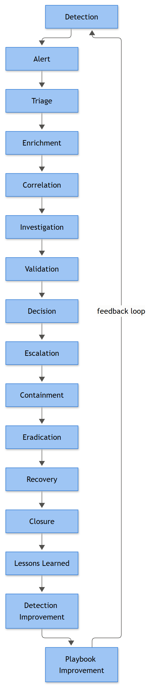
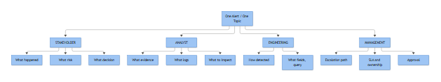

# SIGNAL TO ACTION

## The Complete SOC Playbook Handbook

### A Practitioner's Guide to Designing, Operating and Governing Modern SOC Playbooks

---

**About the Author**

The author has spent over a decade moving through the full arc of SOC work — Tier 1 triage during overnight shifts, Tier 2 investigation and escalation calls, Tier 3 threat hunting and detection tuning, and eventually SOC management across both managed security service provider and enterprise in-house environments. That path included being paged at 3 a.m. for a domain controller alert that turned out to be a scheduled backup job, sitting across the table from an auditor asking why an analyst closed a ransomware precursor alert as benign eighteen months earlier, and rebuilding a detection rule set from scratch after inheriting a SIEM with four thousand unreviewed alert rules and no documented logic behind any of them. This book is written from that seat — not from a vendor briefing deck, and not from a compliance framework read cover to cover but never operationalized.

---

## Preface

I did not set out to write a book. I set out to stop answering the same question every eighteen months at every SOC I've worked in or built: *why did the analyst close this alert, and can you prove the decision was reasonable at the time it was made?*

That question shows up in different clothes. Sometimes it's an auditor, sitting across from you with a printed alert log, asking why a suspicious PowerShell execution on a finance server got marked "benign" with no notes attached. Sometimes it's a CISO after a breach, asking why three analysts on three different shifts looked at the same beaconing pattern over two weeks and each one closed it differently. Sometimes it's a brand-new Tier 1 analyst, four hours into their first solo shift, staring at an alert with a queue of ninety others behind it, trying to guess what "senior judgement" would do here — because nobody wrote it down anywhere they could find it.

I've been on every side of that question. I've been the analyst who closed something too fast because the queue was long and the shift lead was breathing down my neck about SLA breach numbers. I've been the Tier 3 who reopened that same alert three weeks later after it turned out to be the first sighting of a credential-dumping tool that eventually reached a domain controller. I've been the manager who had to explain to a board, in plain language, why our mean time to detect looked fine on paper while our mean time to *validated* detection was closer to four days once you accounted for enrichment delays and a threat intel feed that was quietly fifteen minutes behind.

None of those failures were caused by a lack of talent. Every SOC I've worked in has had sharp analysts. The failures were caused by absent or badly written playbooks — decision logic that lived in one senior analyst's head, or in a wiki page nobody had opened since it was written, or nowhere at all. An alert without a playbook isn't an investigation. It's a guess, made under time pressure, by whoever happened to be on shift, and then defended after the fact if anyone asks.

This book exists to close that gap. Not with theory, and not with another maturity model diagram. With playbooks you can actually run — the field-level detail, the query logic, the escalation thresholds, the exact language you'd use in a ticket when you close something as Benign Positive versus Expected Activity versus Insufficient Evidence, because those are three different findings with three different audit implications and most SOCs use them interchangeably, which is itself a finding.

If you've ever had to explain a SOC decision to someone who wasn't in the room when it was made — this book is for you.

---

## Foreword: An Alert Is Not an Investigation

Here is the core idea the rest of this book is built on, and I want to state it plainly before we go any further: **an alert is a hypothesis, not a conclusion, and a playbook is the repeatable process that turns that hypothesis into a defensible decision.**

A detection rule fires because a pattern matched. That's all it means at the moment it lands in the queue. It does not mean something bad happened. It does not mean nothing bad happened. It means: *this specific combination of conditions, defined by someone, at some point, based on some assumption about attacker behavior or policy violation, was observed.* Everything after that — whether it becomes a confirmed incident, a tuning ticket, or a closed ticket with a one-line note — is investigation. And investigation without a repeatable structure is where inconsistency, audit failure, and missed escalations all come from.

A playbook is not a flowchart for decoration. It's the operational memory of the SOC — it encodes what your best analyst already knows, so your newest analyst can act on it at 3 a.m. without waking anyone up unnecessarily, and so your auditor can trace, six months later, exactly why a decision was reasonable given what was known at the time.

Across this book, playbooks are built around the same lifecycle. Not every playbook needs every stage written out in full — a 2-page library entry for a low-fidelity alert might collapse several stages into a sentence — but the stages exist in every real investigation whether you name them or not:

```text
DETECTION
   → the alert fires, or a hunt hypothesis surfaces a candidate event
TRIAGE
   → is this worth analyst time right now? severity, asset criticality, initial noise check
ENRICHMENT
   → pull context: asset owner, user baseline, threat intel reputation, related alerts, geo/ASN
INVESTIGATION
   → build the timeline, pull logs, correlate across sources, test alternate explanations
VALIDATION
   → confirm or refute the hypothesis with evidence — not gut feel
DECISION
   → True Positive / Benign Positive / Expected Activity / Insufficient Evidence, documented
ESCALATION
   → hand off to IR, management, legal, or a specific tier — with what they need to act
CONTAINMENT
   → stop the bleeding: isolate, disable, block, revoke
ERADICATION
   → remove the cause, not just the symptom
RECOVERY
   → restore normal operation, confirm no residual access or persistence
LESSONS LEARNED
   → what worked, what was slow, what telemetry was missing
DETECTION IMPROVEMENT
   → feed findings back into rule logic, thresholds, and enrichment sources
```

That last stage matters more than most SOCs treat it. Detection Improvement is where the lifecycle loops back on itself — every incident that gets fully worked should leave the detection rule set slightly better than it found it. A SOC that never revisits its rules based on what investigations actually turn up is running the same static rule set forever, quietly falling behind the environment it's supposed to be watching.



*Figure F001 - the full alert-to-improvement lifecycle referenced throughout this book.*

**[MANAGEMENT]** - Every stage in that lifecycle has an owner, and every handoff between stages is where SLA clocks and accountability actually live. If your playbooks don't name who owns Containment versus who owns the Decision, you don't have a playbook — you have a description of a process that depends on someone remembering to pick up the phone.

**[ANALYST]** - In practice you will rarely walk these twelve stages in a straight line. You'll enrich, decide you need more investigation, go back, enrich again. That's normal. What isn't normal is skipping Validation because the queue is long — that's the stage most often compressed under pressure, and it's the one an auditor will ask about first.

---

## Who This Book Is For

Playbooks get consumed differently depending on who's reading them mid-incident versus who's reading them to approve a budget. This book is written so each of the following readers gets something usable, without wading through content meant for someone else's role.

| Reader | What you get from this book |
|---|---|
| Tier 1 Analyst | Clear, step-by-step triage logic so a decision doesn't depend on guessing what a senior analyst would do |
| Tier 2 Analyst | Enrichment and investigation depth — what evidence actually settles a case versus what just feels thorough |
| Tier 3 / Senior Analyst | Edge-case handling, alternate-hypothesis testing, and the reasoning behind escalation thresholds you may currently apply from memory |
| Threat Hunter | Hypothesis-driven investigation patterns and where hunting findings should feed back into standing detections |
| Detection Engineer | Query logic, tuning history, and known false-positive sources behind each playbook's detection rule |
| Incident Responder | Containment and eradication sequencing tied to the specific alert type, not generic IR theory |
| SIEM Engineer | Field mappings, log source dependencies, and where telemetry gaps quietly break a playbook's logic |
| Security Engineer | How detection, prevention, and architecture decisions intersect with what the SOC can actually act on |
| SOC Lead / Manager | SLA structure, escalation ownership, and how to measure whether a playbook is actually working |
| CISO | Risk framing per playbook category and where to focus investment based on real gaps, not assumed ones |
| Risk / Governance Function | How playbook decisions map to risk acceptance, exceptions, and formal risk register entries |
| Internal Audit | The evidence trail a well-run playbook produces, and what "defensible decision" looks like in practice |
| External Audit | A consistent reference for how detection-to-decision processes are expected to be documented and followed |
| IT Manager | What the SOC needs from IT teams during containment and recovery, and how fast |
| Infrastructure Team | Where infrastructure changes (patching, segmentation, decommissioning) intersect with SOC detection assumptions |
| Application Owner | What "normal" looks like for their application in SOC terms, and what to expect when it triggers an alert |
| Business Owner | Plain-language framing of what a given threat category actually risks for their function |
| Project Manager | How SOC playbook dependencies factor into rollout timelines for new systems or migrations |
| Client Stakeholder (MSSP context) | What to expect from a managed SOC's process, and reasonable questions to ask about playbook maturity |
| Senior Management / Executives | The business case and risk reduction argument behind formalized playbooks, without the technical weeds |
| Vendor / Technology Partner | How their tooling is expected to fit into a documented investigation workflow, not just a dashboard |
| Security Architect | How detection coverage and playbook logic should inform architecture and control placement decisions |

If you don't see your exact title on that list, look at what you're accountable for during an incident — triage, decision, containment, budget, or evidence — and read the corresponding section. Most roles map cleanly onto one or two of the depth markers described below.

---

## How to Use This Book

This book is organized in parts, moving from foundational playbook design through to full end-to-end incident treatments.

The early parts cover how playbooks are structured, how decisions are documented, how escalation and SLA logic should be built, and how detection engineering feeds back into the playbook library over time. These parts are conceptual scaffolding — read once, referenced again when you're building or auditing your own playbook set.

The bulk of the book is a **playbook library**. Most entries in that library are intentionally short — 2 to 4 pages covering a single alert type or detection category: a specific authentication anomaly, a specific lateral movement pattern, a specific data-loss-prevention trigger. These are meant to sit next to an analyst during a shift, not to be read cover to cover. They follow a consistent internal structure so once you've used one, you know how to use all of them.

A smaller number of entries are **master playbooks** — full end-to-end treatments of the incident categories that don't compress into four pages without losing what actually matters: ransomware, widescale malware outbreak, and data exfiltration. These master playbooks walk the entire lifecycle in depth, including the stakeholder communication and executive reporting that shorter library entries only touch briefly.

You will not read this book start to finish in one sitting, and it isn't meant to be. Treat the early parts as the manual for the machine, and the playbook library as the machine itself — something you open when you're on shift and the queue is not being kind to you.

---

## Quick Reference: Depth Markers and Callout Boxes

Throughout this book, content is tagged so readers can find their depth of relevance quickly without wading through material meant for a different audience. These markers appear on their own line wherever the shift in framing happens.

**[STAKEHOLDER]** - Plain-language business framing: why a given control, alert type, or decision matters, what risk it reduces, and who has authority to accept or escalate that risk.

**[ANALYST]** - Operational investigation detail: which logs and fields to pull, what normal activity looks like versus what should raise suspicion, and what evidence needs to be collected and preserved before a decision is made.

**[ENGINEERING]** - Detection logic, correlation design, and query implementation detail: how a rule is built, what its known blind spots and false-positive sources are, and how it should be tuned over time.

**[MANAGEMENT]** - Governance detail: ownership per stage, SLA targets, approval requirements, metrics that actually reflect playbook health, and review cadence for keeping the playbook current.



*Figure F050 - the STAKEHOLDER/ANALYST/ENGINEERING/MANAGEMENT framing used across every chapter.*

In addition to the depth markers, five callout box types appear across chapters:

| Callout | Purpose |
|---|---|
| **Analyst Note** | A practical aside from working the floor — a common mistake, a shortcut that isn't actually safe, a "this looks scarier than it is" or "this looks calmer than it is" warning |
| **Stakeholder Note** | A short translation for non-technical readers of why a preceding technical section matters to them |
| **Warning** | A hard stop — a step that, done wrong or skipped, causes real damage: evidence loss, service outage, legal exposure |
| **Checklist** | A condensed, actionable list for use during a live incident, separate from the surrounding narrative explanation |
| **Case Study** | A composite, fictionalized incident walkthrough illustrating how a playbook plays out against a realistic (not sanitized) sequence of events, including the parts that went wrong |

None of these are decorative. They exist because a SOC playbook read at 2 p.m. during a design review and the same playbook read at 2 a.m. during an active incident are being used by two different mental states, and the formatting should serve both.

With that structure in mind, the next part of this book gets into how a playbook is actually built — starting with what a "good enough to defend in an audit" decision record looks like, because that standard, more than any detection logic, is what separates a SOC that survives scrutiny from one that doesn't.
