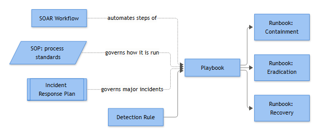

# Chapter 1: What Exactly Is a SOC Playbook?

Ask five analysts on the same team to hand you "the playbook" for an alert and you will probably get five different documents. One hands you a flowchart. Another hands you a PowerShell script. A third points at a Confluence page titled "Account Compromise IR Plan" and shrugs. None of them are wrong, exactly — they are just using "playbook" as a catch-all word for anything written down. That looseness is fine in casual conversation and a genuine liability during an audit, a post-incident review, or a 3am handover between shifts.

This chapter draws hard lines between eleven terms that get used interchangeably across the industry: Detection Rule, Correlation Rule, Use Case, SOC Playbook, Investigation Guide, Runbook, Response Procedure, SOP, Incident Response Plan, Threat Hunt, and Automation/SOAR Workflow. Each is a distinct artifact with a different owner, audience, and change-control process. Confusing them is why "update the playbook" tickets sit unassigned for months — nobody knows if that means editing a wiki page or redeploying a query.

Everything below hangs off one running scenario. Keep it in mind — we come back to it in every section.

> **Running Scenario:** A user account at Northfield Logistics — `j.alvarez`, domain `northfield.example.com` — logs ten failed authentication attempts against a domain controller, followed immediately by one successful login from a new source IP. That pattern is our thread through this entire chapter.

---

## Layer 1: The Trigger — Detection Rule, Correlation Rule, and Use Case

### Detection Rule

A **Detection Rule** is the logic that fires the alert. It is code (or a vendor product's rule syntax) sitting inside a SIEM, EDR, or log platform, evaluating telemetry against defined conditions and producing an event when those conditions are met. A detection rule has a name, a query, a severity, a data source dependency, and a tuning history. It does not describe what a human should do next.

**[ENGINEERING]** - Our running scenario's trigger — ten failed logons (Windows Security Event ID 4625) followed by one successful logon (Event ID 4624) for the same account within a short window — is technically a **correlation rule** dressed up in everyday speech as a "detection rule." That distinction gets its own section next, but functionally, this is the artifact an engineer opens when someone says "the rule is too noisy" or "the rule missed something."

```kql
// Illustrative logic — adapt syntax to your SIEM
SecurityEvent
| where EventID in (4624, 4625)
| where TimeGenerated > ago(15m)
| summarize FailCount = countif(EventID == 4625),
            SuccessCount = countif(EventID == 4624),
            SourceIPs = make_set(IpAddress)
      by TargetAccount, bin(TimeGenerated, 15m)
| where FailCount >= 10 and SuccessCount >= 1
```

Notice this rule says nothing about who gets paged, what "successful" even means if the source IP is a known VPN egress point, or whether a service account should be excluded. That is deliberate — a detection rule's job is narrow and mechanical.

### Correlation Rule

A **Correlation Rule** is technically a subtype of detection logic, but it earns its own name because it stitches together *multiple discrete events, possibly from different log sources, over a time window* into one alert. Our scenario's logic is a textbook correlation rule: it requires eleven separate 4625/4624 events, correlated by account and time, to produce a single alert.

**[ENGINEERING]** - Practically, the distinction changes how you tune it. A single-event rule breaks when a field changes format. A correlation rule breaks when *timing* changes — ingestion delay pushing events across a bucket boundary, clock drift between a domain controller and the SIEM collector, or a service account that legitimately fails and retries in bursts. If your false-positive rate spikes right after a log source migration, suspect the correlation window before the logic.

### Use Case

A **Use Case** is the business/security justification that a detection rule (or a cluster of them) exists to serve. It lives in a use case catalog, not a rule editor, and documents: the threat scenario covered, required log sources, MITRE ATT&CK tactic alignment (Credential Access here — named without a technique ID, since none is verified for this text), priority, owning team, and which rules implement it.

**[STAKEHOLDER]** - The use case answers "why do we even have this rule?" — it is what a security leader shows an auditor to justify coverage. "Use Case: Credential Compromise via Brute Force / Password Spraying" might be implemented by three separate correlation rules across three log sources (on-prem AD, Entra ID, VPN concentrator), and it is the use case document — not any single rule — that tracks whether that coverage is actually complete.

---

## Layer 2: The Analyst Decision — Playbook and Investigation Guide

### SOC Playbook

This is the term everyone overloads, so let's be precise: a **SOC Playbook** is the analyst-facing document that governs how a *specific alert type* gets triaged and investigated. It answers "what do I check, in what order, and what does each outcome mean for my next step?" It is decision-oriented, not execution-oriented — it does not contain the actual commands to fix anything.

**[ANALYST]** - For our scenario, the playbook for "Multiple Failed Logins Followed by Success" would read something like:

1. Confirm the alert isn't a known benign pattern first — shared service account, password rotation script, or a help-desk-assisted reset. Don't assume malice by default; a lot of these close as Benign Positive once you check the calendar for password expiry cycles.
2. Pull the source IP of the successful login. Is it a known corporate egress, VPN pool, or unrecognized ASN/geolocation?
3. Check for a second factor challenge on the successful login. MFA-satisfied logins downgrade urgency; MFA bypass or "MFA fatigue" push urgency up sharply.
4. Check what the account did *after* the successful login — mailbox rule changes, new OAuth app consents, lateral authentication to other hosts. This is where things normally go wrong if you stop at step 2 and call it done.
5. Decision gate: confirmed malicious → escalate per the IR Plan and invoke the Account Disablement Response Procedure, then close as True Positive. Inconclusive → hold open, request additional log retention, mark Insufficient Evidence if the trail goes cold. Explained by legitimate activity → close as Benign Positive or Expected Activity with justification recorded.

A playbook is a decision tree with escalation criteria. It references runbooks by name but never repeats their command-level content — if it did, every runbook update would require updating every playbook that mentions it.

### Investigation Guide

An **Investigation Guide** is narrower and more technical than a playbook — it is the field-by-field, log-source-by-log-source reference that tells an analyst how to *read the evidence*, independent of any single alert's decision flow. Where the playbook says "check the source IP," the investigation guide is the reference that explains, for example, what a normal `IpAddress` value looks like on a Northfield Logistics domain controller versus a NATed proxy artifact, how to pull the corresponding sign-in log from the identity provider, and what a legitimate service-account 4625 burst looks like versus a spray pattern.

**[ANALYST]** - Think of the investigation guide as the appendix the playbook keeps pointing at. Multiple playbooks (failed-login-success, impossible travel, new MFA device registered) can all reference the same "Identity Log Investigation Guide" rather than each re-explaining what a normal `TargetAccount` versus `SubjectAccount` field distinction means. This is also usually where the org keeps notes on known telemetry gaps — e.g. "VPN concentrator logs only retain 14 days; if the alert is older, request the archived export from IT Ops before assuming the trail is gone."

---

## Layer 3: The Execution — Response Procedure and Runbook

### Response Procedure

A **Response Procedure** is the named, governed category of containment or eradication action the organization has formally approved — for example, "Account Disablement," "Host Network Isolation," or "Malicious IOC Blocklisting." It is tool-agnostic: it defines *when* the action is authorized, *who* can approve it, what the expected outcome is, and what the rollback looks like, without specifying keystrokes for any particular platform.

**[MANAGEMENT]** - For our scenario, the Account Disablement Response Procedure specifies that it can be invoked by an Tier 2 analyst without further approval once compromise is confirmed, that HR/manager notification must occur within one business day, and that re-enablement requires identity-team sign-off plus a completed password reset. This is the level where "who is allowed to pull this trigger" actually gets decided.

### Runbook

A **Runbook** is the tool-specific, step-by-step execution instructions for carrying out one Response Procedure on one system. This is where commands, console screenshots, and exact field names live.

**[ANALYST]** - The runbook for disabling `j.alvarez` in an on-prem Active Directory environment might read:

```powershell
# Runbook: AD-RB-014 — Disable compromised on-prem AD account
Disable-ADAccount -Identity "j.alvarez"
Get-ADUser -Identity "j.alvarez" -Properties MemberOf | Select MemberOf
# Terminate active Kerberos sessions
klist purge -li 0x3e7
# Force logoff on last known interactive host
Invoke-Command -ComputerName "NA-FS01" -ScriptBlock { logoff.exe /server:NA-FS01 }
```

If Northfield Logistics also has Entra ID, there is a *second* runbook — different console, different cmdlets (`Revoke-AzureADUserAllRefreshToken`, disabling the cloud identity, checking Conditional Access sign-in logs) — implementing the exact same Response Procedure. One procedure, multiple runbooks. That's the tell: if a document is full of exact commands, button locations, or CLI syntax tied to one specific product, you are holding a runbook, not a procedure or a playbook.

---

## Layer 4: The Governance — SOP

A **Standard Operating Procedure (SOP)** is the organization-approved document governing *how work gets done*, independent of any single alert or threat. It sets acknowledgment and triage SLAs, defines roles and hand-off points, mandates documentation standards, and states which artifacts (playbooks, runbooks) must be followed and where deviations require sign-off. An SOP rarely mentions a specific alert by name — it governs the process shape, not the technical content.

**[MANAGEMENT]** - The relevant SOP here is something like "SOC Alert Triage and Escalation SOP," which states: alerts of High severity must be acknowledged within 5 minutes and triaged within 30; any alert resulting in a confirmed account compromise verdict must be escalated to the Incident Response Plan within 15 minutes of confirmation; all triage actions must be logged in the case management ticket with evidence attached; closure codes are restricted to a defined list (True Positive, Benign Positive, Expected Activity, Insufficient Evidence, Duplicate). None of that is specific to brute-force alerts — the same SOP governs a phishing alert or a malware detection equally.

**[STAKEHOLDER]** - This is usually the document an auditor or regulator actually wants to see, because it demonstrates the process is repeatable and enforced, not that any single rule exists. SLA breaches against the SOP — not individual missed alerts — tend to be the metric leadership tracks quarter over quarter.

---

## Layer 5: The Organizational Response — Incident Response Plan

The **Incident Response Plan (IR Plan)** governs how the *entire organization* manages a declared incident end-to-end, once a SOC alert crosses the threshold from "suspicious" to "confirmed" or "likely." It is not analyst-level triage guidance — it is roles, phases, communication, and authority. Most IR Plans map to the NIST SP 800-61 phase structure: Preparation, Detection and Analysis, Containment/Eradication/Recovery, and Post-Incident Activity (NIST, "Computer Security Incident Handling Guide," NIST Special Publication 800-61 Revision 2, 2012: https://csrc.nist.gov/pubs/sp/800/61/r2/final; superseded by Revision 3, 2025, which reorganizes around the NIST CSF 2.0 functions — see appendices/38b-references.md).

**[STAKEHOLDER]** - For an account compromise declared against `j.alvarez`, the IR Plan is what determines: who is Incident Commander, whether Legal and Privacy get looped in (does Northfield Logistics have a breach notification obligation if `j.alvarez` had access to customer PII?), what the internal and external communication plan looks like, and when executives get briefed. The SOC playbook told the analyst how to investigate; the SOC runbook told them how to disable the account; the IR Plan is what tells the *organization* what happens next — forensic imaging authorization, legal hold, customer notification timelines, and the retrospective that follows.

**[MANAGEMENT]** - A common failure mode: teams write a beautiful IR Plan and then never define the threshold that triggers it. Tie the trigger explicitly to the SOP's escalation clause — "True Positive verdict on a Credential Access use case automatically declares a High-severity incident" — or the IR Plan sits unused while analysts quietly handle real compromises as routine tickets.

---

## Layer 6: The Proactive Layer — Threat Hunt

Everything above this line is reactive — something has to fire an alert first. A **Threat Hunt** is hypothesis-driven and proactive: an analyst or hunt team goes looking for activity that existing detection and correlation rules might not catch, without waiting for an alert.

**[ANALYST]** - The natural hunt born from our scenario: the correlation rule requires ten failures within a 15-minute window. What about an attacker running a slow password spraying campaign — one or two attempts per account, rotated across hundreds of accounts, spread over six hours specifically to stay under that threshold? That pattern never fires the rule. A threat hunt against the same 4625/4624 telemetry, but pivoted by *source IP across many target accounts* rather than *many failures against one account*, is how that gap gets found. If the hunt confirms the pattern exists in the wild against Northfield Logistics, it typically produces a new detection/correlation rule or a revised use case — a hunt often ends by feeding Layer 1, not by closing a ticket.

---

## Layer 7: The Automation — Automation Workflow and SOAR Workflow

An **Automation Workflow** is any defined, repeatable sequence of automated actions triggered by a condition — this term is deliberately platform-neutral and can describe anything from a five-line script to a full orchestration pipeline.

A **SOAR Workflow** is the specific implementation of an automation workflow built inside a Security Orchestration, Automation and Response platform (Microsoft Sentinel automation rules and playbooks, Splunk SOAR, Palo Alto Cortex XSOAR, and similar tools).

**[ENGINEERING]** - For our alert, a SOAR workflow fires the instant the correlation rule triggers — before any analyst looks at it — and typically performs: enrichment (resolve the source IP's geolocation and ASN reputation, pull the account's recent sign-in history, check if the IP matches a known corporate egress list), ticket creation in the case management system with that enrichment pre-attached, and a Teams/Slack notification to the on-call analyst. It might also auto-close the alert as a benign positive if the source IP matches an allow-listed corporate VPN range with high confidence — with that auto-closure logged and periodically audited, not left invisible.

A genuinely useful, easily-missed trap: several major SIEM/SOAR vendors (Microsoft Sentinel is the most common example) name their automation-rule objects "Playbooks" in the product UI. That is a vendor naming choice, not a redefinition of the term used throughout this book. A Sentinel "Playbook" is, in this chapter's vocabulary, a SOAR Workflow — it automates enrichment and notification steps. It is not the analyst decision-tree document this chapter calls a SOC Playbook. Expect this to cause real confusion in change-control tickets and don't assume a colleague means the same artifact you do just because they used the word "playbook."

---

## Putting It Together: One Alert, Eleven Documents



*Figure F003 - how these related documents connect without being a strict hierarchy.*

| Artifact | Answers the question | Owner | For our scenario |
|---|---|---|---|
| Use Case | Why do we monitor for this at all? | Detection Engineering / SOC Management | "Credential Compromise via Brute Force" catalog entry |
| Detection Rule | What raw condition fires? | Detection Engineering | Single 4625 or 4624 event logic |
| Correlation Rule | What multi-event pattern fires? | Detection Engineering | 10× 4625 + 1× 4624, same account, 15-min window |
| SOC Playbook | What does the analyst check, in what order? | SOC Analyst Lead | Triage steps 1–5 above, with decision gate |
| Investigation Guide | How do I read this specific evidence? | SOC Analyst Lead / Senior Analysts | "Reading identity provider sign-in logs" reference |
| Response Procedure | What containment action is approved, and by whom? | SOC Management / Identity Team | Account Disablement Response Procedure |
| Runbook | Exactly how do I execute that on this platform? | SOC Engineering / IT Ops | AD-RB-014 PowerShell steps |
| SOP | What process rules govern how any of this is done? | SOC Management / GRC | Alert Triage & Escalation SOP |
| Incident Response Plan | How does the org manage this end-to-end once declared? | CISO / Incident Commander | Account Compromise IR Plan, NIST phases |
| Threat Hunt | What might we be missing entirely? | Threat Hunt Team | Slow password-spray hypothesis hunt |
| SOAR Workflow | What happens automatically, before a human looks? | SOC Engineering / Automation | Enrichment, ticket creation, notification |

**[ANALYST]** - If you get handed a document and aren't sure what it is, ask: does it contain a query or threshold (Detection/Correlation Rule)? Does it justify why coverage exists at all (Use Case)? Does it walk through triage decisions without giving exact commands (Playbook)? Does it explain how to read specific fields (Investigation Guide)? Does it name exact CLI syntax or console clicks for one product (Runbook)? Does it define an approved action category without product-specific steps (Response Procedure)? Does it set SLAs and process rules with no alert-specific content (SOP)? Does it name an Incident Commander and communication plan (IR Plan)? Does it start from a hypothesis rather than an alert (Threat Hunt)? Does it run without a human touching it first (SOAR Workflow)? Answer that, and you know exactly what's in your hands — and exactly who to go argue with when it needs fixing.
