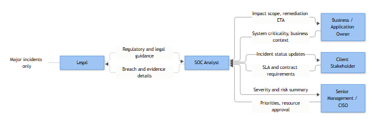

# Part 3: The Stakeholder View of a Playbook

## Chapter: What the Business Needs Answered Before the SOC Ever Calls

Every SOC has a moment where a playbook that reads perfectly well to an analyst falls apart in front of a CISO, a hospital COO, or a plant manager. The logic is sound, the query works, the escalation matrix is technically complete — and the stakeholder still asks "so what does this actually mean for us?" and nobody in the room has a clean answer. That gap isn't a writing problem. It's a design problem. Most playbooks are written by and for the people who run the detection, not the people who own the risk the detection exists to manage.

This chapter is written from the other chair — not the analyst's console or the engineer's rule editor, but the seat of the person who has to explain, to a board or a regulator or a customer, why an account was locked at 2 a.m. or why nobody called them until the damage was already done. If your playbooks can't answer the questions in this chapter in plain language, they are operational documents pretending to be governance documents, and that gap tends to surface mid-incident, in front of the people signing your budget.

## Why Stakeholders Read Playbooks Differently

An analyst opens a playbook wanting to know what to click. A stakeholder opens a playbook — or more often, is handed a one-page summary of one — wanting to know what happens to *their* system, *their* customers, *their* legal exposure. They are not going to read your Sigma rule or trace a KQL join across four tables. They want to know, in under two minutes, whether this detection protects something they care about, whether the SOC's response could break something they care about more, and who gets to make that call.

**[STAKEHOLDER]** - The question underneath almost every stakeholder conversation about a playbook is really "what is the blast radius of this detection firing, and the blast radius of the SOC's response to it?" Both matter. A detection with no downside if it's wrong is cheap to automate. A detection where the response itself carries business risk — locking a CFO's account before a board call, killing a process on a SCADA host — needs a human decision point, and that decision point needs to be named, not implied.

A well-built playbook, from the stakeholder side, answers fourteen questions without the stakeholder having to ask them. We'll go through those in order, because the order matters — it roughly follows the order a stakeholder actually thinks in during a real incident call.

## The Fourteen Questions

### 1. Why does this detection exist?

Every playbook should be traceable to a reason someone decided it was worth building. Not "because Sentinel has a template for it" — a specific risk statement. If nobody can answer why a rule exists, it's a candidate for retirement, not renewal.

**[STAKEHOLDER]** - This is a one-sentence answer: "This detection exists because a compromised domain admin account is one of the fastest paths to ransomware deployment across our environment, and we've had a near-miss on this exact pattern before." If your security team can't give you that sentence, ask why the rule is still enabled.

### 2. What risk does it cover?

Not the technical mechanism — the business risk category. Data exfiltration, service disruption, financial fraud, regulatory exposure, reputational damage. A single playbook can map to more than one risk category, and it should say so explicitly rather than leaving the stakeholder to infer it.

### 3. What business system does it protect?

This is where a lot of playbooks quietly fail. "Domain Controller DC01" is an asset. "Patient scheduling and billing platform" is a business system. Stakeholders don't manage assets, they manage business outcomes, and they need the playbook translated into those terms before they can weigh in on anything downstream — severity, disruption tolerance, who gets called.

### 4. What happens when it fires?

Walk the stakeholder through the actual sequence, not the theoretical one. Alert generates, analyst triages within the SLA window, evidence gets pulled, a verdict gets reached, and — this is the part stakeholders actually care about — something either does or doesn't happen to their system as a result.

### 5. How severe can it become?

Stakeholders need the ceiling, not just the floor. A login anomaly on a service account might be nothing, or it might be the first visible symptom of a domain compromise already three days old. State the low end and the high end of plausible outcomes so nobody is blindsided when a "low severity" alert escalates hard.

*Figure F006 - who the SOC talks to and what flows each direction during an incident.*

### 6. When will the SOC contact us?

**[MANAGEMENT]** - This needs a concrete trigger, not "if it's serious." Tie it to severity tier, confirmed impact, or a specific condition ("any confirmed use of the compromised credential outside expected hours"). Vague triggers are the single most common cause of stakeholders finding out about an incident from a customer or a journalist before they hear it from their own SOC.

### 7. What information will they need from us?

This is chronically underspecified. Analysts need to know, in advance, that HR can confirm whether an employee is on a business trip, that IT asset management can confirm whether a device is company-issued, that the business owner can confirm whether an off-hours login was an expected maintenance window. Naming this in advance turns a frantic phone tree into a five-minute call.

### 8. Who can approve containment?

**[STAKEHOLDER]** - This is the question that determines whether an incident call runs smoothly or turns into an argument. Every playbook needs a named role — not a name, a role, since people change jobs — who can say "yes, disable that account" or "yes, take that system offline." If containment requires approval and the approver is unreachable, the playbook needs a fallback, or containment silently doesn't happen and everyone assumes it did.

### 9. Can the SOC block automatically?

Automated containment (disabling an account, isolating a host, blocking an IP at the edge) is a business decision disguised as a technical one. It trades detection-to-containment speed against false-positive business impact. Stakeholders should decide, in advance and in writing, which actions are pre-approved for automatic execution and which always require a human in the loop.

### 10. When is user disruption justified?

Locking a warehouse floor terminal at 3 a.m. and locking the CEO's laptop thirty minutes before an earnings call are not the same decision, even if the underlying alert looks identical. The playbook should state, for that specific system, where the line sits between "contain now, apologize later" and "verify first, contain if confirmed."

### 11. What are the SLA expectations?

Time to triage, time to notify, time to contain, time to close. Stakeholders need these numbers because they're often the numbers a contract, an insurance policy, or a regulator will later ask about.

### 12. How are false positives handled?

**[STAKEHOLDER]** - Not every alert that fires is an incident, and a stakeholder who thinks "alert fired" always means "we were attacked" will lose confidence in the SOC the first time a false positive gets escalated loudly and then quietly closed. The playbook should say how a false positive gets documented, whether the stakeholder gets told about it at all, and what happens to the detection logic afterward — tuned, left alone, or retired.

### 13. How are improvements approved?

Playbooks drift. Someone tunes a threshold, someone adds an exclusion, someone changes an escalation contact. Stakeholders don't need to approve every tuning change, but they should own the review cadence and sign off on anything that changes severity, containment authority, or notification thresholds.

### 14. Who owns the playbook?

**[MANAGEMENT]** - Every playbook needs exactly one accountable owner on the security side and one on the business side. Not a team distribution list. A name, tied to a role, reviewed on a fixed cadence (quarterly is typical; faster for anything touching regulated or life-safety systems). Ownership without a name is ownership by nobody, and it shows the first time a playbook is three years stale and nobody remembers why a threshold was set the way it was.

## Why This Matters Operationally, Not Just Politically

**[ANALYST]** - None of this is bureaucratic overhead layered on top of "real" detection work. When an analyst is staring at a Microsoft Entra ID sign-in log at 2 a.m. showing a privileged account authenticating from an unfamiliar country, the decision tree they follow — call the business owner now versus wait for confirmation, disable the account versus flag for review — should already be settled by the answers to these fourteen questions. If it isn't, the analyst is making a business risk decision alone, under time pressure, with no cover if it goes wrong either way.

**[ENGINEERING]** - The detection logic itself doesn't change based on stakeholder input, but the response actions bound to it absolutely should. A correlation rule joining a risky Entra ID sign-in event with a subsequent privileged-logon event on a domain controller is the same query regardless of who owns the system. What changes is whether that rule's playbook triggers an automated account disable, an Tier 1 page, or a next-business-day review — and that binding is a governance decision, not a SIEM configuration decision.

## Stakeholder Playbook Summary Template

This is the artifact that should sit on top of every technical playbook — one page, business language, no query syntax. It's what gets attached to a risk register entry, handed to an auditor, or read aloud on an incident bridge in the first ninety seconds.

| Field | What Goes Here |
|---|---|
| **Playbook Name** | The plain-language name used consistently across the SOC, the risk register, and incident reports — not an internal rule ID. |
| **Business Risk** | The risk category this protects against (e.g., data theft, service disruption, regulatory exposure, fraud), stated in one sentence. |
| **System/Service** | The business system or service affected, described the way the business knows it, not by hostname or asset tag alone. |
| **Business Owner** | The named role accountable for that system's availability and business impact decisions. |
| **Security Owner** | The named role in the SOC/security team accountable for maintaining and tuning this playbook. |
| **Detection Objective** | What behavior this is built to catch, in one or two sentences a non-technical reader can follow. |
| **Potential Impact** | The realistic worst-case outcome if this activity is real and goes unaddressed. |
| **Severity** | The severity tier this typically maps to, and the condition that would push it higher. |
| **Escalation Path** | Who gets contacted, in what order, and the specific trigger condition for each step. |
| **Containment Authority** | The named role authorized to approve containment actions, and any fallback if unreachable. |
| **Approval Required** | Which specific actions need prior sign-off versus which are pre-approved to proceed without it. |
| **Notification Requirements** | Who must be told, by when, and through what channel — including any regulatory or contractual notification duty. |
| **SLA** | Time targets for triage, containment, and closure for this specific playbook. |
| **Reporting** | What gets logged, to whom, and on what cadence (per-incident, weekly, monthly metrics). |
| **Risk Acceptance** | The process and authority for formally accepting residual risk if the business chooses not to act on a finding. |
| **Exception Process** | How a documented exception (e.g., a known benign trigger) gets requested, approved, time-boxed, and reviewed. |

## Worked Example: Privileged Account Login from an Unusual Location

The scenario: a domain administrator account for Northwind Logistics authenticates successfully from an IP address geolocated outside any country the account has logged in from in the past 180 days, followed by a privileged logon event on a domain controller.

| Field | Entry |
|---|---|
| **Playbook Name** | Privileged Account Login — Anomalous Geolocation |
| **Business Risk** | Credential compromise leading to lateral movement, data exfiltration, or ransomware deployment via a domain-admin-level account. |
| **System/Service** | Core Active Directory environment underpinning warehouse management, dispatch scheduling, and finance system authentication. |
| **Business Owner** | Director of IT Operations |
| **Security Owner** | SOC Manager, Detection Engineering |
| **Detection Objective** | Identify successful authentication by a privileged account from a geolocation inconsistent with the account's established baseline, correlated with subsequent privilege use on a domain controller. |
| **Potential Impact** | Full domain compromise, disruption of warehouse and dispatch operations, exposure of customer shipment and billing data. |
| **Severity** | High on confirmed anomalous geolocation with privilege use; Medium pending verification with account holder or travel record; downgraded to Informational if travel or VPN egress is confirmed legitimate. |
| **Escalation Path** | Tier 1 analyst triages within 15 minutes → Tier 2/IR lead notified immediately on High → Director of IT Operations contacted within 30 minutes of High confirmation → CISO notified if account confirmed compromised or if any DC configuration change is detected. |
| **Containment Authority** | SOC IR Lead may disable the account immediately without prior approval when High severity is confirmed; any action beyond account disable (e.g., isolating the domain controller) requires Director of IT Operations sign-off. |
| **Approval Required** | Account disable: pre-approved, no prior sign-off needed. Domain controller isolation or forced domain-wide password reset: requires Director of IT Operations or CISO approval. |
| **Notification Requirements** | Account holder notified within 1 hour of disablement via alternate verified channel (personal phone, not corporate email/Teams). Director of IT Operations notified within 30 minutes of High confirmation. Legal/Privacy notified within 4 hours if any evidence of data access or exfiltration is found. |
| **SLA** | Triage start: 15 minutes. Containment decision: 30 minutes from High confirmation. Initial stakeholder notification: 30 minutes. Case closure or formal escalation to full IR: 4 hours. |
| **Reporting** | Full incident timeline logged in the case management system; summary included in the weekly SOC operations report; any confirmed compromise reported to the monthly security steering committee with root cause and remediation status. |
| **Risk Acceptance** | If the business owner elects not to enforce geo-fencing or step-up MFA on this account class despite recurring alerts, formal risk acceptance is signed by the CISO and Director of IT Operations, reviewed every 90 days. |
| **Exception Process** | Known legitimate travel or approved third-party remote administration is submitted in advance via the IT change process, time-boxed to the travel/engagement window, and automatically expires — it does not persist as a standing exclusion. |

## Closing Thought for This Chapter

A playbook that only an analyst can read has done half its job. The technical logic catches the behavior; the stakeholder-facing summary is what lets the business actually govern the response to it — deciding in advance, calmly, who gets called, who gets to say yes, and what "severe" costs them, instead of negotiating all of that live on an incident bridge while the clock is already running.
