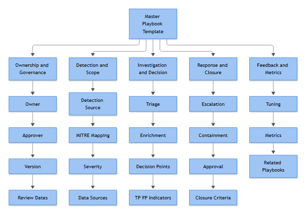

# Part 4A: The Master Playbook Template

Every playbook in this book maps back to one canonical structure. Fifty-eight fields, always in the same order, whether you're building the template in Confluence, a SOAR case template, or a plain Word doc because the SOAR license hasn't been signed off yet. The order matters less than the discipline of never skipping a field just because it feels obvious — "Description" and "Objective" look redundant until you've watched two analysts argue in an incident bridge about what a playbook was actually supposed to catch, six months after the person who wrote it left.

A field with nothing in it is a decision nobody made. That's the whole argument for this structure.

*Figure F049 - the master template fields grouped into five clusters.*

## 1. Identity & Governance

**[MANAGEMENT]** - These ten fields exist so a playbook can be audited, assigned, and retired without anyone having to reverse-engineer who's responsible for it. This is also the block auditors ask for first during ISO 27001 or SOC 2 evidence requests.

| Field | What goes here, and why |
|---|---|
| Playbook ID | Unique identifier (e.g., `PB-CRED-014`) so the playbook can be referenced from tickets, SIEM rule metadata, and audit logs without ambiguity. |
| Playbook Name | Short, human-readable name analysts will actually say out loud on a call — "the impossible travel playbook," not a case number. |
| Version | Semantic version (v1.0, v1.1) so anyone reading an old ticket knows which logic was live at the time of the response, not the current one. |
| Status | Draft, Active, Deprecated, Retired — prevents analysts from following a playbook that's been quietly superseded. |
| Owner | The single named individual (not a team alias) accountable for the playbook's accuracy overall; someone to email when it's wrong. |
| Technical Owner | The engineer/detection-lead who owns the query logic and integrations — who you page when the automation breaks, not the process. |
| Business Owner | The business-side stakeholder (often from the affected system's side, e.g., Finance for a payment-fraud playbook) who signs off on risk framing and impact statements. |
| Approver | Who formally authorized this playbook for production use — required for change control and for containment actions that carry business risk. |
| Last Updated | Date of the most recent substantive edit; a stale date next to an active incident is your first clue the playbook may be out of date. |
| Next Review Date | Scheduled recheck date, independent of incidents — this is what stops playbooks rotting quietly for two years. |

## 2. Detection & Purpose

**[STAKEHOLDER]** - This block answers "why does this alert exist and what does the business lose if we miss it," which is the question stakeholders actually ask, usually after the fact.

| Field | What goes here, and why |
|---|---|
| Detection Source | The tool generating the alert (Sentinel, CrowdStrike, Splunk ES, a custom Sigma rule) — needed because the same alert name can exist in two tools with different logic. |
| Alert Name | The exact alert/rule name as it appears in the console, so an analyst can search for it verbatim. |
| Description | Plain-language summary of what the alert detects — one or two sentences, written for a new analyst's first week. |
| Objective | What this playbook is trying to achieve operationally (e.g., "confirm or rule out credential compromise within 30 minutes") — distinct from Description because it states intent, not mechanism. |
| Business Risk | What actually happens to the organization if this activity is real and unaddressed — revenue, data loss, regulatory exposure, safety. This is the line management reads first. |
| Severity | The technical/impact rating (Informational/Low/Medium/High/Critical) as scored by the detection tool or a defined rubric — reflects potential impact of the underlying activity. |
| Priority | The queue-ordering value once triaged — can differ from Severity (a High-severity alert on a decommissioned test server may still be Low priority). |
| MITRE ATT&CK | The specific technique ID(s) this detection maps to, sourced from your detection engineering documentation — anchors the playbook to a shared taxonomy for coverage tracking and threat-informed defense. |

## 3. Scope & Data

**[ENGINEERING]** - Get this section wrong and analysts either can't find the evidence or trust evidence that was never actually available for this alert type.

| Field | What goes here, and why |
|---|---|
| Applicable Systems | The OS, platform, or application scope this playbook covers (e.g., "Windows domain-joined endpoints only") — stops it being misapplied to Linux servers or SaaS where the logic doesn't hold. |
| Data Sources | The categories of telemetry the playbook draws on (identity logs, EDR telemetry, network flow, DNS) — the "what kind of evidence exists" layer. |
| Log Sources | The specific systems producing that telemetry (Entra ID sign-in logs, Sysmon, firewall syslog) — one level more concrete than Data Sources, and where ingestion gaps get discovered. |
| Required Fields | The specific log fields the investigation steps depend on (e.g., `TargetUserName`, `IpAddress`, `AuthenticationPackageName`) — write this down once and you stop rediscovering missing fields mid-incident. |
| Prerequisites | What has to be true before this playbook is usable at all — a log source onboarded, a UEBA baseline of 30+ days, an integration enabled. |
| Dependencies | Other systems, playbooks, or teams this one relies on to function (e.g., depends on the identity team's disable-account automation) — surfaces single points of failure. |

## 4. Detection Logic

**[ENGINEERING]** - The technical core. This is also the section most likely to drift out of sync with the actual production rule if nobody owns keeping it current — check the Technical Owner field earns its keep here.

| Field | What goes here, and why |
|---|---|
| Trigger Condition | The precise condition that fires the alert — thresholds, logic operators, time windows — stated plainly enough that a reviewer could reconstruct the rule. |
| Detection Logic Summary | A short narrative of *how* the rule detects the behavior (correlation, threshold, anomaly baseline, sequence) — the "why this approach" behind the Trigger Condition. |
| Known Limitations | Documented blind spots — telemetry gaps, timing windows, evasion paths known not to be covered. Written down so nobody mistakes a clean result for a clean environment. |
| Known False Positives | Recurring legitimate activity that reliably triggers this alert (a specific service account, a backup job, a known scanner) — saves re-investigating the same benign pattern every week. |

## 5. Investigation Workflow

**[ANALYST]** - The part you're actually following at 2am. Each field is a distinct phase, not a synonym for the others — conflating "enrichment" with "investigation" is how playbooks turn into unstructured checklists nobody trusts.

| Field | What goes here, and why |
|---|---|
| Initial Triage | The first, fast checks that decide whether this gets worked now or queued — sanity checks, not full analysis. |
| Enrichment | The context-pulling step: threat intel lookups, asset criticality, user role, geolocation — data gathered before judgment is formed. |
| Investigation | The deeper analytical steps — pivoting across logs, timeline building, correlating related events — where the actual determination gets made. |
| Validation | The explicit check that confirms the finding holds up (re-running the query, confirming with a second data source) before a decision is committed to. |
| Decision Points | The named forks in the process — "if X, go to containment; if Y, close as benign" — turns a narrative into something repeatable. |

## 6. Classification Criteria

**[ANALYST]** - Written so two different analysts reach the same verdict from the same evidence. Not every case ends confirmed-malicious — Benign Positive and Insufficient Evidence are legitimate closures, not analyst failure.

| Field | What goes here, and why |
|---|---|
| True Positive Indicators | Concrete evidence patterns that support a real malicious/policy-violating verdict — specific, not "looks suspicious." |
| False Positive Indicators | Concrete evidence patterns pointing to a detection error or misconfigured logic, distinct from Known False Positives, which lists *categories*, not case-specific evidence. |
| Benign Positive Conditions | Evidence that the detected activity is real but authorized/expected (a sanctioned pentest, an approved admin action) — a third outcome, neither TP nor FP. |

## 7. Response Actions

**[MANAGEMENT]** - Containment power without a named approver is how a false positive turns into a business outage. This block exists to make that authority explicit before the incident, not during it.

| Field | What goes here, and why |
|---|---|
| Escalation Criteria | The conditions that require handing this to Tier 2/Tier 3, IR, or leadership — defined in advance so escalation isn't a judgment call made under pressure. |
| Containment Options | The available actions (isolate host, disable account, block indicator) with enough detail to execute, scoped to what this playbook's team is authorized to do. |
| Containment Approval | Who must sign off before containment executes, and how (verbal on-call approval vs. change ticket) — varies by blast radius of the action. |
| Recovery Steps | What restores normal operation after containment — account re-enable process, host re-image and rejoin, service restoration checks. |

## 8. Documentation & Communication

| Field | What goes here, and why |
|---|---|
| Evidence Collection | What must be preserved (logs, memory captures, screenshots, hashes) and how, so findings survive log retention windows and hold up if this becomes a legal or HR matter. |
| Case Documentation | The required structure/fields for the case record itself — timeline, actions taken, verdict — so cases are auditable after the analyst has moved on. |
| Communication Requirements | Who gets notified, when, and through what channel (Slack, email, status page) — distinguishes internal SOC chatter from formal stakeholder notification. |

## 9. Closure

**[MANAGEMENT]** - This is where SLA breaches get born or avoided. If Closure Criteria is vague, cases stay open for comfort, not because work remains.

| Field | What goes here, and why |
|---|---|
| SLA | Time targets for triage, containment, and closure by severity — the number leadership will ask about in the monthly review. |
| Closure Criteria | The explicit conditions that must be met to close the case as any given verdict — stops premature or indefinitely-open cases. |
| Post Incident Tasks | Actions still owed after closure — password resets, follow-up monitoring, ticket handoffs to asset owners. |

## 10. Continuous Improvement

**[ENGINEERING]** - The feedback loop that keeps the playbook and the underlying detection honest. Skip this section long enough and the playbook becomes a museum piece describing a rule that's since been retuned three times.

| Field | What goes here, and why |
|---|---|
| Detection Feedback | The formal path back to detection engineering when the rule itself needs adjustment — not a hallway comment, a tracked input. |
| Tuning Opportunities | Specific suggestions to reduce noise or close gaps, logged as they're noticed during real cases rather than reconstructed later. |
| Metrics | What's measured to judge this playbook's health — volume, TP/FP ratio, mean time to triage — feeds the KPI reporting covered elsewhere in this book. |
| Automation Potential | An honest assessment of which steps could be automated today versus which genuinely need analyst judgment — the input to your SOAR backlog. |

## 11. Cross-Reference

| Field | What goes here, and why |
|---|---|
| Related Rules | Other detection rules that commonly fire alongside this one, for faster correlation during multi-alert incidents. |
| Related Playbooks | Other playbooks this one hands off to or draws from (e.g., escalates into the Ransomware Containment playbook). |
| References | Source material underpinning the logic — MITRE ATT&CK, vendor documentation, internal detection design docs — cited generically, not as dead links. |
| Revision History | A running log of what changed, when, and by whom — the paper trail Version and Last Updated point back to. |

That's the full field set, in the order it should appear in every completed playbook document. The rest of Part 4 walks through filling these in against real detection scenarios — where the honest answer for a field is genuinely "none known yet," and where that gap itself becomes the first tuning ticket.
