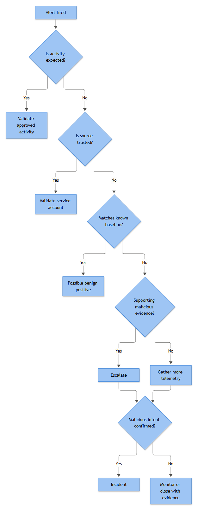

# Part 5 — The Playbook Decision Tree

Every SOC playbook eventually boils down to the same six or seven questions, asked in roughly the same order, by every analyst who has ever triaged an alert. The problem is that most SOCs never write those questions down. They live in the head of whichever senior analyst trained the shift, get retold slightly differently every time, and drift apart across Tier 1, Tier 2, and whichever contractor is covering nights this month. A decision tree just puts that implicit logic on paper, in a shape everyone can follow the same way, every time.

Here is the flow this section works through, exactly as it should appear pinned above a triage queue or embedded in the playbook itself:

```
[ALERT FIRED]
   |
   v
Q1: Is the activity expected / approved?
   (change ticket, maintenance window, documented automation, known scheduled task)
   |
   |-- YES --> [A] Validate approved activity ---------> CLOSE: Expected Activity
   |
   NO
   |
   v
Q2: Is the source trusted?
   (known service account, hardened jump host, signed internal tool, managed automation identity)
   |
   |-- YES --> [B] Validate system / service account behaviour --> CLOSE: Expected Activity
   |                                                                  or Benign Positive
   NO
   |
   v
Q3: Does the behaviour match a known baseline for this asset/user?
   |
   |-- YES --> [C] Possible Benign Positive --------------> CLOSE: Benign Positive
   |
   NO
   |
   v
Q4: Is there supporting evidence of malicious activity?
   (correlated alerts, IOC/threat-intel match, TTP chain, prior incident linkage)
   |
   |-- YES --> [D] ESCALATE ------------------------------> Hand to Tier 2 / IR
   |
   NO
   |
   v
[E] Gather additional telemetry
   (endpoint timeline, network flow, identity logs, cloud audit trail, email headers)
   |
   v
Q5: Can malicious intent be confirmed with the new evidence?
   |
   |-- YES --> [F] TRUE POSITIVE -------------------------> CLOSE: True Positive; declare INCIDENT if it crosses the IR Plan's threshold
   |
   |-- NO  --> [G] Monitor / Close with Evidence ---------> CLOSE: Insufficient Evidence
                                                              (or Benign, evidence retained)
```

Seven endpoints in total if you count both outcomes at node B, and this is deliberate — a real triage flow is not binary, it has multiple legitimate places to stop, and closing at any of them with the right documentation is a correct outcome, not a failure to find something bad.



*Figure F002 - the core decision tree for turning an alert into a disposition.*

## Q1 — Is the activity expected?

This is the cheapest question to answer and it should always be asked first, because a huge share of alert volume in any mature SOC is generated by things the organization already knows about: a patch cycle running overnight, a pentest with an active rules-of-engagement document, a new backup agent that nobody told detection engineering about until it tripped a dozen alerts in its first hour.

**[ANALYST]** - Check the change calendar, the maintenance-window list, and any active authorization records (pentest ROE, red team exercise ticket, vendor onboarding ticket) before touching anything else. Confirm the timing lines up — an approved change window at 02:00 UTC does not excuse the same activity showing up again at 14:00 UTC three days later. Confirm the scope lines up too: an approved software deployment to a specific OU does not cover the same binary appearing on a host outside that OU.

**[ENGINEERING]** - Where possible, feed the change calendar or CMDB into the SIEM as an enrichment source so "expected" isn't purely a manual lookup. A simple lookup table keyed on host/IP and time window, checked automatically, will suppress a meaningful chunk of noise before an analyst ever opens the alert.

**[MANAGEMENT]** - This branch only works if change management actually notifies the SOC. If a change ticket exists but nobody tells detection engineering, node A becomes a dead branch every analyst has to manually re-discover. Track "alerts closed as expected activity that had no visible change record at time of triage" as a metric — it tells you exactly how leaky your change-notification process is.

## Q2 — Is the source trusted?

Not every unexpected alert is malicious, and not every trusted source deserves a free pass forever. This node exists to separate "we don't have a ticket for this, but it's our own backup service account doing something a little unusual" from "we don't have a ticket for this, and we don't recognize the account either."

**[ANALYST]** - "Trusted" is not the same as "familiar." Validate the account against an inventory of known service accounts, its expected logon type, expected source host, and expected behavior pattern — not just "I've seen this account name before." Service accounts get compromised and reused by attackers specifically because analysts pattern-match on the name and stop looking.

**[ENGINEERING]** - Maintain a service-account and system-account reference list (owner, expected hosts, expected process, expected schedule) inside the SIEM or a connected CMDB, and alert when a known service account deviates from its expected host or logon pattern — that deviation should route back into the tree at Q4, not get closed here on reputation alone.

**[STAKEHOLDER]** - This is the node where "trust" and "verification" have to coexist. A compromised service account is one of the most common privilege-escalation paths into an environment precisely because it's trusted by default. The business risk of skipping validation here is disproportionate to how quick the check is.

## Q3 — Does behaviour match a known baseline?

By the time an alert reaches this node, it isn't covered by a ticket and it isn't riding on inherited trust from the source. The question now is whether the behavior itself is simply normal for this asset, this user, or this time of day — dont assume unusual-looking is the same as malicious, and dont assume it's benign just because it's common. Both mistakes happen constantly at this exact step.

**[ANALYST]** - Pull the asset or user's own history: has this host run this process before, at this frequency, communicating with this destination? A marketing laptop running PowerShell for the first time in six months is a very different baseline conversation than a domain controller doing the same thing. Look at volume too — one connection to an unfamiliar IP is different from fifty in an hour.

**[ENGINEERING]** - This is where UEBA-style baselining and simple statistical thresholds (first-seen-in-N-days, deviation from rolling average) earn their keep. If the platform can flag "first time this parent-child process pair has been seen on this host" automatically, this node stops being a manual archaeology exercise and becomes a fast lookup.

**[MANAGEMENT]** - Baseline-driven closures need a paper trail too. "Possible Benign Positive" should reference which baseline was checked and what the deviation (or lack of one) actually was — not just "looks normal, closing." Six months from now, when an auditor or a post-incident review asks why this alert was closed, "looks normal" will not hold up; a referenced baseline will.

## Q4 — Is there supporting malicious evidence?

This is the pivot point of the whole tree. Everything before it was about ruling things out cheaply. Everything after it assumes you're now genuinely investigating.

**[ANALYST]** - Look for corroboration outside the alert itself: other alerts on the same host or user in the last 24–72 hours, a match against current threat-intel indicators, a command-line or file hash that matches a known TTP chain rather than an isolated event. One weird process launch, alone, is weak evidence. That same process launch fifteen minutes after a suspicious login from an unfamiliar geography is a different conversation entirely.

**[ENGINEERING]** - This node is the natural home for correlation rules — chaining a lower-confidence alert to a higher-confidence one within a defined time window and shared entity (host, user, IP). A correlation rule that links "unusual PowerShell execution" with "new scheduled task creation" and "outbound connection to a rare destination" on the same host within 30 minutes turns three low-fidelity alerts into one high-confidence escalation, and does it without waiting on an analyst to remember to check.

**[MANAGEMENT]** - Escalation criteria here should be written down, not left to individual judgment about what counts as "enough" evidence. Define minimum criteria for escalation (e.g., two or more correlated indicators, or one confirmed IOC match) so Tier 1 escalates consistently regardless of who's on shift.

## The telemetry-gathering loop and Q5

If there's no immediate corroborating evidence, the honest answer is not "benign" — it's "not enough information yet." This is the branch most new analysts skip past too fast, usually because closing the alert feels more productive than opening three more log sources.

**[ANALYST]** - Pull the endpoint process tree and parent/child lineage, check for related authentication events (new logons, MFA prompts, password resets) around the same timeframe, check outbound network activity from the host, and check whether the same indicator (hash, domain, IP) appears anywhere else in the environment. This is also where telemetry gaps get discovered — missing agent coverage, a log source that stopped forwarding two days ago, retention limits that already aged out the data you actually need. Document what you looked for and didn't find, not just what you found.

**[ENGINEERING]** - Build the telemetry-gathering step into the playbook as a checklist of specific queries against specific sources, not a vague instruction to "investigate further." An analyst under pressure at 3 a.m. will follow a checklist. They will not reliably improvise a full investigation from scratch.

At Q5, the tree closes into one of two honest outcomes. Confirmed intent — a real objective the attacker was pursuing, backed by evidence — closes as True Positive; if it also crosses the SOP's declared-incident threshold (privileged account, confirmed follow-on activity, and similar triggers named in Part 1), that True Positive additionally gets formally declared an Incident and moves into incident response. Not every True Positive clears that bar on its own — a confirmed but contained case can close as True Positive without a full incident declaration. Unconfirmed intent does not mean "nothing happened." It means monitor or close with the evidence retained, flagged as Insufficient Evidence rather than silently discarded, so if the same indicator resurfaces next week the prior context is still attached to it.

## Why the tree reduces subjective investigation

Hand the same raw alert to five analysts with no structure and you'll get five different closure decisions, five different amounts of time spent, and at least one analyst who closes it purely because the queue is long and this one "felt fine." That inconsistency is not a training problem you can fully fix with better analysts — it's a structural problem, and it shows up in metrics as wildly uneven mean-time-to-triage and unpredictable escalation rates between shifts.

A decision tree fixes this by forcing the same sequence of checks regardless of who's asking. It doesn't remove judgment — Q3 and Q4 both still require real analytical skill — but it removes the ambiguity about what order to apply that judgment in, and what evidence has to exist before a closure category is chosen. That has three concrete effects worth tracking:

**[MANAGEMENT]** - First, closures become defensible in audit and post-incident review, because each one maps to a specific node and a specific piece of documented evidence rather than an analyst's unrecorded gut call. Second, new analysts ramp up faster, because the tree is the training material — you're not asking a two-week-old hire to develop the same instincts a five-year veteran has, you're asking them to follow the same checklist the veteran privately runs anyway. Third, SLA and quality metrics finally mean something: "time to Q4" and "percentage of alerts closed before Q4 vs. after" tell you where triage time is actually being spent, which raw mean-time-to-resolution numbers never show on their own.

None of this means the tree eliminates false closures or bad escalations. It means when they happen, you can see exactly which node the analyst was standing at, what evidence they had, and whether the tree itself needs tuning — versus the alternative, where a bad closure is just a mystery with no reconstructable reasoning behind it.

## Worked example — one alert, every endpoint

The alert: **EDR detection — encoded PowerShell command execution**, host `FIN-WKS-014`, user `jsmith`, process `powershell.exe` launched with a base64-encoded `-EncodedCommand` argument, parent process `outlook.exe`. Same base alert, four different real-world contexts, four different legitimate endpoints.

**Endpoint A — Expected Activity.** IT operations ran a scripted Outlook profile migration across the Finance OU last night as part of ticket CHG-4471, using a signed PowerShell module that legitimately calls itself with an encoded argument to avoid quoting issues. The change ticket lists `FIN-WKS-014` in scope, the timestamp lines up with the maintenance window. Analyst validates the ticket, confirms scope and timing, closes as Expected Activity — total time, under ten minutes.

**Endpoint B — Expected Activity (trusted source path).** No change ticket exists, but the process was launched by `RMM-Agent.exe`, the organization's documented remote monitoring and management tool, running under its known service account with its known parent-child pattern. Analyst confirms the account against the service-account inventory, confirms the host and process pattern match what RMM is expected to do, closes as Expected Activity with a note that the change-notification gap (no ticket) is separately reported to IT ops.

**Endpoint C — Benign Positive.** No ticket, parent process is genuinely `outlook.exe` rather than a spoofed name, but baseline review shows `jsmith` has a documented, IT-approved calendar macro that shells out to PowerShell to sync meeting rooms every Monday morning — this is the third Monday running the same alert has fired for this exact user at this exact hour. Analyst references the prior two closures and the documented macro, closes as Benign Positive, and flags the rule to detection engineering for a tuning exception rather than re-triaging it every week.

**Endpoint D through F — Incident.** No ticket, no recognized service account, no matching baseline — `jsmith` has never triggered this alert before. Q4 check turns up a correlated alert eleven minutes earlier: an unusual mailbox rule creation on `jsmith`'s account and a sign-in from an unfamiliar IP address in a country the user has never logged in from. That's supporting evidence, so the alert escalates immediately (Endpoint D) rather than waiting on further telemetry gathering. Tier 2 pulls the process tree and finds the encoded command decodes to a script downloading a second-stage payload from an external domain, confirms lateral movement staging behavior, and the case becomes a confirmed incident (Endpoint F) — credential reset, host isolation, and the full incident response plan follow.

**Endpoint G — Monitor / Close with Evidence.** Same alert, same unfamiliar user pattern, but Q4 turns up nothing correlated — no other alerts on the host, no IOC match, no unusual sign-in. Analyst gathers additional telemetry: process lineage looks unremarkable, no outbound connections beyond expected mail traffic, no new scheduled tasks, no other endpoint showing the same indicator. Intent can't be confirmed either way. This closes as Insufficient Evidence, not Benign — the indicator (the encoded command hash) is retained and tagged, so if it resurfaces on another host next month, the analyst working that alert inherits this context instead of starting from zero.

Same trigger condition, four defensible outcomes, and every single one of them followed the same six questions in the same order to get there.
