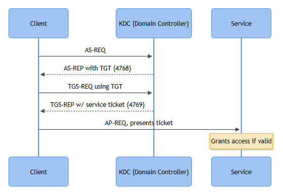

# Windows Event IDs: Lockout, Kerberos & NTLM Events

This cluster covers the events you live in whenever someone gets locked out, a service account starts behaving strangely, or you're chasing a Kerberoasting alert at 2am. Most of these IDs are noise in isolation — a domain controller generates thousands of 4769s an hour without anyone touching a keyboard. The value shows up when you stack them against each other and against the account/host baseline.

All eight IDs live in the **Security** log. All but 4798/4799 are logged almost exclusively on **Domain Controllers** (Kerberos/NTLM auth happens against the DC). 4798/4799 fire on whichever local machine the enumeration happened on — workstation, server, or DC.

---

### 4740 — A User Account Was Locked Out

**What it means:** The account's bad-password counter hit the lockout threshold and the DC locked it. A *consequence* event, not the attack itself — the actual bad attempts show up elsewhere (4625, 4771, 4776).

**Key fields:** Target Account Name/SID, **Caller Computer Name** (source of the bad attempts — the field everyone forgets to check), Subject (usually the DC's own machine account).

**Normal:** A user changed their password on their phone and other devices still hold the old cached credential, hammering the DC until it locks. Caller Computer Name is usually the user's own workstation or a mobile Exchange/VPN gateway.

**Suspicious:** Caller Computer Name is a host the account has no business touching — a file server, a jump box, another user's laptop — especially if multiple accounts lock out from the *same* Caller Computer Name in a short window: the fingerprint of a password-spray tool grinding through a user list from one host.

**[STAKEHOLDER]** - A lockout storm is usually the first thing the help desk feels, long before the SOC does. If ten users call in locked out within five minutes, check for a shared Caller Computer Name before resetting everyone's password and moving on.

**Correlate with:** 4625, 4771, 4776 (the underlying auth failures), 4767 (unlocked right after, and by whom).

**Common false positives:** Stale credentials in scheduled tasks, mapped drives, or mobile mail profiles; a service account whose password rotated but wasn't updated in an app config, which repeats for weeks if nobody fixes the root cause.

**Investigation narrative:** Vantage Point Logistics' help desk gets six lockout tickets in four minutes, all Finance OU. 4740 events all list `Caller Computer Name: WKS-FIN-KIOSK03`, a warehouse kiosk with no reason to authenticate as Finance staff. Pivoting to 4625/4771 on that host's IP (10.20.14.55) shows a script cycling a username list against one weak password — a spray, not a coincidence. Kiosk gets isolated; the culprit turns out to be a leftover RAT from an unpatched browser exploit three weeks prior.

**KQL:**
```kql
SecurityEvent
| where EventID == 4740
| summarize LockoutCount = count(), Accounts = make_set(TargetAccount) by CallerComputerName = tostring(parse_json(EventData).CallerComputerName)
| where LockoutCount >= 3
| order by LockoutCount desc
```

---

### 4767 — A User Account Was Unlocked

**What it means:** Self-explanatory, but the value is entirely in *who* did it and *how fast*.

**Key fields:** Target Account Name/SID, Subject (the admin or self-service tool that performed the unlock).

**Normal:** Help desk unlocks after verifying identity, ticket attached. Self-service reset portals also generate this under a service account identity.

**Suspicious:** Unlock by an account with no help-desk role; unlock immediately followed by a fresh burst of 4771/4776 failures on the same target (someone unlocked it to keep guessing); unlock at 3 AM with no ticket.

**Correlate with:** 4740 (the lockout it resolves), 4724 (a bundled password reset), 4672 (does the unlocking account actually hold the rights it's using).

**Common false positives:** Automated self-service portals unlocking accounts as part of normal MFA-verified reset flow — noisy but expected; allowlist the service account's SID rather than suppress the whole event type.

**Investigation narrative:** An analyst sees `svc-helpdesk` unlock `jsmith` at 03:14 local time, outside the help desk's shift. `svc-helpdesk`'s credential had been reused on a phished web app two days earlier — the unlock was the attacker clearing their own lockout mid-spray so they could keep guessing jsmith's password. Correlating 4767 to a fresh burst of 4771 seconds later confirms it.

**SPL:**
```spl
index=wineventlog EventCode=4767
| eval subject_account=SubjectUserName
| where subject_account!="SYSTEM" AND NOT match(subject_account, "svc-selfservice")
| table _time, TargetUserName, SubjectUserName, SubjectDomainName
```

---

### 4768 — A Kerberos Authentication Ticket (TGT) Was Requested

**What it means:** The first step of Kerberos logon — the client asks the DC (KDC) for a Ticket Granting Ticket. The Kerberos equivalent of the initial logon attempt.

**Key fields:** Account Name, Supplied Realm, **Client Address**, Pre-Authentication Type, **Result Code**: `0x0` success, `0x6` client not found (bad username), `0x12` account revoked/disabled, `0x18` pre-auth failed (bad password).

**Normal:** Every domain-joined device requesting a TGT at logon, unlock, or scheduled renewal. High volume, mostly `0x0`.

**Suspicious:** A run of `0x6` for account names that look enumerated (`admin1`, `admin2`, `svc_test`...) from one Client Address — username enumeration against the KDC. A `0x12` for a disabled service account someone is trying to resurrect. Repeated `0x18` immediately preceding a `0x0` for the same account/source — brute force that eventually lands.

**Correlate with:** 4771 (failure detail), 4769 (the follow-on service ticket request), 4625 (NTLM fallback), 1102 (log cleared after a successful guess).

**Common false positives:** Misconfigured legacy apps probing with stale service accounts; NAT'd branch offices where Client Address reflects a shared egress IP rather than the true workstation, muddying attribution.

**Investigation narrative:** DC02 shows a burst of 4768 events, Result Code `0x6`, for twenty-two account names in ninety seconds from 192.168.4.201, a host with no account-management role — a username-enumeration sweep ahead of a spray. No successful `0x0` follows, so this closes as detected-and-blocked recon, but the source host still gets pulled for a malware sweep.

**KQL:**
```kql
SecurityEvent
| where EventID == 4768
| extend ResultCode = tostring(parse_json(EventData).ResultCode)
| where ResultCode == "0x6"
| summarize DistinctAccountsTried = dcount(TargetUserName), Accounts = make_set(TargetUserName) by IpAddress, bin(TimeGenerated, 5m)
| where DistinctAccountsTried > 10
```

---

### 4769 — A Kerberos Service Ticket Was Requested

**What it means:** The client has a TGT and now asks for a service ticket (TGS) to access a resource — a file share, a SQL instance, a Kerberos-auth'd web app.

**Key fields:** Account Name, **Service Name**, Client Address, **Ticket Encryption Type**, Failure Code.

**Normal:** Enormous volume — every SMB share, SQL connection, or internal web app hit generates one. Most SOCs filter this heavily or route it to cold tier.

**Suspicious:** Ticket Encryption Type `0x17` (RC4) requested for a **service account's** SPN, especially in bulk against many different service accounts from one requesting identity in a short window — the signature of Kerberoasting, where RC4-encrypted tickets are cracked offline far more cheaply than AES.

**[ENGINEERING]** - Don't alert on RC4 alone; plenty of legacy apps still request it. Alert on RC4 plus high fan-out (unusual number of distinct Service Names requested by one account in a short window), or RC4 against SPNs tied to privileged service accounts specifically.

**Correlate with:** 4768 (the preceding TGT), 4740/4771 (auth failures elsewhere for the same account), 4688 (a known Kerberoasting tool's process on the requesting host — Rubeus and similar leave artifacts).

**Common false positives:** Backup/monitoring software legitimately enumerating SPNs across many service accounts on a schedule; legacy Java or Unix clients defaulting to RC4 because they don't support AES.

**Investigation narrative:** `jdoe`'s account requests tickets for eleven distinct SPNs, all `0x17`, inside a forty-second window — none are shares jdoe's role touches. 4688 shows a PowerShell process spawned three minutes earlier with a suspicious command line, and 4104 script block logging confirms a `Get-DomainSPN`-style enumeration cmdlet. Verdict: True Positive - Kerberoasting attempt; targeted service accounts get priority rotation to AES-compatible, long passwords before any offline crack can succeed.

**SPL:**
```spl
index=wineventlog EventCode=4769 TicketEncryptionType=0x17
| stats dc(ServiceName) as distinct_spns, values(ServiceName) as spns by TargetUserName, src_ip, _time span=1m
| where distinct_spns > 5
```



*Figure F012 - the AS-REQ/AS-REP/TGS-REQ/TGS-REP/AP-REQ flow underlying the Kerberos attack playbooks.*

---

### 4771 — Kerberos Pre-Authentication Failed

**What it means:** Flags a pre-authentication failure specifically, most commonly a bad password.

**Key fields:** Account Name, Client Address, **Failure Code** (`0x18` = bad password), Pre-Authentication Type.

**Normal:** Occasional single failures — mistyped password, stale cached credential on a phone.

**Suspicious:** Rapid repeated `0x18` for one account from one Client Address (brute force), or `0x18` for many accounts from one Client Address (spray) — same family as 4740/4768, but this is the raw failure signal that precedes a lockout, often your earliest detection point.

**Correlate with:** 4740 (lockout once threshold is hit), 4768 (eventual success or continued failure), 4776 (NTLM fallback).

**Common false positives:** A phone or tablet with an old cached password retrying every few minutes for days — annoying, low-and-slow, not malicious. Distinguish by checking whether the source is a device the user actually owns versus a server or unfamiliar host.

**Investigation narrative:** Forty 4771 events, Failure Code `0x18`, single account `svc-backup`, single source 10.20.30.14 — a server that isn't the actual backup application server. An attacker with lateral access to a misconfigured jump host was running a brute force attempt against a service account found in a config file. Account gets disabled and rotated before lockout even triggers — caught one stage earlier than the 4768 case above.

**KQL:**
```kql
SecurityEvent
| where EventID == 4771
| extend FailureCode = tostring(parse_json(EventData).FailureCode)
| where FailureCode == "0x18"
| summarize Attempts = count() by TargetUserName, IpAddress, bin(TimeGenerated, 10m)
| where Attempts > 5
```

---

### 4776 — The Domain Controller Attempted to Validate Credentials for an Account (NTLM)

**What it means:** NTLM authentication attempt validated (or rejected) by the DC — fires when Kerberos isn't used: older apps, IP-based connections, workgroup scenarios, or explicit NTLM fallback.

**Key fields:** Logon Account, **Source Workstation**, **Error Code**: `0xC0000064` unknown user, `0xC000006A` bad password, `0xC0000234` account locked out.

**Normal:** Legacy line-of-business apps, older printers/scanners with stored creds, VPN concentrators, anything connecting by IP rather than hostname (Kerberos needs a resolvable SPN; NTLM doesn't care).

**Suspicious:** A sudden spike in NTLM traffic for an account that normally only uses Kerberos — can indicate a downgrade attack, relay activity, or a tool avoiding Kerberos logging. Repeated `0xC000006A` from one workstation trying multiple accounts is a spray, same pattern as the Kerberos-side events.

**[STAKEHOLDER]** - Heavy NTLM usage in a business unit is a standing risk (weaker protocol, easier to relay), independent of any single incident — worth its own line on the risk register.

**Correlate with:** 4625 (NTLM logon failure), 4740 (lockout, if `0xC0000234` recurs), 4648 (explicit alternate credentials, common in relay chains).

**Common false positives:** Legacy multifunction printers with a stale service account password — a slow drip of `0xC000006A` for months if nobody owns that device's config.

**Investigation narrative:** A spike of 4776 events, Error Code `0xC000006A`, for the domain admin account, Source Workstation `PRINTSVR01` — a print server with no business reason to authenticate as a domain admin. A scheduled task left over from a departed contractor is still trying (and failing) under an old credential. Benign Positive — worth cleaning up, not an attack. Lesson goes into the offboarding checklist: audit scheduled tasks and stored credentials, not just AD account disablement.

**SPL:**
```spl
index=wineventlog EventCode=4776 ErrorCode=0xC000006A
| stats count by SourceWorkstation, TargetUserName
| where count > 10
```

---

### 4798 — A User's Local Group Membership Was Enumerated

**What it means:** Something queried what local groups a specific user belongs to on this machine — think `net user <name>` or the equivalent API call.

**Key fields:** Subject (account doing the enumerating), Target Account (whose membership got queried).

**Normal:** Admin tools, endpoint agents, and help-desk scripts do this constantly — one of the highest-volume, lowest-signal events on this list in isolation.

**Suspicious:** A non-admin account or unfamiliar process enumerating many *other* users' memberships across many hosts in a short window — recon, usually early-stage, mapping who has local admin where.

**Correlate with:** 4799 (same tooling, same session), 4688 (process behind the query — `net.exe`, `whoami.exe`, a recon script), 4104 (script block content if PowerShell-based).

**Common false positives:** RMM/EDR agents doing routine posture checks, Group Policy processing, SCCM/Intune inventory scans — baseline by process name and account so real anomalies stand out.

**Investigation narrative:** A laptop shows hundreds of 4798 events targeting dozens of usernames across two hours, all triggered by `net.exe` spawned from a script, not an interactive session. 4688 shows the parent process is an unsigned binary dropped in a temp directory — combined with 4799 activity on the same host, this reads as a recon tool mapping local admin rights. Verdict: True Positive, escalated to Incident; host isolated for forensic imaging.

---

### 4799 — A Security-Enabled Local Group Membership Was Enumerated

**What it means:** Same idea as 4798, but from the group's side — something asked "who is in this local group" (classically local Administrators) rather than "what groups is this user in."

**Key fields:** Subject (caller), Group Name/SID being enumerated.

**Normal:** Same admin-tooling and endpoint-agent noise as 4798, plus routine Group Policy/inventory processing.

**Suspicious:** Repeated queries against the local Administrators group across many hosts from one account in a short window — building a map of privileged access before lateral movement or escalation.

**Correlate with:** 4798 (the companion recon event), 4732/4728 (actual membership *changes* — the escalation step this recon often precedes), 4672 (privileged logon on the target host, if the attacker acts on what they found).

**Common false positives:** Vulnerability scanners and asset-management platforms are the usual noisy legitimate source; allowlist the scanner's service account rather than tune the rule into uselessness.

**Investigation narrative:** Continuing the 4798 case, the same binary generates 4799 events against the local `Administrators` group on twelve hosts over ninety minutes — a clear sweep, not a one-off. Those twelve hosts get checked for any subsequent 4732 to rule out escalation having already happened before containment.

**KQL (covers both 4798/4799 together, since they're almost always investigated as a pair):**
```kql
SecurityEvent
| where EventID in (4798, 4799)
| summarize HostsTouched = dcount(Computer), Events = count() by SubjectUserName, bin(TimeGenerated, 1h)
| where HostsTouched > 5
| order by HostsTouched desc
```

---

### Correlation Cheat Sheet

| If you see... | Also pull... | Because... |
|---|---|---|
| 4740 (lockout) | 4625, 4771, 4776, 4767 | Find the real source of bad attempts and whether someone re-enabled access |
| 4768/4771 spray or enumeration pattern | 4740, 4625, 1102 | Confirm blast radius and check whether logs got cleared after a successful guess |
| 4769 with RC4 + high fan-out | 4688, 4104, 4768 | Confirm a Kerberoasting tool actually ran, not just a legacy app default |
| 4776 spike for a normally-Kerberos account | 4648, 4625 | Possible downgrade or relay activity |
| 4798/4799 breadth from one Subject | 4688, 4732/4728, 4672 | Recon usually precedes an actual privilege-escalation attempt |

**[MANAGEMENT]** - Lockout-storm and Kerberoasting-pattern alerts belong on a tighter SLA than routine failed-logon noise — both can precede active credential compromise within minutes. Baseline: acknowledge within 15 minutes, initial triage within 30. Track false-positive rate per rule monthly; if a service account or scanner keeps tripping the same alert, fix the allowlist rather than let analysts re-litigate the same benign finding weekly — that's how alert fatigue starts on this cluster.
