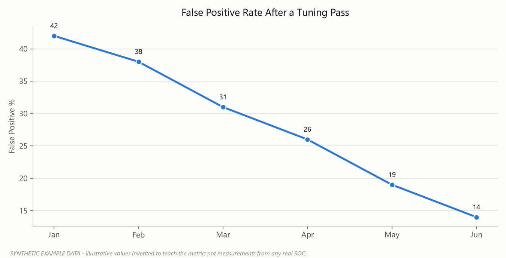
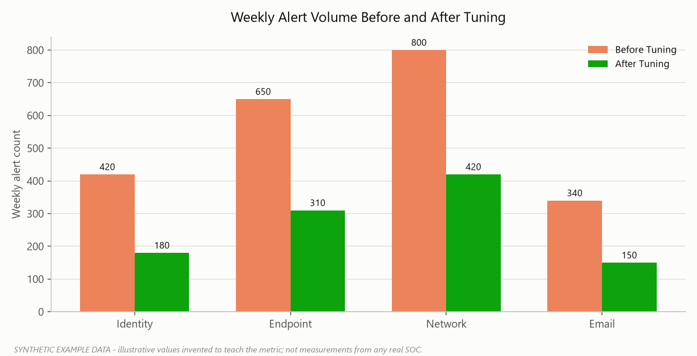

# Part 21 — False Positive Engineering

Every SOC eventually hits the same wall: the detection rule works, the alert fires exactly when it's supposed to, and the analyst still closes it as noise. That's not a rule failure — it's the normal lifecycle of a detection that hasn't been tuned yet. The mistake most teams make is treating "false positive" as a single bucket that catches everything from "the logic was wrong" to "the logic was right but nobody cares." Those need opposite fixes, and lumping them together is how tuning backlogs turn into six-month graveyards nobody wants to touch.

This section gives a disposition vocabulary that distinguishes cause from consequence, walks through the axes you tune against, and closes on the most common way tuning goes wrong: the permanent, unscoped exclusion that quietly becomes a blind spot.

## The Disposition Taxonomy

Analysts often collapse everything that isn't a confirmed incident into "false positive" in the ticket dropdown because it's the fastest option. Six months later, nobody can tell whether a rule is garbage or whether it's accurately catching routine business activity that was never a threat in the first place. Those require opposite fixes — one needs the logic rewritten, the other needs an exception carved into the environment.

| Disposition | Did the described activity actually happen? | Was it malicious/unauthorized? | Typical fix |
|---|---|---|---|
| **False Positive** | No — the rule matched something it shouldn't have, or misrepresents what occurred | N/A | Fix the detection logic |
| **Benign Positive** | Yes, exactly as described | No — legitimate business activity | Tune scope/exclusion, or accept as noise floor |
| **Expected Activity** | Yes | No — pre-announced/scheduled | Suppress for the known window, annotate |
| **True Positive** | Yes | Yes | Incident response |
| **Test Activity** | Yes — the attacker-pattern is technically real | No actor intent — authorized red team/tooling reproduced the pattern | Validate authorization, log as validated detection, no IR |
| **Duplicate** | Yes, but already alerted | Irrelevant | Fix correlation/dedup logic |

**False Positive** — the detection logic itself is wrong. A rule looking for Kerberoasting fires on Ticket Encryption Type `0x17` (RC4) in event 4769, but the parser is reading the wrong field offset and is really matching mislabeled AES tickets. Or a "brute force" correlation counts 4625 events but is actually counting a load balancer health check retrying one service account with a stale password. The event described did not occur the way the alert claims — an engineering defect, fixed in the query or parser, not with an exclusion.

**Benign Positive** — the rule worked correctly and the activity happened exactly as described, but it's ordinary business, not an attack. A help desk technician logs on interactively to a server using explicit alternate credentials (4648) to run a patch script — legitimate lateral-movement-shaped behavior (T1021.002 territory if this were an attacker), except it's Tuesday patch night at Meridian Bank and it's on the change calendar. The alert is accurate; the world it describes is fine.

**Expected Activity** — a subtype of Benign Positive worth separating out because the SOC had advance notice. A scheduled DR failover creates a burst of new-service installs (7045) and scheduled tasks (4698) across the finance segment. If the SOC knew about the window in advance (change ticket, DR calendar, pentest rules of engagement), this closes fast with a pointer to that record. If it did *not* know in advance, treat it as Benign Positive at best until confirmed — don't assume good intent just because the activity looks routine.

**True Positive** — the activity is real and actually malicious or unauthorized: a Password Spraying campaign (T1110.003) against Meridian's VPN gateway generating 4771 pre-auth failures across dozens of accounts from one external IP, followed by a single 4768 success. Confirmed, escalate.

**Test Activity** — gets confused with Benign Positive constantly, so it's worth being precise. Benign Positive means the *scenario itself* never resembled an attack — an admin doing admin things. Test Activity means the rule correctly caught genuine attacker-pattern behavior — real Kerberoasting-shaped RC4 ticket requests, LSASS memory access matching T1003.001, a DCSync-pattern replication request (T1003.006) — but forensic follow-up shows the actor was authorized: an approved penetration test under signed rules of engagement, or a scanner legitimately triggering T1595 Active Scanning as contracted work. The technique is real; the intent is sanctioned. Log it as a validated detection and close without incident response, authorization record attached.

**[ANALYST]** - Don't close as Test Activity on someone's say-so. Pull the actual rules-of-engagement document, confirm the source IP/host falls inside the authorized scan range and time window, and check the ticket number quoted actually exists and covers this activity. "The pentest team said it was them" without a document to point to is how a real DCSync gets waved through.

**Duplicate** — the same real event generating more than one alert because of architecture, not because anything happened twice: a 4697 service-install event ingested by both the SIEM's native connector and a separate syslog forwarder, producing two tickets for one install. Fix the dedup logic or ingestion pipeline — don't just close duplicates manually forever.

**A note on severity vs. disposition** — some alerts are never meant to trigger a same-day response: a notification every time someone is added to a security-enabled global group (4728), routed to an inbox for identity governance with no expectation anyone investigates immediately. That's a severity call (Informational, the lowest rung of the five-level severity scale), not a disposition — the alert still needs one of the outcomes above, usually Benign Positive once someone confirms the addition was authorized. Tagging it Informational-severity and Benign Positive is different from inventing an "Informational" disposition bucket that hides whether anyone ever actually checked it. Keep Informational-severity volume out of the actionable analyst queue where possible — mixing it in is one of the fastest ways to train analysts to skim past everything.

**[MANAGEMENT]** - Disposition codes feed your metrics. If "false positive" is used for both broken logic and legitimate business activity, your false-positive rate looks identical whether the fix is a two-line query patch or a permanent policy exception — and leadership can't tell which rules are actually unreliable versus which ones are just noisy against normal operations. Track disposition as its own field, separate from priority and separate from "actioned/not actioned," and review the distribution monthly per rule.

## Tuning Axes

Once you know *why* something is a false or benign positive, the next question is *what dimension* do you narrow the rule against. Most tuning decisions map to one or more of these axes. Stacking axes (user + host + time window, not just user alone) is what separates a defensible tuning decision from a blind spot waiting to happen — see the exclusion section below.

**User** — the identity the activity is attributed to (Subject or Target Account in 4624/4625/4768). The highest-risk axis to tune alone, because identities get compromised; it should almost never be the *only* axis in a scoped exception.

**Host** — the source or target workstation/server (Workstation Name, Source Network Address, Caller Computer Name). A backup job running as SYSTEM from `MER-BKP01`, hitting file servers with 4648 explicit-credential logons nightly at 01:00, is expected from that host; the same pattern from a marketing laptop is not.

**IP / Network location** — source or destination address, and whether it's internal, VPN-assigned, or external. Needs care around NAT and VPN egress — dozens of users can share one exit IP, so an IP-only exclusion can silently cover traffic from people it was never meant to cover.

**[ENGINEERING]** - When scoping by IP, prefer CIDR ranges tied to known infrastructure (a vulnerability scanner subnet, a specific jump-box /32) over broad exclusions of an entire VPN pool or NAT gateway range.

**Service account** — non-interactive identities like `svc-backup` or `svc-sqlagent`. Narrow, predictable behavior (specific hosts, times, Creator Process Name in 4688) makes these good candidates for tight baselines and bad candidates for blanket exclusion — a compromised service account with standing privileges is a favorite pivot for T1078.002 and T1550.002/.003 (Pass the Hash / Pass the Ticket).

**Application / Process** — the New Process Name or Service File Name (4688, 4697, 7045). A rule flagging suspicious children of `winword.exe` can exclude a known, hash-verified reporting add-in launching `powershell.exe` with one specific command line — scoped to that exact parent-child-command-line triplet, not "PowerShell spawned by Office, ever."

**Time** — expected windows: patch Tuesday, backup runs, batch jobs, business hours vs. off-hours. A 4698 scheduled task at 02:00 from the patch management server is routine; the same event from a developer's workstation at 02:00 is not.

**Threshold** — the count that has to be crossed before the rule fires (e.g., 5 failed logons in 10 minutes). Raising it blindly to kill noise also raises your detection floor for slow, deliberate brute-forcing — pair threshold changes with a check on what real attack volume looks like against that target.

**Frequency** — how often the *pattern itself* recurs over a longer window, distinct from a burst threshold. One 4769 with RC4 encryption is unremarkable; the same account requesting RC4 tickets for forty different SPNs in an hour is Kerberoasting-shaped (T1558.003) regardless of any single threshold.

**Sequence** — order-dependent correlation: 4719 audit policy change immediately followed by 1102 log clearance, or 4624 logon then 4672 special privileges then 4698 task creation. Be explicit about required order and allowed time gap — too loose gives false chains from coincidence, too tight lets jittered multi-stage attacks slip through.

**Baseline** — statistical "normal" for a specific entity over time (this host's average of forty logons/day vs. a spike to four hundred). Needs enough history to be meaningful — two weeks over a holiday period isn't representative.

**Peer group** — comparing an entity against others like it, not just its own history. A help desk account touching twelve workstations a day is normal *for that role*; a finance analyst doing the same is anomalous even after months of doing it (a stale baseline of its own).

**Risk** — aggregate scoring across multiple weak signals (UEBA-style) rather than one deterministic rule. Tuning usually means adjusting per-signal weights and the aggregate threshold that promotes a score into an alert, not editing a single query.

**[ENGINEERING]** - Stacking host, IP, service-account, and threshold axes in one exclusion clause, rather than suppressing the whole rule for that DC or blanket-excluding the scanner account everywhere:

```kql
SecurityEvent
| where EventID in (4771, 4768) and TimeGenerated > ago(1h)
| where not (Computer == "MER-DC01" and IpAddress == "10.10.5.20" and TargetUserName startswith "svc-scan")
| summarize FailCount = countif(Status != "0x0"), Accounts = dcount(TargetUserName) by IpAddress, bin(TimeGenerated, 10m)
| where FailCount >= 8 and Accounts >= 5
```



*Figure F051 - an illustrative false-positive decline after a tuning pass (synthetic data).*

The rate decline above is the per-rule view; the same effect shows up in raw ticket volume once tuning axes are applied across a rule set. The chart below compares weekly alert counts by category before and after such a tuning initiative:



*Figure F054 - an illustrative before/after tuning comparison across categories (synthetic data).*

## Why "Exclude This User Forever" Is Dangerous

This is the tuning decision that causes the most damage over the longest time, and it almost always starts with a reasonable-sounding request. Someone on the help desk says a user "always fat-fingers their password" or "always logs on from three laptops" and asks the SOC to suppress alerts on that account. An analyst under ticket pressure adds the username to a global exclusion list on the brute-force rule. No ticket reference, no review date, no scope beyond the bare username.

Here's the failure mode: six months later that same account gets caught in a real Password Spraying campaign, because the account itself was never the anomaly — the *volume and source* of failed logons was. A blanket user-level exclusion suppresses the legitimate noise and the real attack traffic equally, because the rule can no longer see that account at all. By the time anyone notices it authenticating from an unfamiliar external IP and pivoting through file shares (T1078.002, T1021.002), the attacker has had a free run specifically *because* someone tried to reduce ticket volume a year earlier. Worse, nobody remembers the exclusion exists — no calendar entry, no attached ticket, and the analyst who created it left the team eleven months ago.

The underlying problem is that "exclude this user" is a single-axis, unscoped, unowned, permanent change to detection coverage. Every one of those four properties needs to be the opposite.

**[MANAGEMENT]** - A proper exclusion is:

| Property | What it means | Example |
|---|---|---|
| **Scoped** | Narrowed across multiple axes, not just identity | User + host + time window + process, not user alone |
| **Justified** | Tied to a documented business reason and a ticket/change record | "Backup job svc-backup runs 4648 explicit-credential logons nightly per CHG-40217" |
| **Expiring** | Has a hard review/expiry date, not indefinite | Reviewed quarterly, auto-flagged for renewal every 90 days |
| **Owned** | A named accountable approver, not "the SOC" collectively | Detection engineering lead signs off; identity team co-owns if account-related |

A defensible version of the help-desk request above looks like this instead:

| Field | Value |
|---|---|
| Rule | Brute Force / Repeated Failed Logon (4625/4771 threshold) |
| Scope | Account `j.romero` **AND** source host `MER-WKS-1147` **AND** logon type 2 (interactive) only |
| Justification | User has a documented physical keyboard/accessibility condition; help desk ticket HD-88213 |
| Approved by | SOC Manager + user's line manager (identity-related exception) |
| Effective | 2026-09-15 |
| Expires | 2026-12-15 (90-day review) |
| Compensating control | MFA remains enforced; any failed logon from a *different* host still alerts normally |

Notice what this doesn't do: it doesn't touch the account's behavior from any other host, it doesn't suppress Kerberos pre-auth failures (4771) from external IPs, and it dies automatically in ninety days unless someone actively re-justifies it. If `j.romero`'s credentials get phished and used from an attacker's box, the rule still fires, because the exclusion was never about the *username* — it was about one specific, narrow, expiring combination of user, host, and logon type.

**[STAKEHOLDER]** - The business case for scoped exclusions isn't just "fewer false alarms," it's "we can prove to an auditor exactly what's excluded, why, who approved it, and when it was last reviewed." A permanent unscoped exclusion is unauditable by definition — nobody can tell you, six months in, whether it's still needed or whether it's a hole someone forgot to patch. Frame every tuning exception the way you'd frame a firewall rule change: least privilege, time-boxed, owned.

Treat the exclusion list itself as a detection surface worth monitoring, on the same review cadence as firewall rules or privileged access. Stale, ownerless, permanent exclusions are exactly the kind of gap that shows up in a post-incident review with the sentence "the alert would have fired, but it was suppressed."
