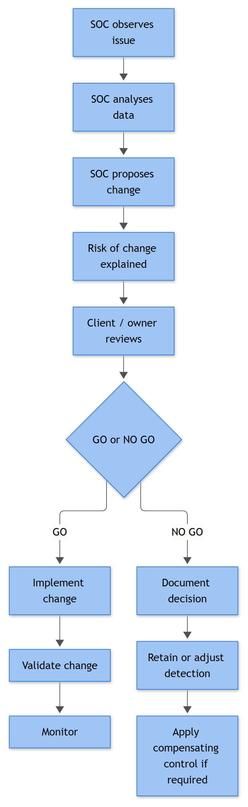

# PART 22 — Client Approval and GO/NO GO Decisions

Every tuning change you make in someone else's environment is a small negotiation. You're trading detection coverage for signal quality, and somebody who isn't in the SOC has to own that trade-off — because when it goes wrong, they're the one explaining it to a regulator or a board, not you. This part covers the mechanics of that negotiation: how a SOC turns "this rule is garbage" into a documented, approved, reversible change, and what happens when the client says no.

If you've worked MSSP-side, in-house SOC-with-a-CISO-above-you, or even just a large enough internal team where security doesn't own the risk decision alone, you already know the pattern. What kills teams isn't the tuning itself — it's doing it informally, verbally, "I'll just add an exclusion real quick," and then nobody being able to answer "who approved suppressing this" eighteen months later when an auditor or an incident retro asks.

## The Flow

```text
1. SOC IDENTIFIES ISSUE        (analyst or engineer flags noise, gap, or FP pattern)
        │
2. SOC COLLECTS EVIDENCE       (alert volume, FP rate, root cause, sample events)
        │
3. SOC PROPOSES CHANGE         (written proposal, required fields below)
        │
4. RISK IMPACT EXPLAINED       (what detection coverage is traded away, and for what)
        │
5. CLIENT / STAKEHOLDER REVIEW (technical + risk-owner sign-off)
        │
6. GO / NO-GO DECISION         (documented, timestamped, named approver)
        │
   ┌────┴────┐
  GO        NO-GO
   │          │
7. CHANGE      Proposal closed, logged as rejected with reason,
   IMPLEMENTED  alternative mitigation discussed if applicable
   │
8. VALIDATION  (confirm the rule still catches true positives, noise actually dropped)
   │
9. MONITOR     (defined observation window, then close or roll back)
```

Nothing here is exotic. The failure mode is skipping steps 2 and 4 because "we're confident it's fine," or skipping step 9 because the ticket got closed the moment the change was pushed. A change with no monitoring window isn't validated, it's just deployed and forgotten.

**[MANAGEMENT]** - This flow should exist as a named process in your SOC's operating procedures, not tribal knowledge held by one senior engineer. If your MSSP contract or internal SLA doesn't already define a maximum turnaround time for tuning-change review (5 business days is a common baseline for non-urgent changes, expedited path for anything actively suppressing a live threat), that's a gap worth raising with the account owner.



*Figure F005 - how a SOC recommendation becomes a client-approved change.*

## The Proposal Record — Required Fields

Every tuning or detection change proposal, no matter how small it looks, gets logged with the following fields. Treat this as a form, not prose — it should be answerable in a sentence or two per field, and if you can't answer one, you're not ready to submit it.

| Field | Description | Notes |
|---|---|---|
| **Proposed by** | Named analyst/engineer, not "the SOC team" | Accountability, and who to ask follow-up questions |
| **Date proposed** | Calendar date the proposal was submitted | Starts the SLA clock |
| **Reason / trigger** | What prompted this — FP volume, missing telemetry, analyst fatigue, a specific incident | Should reference ticket numbers or alert IDs, not "it's noisy" |
| **Detection affected** | Exact rule name, rule ID, and the ATT&CK technique(s) it maps to | No ambiguity about scope |
| **Change description** | Precise mechanical change — exclusion, threshold, logic rewrite, disable | Should be reviewable as a diff, not a paragraph |
| **What could be missed** | Honest statement of the coverage gap this creates | The single most-skipped field, and the most important one |
| **Expected noise reduction** | Quantified — "cuts daily alert volume from ~40 to ~3" | Ties the ask to a measurable benefit |
| **Rollback plan** | Exact steps and time to revert, and what triggers a rollback | Must be executable by someone other than the author |
| **Compensating controls** | Anything covering the gap identified above (alternate detection, manual review, additional logging) | Optional field, but strengthens weak proposals |
| **Approved by** | Named client/stakeholder decision-maker | Not "client SOC," a person |
| **Decision date** | When GO/NO-GO was recorded | Closes the SLA clock |
| **Review/expiry date** | When this change gets re-evaluated | Prevents permanent exceptions from silently becoming permanent gaps |

**[STAKEHOLDER]** - You are not being asked to understand Kerberos ticket encryption types. You are being asked one question: "are we comfortable accepting this specific, described gap in exchange for this specific, described benefit, for this specific period of time." If the SOC can't answer "what could be missed" in plain language, send the proposal back.

**[ANALYST]** - The evidence-collection step (step 2 in the flow) is where most proposals live or die before they even reach the client. Pull actual sample events, not a summary — screenshots or exported rows of the 4771/4769/whatever fired, timestamps, source IPs, account names, and a clear before/after volume count over a representative window (7–14 days minimum; a 2-day sample gets challenged, correctly, as unrepresentative).

## Worked Example — GO

**Trigger:** Alert `T1110.003-KerbSpray-01` ("Multiple Kerberos Pre-Authentication Failures, Single Source") fired 460 times over 9 days against the domain controllers for **Alderney Bay Financial**, all sourcing from `10.20.4.15`. Every single fire was a true-positive-on-paper, false-positive-in-practice: it's the Tenable vulnerability scanner's dedicated credential-check service account (`svc-tvm-scan`), running its weekly authenticated scan against a rotating batch of test accounts as part of the credential-validation module.

**Evidence collected:** Analyst Priya Nandakumar pulled 4771 events (Kerberos pre-authentication failed, Failure Code 0x18) for the window, confirmed source address consistently `10.20.4.15`, confirmed via CMDB and a call with the client's vulnerability management team that this host is the authorized Tenable scanner, and confirmed the scan schedule (Tuesdays 02:00–04:00 UTC) lines up exactly with the alert timestamps.

**Proposal submitted:**

| Field | Value |
|---|---|
| Proposed by | Priya Nandakumar, Tier 2 Analyst |
| Date proposed | 2026-08-11 |
| Reason | 460 alerts / 9 days, 100% confirmed benign, source of alert fatigue on the T1110.003 rule |
| Detection affected | `T1110.003-KerbSpray-01` (Kerberos pre-auth failure threshold, T1110.003 Password Spraying) |
| Change description | Add source-IP exclusion for `10.20.4.15`, scoped to the confirmed scan window (Tue 02:00–04:00 UTC) via a scheduled time-bound filter, not a blanket exclusion |
| What could be missed | An actual Password Spraying attempt originating from `10.20.4.15` (e.g., if that host is compromised) during the excluded window would not alert on this rule |
| Compensating control | Host-based EDR on the scanner itself remains fully active; a separate, lower-threshold anomaly rule watches for any *new* source IP joining the excluded /32, which would indicate the scanner's identity is being spoofed or the box is compromised |
| Expected noise reduction | ~50 alerts/week to 0, restores analyst attention to the rule for genuine sources |
| Rollback plan | Remove the time-bound exclusion entry (single config line); takes effect on next rule sync, under 5 minutes; rollback trigger = any confirmed incident involving `10.20.4.15` |
| Review/expiry date | 2026-11-11 (90-day review) |

**Client review:** Marcus Webb, Alderney Bay's Information Security Manager, reviewed with his vulnerability management lead, confirmed the scan schedule independently against their Tenable console, and approved.

**Decision:** **GO** — approved by Marcus Webb, 2026-08-13.

**[ENGINEERING]** - The implementation used a scoped, time-boxed exclusion rather than a static IP allowlist, specifically so the rule still evaluates traffic from that host outside the known scan window:

```kql
KerberosPreAuthFailures
| where SourceIP == "10.20.4.15"
    and not (hourofday(Timestamp) between (2 .. 4) and format_datetime(Timestamp, 'ddd') == "Tue")
| summarize FailCount = count() by AccountName, SourceIP, bin(Timestamp, 15m)
| where FailCount >= 5
```

Validation on 2026-08-19 confirmed zero alerts during the Tuesday scan window and normal detection behavior against a manual red-team-simulated Password Spraying test from a different source IP the same week. Set to auto-review 2026-11-11.

## Worked Example — NO GO

**Trigger:** A recurring workstation-maintenance script deployed by Alderney Bay's IT operations team clears the local Security event log on end-user laptops as part of its "disk cleanup" routine, generating **1102** (audit log cleared) events roughly 40 times a week across the fleet. The SOC engineer on rotation, Tom Reyes, proposed suppressing 1102 alerts originating from hosts matching the maintenance script's known service account (`svc-itops-maint`).

**Proposal submitted:**

| Field | Value |
|---|---|
| Proposed by | Tom Reyes, SOC Engineer |
| Reason | IT maintenance script clears local Security logs, generating ~40 1102 alerts/week, all attributed to `svc-itops-maint` |
| Detection affected | `AntiForensics-01` (1102 audit log cleared — T1070.001 Indicator Removal: Clear Windows Event Logs) |
| Change description | Suppress 1102 alerts where Subject account = `svc-itops-maint` |
| What could be missed | Any attacker who compromises or impersonates `svc-itops-maint`, or times a real log-clear to coincide with the maintenance window, would clear logs undetected. 1102 is one of the highest-value anti-forensic signals in the entire ruleset — it's usually the first thing an intruder does before doing something they don't want found |
| Expected noise reduction | ~40 alerts/week to near-zero |
| Rollback plan | Remove suppression rule, immediate effect |

**Risk impact explained to client:** The SOC lead flagged, correctly, that this proposal trades away visibility into one of the few genuinely hard-to-fake anti-forensic events available in Windows logging, in exchange for silencing noise generated by a script that shouldn't be clearing security logs on live endpoints in the first place. That's a bad trade — the noise is a symptom, not the actual problem.

**Client review:** Marcus Webb rejected the suppression outright and asked the obvious question back: why is an IT maintenance script clearing Security event logs on production endpoints at all? That's not a SOC detection problem, it's an IT operations misconfiguration.

**Decision:** **NO GO** — rejected by Marcus Webb, 2026-08-22. Documented reason: "1102 suppression not acceptable at any scope; anti-forensic signal loss outweighs noise reduction. Redirect to root cause."

**Alternative action taken:** The SOC opened a change request against IT Operations to remove the log-clearing step from the maintenance script entirely (logs should rotate via retention policy, not manual clear), with a compensating short-term measure: 1102 events from `svc-itops-maint` were routed to a separate, lower-priority queue for batch daily review rather than real-time paging, so analysts weren't paged at 2 a.m. for a known-benign pattern — but nothing was suppressed, and nothing lost visibility.

This is the outcome you want people to see when a NO GO happens: it's not a dead end, it's a redirect toward fixing the actual root cause instead of tuning around a symptom that happens to also be a critical detection.

## Why NO GO Isn't a Failure

**[STAKEHOLDER]** - A rejected proposal isn't the SOC wasting your time, it's the process working. You should see NO GOs in your metrics. If every proposal that ever reaches your desk gets rubber-stamped GO, either your SOC is only bringing you the easy, obvious ones (fine, but ask what's being tuned without ever reaching you), or your review isn't actually scrutinizing the "what could be missed" field.

**[MANAGEMENT]** - Track a small set of numbers monthly: proposals submitted, GO / NO-GO / modified-and-approved counts, median time-to-decision, and how many approved changes were later rolled back. A rollback rate creeping upward usually means proposals are getting rubber-stamped without enough evidence in step 2, or the monitoring window in step 9 is too short to catch what the change actually broke. Review this alongside your regular detection-coverage review, not as a separate report nobody reads — tuning decisions and coverage gaps are the same conversation wearing two different names.

One last friction point worth naming: decisions made verbally on an incident bridge call under time pressure ("just kill that alert, we'll sort it out later") are the ones that never make it into the record properly. If a GO/NO-GO gets made live during an incident, someone still has to backfill the proposal record within the same business day — including the field everyone forgets when they're relieved the immediate fire is out: the review/expiry date. Emergency exceptions that never get revisited are how environments quietly accumulate blind spots.
