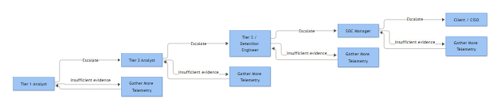
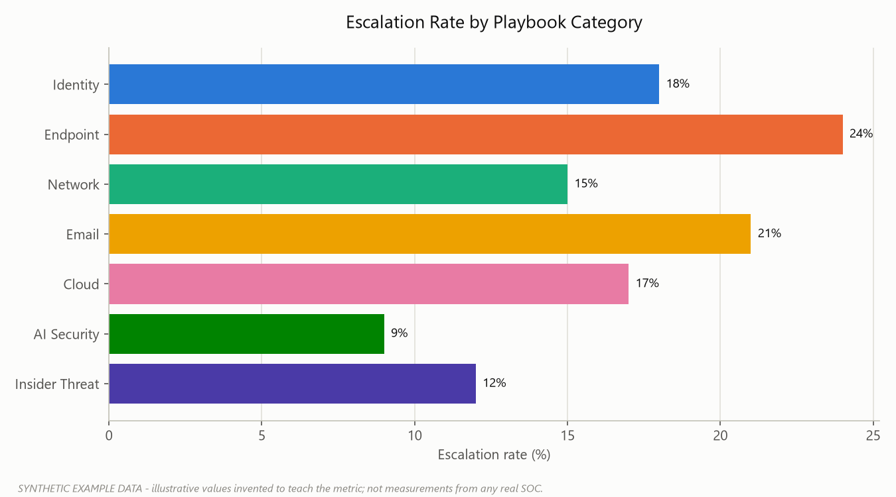

# Part 23 — Escalation Quality: What Tier 2 Actually Needs From You

Every SOC has a version of this ticket: *"Suspicious login alert triggered, please investigate."* No IP, no timeline, no indication of whether the analyst actually looked at the logon type or just clicked through the alert. Tier 2 gets it, has to re-derive everything from scratch, and the fifteen minutes the Tier 1 analyst saved themselves gets tacked onto the response time of whoever picks it up next. Multiply that by forty escalations a day and you have a queue that never gets shorter no matter how many people you hire.

Escalation quality is not a soft skill. It's a control. A well-formed escalation is the difference between an incident that gets contained in twenty minutes and one that gets contained in three hours because someone had to go back and pull the same logs the first analyst already had open. This section defines the fields an escalation must carry, and shows what separates a ticket that gets acted on immediately from one that bounces back with "need more context" — which, in most SOCs, is the single biggest hidden driver of MTTR.



*Figure F004 - the Tier 1 through client/CISO escalation path.*

## The Thirteen Fields

These fields apply regardless of alert source — EDR, SIEM correlation rule, cloud provider alert, threat intel hit. Not every field will have rich content every time (sometimes "historical comparison: no prior baseline exists for this account" is the honest answer), but every field must be *addressed*, not silently skipped.

| Field | What goes in it |
|---|---|
| **Affected identity** | User, service account, or system principal involved — SAM name, UPN, SID if available, and its normal role (helpdesk, service account, domain admin, etc.) |
| **Source** | Originating host, IP, or process — internal hostname/IP, external IP with ASN/geo if relevant, parent process for endpoint alerts |
| **Destination** | Target system, resource, or service — server name, SPN, cloud resource ID, mailbox, share path |
| **Timeline** | First-seen and last-seen timestamps in a fixed timezone (state which one), sequence of events with timestamps, not just "around 3pm" |
| **Observed behaviour** | What actually happened, described factually — not "malicious activity detected," but the specific action: process launched, ticket requested, mailbox rule created |
| **Correlated events** | Other log entries or alerts that fired around the same identity/host/timeframe — the chain, not just the triggering event |
| **Historical comparison** | Is this normal for this identity/host? First time seen, or a known recurring pattern (scheduled job, known admin behavior)? |
| **Threat intelligence context** | Any Indicator of Compromise (IOC) matches — known-bad IP/hash/domain, or explicitly "no TI match found," which is still useful information |
| **Evidence** | Raw log excerpts, exported EVTX/JSON, screenshots, hashes — attached or linked, not paraphrased from memory |
| **Analyst assessment** | The analyst's own reasoned judgment and confidence level — this is the value-add, not a restatement of the alert text |
| **Potential impact** | What happens if this is real and unaddressed — scoped to the actual blast radius, not generic "could lead to compromise" |
| **Recommended action** | A specific next step — isolate, disable, reset, block, monitor, escalate to IR — not "please advise" |
| **Urgency** | Priority tier with justification tied to the SLA framework in use (see Part covering SLA tiers), not a gut-feel label |

**[ANALYST]** - The single most common failure isn't missing data, it's collapsing multiple fields into one sentence. "User logged in weird" tries to cover affected identity, source, observed behaviour, and analyst assessment at once, and does none of them properly. Write each field as its own line even when the answer is short.

**[MANAGEMENT]** - Track escalation rework as a metric: the percentage of Tier 2 tickets sent back to Tier 1 for missing context. It's a better signal of analyst quality and training gaps than raw ticket volume, and it's usually the fastest lever available to cut MTTR without adding headcount.



*Figure F056 - an illustrative escalation rate comparison across categories (synthetic data).*

## Why Escalations Go Bad

Most bad escalations aren't laziness. They come from four repeatable causes: the analyst is under queue pressure and grabs the fastest close path, the SIEM's alert template pre-fills a description that gets copy-pasted verbatim, there's no shared timezone convention so timestamps get mangled across shift handoffs, or the analyst genuinely doesn't have a baseline to compare against and doesn't say so explicitly. That last one matters — "no historical baseline available" is a legitimate, honest field entry. Guessing and presenting it as fact is not.

The three pairs below show the same underlying alert, worked twice: once as a real ticket that would bounce, and once with the fields properly filled.

## Example 1 — Authentication Alert (Password Spraying)

**Bad escalation:**

```
Ticket: Multiple failed logins detected on account jsmith
Priority: Medium
Notes: SIEM fired an alert for brute force. Recommend resetting password.
```

**Good escalation:**

| Field | Content |
|---|---|
| Affected identity | jsmith (Finance dept, standard user, no elevated group membership) |
| Source | 41 distinct source IPs, all resolving to a single /24 (198.51.100.0/24), no prior activity from this range for this tenant |
| Destination | dc01.example.com (domain controller, primary auth path for VPN) |
| Timeline | 2026-09-14 22:03–22:41 UTC, 41 failed attempts across 6 accounts, jsmith among the highest-count targets |
| Observed behaviour | Repeated 4625 failed logons against jsmith and 5 other accounts, Sub Status 0xC000006A (bad password) on all attempts; 4740 lockout fired for jsmith at 22:41 with Caller Computer Name matching the same external range via VPN concentrator |
| Correlated events | 4771 Kerberos pre-auth failures (Failure Code 0x18) for two of the same six accounts in the same window — same source range |
| Historical comparison | jsmith has no failed-logon history in the past 90 days; this pattern (low-and-slow across many accounts, single-digit attempts per account) is consistent with password spraying, not a single mistyped password |
| Threat intelligence context | Source /24 not present in current TI feeds; no known-bad reputation, flagging as unattributed infrastructure rather than confirmed-malicious |
| Evidence | Exported 4625/4740/4771 events attached (spray_evidence.evtx), VPN concentrator connection log excerpt attached |
| Analyst assessment | High confidence this is a password spraying attempt (T1110.003) against multiple accounts, not isolated user error. jsmith's account is currently locked, no successful auth observed for any targeted account in this window |
| Potential impact | If successful, initial access to VPN with a standard user account — no direct admin exposure, but VPN access is a foothold for further internal recon |
| Recommended action | Confirm lockout holds, force password reset for all 6 targeted accounts, block source /24 at VPN edge, check for MFA prompts/denials in the same window |
| Urgency | P2 — active attempt, no confirmed success yet, but multiple accounts targeted from one source justifies same-shift response |

**[ENGINEERING]** - The correlation worth automating here is the 4625 → 4740 → 4771 chain grouped by source IP or /24 over a sliding window, surfaced as one alert instead of six separate ones. Analysts escalating each 4625 individually is how you get alert fatigue and missed patterns.

## Example 2 — Credential Access (Kerberoasting)

**Bad escalation:**

```
Ticket: Kerberoasting alert - svc_sql account
Priority: High
Notes: Ticket encryption looks weak, might be an attack tool.
```

**Good escalation:**

| Field | Content |
|---|---|
| Affected identity | svc_sql (service account, SQL Server service on db02.example.com, member of no privileged groups but holds an SPN registered to a domain admin-adjacent OU) |
| Source | ws-fin-17.example.com (10.20.4.117) — a finance department workstation, not svc_sql's normal host, not a server |
| Destination | dc01.example.com (KDC) |
| Timeline | 2026-09-14 14:12–14:19 UTC, 27 4769 events for 27 distinct SPNs within 7 minutes |
| Observed behaviour | 4769 Kerberos service ticket requests for 27 different SPNs, all with Ticket Encryption Type 0x17 (RC4), requested sequentially from a single client address, Account Name in each event is a domain user (t.reyes) not the service account itself |
| Correlated events | No matching 4688 process creation logged on ws-fin-17 in the same window (process creation auditing not enabled on that host — logging gap, noted) |
| Historical comparison | t.reyes has never requested a service ticket for more than 2 SPNs in a single session in the past 60 days; requesting 27 distinct SPNs in 7 minutes has no precedent for this account |
| Threat intelligence context | Pattern matches known Kerberoasting tooling behavior (bulk RC4 SPN enumeration); no specific hash or IOC match, this is behavioral not signature-based |
| Evidence | 4769 events exported (kerberoast_ws-fin-17.evtx), list of 27 requested SPNs attached for offline-cracking risk assessment |
| Analyst assessment | High confidence this is Kerberoasting (T1558.003) staged from t.reyes's session on ws-fin-17, likely following prior account discovery (T1087) to build the SPN target list. No evidence yet that any ticket has been cracked or reused |
| Potential impact | If svc_sql's service ticket is cracked offline, its password becomes attacker-known; svc_sql's SQL access scope needs to be checked before assuming low impact — service accounts frequently have broader database rights than their AD group membership suggests |
| Recommended action | Rotate svc_sql (and any other targeted service account) password immediately, enable command-line auditing on ws-fin-17, isolate the host pending IR review, interview or suspend t.reyes's session |
| Urgency | P1 — credential exposure risk against a service account with database access, offline cracking window is already open |

## Example 3 — Endpoint Execution (Obfuscated PowerShell, Possible C2)

**Bad escalation:**

```
Ticket: PowerShell alert on host FIN-LT-22
Priority: Medium
Notes: Encoded PowerShell command seen, looks suspicious.
```

**Good escalation:**

| Field | Content |
|---|---|
| Affected identity | m.okafor (marketing, standard user, local admin on own laptop only) |
| Source | fin-lt-22.example.com (10.20.9.44), parent process WINWORD.EXE |
| Destination | Outbound connection to 203.0.113.88:443 (no reverse DNS, ASN not previously seen from this endpoint) |
| Timeline | 2026-09-14 09:47 UTC document opened; 09:47:12 PowerShell spawned; 09:47:40 first outbound connection; recurring every ~60s through 10:15 UTC |
| Observed behaviour | 4688 shows powershell.exe launched with Creator Process WINWORD.EXE; 4104 script block logging captured a base64-encoded command that decodes to a download-and-execute pattern; 4103 module logging shows Invoke-WebRequest and Invoke-Expression in the pipeline |
| Correlated events | Repeated outbound connections at a steady ~60-second interval following execution, consistent with beaconing; no 7045 service install observed yet, no persistence artifact found so far |
| Historical comparison | m.okafor's laptop has no prior PowerShell execution history at all in the last 90 days — this user does not normally run scripts, making this a strong deviation from baseline regardless of content |
| Threat intelligence context | Destination IP has no current reputation hit in available feeds; treating as unknown/unattributed infrastructure rather than confirmed C2, pending sandbox detonation of the original attachment |
| Evidence | 4104 decoded script block attached in full, original email with attachment preserved and quarantined, pcap of the 09:47:40–10:15 connection pattern attached |
| Analyst assessment | High confidence in malicious execution chain: phishing attachment (T1566.001) triggered obfuscated PowerShell (T1059.001, T1027) that established a likely command-and-control channel (T1071) with beaconing behavior. Not yet confirmed whether payload achieved persistence |
| Potential impact | Single endpoint currently, but m.okafor is local admin on the device and has access to shared marketing drives — lateral movement or data staging from this host is plausible if not contained quickly |
| Recommended action | Isolate fin-lt-22 from network immediately, preserve memory/disk image before remediation, block destination IP at perimeter, hunt for the same attachment hash across other mailboxes |
| Urgency | P1 — active outbound beaconing at time of escalation, isolate before triage rather than after |

**[STAKEHOLDER]** - The business question this last field answers isn't "is this bad," it's "who decided to unplug the laptop, and how fast." A ticket that states urgency with justification lets whoever owns the containment call (SOC Manager, IR manager, sometimes the business unit) make that decision in seconds instead of asking the analyst three follow-up questions first.

## Governance Notes

**[MANAGEMENT]** - Escalation quality should be sampled, not just measured by rework rate. A weekly QA pass — Tier 2 lead reviews 5-10 random Tier 1 escalations from the prior week against the thirteen-field checklist — surfaces coaching opportunities before they become a pattern of missed context during a real incident. Score against the checklist as pass/fail per field, not a subjective 1-5 rating; it removes reviewer bias and makes the feedback specific enough for the analyst to act on. Feed the results into onboarding material — the gap between a new analyst's first escalations and a six-month analyst's is almost always in historical comparison and analyst assessment, not in the mechanical fields like source/destination.

Not every escalation needs to end in "confirmed malicious." A ticket built to this standard that concludes with Benign Positive or Insufficient Evidence is still a good escalation — the fields document *why* that conclusion was reached, which is exactly what protects the SOC when the same alert fires again next quarter and someone asks whether it was looked at properly the first time.
