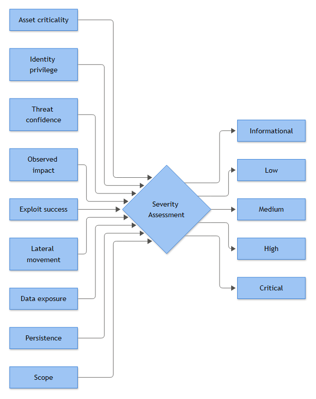
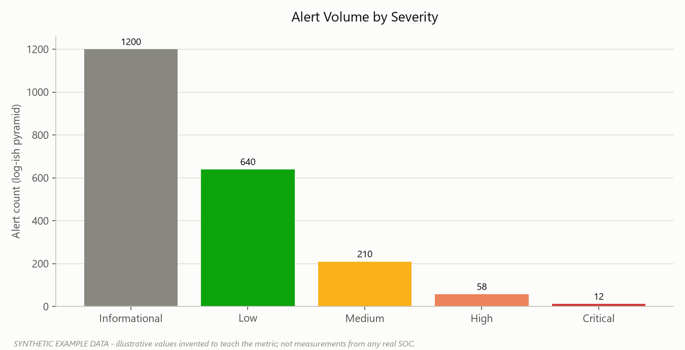

# PART 25 — Playbook Severity Model

Every SOC eventually has the same argument: analyst opens a ticket, calls it Medium, shift lead bumps it to High because "the CISO will ask," and by the time it's in front of the incident commander it's Critical because nobody wants to be the one who under-called it. Six months later someone runs a report and half the "Critical" incidents were a single failed RDP login against a print server. The severity field has become a mood ring, not a control.

A severity model exists to take that argument away from gut feel and put it on a rubric that produces the same answer whether it's a Tuesday morning analyst or a 3 AM on-call engineer scoring it. It doesn't need to be perfect — it needs to be consistent, defensible, and fast enough to apply during triage without turning every ticket into a spreadsheet exercise.

This section builds a severity model around nine scoring dimensions, gives you a weighted rubric, defines the five bands (Informational through Critical), and — because a pure point total will occasionally produce a stupid answer — adds override rules that let specific conditions floor the severity regardless of the math.

## Why a Single Score Field Fails

Most immature severity models are really just "how bad does this feel." Mature ones score the incident across independent axes and let the combination drive the outcome, because a Critical asset with no impact yet is a different animal than a low-value asset that's already been encrypted. Collapsing those into one number too early loses the nuance the on-call analyst actually needs when deciding whether to wake up the IR lead.

**[STAKEHOLDER]** - the business doesn't care about elegant scoring math. It cares that "Critical" reliably means "call me now" and "Low" reliably means "I'll read about it Monday." A rubric that drifts in meaning erodes trust in every escalation that follows it.

## The Nine Scoring Factors

1. **Asset Criticality** — where does the affected system sit in the crown-jewel tiering (domain controllers, PKI, backup infrastructure, IAM, regulated data stores = Tier 0/1; general prod servers = Tier 2; user workstations, non-prod = Tier 3).
2. **Identity Privilege** — what does the compromised or targeted account grant. A standard user token is not the same finding as a token carrying elevated privileges surfaced via Windows Security Event ID 4672 (special privileges assigned to new logon), or an account that shows up in 4728/4732 group-membership changes.
3. **Threat Confidence** — is this a confirmed malicious pattern, a TTP-consistent-but-unconfirmed signal, or a single weak indicator that could just as easily be benign noise or an expected admin action.
4. **Observed Impact** — has anything actually happened (service degraded, data altered, host unavailable) or is this still pre-impact.
5. **Exploit Success** — did the attempt land. A blocked exploit attempt against a public-facing app (T1190 Exploit Public-Facing Application) scores very differently than a confirmed successful one with follow-on process activity.
6. **Lateral Movement** — none, attempted, or confirmed movement between hosts — think T1021 Remote Services (.001 RDP, .002 SMB/Windows Admin Shares, .004 SSH), or credential-material reuse via T1550 Use Alternate Authentication Material (.002 Pass the Hash, .003 Pass the Ticket).
7. **Data Exposure** — none, potentially accessible, or confirmed exfiltration — T1567 Exfiltration Over Web Service, T1048 Exfiltration Over Alternative Protocol, T1530 Data from Cloud Storage.
8. **Persistence** — has the actor tried to survive a reboot or credential rotation — T1053.005 Scheduled Task/Job, T1543.003 Create or Modify System Process (Windows Service, often visible as System log Event ID 7045 or Security log 4697), T1547.001 Registry Run Keys.
9. **Scope** — one host/one user, a handful of related endpoints, or enterprise-wide/multiple business units.



*Figure F009 - the factors that feed into an Informational-to-Critical severity call.*

## Scoring Rubric

Each factor is scored 0–4 by the analyst during triage, then multiplied by a weight that reflects how much that dimension should move the needle. Asset criticality, observed impact, exploit success, and data exposure carry the heaviest weight because they're the factors that most directly correlate with actual business harm.

| Factor | Weight | 0 – None | 1 – Minimal | 2 – Moderate | 3 – Significant | 4 – Severe |
|---|---|---|---|---|---|---|
| Asset Criticality | ×3 | No real asset (test/sandbox) | Tier 3 — user workstation, non-prod | Tier 2 — standard prod server/app | Tier 1 — regulated data, finance, domain-joined infra | Tier 0 — DC, PKI, IAM, backup, crown-jewel data store |
| Identity Privilege | ×2 | No account involved | Standard user, no elevated rights | Local admin on one host | Domain/tenant admin-adjacent (delegated rights, group owner) | Domain Admin, Global Admin, service account with DA-equivalent SPN |
| Threat Confidence | ×2 | Known benign / expected activity | Single weak indicator, ambiguous | Matches a known TTP pattern, unconfirmed | Multiple corroborating indicators | Confirmed via correlated evidence (threat intel hit + behavioral match) |
| Observed Impact | ×3 | None observed | Cosmetic/log noise only | Degraded service or minor config change | Data altered or service disrupted | Data destroyed/encrypted, service down enterprise-wide |
| Exploit Success | ×3 | No exploit attempt | Attempt blocked/failed pre-execution | Attempt executed, no confirmed code execution | Confirmed code execution on target | Confirmed exploitation with attacker-controlled follow-on activity |
| Lateral Movement | ×2 | None | Recon only (T1046, T1595) | Single attempted hop, unsuccessful | One confirmed hop to a second host | Multi-host confirmed movement across segments/tiers |
| Data Exposure | ×3 | None | Data accessible but not confirmed touched | Confirmed access, no confirmed transfer | Confirmed staging/collection (T1119, T1114) | Confirmed exfiltration off-network |
| Persistence | ×2 | None established | Attempted, blocked | Confirmed persistence, low-privilege scope | Confirmed persistence with elevated privilege | Confirmed persistence at Tier 0/1 with validated attacker re-entry capability |
| Scope | ×1 | N/A | Single host, single user | 2–5 related hosts/accounts | One full business unit/segment affected | Multiple business units, enterprise-wide |

Maximum weighted score is 84 (4 × sum of weights: 3+2+2+3+3+2+3+2+1 = 21, ×4 = 84).

**[ENGINEERING]** - this maps cleanly into a SOAR case field structure. A minimal scoring object looks like:

```json
{
  "asset_criticality": {"score": 3, "weight": 3},
  "identity_privilege": {"score": 2, "weight": 2},
  "threat_confidence": {"score": 3, "weight": 2},
  "observed_impact": {"score": 1, "weight": 3},
  "exploit_success": {"score": 2, "weight": 3},
  "lateral_movement": {"score": 0, "weight": 2},
  "data_exposure": {"score": 0, "weight": 3},
  "persistence": {"score": 1, "weight": 2},
  "scope": {"score": 1, "weight": 1}
}
```

Weighted total = Σ(score × weight). Compute it automatically in the case management form the moment an analyst fills in the nine fields — don't make anyone do this arithmetic by hand under pressure at 2 AM.

## From Score to Severity Band

| Band | Weighted Score Range | % of Max | Operational Meaning |
|---|---|---|---|
| **Informational** | 0–8 | 0–9% | No action required beyond logging; often closes as Expected Activity or Benign Positive |
| **Low** | 9–24 | 10–29% | Analyst-handled, single-shift resolution, no stakeholder notification required |
| **Medium** | 25–42 | 30–50% | Team lead visibility, standard IR workflow, notification to asset owner |
| **High** | 43–60 | 51–71% | IR lead engaged, containment actions expected, management notified within SLA window |
| **Critical** | 61–84 | 72–100% | Full incident response activation, executive/legal notification, out-of-hours escalation |

**[MANAGEMENT]** - each band should have a paired SLA for time-to-acknowledge and time-to-contain, owned in the escalation matrix covered elsewhere in this book. The rubric's job is to produce a defensible band; the SLA's job is to say what happens once that band is assigned.



*Figure F055 - an illustrative severity pyramid shape (synthetic data).*

## Override and Floor Rules

A weighted sum is a good default, but a handful of conditions are severe enough on their own that they shouldn't have to wait for the math to catch up. These are hard floors — if the condition is met, the incident cannot be scored below the listed band, regardless of what the rubric total says.

| Trigger Condition | Floor Severity | Rationale |
|---|---|---|
| Security audit log cleared (Event ID 1102) by an account not on the approved maintenance list | **Critical** | Anti-forensic action; presumption of malicious intent until proven otherwise |
| Confirmed DCSync activity (T1003.006 OS Credential Dumping) or Golden Ticket usage (T1558.001) | **Critical** | Domain-wide credential compromise regardless of current observed impact |
| Confirmed T1486 Data Encrypted for Impact or T1490 Inhibit System Recovery | **Critical** | Ransomware behavior — impact will outrun the scoring window if not floored immediately |
| Confirmed exfiltration (T1567/T1048) involving regulated data on a Tier 0/1 asset | **High**, escalates to Critical if volume/scope confirmed enterprise-wide | Regulatory notification clocks may already be running |
| Failed exploit or scan against a Tier 2/3 asset with zero follow-on activity, no matter how many times it recurs | Capped at **Low** | Prevents scanner/noise from inflating severity just because a technique ID matched |

This last row matters as much as the "floor up" rows — without a cap, an aggressive rubric will happily call every blocked Nmap sweep (T1595 Active Scanning) against a dev box a Medium because "threat confidence" ticks up from the signature match, when nothing actually happened. The cap holds regardless of repetition: ten blocked attempts against the same zero-follow-on pattern are still zero follow-on, not a reason to let Scope or Threat Confidence drag the score past Low.

## Worked Examples

**Example A — Kerberoasting attempt, single DC, no lateral movement confirmed.** Analyst sees a spike of 4769 service ticket requests with RC4 encryption (0x17) against a service account tied to a finance application. Asset criticality: Tier 1 (3, ×3=9). Identity privilege: service account with elevated app rights (2, ×2=4). Threat confidence: pattern matches Kerberoasting, unconfirmed cracked ticket (2, ×2=4). Observed impact: none yet (0, ×3=0). Exploit success: ticket obtained, offline cracking unconfirmed (1, ×3=3). Lateral movement: none (0). Data exposure: none (0). Persistence: none (0). Scope: single account (1, ×1=1). Total = 21 → **Low**, pending confirmation the ticket was cracked and reused.

**Example B — Same Kerberoasting lead, 48 hours later.** The service account now shows a 4624 logon from an unfamiliar workstation, followed by 4648 explicit-credential logons to two additional servers (T1550.002/.003 pattern) and a 4697 service install (T1543.003) on a Tier 0 domain controller. Recompute: asset criticality (4, ×3=12), identity privilege (4, ×2=8), threat confidence (4, ×2=8), observed impact (2, ×3=6), exploit success (4, ×3=12), lateral movement (3, ×2=6), data exposure (1, ×3=3), persistence (3, ×2=6), scope (3, ×1=3). Total = 64 → **Critical** on the math alone, and the persistence-on-Tier-0 condition would floor it there even if the arithmetic came in lower.

**Example C — Phishing click, credential entered on a lookalike page, no evidence of reuse.** Tier 3 asset (1), standard user (1), high confidence it's phishing (T1566.002, 3), no impact observed (0), no exploit beyond credential harvest (1), no lateral movement (0), potential-but-unconfirmed exposure of one password (1), no persistence (0), single user (1). Total ≈ 3+2+6+0+3+0+3+0+1 = 18 → **Low**, with a mandatory action item to force a password reset regardless of the score — severity drives escalation urgency, not the remediation checklist itself.

## Rescoring and Governance

**[ANALYST]** - score at triage with what you have, and rescore at every material evidence update. A ticket that opens as Low because lateral movement hasn't been confirmed can jump two bands the moment a second host shows up in the timeline. Don't treat the initial score as sacred — treat it as the first data point in a running assessment.

**[MANAGEMENT]** - the rubric weights and floor conditions should sit under change control, not analyst discretion. Review them quarterly against closed-incident data: if Medium-scored incidents are consistently escalating to High during investigation, the weights are miscalibrated and need adjustment, not the analysts. Assign a single owner (typically detection engineering or the SOC manager) for rubric changes, and log every adjustment with the incident data that justified it — an unversioned severity model is just as unreliable as no model at all.
