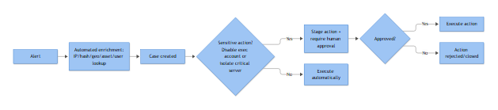
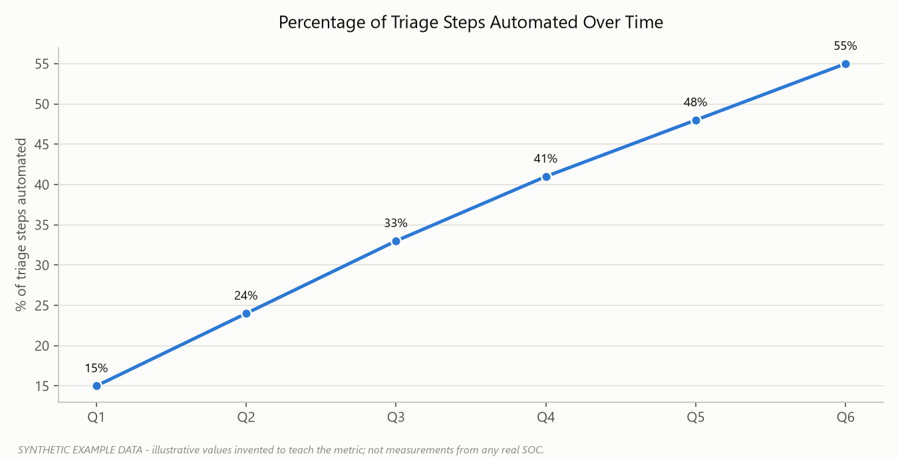

# Part 26 — Automation and SOAR: What to Automate, What to Gate

A SOAR platform will happily automate a bad decision at machine speed. That's the part vendors don't put on the slide. Automation doesn't make judgment calls better, it makes them faster and more consistent — which is exactly why the line between "run this automatically" and "ask a human first" has to be drawn deliberately, not discovered after the automation disables the CFO's account during month-end close.

This part draws that line. It splits SOAR actions into two tiers — enrichment automation that should run without asking anyone, and containment/destructive actions that need an approval gate — and then shows what a real approval gate looks like inside a workflow, not just "someone should approve this" written on a whiteboard.

## Why the Line Exists

Enrichment actions are read-only. They pull data, they don't change anything a user or system depends on. Worst case, a bad enrichment lookup wastes API quota or clutters a case with irrelevant context — annoying, not damaging. Containment and destructive actions change state: they cut access, stop a workload, or destroy something. Worst case, they take down production, lock out an executive mid-board-call, or delete evidence a regulator later asks for. Reversibility and blast radius are the two questions that decide which tier an action belongs in, not how "risky" the alert that triggered it felt at 2 a.m.

**[STAKEHOLDER]** - The business risk isn't automation itself, it's automation with no undo button acting on incomplete evidence. A SOC that automates enrichment aggressively and gates containment properly moves faster on real incidents *and* has fewer self-inflicted outages than one that automates everything, or one that automates nothing and makes analysts do enrichment by hand all night.

## Tier 1 — Automate Without Asking

These actions gather information or organize a case. None of them change production state, none of them affect a user's access, and all of them are things an analyst would otherwise do manually in the first five to ten minutes of triage — the exact minutes that determine whether an incident gets contained in twenty minutes or three hours.

| Automation | What it does | Typical source | Why it's safe to auto-run |
|---|---|---|---|
| **IP enrichment** | Resolves ASN, ownership, geolocation, known infrastructure ties for source/destination IPs | Threat intel feeds, WHOIS, internal CMDB (to flag known-good ranges) | Read-only lookup, no state change |
| **Hash reputation** | Checks file hashes (MD5/SHA1/SHA256) against reputation and sandbox databases | VirusTotal-style aggregators, EDR vendor cloud, internal allowlist | Read-only, informs but doesn't act |
| **Geo lookup** | Maps IP or login location to country/region, flags impossible-travel deltas | GeoIP databases, identity provider risk signals | Context only — the *decision* to act on impossible travel still needs judgment |
| **Asset lookup** | Pulls asset criticality, owner, OS, patch level, business function from CMDB/asset inventory | CMDB, EDR inventory, vulnerability scanner asset data | Tells the analyst how much this matters, doesn't touch the asset |
| **User lookup** | Pulls account role, department, group memberships, manager, privileged status from directory | Active Directory, Azure AD/Entra ID, HR system integration | Read-only directory query |
| **Historical alert lookup** | Searches for prior alerts on the same user/host/IP in a lookback window, flags recurrence | SIEM case history, ticketing system | Pattern context, no action taken |
| **IOC extraction** | Parses raw logs, emails, or files to pull IPs, hashes, domains, URLs into structured indicators | Log parsers, email header/attachment parsers, sandbox reports | Extraction, not action |
| **Case creation** | Opens a ticket/case with pre-populated fields (affected identity, source, timeline) from the alert | SIEM, ticketing/case management platform | Administrative — creates a record, doesn't touch anything live |
| **Evidence collection** | Pulls relevant raw events, exports EVTX/JSON, snapshots the alert payload, attaches to the case | SIEM export API, EDR forensic collection | Preserves evidence, doesn't alter source systems |

**[ENGINEERING]** - Design these as parallel, fire-and-forget playbook branches triggered directly off alert ingestion, not chained sequentially. If IP enrichment takes four seconds and hash reputation takes six, running them in series adds ten seconds to every case for no reason. Fan them out, let each branch write back to the case object independently, and let the analyst see a fully enriched case the moment they open it rather than watching fields populate one at a time.

One caveat worth stating plainly: "safe to auto-run" is not the same as "safe to auto-close." A case where every enrichment field comes back clean — no TI hits, known-good IP range, normal login geography — is a strong candidate for a **Benign Positive** or **Expected Activity** closure, but that disposition still needs an analyst to actually look at the case and apply it. Auto-closing based purely on clean enrichment removes the one check that catches the enrichment source itself being stale, rate-limited, or wrong.

## Tier 2 — Actions That Need a Human in the Loop

These change state. Getting one wrong doesn't cost you an annoyed analyst re-running a lookup, it costs you an outage, a locked-out executive, a deleted resource, or a domain controller that's now unreachable during the exact incident you were trying to contain.

| Action | Why it's dangerous to auto-run | What goes wrong when it's wrong |
|---|---|---|
| **Disabling a CEO's (or any executive's) account** | High-visibility identities are also high-value targets for false positives — travel, new device, VPN change all look like impossible travel | Executive locked out during a board call, deal signing, or public event; reputational and business cost disproportionate to the alert |
| **Blocking a critical server (e.g., a production database or payment gateway)** | The "block" that contains an attacker also contains every legitimate transaction | Revenue-generating system goes dark; the incident that gets escalated is now "why is checkout down," not the original alert |
| **Deleting a cloud workload** | Deletion is rarely instantly reversible even with backups/snapshots, and automated deletion logic run against the wrong resource ID has no built-in sanity check | Wrong VM/container deleted, evidence needed for the actual investigation destroyed, RTO blown while restoring from backup |
| **Quarantining a domain controller** | A DC is core infrastructure — authentication, Group Policy, DNS for the domain often ride on it | Quarantining it can lock out the entire site or domain, including the responders trying to fix the problem |

**[STAKEHOLDER]** - These four aren't arbitrary. They share a pattern: high blast radius, low reversibility, and a real cost to acting on a false positive that's comparable to or worse than the cost of acting slightly late on a true positive. That's the test for whether *any* action belongs in this tier — not whether it "sounds serious."

## Anatomy of a Proper Approval Gate

A gate that just says "requires approval" in a runbook and relies on someone remembering to ping a manager on Slack isn't a gate, it's a hope. A real gate, built into the SOAR workflow itself, has these components:

| Component | Purpose |
|---|---|
| **Trigger condition** | The specific risk score, alert type, or asset-criticality threshold that routes the workflow into the gate instead of straight to execution |
| **Context package** | Everything the approver needs to decide in under a minute — affected identity/asset, evidence summary, recommended action, blast radius, analyst confidence |
| **Approver identity** | A named role (not a person) mapped to on-call rotation — Tier 3/IR lead, asset owner, or SOC Manager, escalating along the same ladder as the Playbook Approval Matrix rather than inventing a parallel title; CISO stays a Notify recipient there, so gates shouldn't route final approval to CISO either |
| **Approval channel** | Where the request lands — Slack/Teams with actionable buttons, ticketing system approval field, or a dedicated approval app; must support delegation if the primary approver is unavailable |
| **Decision capture** | Who approved/denied, when, and any comment — logged immutably against the case |
| **Timeout behavior** | What happens if no one responds within the SLA — escalate to a secondary approver, not silently expire or silently execute |
| **Execution step** | The actual containment action, only triggered by an explicit "approved" state |
| **Audit trail** | Full record: trigger, context sent, approver, decision, timestamp, execution result — retained for post-incident review and compliance |

**[MANAGEMENT]** - The timeout behavior is the component most SOCs get wrong. "No response in 15 minutes" defaulting to auto-execute defeats the purpose of the gate entirely — it's a gate with a trapdoor. Defaulting to auto-deny is also wrong if the underlying incident is a live ransomware event and the delay itself is the damage. The correct default is escalation to a secondary approver with a shorter fuse, not a binary auto-decision either direction.



*Figure F007 - where automation should stop and wait for a human approval.*

## Worked Example: A Gated Containment Workflow

Scenario: EDR flags process injection activity on `DC-EU-01`, a domain controller, consistent with credential dumping behavior (T1003.001, LSASS memory access) followed by replication requests matching DCSync patterns (T1003.006). The recommended containment action is network quarantine of the host — exactly the kind of action that should never fire unattended on a DC.

```yaml
workflow: contain_suspected_credential_theft
trigger:
  alert_type: "EDR - LSASS access + AD replication anomaly"
  asset_tag: "domain-controller"          # pulled from CMDB via Tier 1 asset lookup automation

steps:
  - id: enrich
    type: automatic
    actions:
      - ip_enrichment
      - user_lookup: { account: "svc_replication_backup" }
      - historical_alert_lookup: { host: "DC-EU-01", lookback_days: 30 }
      - evidence_collection: { export: ["4624", "4672", "4104"], host: "DC-EU-01" }

  - id: risk_score
    type: automatic
    logic: "asset_criticality == 'tier0' AND technique in ['T1003.001','T1003.006'] => score = CRITICAL"

  - id: approval_gate
    type: manual_approval
    condition: "risk_score == CRITICAL AND action == 'network_quarantine'"
    approver_role: "IR_LEAD_ONCALL"
    fallback_approver_role: "SOC_MANAGER_ONCALL"
    notify_roles: ["CISO"]                # per the Playbook Approval Matrix, CISO is Notify, not an approver, on every row
    context_package:
      - affected_asset: "DC-EU-01 (Tier 0 - EU primary domain controller)"
      - evidence_summary: "auto-generated from evidence_collection step"
      - recommended_action: "network_quarantine"
      - analyst_confidence: "from triage_score field"
    sla_minutes: 10
    on_timeout: "escalate_to fallback_approver_role, sla_minutes: 5"
    on_deny: "route_to case_note + notify SOC_manager"

  - id: execute_containment
    type: automatic
    condition: "approval_gate.decision == 'approved'"
    action: "network_quarantine"
    target: "DC-EU-01"

  - id: audit_log
    type: automatic
    always_run: true
    log_fields: ["trigger", "context_package", "approver", "decision", "timestamp", "execution_result"]
```

The approval message that actually lands in front of the IR lead should look like this, not a bare "approve/deny":

```
⚠ APPROVAL REQUIRED — CRITICAL
Asset: DC-EU-01 (Tier 0, EU primary domain controller)
Detected: LSASS memory access (T1003.001) + AD replication request
          matching DCSync pattern (T1003.006)
Account involved: svc_replication_backup (service account, no interactive
          logon history in prior 30 days per historical lookup)
Evidence: 4624/4672/4104 export attached, case CASE-2026-04471
Recommended action: Network quarantine of DC-EU-01
Impact if approved: Domain auth/DNS/GPO for EU site degraded until
          secondary DC (DC-EU-02) confirmed handling load
Impact if denied/delayed: Potential continued credential replication access

[ Approve ]   [ Deny ]   [ Request more info ]
SLA: 10 minutes, escalates to SOC Manager on-call if no response (CISO notified in parallel, per the approval matrix)
```

**[ANALYST]** - Notice the context package answers the two questions an approver actually needs — "what breaks if I say yes" and "what happens if I say no" — instead of just restating the alert. If your gate messages don't include the downstream impact of approving, you're asking the approver to make a blind call under time pressure, which is how gates get rubber-stamped without real review.

## Where Gates Break in Practice

Approval fatigue is real: if every medium-severity alert on a "critical" asset routes through the same on-call IR lead, they start approving on reflex instead of reading the context package, and the gate becomes theater. Scope gates tightly — Tier 0 assets and identity-sensitive actions only — not every asset someone tagged "important" in the CMDB.

Out-of-hours coverage is the other recurring failure. A gate with one named approver and no fallback rotation is a gate that silently becomes "auto-deny by inaction" at 3 a.m., which for an active ransomware spread is arguably worse than no gate at all. This is why the fallback approver role in the workflow above isn't optional — it's the difference between a control and a single point of failure.

And under real incident pressure, someone will ask to bypass the gate "just this once." Whether that's allowed, and who's authorized to make that call, has to be decided in the playbook design — not improvised on an incident bridge by whoever's loudest.

## Governance

**[MANAGEMENT]** - Track four things quarterly: the percentage of SOAR actions running fully automated versus gated (a rising gated percentage without a matching rise in true-positive containment usually means over-gating, not caution), median approval response time against the stated SLA, the override/bypass rate, and — critically — a review of the gated-action list itself. Cloud environments and org charts change; the "critical server" list from eighteen months ago is not the same list today, and an action that no longer needs a human might be quietly slowing down every real incident that touches it.



*Figure F058 - an illustrative automation-rate growth trend (synthetic data).*
