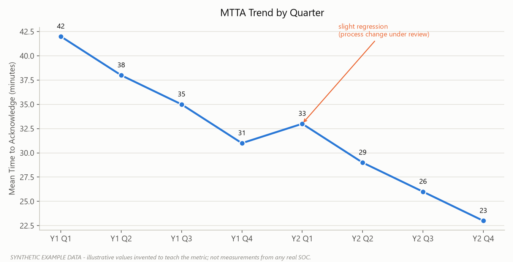
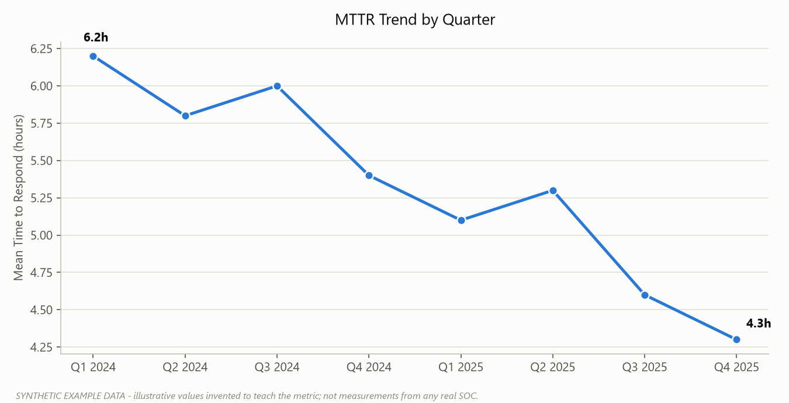
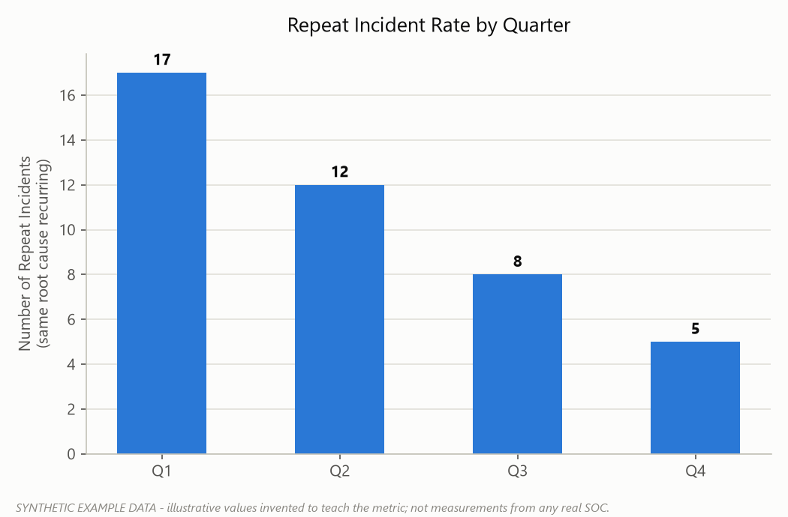
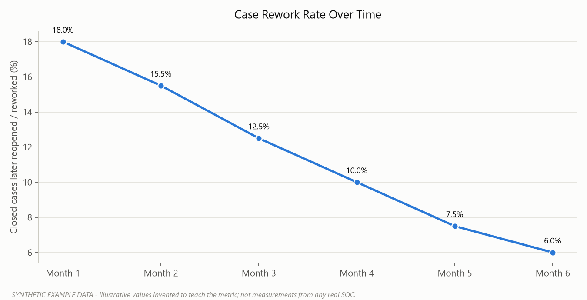
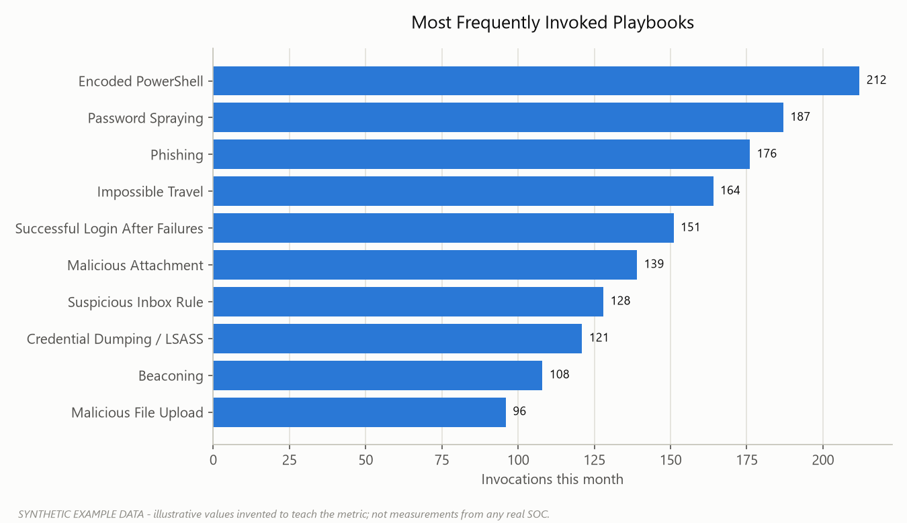
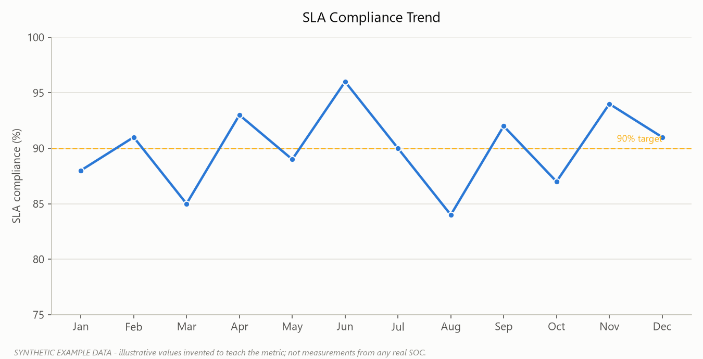

# Part 28 - Metrics: Making the Numbers Tell the Truth

Every SOC eventually gets asked "how do we know this is working?" and the honest answer is usually a mix of good metrics, bad metrics, and metrics that used to mean something before someone started managing to them. This part is a working reference for the numbers that show up in monthly reports, QBRs, and the occasional CISO ambush meeting. For each one: what it actually measures, how it's calculated, who in the org cares and why, and - because this is the part vendors leave out of the slide deck - how it gets gamed or misread.

None of these numbers mean anything in isolation. A SOC with a beautiful MTTA and a rotting False Positive Rate isn't fast, it's just closing things without looking at them. Read metrics in pairs, not one at a time.

## Speed Metrics: MTTA, MTTR, Containment Time

These three get quoted the most and misunderstood the most, mostly because "response" means three different things depending on who's asking.

| Metric | What It Measures | How It's Calculated | Who Cares |
|---|---|---|---|
| **MTTA** (Mean Time to Acknowledge) | How long an alert sits before a human (or automation) picks it up | Sum(Acknowledgment Timestamp - Alert Creation Timestamp) / Number of Alerts | Shift leads, staffing planners |
| **MTTR** (Mean Time to Respond/Resolve) | How long from acknowledgment (or detection, depending on the org's definition) to case closure | Sum(Resolution Timestamp - Start Timestamp) / Number of Cases | CISO, board reporting, MSSP contracts |
| **Containment Time** | How long from confirmed malicious verdict to the threat being actively stopped (host isolated, account disabled, access revoked) | Sum(Containment Action Timestamp - Confirmed Timestamp) / Number of Confirmed Incidents | IR lead, risk owner |

**[ANALYST]** - MTTA is a queue-health number, not a skill number. If MTTA balloons at 3am, that's a staffing gap, not an analyst problem. Don't let a bad MTTA month turn into a performance conversation with the overnight tier-1 who was the only person covering four queues.

**[MANAGEMENT]** - The most common misuse is comparing MTTR across teams or vendors without agreeing on the clock's start and stop points first. One SOC starts the MTTR clock at alert creation, another starts it at analyst acknowledgment - the second number will always look better and means nothing when placed next to the first. Nail down the definition in the SOW or internal SLA doc before anyone puts these numbers in a slide.

Gaming is easy and common: close cases fast with a thin one-line disposition to protect MTTR, split one real incident into five tickets so each "resolves" quickly, or quietly redefine "resolved" to mean "ticket status changed" rather than "threat handled." Containment Time gets gamed by declaring containment the moment an isolation *ticket* is filed rather than when the host actually drops off the network - check the EDR isolation confirmation timestamp, not the change-request timestamp, if you want the real number.

*Figure F052 - an illustrative MTTA improvement trend (synthetic data).*

*Figure F053 - an illustrative MTTR improvement trend (synthetic data).*

## Quality Metrics: FPR, TPR, Escalation Rate, Repeat Incidents, Rework

Speed without quality just means the SOC is fast at being wrong. This cluster is where you find out if that's happening.

| Metric | What It Measures | How It's Calculated | Who Cares |
|---|---|---|---|
| **False Positive Rate (FPR)** | Share of alerts/cases that turned out to be benign, expected activity, or non-issues | False Positives / Total Alerts Triaged | Detection engineers, analyst morale (seriously) |
| **True Positive Rate (TPR)** | Share of alerts that correctly represented real malicious or policy-violating activity | True Positives / Total Alerts Triaged | Detection engineers, SOC manager |
| **Escalation Rate** | How often tier-1 hands a case up to tier-2/3 or IR rather than closing it themselves | Escalated Cases / Total Cases Handled by Tier | SOC manager, training lead |
| **Repeat Incident Rate** | How often the *same* root cause fires again after being "resolved" | Incidents Matching a Prior Root Cause (within a defined window, e.g. 90 days) / Total Incidents | CISO, remediation owners |
| **Analyst Rework** | How often a closed case gets reopened because the first disposition was wrong or incomplete | Reopened Cases / Total Closed Cases | QA lead, shift lead |

**[ENGINEERING]** - FPR and TPR are only trustworthy if disposition tagging is disciplined. If analysts are dumping everything into "False Positive - Other" because the picklist doesn't have a category for "expected activity, no ticket needed," your FPR is inflated and your detection engineering backlog is aimed at the wrong rules. Build the disposition taxonomy to distinguish **Benign Positive** (alert fired correctly, activity was legitimate), **Insufficient Evidence** (couldn't confirm either way - don't force this into FP or TP), and **True Positive**, not just a binary FP/TP.

Escalation Rate is the one everyone loves to misuse in both directions. A SOC manager under pressure to show tier-1 competence can quietly discourage escalations - which looks great on the metric and terrible the first time a tier-1 analyst closes a real intrusion as "user error" to avoid the escalation conversation. Conversely, a tier-1 team that's under-trained or scared of ownership escalates everything, which torches tier-2's queue and MTTR simultaneously. Neither extreme is healthy; the number needs to move with training investment, not with a target painted on it.

Repeat Incident Rate is arguably the most honest metric on this list because it's hard to fake - either the same phishing kit keeps landing on the same three users or it doesn't. Analyst Rework is the one that gets buried: teams under deadline pressure to hit closure targets will close first and get it wrong, and if nobody tracks reopens, that pressure never surfaces as a problem.

*Figure F060 - an illustrative decline in same-root-cause repeat incidents (synthetic data).*

*Figure F061 - an illustrative decline in reopened/reworked cases (synthetic data).*

## Process and Automation Metrics: Playbook Usage, Automation Rate, Noise Reduction, Detection Improvement Rate

This group measures whether the tooling and the documentation are actually doing anything, versus existing as artifacts that satisfy an audit.

| Metric | What It Measures | How It's Calculated | Who Cares |
|---|---|---|---|
| **Playbook Usage** | How often an available playbook is actually invoked for a matching alert type | Cases Where Applicable Playbook Was Followed / Total Cases of That Alert Type | Playbook owners, SOC manager |
| **Automation Rate** | Share of case steps (or whole cases) closed with no human action | Auto-Closed or Auto-Remediated Cases / Total Cases | SOAR/engineering lead, budget owner |
| **Noise Reduction** | How much low-value alert volume has been suppressed, tuned, or auto-triaged over time | (Baseline Alert Volume - Current Alert Volume) / Baseline Alert Volume, for a fixed detection set | SOC manager, analyst retention |
| **Detection Improvement Rate** | How many detections were tuned, retired, or newly deployed as a result of incident findings, in a given period | Detections Modified/Created from Lessons Learned / Total Detections in Scope | Detection engineering lead |

**[MANAGEMENT]** - Automation Rate is the metric most likely to be presented to leadership without context, because "70% automated" sounds like progress regardless of what got automated. If the automated 70% is all password-reset-request tickets and the 30% still done by hand is every credential-theft and lateral-movement case, the number is decorative. Ask what's in the automated bucket before approving budget based on the percentage.

Playbook Usage below expectations doesn't automaticaly mean analysts are ignoring process - check whether the playbook is out of date, too slow relative to a real incident's pace, or written for a tool version that got upgraded eight months ago. A playbook nobody follows is a data point about the playbook, not just the analyst.

Noise Reduction gets gamed by suppressing alerts rather than fixing the underlying detection logic - turning off a noisy rule entirely "reduces noise" and also reduces coverage, and those two effects look identical on this metric unless someone is also tracking Playbook Coverage and TPR alongside it. Detection Improvement Rate is easy to pad by counting trivial threshold tweaks as "improvements" - track how many of those changes came from an actual incident retro versus a Tuesday-afternoon tuning pass, because leadership will ask.

*Figure F057 - an illustrative top-10 playbook usage ranking (synthetic data).*

## Governance Metrics: SLA Compliance, % Playbooks Reviewed on Schedule, Expired Exceptions, Playbook Coverage

This is the cluster auditors and risk committees actually read line by line, because it's the evidence that the program is being *run*, not just operated.

| Metric | What It Measures | How It's Calculated | Who Cares |
|---|---|---|---|
| **SLA Compliance** | Percentage of cases meeting their contracted or internal response/resolution targets by severity | Cases Meeting SLA / Total Applicable Cases | Contract owners, MSSP clients, CISO |
| **% Playbooks Reviewed on Schedule** | How much of the playbook library got its required periodic review (e.g. annual, or after every major incident) | Playbooks Reviewed by Due Date / Total Playbooks Due for Review | Governance/compliance lead |
| **Expired Exceptions Count** | Number of approved exceptions (to a control, detection suppression, or policy) that are past their review/expiry date and still active | Count of exceptions with Expiry Date < Today and Status = Active | Risk committee, internal audit |
| **Playbook Coverage** | How much of the current detection/alert catalog has a corresponding playbook | Alert Types with a Mapped Playbook / Total Active Alert Types | SOC manager, detection engineering |

**[STAKEHOLDER]** - SLA Compliance is the number that shows up in the contract renewal conversation, and it's worth knowing that a single P1 incident that blows past its target during a bad week can single-handedly drop a quarter's compliance percentage even if every other case landed on time. Ask for the underlying case count and severity mix before reacting to a dip - one missed critical isn't the same story as a systemic tier-1 staffing gap.

**[ANALYST]** - SLA Compliance gets gamed at the ground level by reclassifying severity downward after the fact - a case that should have been a P1 with a 15-minute target quietly becomes a P2 with a 4-hour target once it's clear the team is going to miss the tighter clock. If severity reclassifications spike right around SLA reporting windows, that's worth an audit on its own.

*Figure F059 - an illustrative SLA compliance trend with realistic noise (synthetic data).*

Expired Exceptions Count is the one that quietly accumulates risk nobody's looking at: a firewall rule exception granted for a two-week migration eighteen months ago, a detection suppression put in during an incident that never got reverted, an access exception for a vendor contract that ended. **[MANAGEMENT]** - This number should be reviewed on a fixed cadence (monthly is typical) with an owner assigned to each expired item, not just reported as a count. A rising trend line here with no remediation plan attached is one of the cleaner audit findings a risk committee will land on, because it's provable and it's usually been sitting there for a while.

Playbook Coverage and % Playbooks Reviewed on Schedule are frequently confused with each other and both get gamed the same way: counting a playbook as "covered" or "reviewed" when someone opened the document and closed it again without changing anything or checking it against the current environment. A real review means confirming the tool references, escalation paths, and containment steps still match production - not confirming a checkbox in the GRC tool got ticked. Coverage inflates similarly when old, duplicate, or dead alert types (rules that were retired but never removed from the catalog) are still counted in the denominator; clean up the catalog before trusting the percentage.

## Reading the Set, Not the Single Number

The reason to define these sixteen metrics side by side rather than one at a time is that almost every gaming pattern above only shows up in a *pair*. Fast MTTA plus rising Analyst Rework means analysts are rushing dispositions. High Automation Rate plus falling Playbook Coverage means the easy stuff is automated and the hard stuff still has no documented path. Clean SLA Compliance plus a spike in downward severity reclassifications means the SLA number is being managed, not earned. Build the monthly or quarterly review around at least one speed metric, one quality metric, and one governance metric together, and ask the same question every time: did this number move because the SOC got better, or because someone found a way to make it move.
