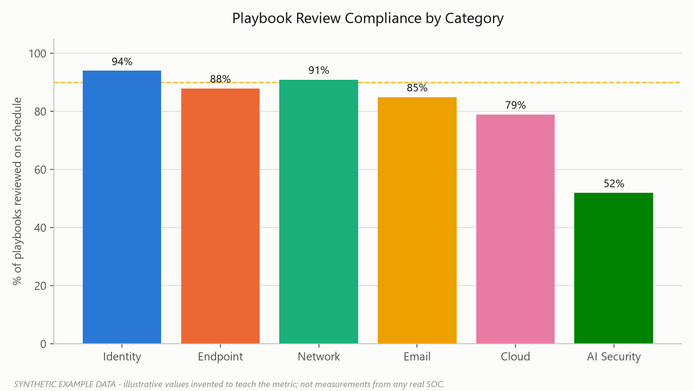
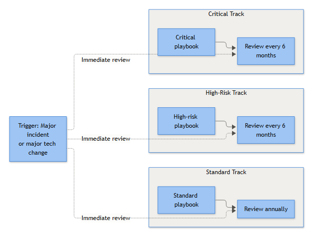

# Part 29 — Governance: The Header Nobody Reads Until an Auditor Does

Every playbook covered so far has been about working content — decision trees, queries, escalation logic, severity, automation. None of that survives contact with reality unless someone owns it, someone signed off on it, and someone can prove when it was last checked. This part covers the ten fields that turn a playbook from "a document someone wrote once" into a governed artifact you can defend in an audit, a post-incident review, or a regulator's chair.

Analysts skip straight past the header block to get to the detection logic. That's fine day-to-day. It stops being fine the day a playbook fires on a real Kerberoasting attempt, the response is wrong, and the incident review asks who approved this, when it was last tested, and why nobody caught that the evidence source had changed three months earlier when the SIEM migrated. If the header is empty, there's no good answer.

**[STAKEHOLDER]** - governance fields aren't paperwork for its own sake. They let the business answer "can we trust this control" without re-reading every query. An auditor, a cyber-insurance underwriter, or a risk committee doesn't want the detection logic — they want proof of ownership, review, and testing.

## The Ten Fields

Every playbook — wiki page, SOAR case template, or a markdown file in a repo — needs the same header block. Missing any one of these is a finding waiting to happen.

| Field | Purpose | Typically owned by |
|---|---|---|
| Owner | Named individual (not a team alias) accountable for accuracy | Detection engineering lead or senior analyst |
| Approver | Authority to sign off changes before they go live | SOC manager or security lead, by severity tier |
| Version | Semantic or date-based number, incremented on every substantive change | Owner, enforced by change control |
| Review Date | Next scheduled review, driven by the cadence table below | GRC function, tracked centrally |
| Change History | Log of what changed, when, why, and who approved it | Owner, reviewed by Approver |
| Evidence Source | Exact log sources, tables, and field names the playbook depends on | Detection engineer, validated by the analyst running it |
| Testing Status | Whether the playbook was validated against real/simulated data, and the result | QA/detection engineering |
| Last Validation | Date and method of the most recent test (tabletop, red team, live incident) | Owner |
| Exceptions | Documented, time-bound deviations and who approved them | Approver, with expiry date |
| Related Controls | Cross-references to MITRE ATT&CK techniques, SOAR automations, and compliance controls | Detection engineer |

A few of these deserve more than one line.

**Owner vs. Approver.** These must be different people, or the control is worthless — if the analyst who wrote the playbook also approves its own changes, there's no independent check, and that's exactly the single-point-of-failure a maturity assessment or SOC 2 audit will flag. Owner maintains; Approver signs off. On a two-person SOC this is uncomfortable but non-negotiable — the manager ends up as de facto approver for everything, which is a staffing problem worth raising rather than a rule worth skipping.

**Evidence Source is not "the SIEM."** It needs to be specific enough that someone six months from now, after the SIEM migrates or the log source gets re-parsed, can tell whether the playbook still holds up. "Windows Security Event 4769 via the Domain Controller's forwarded Security log, Ticket Encryption Type field" is an evidence source. "AD logs" is not.

**[ENGINEERING]** - treat Evidence Source as a dependency declaration, the same way you'd pin a library version in a build file. When a field gets renamed during a SIEM upgrade, you need a fast way to find every playbook that breaks. Searching headers for the old field name is a lot cheaper than discovering the query returns zero rows during a live incident.

**Testing Status vs. Last Validation.** Testing Status is a state — Validated, Needs Retest, Failed, Not Yet Tested. Last Validation is a timestamped event with a method attached. A playbook can show "Validated" while its Last Validation date is fourteen months old, which should itself trip a review — most environments drift enough in a year that a stale validation is barely better than none.

## Worked Example

```yaml
playbook: Kerberoasting Detection and Response
playbook_id: PB-CRED-014
owner: A. Novak (Detection Engineering)
approver: R. Falkner (SOC Manager)
version: 3.2
severity_tier: High
review_date: 2027-03-01
last_validation: 2026-08-14 — red team exercise RT-2026-07, alert fired on
  simulated T1558.003 request against svc_reporting@example.com
testing_status: Validated
evidence_source: Windows Security Event 4769 (Kerberos service ticket
  requested), forwarded from dc01.example.com / dc02.example.com to Sentinel.
  Fields used: Account Name, Service Name, Ticket Encryption Type,
  Client Address, Failure Code.
exceptions:
  - id: EXC-2026-041
    description: Legacy print server prt-svc-01 (192.168.4.22) excluded
      from alert scope pending RC4 remediation
    approved_by: R. Falkner
    expiry: 2026-12-31
related_controls: ATT&CK T1558.003; detection rule SN-KRB-009; SOAR playbook
  SOAR-CRED-014-auto-contain; internal control CTL-IAM-07 (privileged
  service account hygiene)
```

**[ANALYST]** - when you inherit a playbook, read Evidence Source and Last Validation before the detection logic. If the evidence source references a field that no longer exists in your SIEM, don't assume it still works just because an alert fired — check the fields populated as expected. More than one "confirmed malicious" verdict has been walked back after someone noticed the query was matching a renamed field.

## Change History: A Log, Not a Diary

Change History should read like a commit log, not a narrative: version, date, what changed, why, who approved it.

| Version | Date | Change | Reason | Approved by |
|---|---|---|---|---|
| 1.0 | 2025-02-11 | Initial publication | New detection deployed for T1558.003 | R. Falkner |
| 2.0 | 2025-09-03 | Added Client Address pivot; removed manual DC log pull | SIEM now covers all DCs, manual step obsolete | R. Falkner |
| 3.0 | 2026-01-20 | Escalation changed to page IAM team directly | Post-incident review found 40-min delay via Tier 2 | S. Whitcombe |
| 3.1 | 2026-06-02 | Exception added for prt-svc-01 | Legacy service account can't be remediated before Q4 | R. Falkner |
| 3.2 | 2026-08-14 | Evidence source updated: field renamed | Sentinel connector change broke parsing | A. Novak |

Version 3.0 exists because of a documented failure, not a cosmetic edit. **[MANAGEMENT]** - Change History is your evidence trail for "did we learn from that incident." If a post-incident review recommends a change and the playbook's history never reflects it, that recommendation died quietly and resurfaces as the same finding in next year's audit.

## Review Cadence

Review frequency should be driven by severity tier, not by whatever the team happens to get around to. The table below is the baseline — adjust tiers to your own severity model, but keep the trigger logic.

| Tier / Trigger | Frequency | Who triggers it | What the review actually covers |
|---|---|---|---|
| Critical severity | Every 6 months | GRC function, tracked against Review Date | Full re-validation: evidence source accurate, query returns expected fields, escalation contacts current, exceptions justified, ownership current |
| High severity | Every 6 months | GRC function, same mechanism as Critical | Same scope as Critical; can be batched with other playbooks in the same detection domain |
| Standard severity | Annually | GRC function, batch-scheduled | Lighter touch: confirm owner/approver still in role, evidence source hasn't silently broken, spot-check one recent alert |
| Immediate, post-incident | Incident commander at incident closure | Flags any playbook used (or that should have been used) in the after-action review | Review just the steps relevant to what went wrong — did escalation work, was evidence complete, did a step blow the SLA |
| Post major technology change | Owner of the change (SIEM admin, IAM team, cloud platform) as part of change sign-off — not the SOC discovering it later | Detection engineering re-validates every playbook whose Evidence Source touches the changed system | Field-by-field check that queries still parse against the new log format, connector, or schema — the review most often skipped because it isn't calendar-driven |

The last row causes the most quiet failures. A SIEM migration or a switch to a hybrid identity model doesn't show up on a calendar reminder. It shows up as a playbook with a valid-looking Review Date months away that simply stops working the day someone needs it. Build the trigger into change management itself: no infrastructure change ships without detection engineering confirming which playbooks reference the affected evidence source.

**[MANAGEMENT]** - track review completion like patch compliance: a dashboard of overdue reviews by tier, with Critical and High items escalated automatically. A playbook past its Review Date with no completed review is a control gap and should be reported as one.



*Figure F062 - an illustrative review-compliance comparison across categories (synthetic data).*

A review isn't a rubber stamp. At minimum: someone ran the query against current data, someone confirmed the owner and approver are still the right people, and someone checked whether any exception should have expired. A review that's just the owner clicking "approved" won't hold up when someone asks for proof.



*Figure F048 - critical/high/standard review tracks plus trigger-based reviews.*

## Exceptions: The Field Everyone Forgets to Close Out

Exceptions are where governance quietly rots. A legitimate reason gets an exception approved — a legacy service account that can't support modern authentication, a vendor system not yet onboarded to EDR — then nobody revisits it because there's no expiry forcing the conversation.

Every exception needs an expiry date and an owner accountable for either remediating the underlying issue or renewing the exception with fresh justification. An exception with no expiry isn't an exception — it's a permanent hole in the control, dressed up to look temporary.

## Related Controls: Closing the Loop

Related Controls ties the playbook outward — to the ATT&CK techniques it detects, the SOAR automations that act on it, and whatever compliance framework applies (ISO 27001 Annex A, NIST 800-53 families, internal control IDs). It lets a compliance team answer "show me every playbook that supports control CTL-IAM-07" without asking the SOC to search manually, and it answers the reverse question during ATT&CK coverage planning: which techniques have a governed, owned playbook behind them, and which only have a detection rule with nobody watching it.

Governance fields feel like overhead until they're the only thing standing between "a documented, tested, owned control" and "a document someone wrote in 2025 and never looked at again." Fill them in properly once, and the review cadence above turns from an audit ask into a five-minute check.
