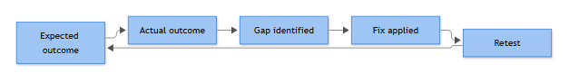

# Part 30 — Playbook Testing

A playbook that has never been run against real telemetry is a hypothesis, not a procedure. I've seen detection logic that looked airtight in a tabletop discussion fall apart the first time someone actually kerberoasted a lab domain controller — wrong field name, wrong encryption type filter, alert never fired. Testing is where you find that out before an attacker does it for you.

There isn't one right way to test a playbook. Different methods catch different classes of failure — some catch bad assumptions about attacker behavior, some catch broken query syntax, some catch the fact that your analyst has no idea what to do when the alert actually lands in the queue. Most mature SOCs run a mix, at different cadences, against different tiers of playbook criticality.

## The Testing Methods

### Tabletop Exercises
A facilitated, no-keyboard walkthrough. Someone reads out a scenario ("attacker has a phished credential and is now requesting Kerberos service tickets for several SPNs") and the team talks through what the playbook says to do, step by step, out loud.

**Use it when:** you've just written or heavily revised a playbook and want to sanity-check the decision tree, escalation paths, and communication flow before anyone touches a keyboard. Also the right tool for testing incident *response* playbooks that involve legal, PR, or executive notification — you don't want to simulate ransomware against production to find out your comms plan has a broken phone tree.

**[MANAGEMENT]** - Tabletops are cheap, low-risk, and good evidence for audit ("we tested this playbook against a ransomware scenario on this date, attendees X/Y/Z"). Track them as a recurring line item, quarterly minimum for Tier-1 playbooks (ransomware, data exfil, BEC).

### Log Replay
Take a known-good or known-bad log sample — either from a prior real incident, a vendor sample set, or a lab capture — and run it through the actual detection pipeline as if it were live, then check whether the playbook's detection logic fires and the response steps make sense against what's in the sample.

**Use it when:** you've written a new correlation rule and want to prove it against real event shapes before it goes to production, without waiting for the behavior to happen organically. Good for validating a 4768/4769 Kerberos pipeline against a captured ticket-request burst.

### Simulation
Broader than log replay — you generate the *behavior*, not just the log record, usually with a scripted tool that performs the actual technique (spinning up a scheduled task, dumping LSASS, requesting a service ticket) so the full telemetry chain gets produced naturally by the OS and your agents, rather than hand-crafted.

**Use it when:** you want confidence that your entire collection pipeline — endpoint agent, forwarder, SIEM parser, correlation rule — behaves correctly end to end, not just that a rule matches a JSON blob you constructed by hand.

### Purple Team Exercises
A collaborative exercise where a red operator actively attempts a defined attack chain while the blue team (SOC) tries to detect and respond in real time, with both sides comparing notes as it happens rather than after a two-week report.

**Use it when:** you have a multi-stage playbook (initial access → credential theft → lateral movement → domain admin) and want to know where in the chain detection actually breaks — tabletop and log replay test one rule at a time, purple team tests whether your playbooks compose into a working detection *chain*.

### Lab-Based Testing
Running the technique against an isolated, disposable environment — a lab domain, throwaway VMs — that mirrors production closely enough (same OS build, same logging config, same GPO baseline) that the results are trustworthy, without any risk to production systems.

**Use it when:** the technique itself is destructive or high-risk to simulate live — testing an Inhibit System Recovery (T1490) playbook, for instance, where you genuinely want shadow copies deleted and backup jobs interfered with to validate the alerting, and you are never doing that in production.

### Atomic Tests
Small, single-technique, scripted tests (Atomic Red Team is the common open-source library) that execute one specific behavior — one registry run key write, one Kerberoasting-style ticket request, one LSASS memory access — in isolation, quickly, and repeatably.

**Use it when:** you need fast, narrow, repeatable validation of a single detection rule after a tuning change, and you don't need the overhead of a full simulation or lab build. This is the method you run in CI whenever a detection rule is edited.

### Testing Against Historical Logs
Re-running a new or modified detection rule against your own SIEM's retained historical data to see what it would have caught (or missed) in the past, and — just as important — how much noise it would have generated.

**Use it when:** you want to measure false-positive rate before turning a new rule on live. Nothing kills analyst trust in a playbook faster than a rule that would have fired 4,000 times last month on legitimate service account activity.

### Synthetic Event Injection
Manually crafting and injecting a log event (or small batch of events) directly into the pipeline — not by performing the behavior, just placing the record where the SIEM will ingest it — to test parsing, field extraction, and rule logic in isolation from the OS/agent layer.

**Use it when:** you're debugging why a rule *should* match a given event structure but doesn't — isolates whether the fault is the rule logic or the data collection layer. Fastest possible iteration loop, but it proves nothing about whether your agents actually produce that event shape in the wild.

### Controlled Attack Simulation
A scoped, authorized, often third-party-run adversary emulation exercise (frequently mapped to a specific MITRE ATT&CK actor profile) executed against production or a production-equivalent environment under strict rules of engagement, with the SOC not told in advance.

**Use it when:** you want to validate the whole program — detection, playbook execution, escalation, containment decision-making — under conditions that most closely resemble a real incident, including the ambiguity and imperfect information. This is your annual or semi-annual "prove it" exercise, usually the one that goes in front of the board.

## Worked Example: Kerberoasting Detection Playbook

**Scenario:** the team has a playbook for detecting Kerberoasting (T1558.003) — mass Kerberos service ticket requests using weak RC4 encryption, typically followed by offline cracking of service account passwords.

**Expected outcome:** the correlation rule watches 4769 events, filters for Ticket Encryption Type 0x17 (RC4), and alerts when a single Account Name requests service tickets for more than 15 distinct Service Names within a 10-minute window. Playbook says the analyst should identify the requesting account, check whether it's a legitimate admin doing SPN inventory, and if not, treat it as credential-theft prep and check for downstream authentication using the targeted service accounts.

**Test method used:** atomic test first (single scripted ticket request against a lab SPN), then a lab-based simulation running a realistic Kerberoasting tool against a small lab domain with 20 service accounts, to get natural volume and timing.

**Actual outcome:** the atomic test fired cleanly — one RC4-flagged 4769, rule logic correctly excluded it below the 15-ticket threshold, as designed. The lab simulation, however, produced *zero* alerts even though the tool successfully requested tickets for all 20 SPNs in under three minutes.

**Gap:** on investigation, the domain controllers in the lab (matching production GPO) were configured with 4769 auditing enabled but success-only, and — separately — the SIEM parser was silently dropping the Ticket Encryption Type field because it was being extracted from the wrong offset in a slightly different log format version than the one the rule was originally built against. The rule had been validated against a hand-crafted synthetic event, not a live-collected one — a classic synthetic-injection blind spot: the rule logic was fine, the field extraction underneath it was broken.

**[ENGINEERING]** - The fix had two parts: correct the field mapping in the parser so Ticket Encryption Type populates reliably from live 4769 events, and lower the alert threshold from 15 distinct services to 8 within 10 minutes, since the simulation showed a realistic attack tool comfortably clears 15 in under three minutes — 15 was tuned against guesswork, not against an actual attack run.

```
index=security_logs EventID=4769
| where Ticket_Encryption_Type="0x17"
| stats dc(Service_Name) as distinct_services, values(Service_Name) as targeted_services by Account_Name, _time span=10m
| where distinct_services > 8
```

**Retest:** re-ran the same lab simulation. This time the corrected parser extracted the encryption type correctly, and the rule fired at the 8th distinct service ticket request — inside the attack window instead of after it. Alert routed to the analyst queue with the account name and full list of targeted SPNs, matching the playbook's expected evidence set.



*Figure F011 - the expected/actual/gap/fix/retest loop.*

**Follow-up:** the team then ran the same rule against 90 days of historical 4769 logs before enabling it live, confirming it would have generated only three matches in that window — all three were a legitimate vulnerability-scanning service account doing SPN enumeration, which got added to an allowlist rather than triggering a threshold change. That step alone avoided an analyst-fatigue problem the lab test wouldn't have surfaced, because the lab domain simply doesn't have three months of real service-account noise sitting in it.

**[MANAGEMENT]** - Log the test date, method, gap found, and fix applied against the playbook's revision history. A rule that has been through atomic test, lab simulation, and historical replay — and has documented false-positive numbers — is a materially different risk posture than one that "looks right" and has never been run.
