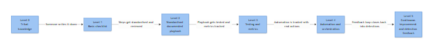

# Playbook Maturity Model

Every SOC I've worked in has told me, at some point, that their playbooks are "pretty mature." Almost none of them could tell me what that meant in measurable terms. This appendix gives you a five-level scale (0 through 5) you can actually use in a maturity assessment, a QBR slide, or an argument with a CISO about why the automation budget request is not premature.

The model below is deliberately blunt about what each level looks like in practice, including the ugly parts, and what usually stalls the climb. If you recognize your SOC in Level 1 or 2, that's normal — most are. The point of the model isn't to make you feel behind, it's to give you language for the next conversation with leadership about what's actually needed to move up.

## How to Use This Model

Score each playbook individually, not the SOC as a whole. It's completely normal to have a Level 4 phishing playbook sitting next to a Level 1 insider-threat playbook — different threat categories mature at different speeds depending on volume, tooling fit, and how much the business cares. A single organization-wide maturity number is almost always a fiction that hides the playbooks nobody has touched since they were written.

**[MANAGEMENT]** - Run this scoring exercise annually at minimum, and after any major SIEM/SOAR migration. Track level per playbook in your playbook inventory (see the governance appendix on ownership and review cadence) rather than trying to force a single organizational score. Boards and auditors like a single number; resist giving them one that isn't true.

*Figure F008 - how a SOC progresses from tribal knowledge to continuous feedback.*

## Level 0 — No Documentation

**What it looks like:** Response exists entirely in analysts' heads. When someone asks "what do we do for a suspected ransomware alert," the answer is "ask Dave, he handled the last one." There is no written escalation path, no defined containment step, no agreed severity taxonomy.

**Realistic signs:**
- Onboarding a new analyst takes weeks because knowledge transfer is verbal and inconsistent
- Two analysts handling the same alert type produce different containment actions
- Post-incident reviews reveal the response deviated from "what we always do" because nobody agreed what that was
- Audit findings cite "no documented incident response procedures" year after year

**What blocks the jump to Level 1:** Almost never lack of ability — it's lack of time allocation and ownership. Analysts are firefighting, and writing things down feels like a luxury when the queue has 40 open alerts. The unblock is usually a manager carving out non-negotiable hours (even 2 hours/week per analyst) and picking one starter template. Waiting for "a quiet week" to start documenting never works; there is no quiet week.

## Level 1 — Basic Checklist

**What it looks like:** Someone has written down the steps for the most common alert types — usually phishing, malware detection, and maybe brute-force lockouts. These are checklists, not playbooks: a list of "do this, then this" with no decision branches, no defined data sources, no severity criteria attached.

**Realistic signs:**
- Checklists live in a wiki page, a shared Word doc, or worse, a pinned Slack message
- No version history — you can't tell if the checklist you're following is current
- Checklists cover the happy path only; anything that deviates ("the user says they didn't click the link but the mail trace says otherwise") sends the analyst back to asking a senior teammate
- Coverage is uneven — 3 checklists exist, but 20 alert rule categories fire regularly

**What blocks the jump to Level 2:** Checklists get written for the easy cases and stall on the hard ones, because branching logic (what changes if the host is a domain controller vs. a laptop, what changes if the user is in Finance vs. IT) is harder to write and requires actual case data to generalize from. The unblock is usually pulling 10-15 closed tickets per alert type and asking "what made the different outcomes different" — that's the raw material for decision trees.

## Level 2 — Standard Playbook

**What it looks like:** Playbooks now have structure: scope, trigger conditions, severity classification, investigation steps with specific log sources and fields, decision branches, escalation criteria, and containment/remediation steps. This is the format used throughout most of this book. Playbooks are versioned and owned.

**Realistic signs:**
- New analysts can run a Tier 1 investigation from the playbook alone, without pulling in a senior analyst for routine cases
- Playbooks reference specific fields (event IDs, log sources) rather than vague instructions like "check the logs"
- There's a defined owner per playbook, even if review cadence is inconsistent
- Playbooks exist for the top 15-25 alert categories by volume, covering maybe 70-80% of ticket volume

**What blocks the jump to Level 3:** This is one of the most common places SOCs get stuck for years. The playbooks work, so there's no burning platform to improve them. Nobody is measuring whether the playbook's stated steps match what analysts actually do, whether the "5-minute investigation step" actually takes 25 minutes, or whether the playbook has ever produced a false negative. The unblock requires someone deciding to instrument the process — which means work with no immediate payoff, competing against a queue of live alerts. Leadership sponsorship for metrics work (not just incident work) is the real gate here.

**[MANAGEMENT]** - If your SOC has been stable at Level 2 for more than 18 months with no metrics program, that stability is often masking drift — playbooks that were accurate at write-time but haven't been validated against current attacker behavior, current log retention, or current tool configuration.

## Level 3 — Metrics and Testing

**What it looks like:** Playbooks are tied to measurable outcomes: mean time to detect/respond per playbook, false positive rate per detection rule, step-level completion tracking. Tabletop exercises or live-fire tests validate that the playbook still works against current telemetry and current attacker TTPs. Deviations between "what the playbook says" and "what analysts actually did" get reviewed, not just accepted.

**Realistic signs:**
- You can answer "how long does our phishing playbook actually take, median and 95th percentile" with a real number, not a guess
- Playbooks get tested against simulated attacks (or genuine incidents used as retrospective tests) at least annually
- False positive rates per detection rule are tracked and reviewed — playbooks with FP rates above threshold get tuning tickets, not just complaints
- Metrics feed a quarterly review where playbooks get retired, merged, or rewritten based on data, not opinion

**What blocks the jump to Level 4:** Automation requires trust, and trust requires evidence that the playbook's logic is sound enough to run unattended for at least the low-risk steps. A SOC that hasn't measured false positive rates has no basis for deciding which steps are safe to automate — automating an unreliable decision just executes bad logic faster. The other common blocker is tooling: SOAR platforms, API access to EDR/identity/firewall for programmatic actions, and the internal approval process to let a script isolate a host without a human click. That approval process is often more political than technical.

## Level 4 — Automation

**What it looks like:** Low-risk, high-confidence steps run without human intervention — enrichment (WHOIS, VirusTotal, threat intel lookups), evidence collection, initial triage scoring, and in mature cases, reversible containment actions (isolating a host, disabling an account, blocking a hash) pending analyst confirmation or fully automated for the highest-confidence signatures.

**Realistic signs:**
- SOAR playbooks execute enrichment automatically before the alert reaches an analyst's queue
- Analysts spend time on judgment calls (is this malicious, what's the scope) rather than swivel-chair data gathering
- There's a documented rollback procedure for every automated action, because automation eventually acts on a false positive
- Automated actions are logged and auditable separately from manual actions, so a bad outcome can be traced to "the script did X" vs. "the analyst did X"

**What blocks the jump to Level 5:** Automation at Level 4 is still built on static logic — if/then rules that someone wrote based on last year's attacker behavior. It doesn't get better on its own. The jump to Level 5 requires building the feedback loop: closed-case outcomes (true positive, false positive, benign positive, insufficient evidence) systematically feeding back into detection tuning and playbook logic. Most SOCs never build this because it requires data engineering effort (structured disposition data, not free-text closure notes) that nobody budgets for separately from "SOC operations."

## Level 5 — Continuous Feedback and Adaptive Detection

**What it looks like:** Case dispositions are structured data, not just closed tickets. Detection rules and playbook branch logic get revised on a defined cadence based on that data — a rule with a climbing false-positive rate triggers an automatic review, not a manual complaint six months later. New attacker TTPs observed in the wild (via threat intel or actual incidents) feed directly into playbook updates within a tracked SLA, not "whenever someone gets around to it."

**Realistic signs:**
- You can produce a trend line of false-positive rate per detection over time and show it declining after tuning cycles, not just a single-point snapshot
- Playbook version history shows changes tied to specific triggering events (a missed detection, a new TTP, a metric threshold breach)
- Detection engineering and SOC operations are in a tight loop — analyst feedback from real cases reaches the people who write correlation logic within days, not quarters
- The organization can show, with data, that a specific playbook change reduced dwell time or MTTR for a specific attack category

**What sustains Level 5 (there's no "next level," just maintenance):** This level degrades fast if the feedback loop's ownership is unclear or if headcount pressure eliminates the "non-incident" work of tuning and review. Level 5 SOCs I've seen slip back to Level 3 within a year of loosing their detection engineering function to layoffs — the playbooks don't disappear, but the loop that kept them current stops turning, and six months later nobody notices the drift until an incident review shows the playbook missed a technique variant it should have caught.

**[STAKEHOLDER]** - The business case for moving up levels isn't "more mature is better" in the abstract — it's that each level buys down a specific risk. Level 1 to 2 reduces inconsistent response quality across analysts. Level 2 to 3 gives you the data to prove (or disprove) that detection investment is working. Level 3 to 4 reduces response time for the highest-volume, lowest-judgment work, freeing analyst time for actual investigation. Level 4 to 5 prevents the slow rot where playbooks quietly stop matching real attacker behavior. Budget conversations land better framed against the specific risk being reduced, not against an abstract maturity score.
