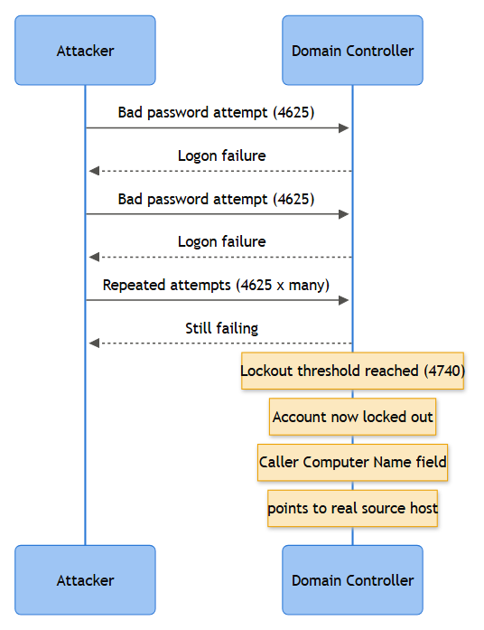

# Playbook: Brute Force

## Playbook ID & Name

**IAM-002 — Brute Force / Password Guessing & Spraying (Interactive, NTLM, and Kerberos)**

Category: Identity & Active Directory — Account & Authentication

## Business Risk

**[STAKEHOLDER]** - An attacker who guesses or sprays their way into even one valid account gets a legitimate identity to hide behind — everything they do afterward looks like "a user logging in." This is usually the first step toward mailbox compromise, VPN access, or a foothold for ransomware deployment. The business risk isn't the failed logons themselves; it's the one that eventually succeeds. Cost of getting this wrong is measured in incident response hours, not just a locked-out helpdesk ticket.

## Severity/Priority Default

- **Medium** — isolated bursts against a small number of accounts, no lockouts, no successful logon.
- **High** — password spray pattern across many accounts, any 4740 lockout storm, or any correlated success (4624/4768 with Result Code 0x0) following a failure burst on the same or related account.
- **Critical** — successful authentication on a privileged account (4672 present) following a brute force pattern, or brute force activity against a domain controller, VPN, or internet-facing auth endpoint (Exchange, OWA, RDP gateway) that succeeds.

## MITRE ATT&CK Techniques

- **T1110 Brute Force**
  - **T1110.001** Password Guessing (many attempts, one or few accounts)
  - **T1110.003** Password Spraying (few attempts per account, many accounts, usually one shared candidate password)
- **T1078 Valid Accounts** (.002 Domain Accounts) — the logical follow-on once a credential lands
- **T1021** Remote Services (.001 RDP, .004 SSH) — common delivery surface for brute force attempts against exposed services

## Trigger / Detection Logic Summary

Correlation rule fires on volume/velocity of authentication failures against a single source, a single target account, or a single target-account-population, within a rolling window, using one or more of:

- ≥N `4625` (interactive/network logon failures) from one source IP against one account in <5 minutes → guessing
- ≥N `4625`/`4771` failures from one source IP spread across ≥M distinct accounts in <15 minutes → spraying
- Any `4776` NTLM validation failures at volume against a DC, particularly clustered outside business hours
- Any `4740` account lockout event, correlated back via **Caller Computer Name** to find the true source host generating the bad attempts (this is not always the workstation the user thinks it is)
- Kerberos-specific: repeated `4768` with **Result Code 0x18** (pre-auth failed/bad password) or `4771` with **Failure Code 0x18**, same **Client Address**, multiple **Account Name** values

Thresholds should be tuned per environment — a shared kiosk PC or an RDP gateway will trip naive thresholds constantly.



*Figure F014 - repeated failures culminating in a 4740 lockout.*

## Required Log Sources & Event IDs

| Source | Event IDs | Purpose |
|---|---|---|
| Domain Controller Security log | 4625, 4771, 4768, 4776, 4740, 4767 | Core failure/lockout/Kerberos pre-auth telemetry |
| Domain Controller Security log | 4624, 4672 | Confirms whether a spray/guess attempt ultimately succeeded, and whether the account is privileged |
| Member server/workstation Security log | 4625, 4624, 4648 | Local/RDP brute force not routed through a DC (local accounts, non-domain services) |
| VPN/edge auth appliance logs (vendor-specific) | N/A (out of Windows scope) | Source of the actual external IP when NAT/VPN sits in front of AD |
| Network/proxy logs | N/A | Correlate source IP reputation, geolocation, known scanner ranges |

## Key Fields to Inspect

**[ANALYST]** -

- `4625`: **Account Name**, **Failure Reason**, **Status/Sub Status** (0xC000006A bad password, 0xC0000064 no such user, 0xC0000234 locked out, 0xC0000072 disabled), **Source Network Address**, **Caller Process Name**, **Logon Type**
- `4771`/`4768`: **Account Name**, **Supplied Realm**, **Client Address**, **Pre-Authentication Type**, **Result Code**/**Failure Code**
- `4776`: **Logon Account**, **Source Workstation**, **Error Code**
- `4740`: **Caller Computer Name** (the actual attacking or misconfigured host, not necessarily the victim's usual machine)
- `4624`/`4672` following a failure burst: **Logon Type**, **Source Network Address**, whether privileges were granted

Sub status 0xC0000064 (no such user) mixed in with 0xC000006A across many attempts from one source is a strong tell — it means the attacker is iterating a username list, not just retrying a password on known accounts.

## Normal vs Suspicious Pattern

| Normal | Suspicious |
|---|---|
| A handful of 4625s clustered right after a password change, from the user's known workstation | High-volume 4625/4771 from a single external or unfamiliar internal IP against one or many accounts |
| 4625 from a service account tied to a stale scheduled task or mapped drive with a cached old password | 4771 Failure Code 0x18 spread thin (1-3 attempts) across dozens of accounts, same Client Address — classic spray, built to dodge lockout policy |
| 4740 lockout with Caller Computer Name = the user's own laptop (typo, cached credential in a phone/mail client) | 4740 lockout storm with Caller Computer Name pointing to a server, print appliance, or unrecognized host — often malware or a misconfigured legacy app relaying attempts, sometimes an actual attacker pivot point |
| Occasional 4776 failures from a help desk kiosk during password resets | 4776 failures at a steady mechanical interval (scripted) rather than the irregular cadence of a human typing |

## Investigation Steps

1. Pull all `4625`/`4771`/`4776` events for the affected account(s) and pivot on **Source Network Address** / **Client Address** / **Caller Computer Name** to identify true attempt volume and origin.
2. Determine pattern shape: one account hammered (guessing, T1110.001) vs many accounts each hit a few times (spraying, T1110.003). This changes scope — spraying means every account touched needs review, not just the one that eventually succeeded.
3. Check whether any attempt succeeded: search `4624`/`4768` (Result Code 0x0) for the same account within the attack window, on the same or an adjacent source. If found, treat as credential compromise, not just an attempted attack — escalate immediately.
4. If a success is found, check for `4672` (privileged logon) and pull the resulting Logon ID forward through `4688`/process activity and `4648` for lateral movement indicators.
5. Resolve the source IP/host: internal asset owner lookup, VPN concentrator session logs, or external IP reputation/geolocation. Don't assume external — a compromised internal host or an old script with a hardcoded stale password is common.
6. Check for lockout collateral damage: how many legitimate users got locked out (`4740`/`4767` pairs), and whether helpdesk is already fielding tickets — this often surfaces the incident before SIEM does.
7. Review whether MFA was in front of the affected accounts/service. Password success without MFA enforcement is a materially worse finding than success on an MFA-protected app.
8. Document scope: full list of targeted accounts, source(s), time window, and whether any succeeded, before writing the disposition.

## True Positive Indicators

- Sustained failure volume against one account or spread thin across many, from one or a small rotating pool of IPs
- Mix of 0xC000006A and 0xC0000064 sub statuses indicating enumerated/guessed usernames
- Any successful logon (4624/4768 success) immediately following a failure burst on the same account
- Attempt cadence too regular/fast for human typing (scripted tooling)
- Source IP with no legitimate business reason to authenticate against that account (foreign geolocation, known scanning infrastructure, Tor/VPN exit node)

## False Positive / Benign Positive Indicators

- Recently changed password not yet updated in a mobile mail client, mapped drive, or scheduled task (repeats from one known device, same account, over days)
- Misconfigured monitoring tool or vulnerability scanner performing credentialed checks against many hosts/accounts
- Helpdesk performing legitimate bulk password resets or unlock operations
- Shared kiosk/lab machine with high natural failed-login noise from multiple legitimate users
- Load balancer or NAT gateway making many source IPs appear as one, inflating apparent "spray breadth" from what is actually one office's normal login traffic

## Escalation Criteria

Escalate to Incident Response when: any confirmed successful authentication follows a brute force pattern; the targeted or compromised account is privileged (Domain Admin, service account with elevated rights, break-glass account); the source is an internal host (implies existing compromise, not just external attack surface); or a lockout storm affects a large percentage of the user population (availability/operational impact in its own right, page IT Ops in parallel).

## Containment Options & Approval Authority

**[MANAGEMENT]** -

| Action | Who Can Approve | Notes |
|---|---|---|
| Force password reset on targeted account(s) | SOC Analyst / IAM on-call (standing authority) | Low-risk, fast, standard first move on any confirmed guess/spray hit |
| Block source IP at perimeter/WAF | Network/Security Engineering on-call | Coordinate with NOC if IP is shared NAT/VPN egress used by legitimate users |
| Disable account pending investigation | IAM team lead or IR lead sign-off | Requires business impact check — don't disable a CEO or on-call account without a heads-up |
| Force MFA re-registration / revoke sessions | IAM lead + IR lead joint approval | Used when success is confirmed; revokes any active token from the compromised session |
| Enforce/lower lockout threshold temporarily | IAM/Identity engineering, change-managed | Tactical, time-boxed change, should be reverted post-incident and logged |

## Example Query (Splunk SPL)

```spl
index=wineventlog EventCode IN (4625,4771)
| eval acct=coalesce(Account_Name, TargetUserName), src=coalesce(Source_Network_Address, IpAddress)
| bin _time span=15m
| stats dc(acct) as distinct_accounts, count as attempts by src, _time
| where attempts >= 10 AND distinct_accounts >= 5
| sort -attempts
```

## Closure Criteria

Close as **True Positive** only once source, full account scope, and success/failure outcome are documented, and containment (reset/block/disable as warranted) is confirmed applied. Close as **Benign Positive** when the pattern traces to a known stale-credential device, scanner, or helpdesk activity, with the owning team/tool identified by name. Close as **Insufficient Evidence** when the source cannot be attributed and no success or lockout collateral resulted — do not silently drop, flag for a watchlist/threshold review instead.

**Example case-note line:** *"2026-09-15 03:14 UTC — 4771 Failure Code 0x18 across 47 distinct accounts from 203.0.113.44 (external, no VPN match) over 12 min, single attempt per account; no 4624/4768 success found in window; account jrodriguez@example.com later authenticated successfully from same IP at 03:26 — escalated to IR as confirmed compromise (T1110.003 → T1078.002), password reset + session revoke applied, source IP blocked at perimeter, IAM lead notified."*
