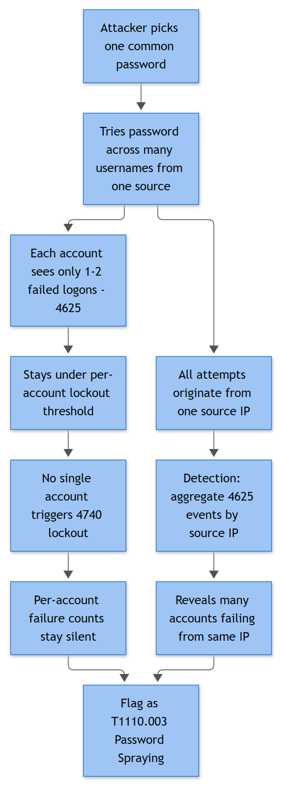

# Password Spraying

## Playbook ID & Name

**ID:** IAM-003 | **Name:** Password Spraying (Single-Attempt, Multi-Account Credential Attack)
**Category:** Identity & Active Directory - Account & Authentication

## Business Risk

**[STAKEHOLDER]** - An attacker who doesn't know any specific password is trying one or two common guesses against a large batch of employee usernames instead of hammering a single account (which would trip a lockout policy fast). Done right, this technique slides under most lockout thresholds and blends into ordinary "someone fat-fingered their password" noise. The business risk is direct account takeover of a valid domain identity, most commonly a service desk-reset account, a shared mailbox, or an employee with a seasonal/dictionary-word password - and once one account lands, that identity's access, mailbox and group memberships are the attacker's. This is one of the cheapest, highest-ROI attack techniques against any org that hasn't enforced MFA everywhere and still allows weak or seasonal passwords.

## Severity / Priority Default

- **Default:** Medium, escalates to High automatically on any correlated successful authentication (4624/4768 success) following spray-pattern failures against the same account.
- **Critical** if the successful account carries admin-equivalent rights (4672 fires alongside the logon) or is a service account with broad delegation.

## MITRE ATT&CK Techniques

- **T1110.003** - Brute Force: Password Spraying (primary)
- **T1110.001** - Brute Force: Password Guessing (related, lower distinct-account volume, higher per-account attempt count)
- **T1078.002** - Valid Accounts: Domain Accounts (post-compromise use of the sprayed credential)
- **T1087** - Account Discovery (frequently precedes a spray - attacker needs a username list first)

## Trigger / Detection Logic Summary

**[ENGINEERING]** The signature that separates spraying from a normal bad-typing day or a legitimate lockout event is the **ratio of distinct target accounts to total failed attempts, per source**. A spray produces a near-1:1 ratio (many accounts, 1-3 attempts each) inside a tight time window. A single confused user produces the inverse (one account, many attempts).

Baseline detection logic:

- Count **distinct target accounts** with a failed authentication event (4625 with Logon Type 3/8, or 4771/4768 with a failure result) from a **single source IP, source workstation, or small CIDR block** within a rolling window (commonly 10-15 minutes, tune to your environment's auth volume).
- Alert when distinct-account count exceeds a threshold (start around 10-15 distinct accounts per source per window and tune down false positives from there) **and** average attempts-per-account stays low (under ~3).
- A secondary, lower-noise variant watches for the same pattern spread across a longer window (hours) with very low per-account attempts (1) - this catches "slow spray" designed specifically to stay under short-window thresholds.
- Include a companion rule on 4740 (account lockout) volume - a lockout storm where **Caller Computer Name** repeats across many different locked-out accounts is a strong secondary indicator, and sometimes the first thing anyone notices, since it generates helpdesk tickets before the SOC alert fires.



*Figure F013 - why password spraying stays under per-account lockout thresholds.*

## Required Log Sources & Event IDs

| Source | Event IDs | Why |
|---|---|---|
| Domain Controller Security log | 4625, 4771, 4768, 4776, 4740, 4767 | Core failure/lockout telemetry, both NTLM and Kerberos paths |
| Domain Controller Security log | 4624, 4672 | Confirms whether any spray attempt actually succeeded, and whether it was privileged |
| VPN / RDS Gateway / reverse proxy logs (if externally facing) | vendor-specific auth logs | Identifies the real originating IP before NAT/proxy translation |
| Identity provider / federation logs (if hybrid) | vendor-specific sign-in logs | Confirms whether the same identity was targeted from the cloud side simultaneously |

## Key Fields to Inspect

**[ANALYST]**

| Field | Event | What to check |
|---|---|---|
| Account Name / Target Account | 4625, 4771, 4768 | Build the full list of distinct accounts targeted - this is your victim-scope list |
| Source Network Address / Client Address | 4625, 4771, 4768 | Is it one IP, a rotating small pool, or a known corporate egress NAT (false-positive risk) |
| Status / Sub Status | 4625 | Confirm sub status is **0xC000006A** (bad password) - if you see a mix of 0xC000006A and 0xC0000064 (user does not exist), the attacker is spraying against a guessed username list, which is a stronger TP signal than spraying only valid accounts |
| Failure Code | 4771 | 0x18 = pre-auth failed / bad password, consistent with spray behavior |
| Result Code | 4768 | 0x18 bad password vs 0x6 client not found - same logic as above |
| Logon Type | 4625 | Type 3 (network) or 8 (NetworkCleartext) dominate for spray tooling; interactive (Type 2) spray from a single console is unusual and worth extra scrutiny |
| Caller Process Name / Workstation Name | 4625 | Legit user-driven failures show a workstation name; spray tooling against externally exposed auth endpoints (OWA, VPN portal) often shows blank or a generic gateway/proxy hostname |
| Caller Computer Name | 4740 | Source of the bad attempts in a lockout storm - don't assume the lockout ticket the helpdesk raised names the right host |
| Authentication Package | 4624/4625 | NTLM vs Kerberos - helps confirm whether the attempt hit the DC directly or came through a legacy protocol endpoint (a classic spray vector: IMAP/SMTP/legacy Exchange auth that doesn't support MFA) |

## Normal vs Suspicious Pattern

| Normal | Suspicious |
|---|---|
| One account, one source, several failures in a row, then a success (user forgot which password) | Many distinct accounts, one source, 1-3 failures each, no successes - or one success buried in the noise |
| Failures cluster around business hours and password-expiry cycles | Failures spread evenly across a batch with no relation to expiry cycles, sometimes at odd hours |
| Source workstation/IP matches the account's usual location | Source IP is a VPN exit node, hosting-provider ASN, Tor exit, or an internal host that has no business reason to authenticate as dozens of different users |
| Lockouts trickle in individually over days | Lockouts spike together, same Caller Computer Name, across many unrelated accounts within minutes |

## Investigation Steps

1. Pull all 4625/4771/4768 events for the source IP/workstation across the alert window and build the distinct-account list plus attempt counts per account - confirm the 1:1-ish ratio that defines spraying versus a targeted brute force.
2. Check sub status/failure codes across the set. A mix of bad-password and user-does-not-exist codes tells you the attacker is working off a guessed or purchased username list, not a validated one from prior recon.
3. Search for any 4624 success (or 4768 Result Code 0x0) for any account in that same distinct-account list, from the same or a related source, in the same or an extended window - this is the single most important pivot in the whole investigation.
4. If a success is found, immediately check for 4672 (privileged logon) and pull that Logon ID's full session activity (4688 process creation, 4648 explicit-credential use, any 4720/4738/4728 account-tampering events) to see what the attacker did with the access.
5. Identify the true source: for internet-facing auth (VPN, OWA, RDS Gateway), pull the edge/gateway log to de-NAT the address; for internal-appearing sources, confirm whether that host is a legitimate proxy/NPS/RADIUS server (common false-positive source) or an actually compromised workstation.
6. Cross-reference the targeted-account list against HR/identity data - stale accounts, shared mailboxes, and service accounts with no MFA are the highest-value hits and deserve a password reset regardless of spray outcome.
7. Check for related 4740 lockout volume and correlate Caller Computer Name against the source identified in step 5 to confirm you're not chasing a red herring from a misconfigured app using cached credentials.
8. Document scope (accounts targeted, accounts successfully authenticated, accounts locked) and hand off to IAM for forced resets on anything touched.

## True Positive Indicators

- Distinct-account-to-attempt ratio near 1:1 from a single source within a short window.
- Source IP/ASN with no legitimate business relationship to the tenant (hosting provider, anonymization service, unrelated geography).
- At least one confirmed success (4624/4768 0x0) among the sprayed accounts, especially followed by 4672 or lateral movement indicators.
- Targeted account list overlaps heavily with a recently harvested or public username format (firstname.lastname@example.com pattern guessed systematically).

## False Positive / Benign Positive Indicators

- Source is a known NPS/RADIUS, VPN concentrator, or reverse proxy relaying legitimate user traffic - failures are real users, source IP is just shared (classic NAT-aggregation false positive).
- A misconfigured application or scheduled job is retrying a stale cached credential against a service account after a scheduled password rotation - produces a spray-shaped pattern against a very small, static account list (usually one or two accounts, not dozens).
- Mass password-expiry event (e.g., a bulk-onboarded cohort) landing on the same day - filter by checking whether the account list correlates with a recent policy change rather than a hostile source.
- Internal vulnerability scanner or pentest activity (check the authorized scanning/testing calendar before escalating - this is a frequent source of spray-shaped noise that wastes an afternoon if not checked first).

## Escalation Criteria

Escalate to Tier 2 / IR immediately if any of the following is true: a confirmed successful authentication exists among the sprayed accounts; the successful account is privileged (4672) or a service account; the source is external and unrelated to any known scanning/testing window; or lockout volume is disrupting business operations (helpdesk ticket surge) regardless of TP/FP status, since operational impact alone justifies IR involvement.

## Stakeholder Communication

**[STAKEHOLDER]** - Not every spray needs a stakeholder call - most close as Benign Positive against a scanner or NAT source without leaving the SOC. Make the call once a success is found among the sprayed accounts, the source is confirmed external/hostile, or lockout volume is disrupting the business. Give the business owner these five things, in this order:

- **What happened:** "[N] accounts were targeted with password-guessing attempts from [source/ASN] over [window]." Cite the distinct-account count and window from your query results, not an estimate.
- **The risk:** Direct takeover of a valid domain identity - if the sprayed password lands on one of these accounts, the attacker inherits that identity's mailbox, file access, and group memberships immediately.
- **The evidence:** The targeted-account list, whether any 4624/4768 success was found among them, and whether that successful account is privileged (4672) - a confirmed success changes this from a hygiene finding to an active-intrusion conversation.
- **The decision needed:** Whether to force a reset on every targeted account now (safe default) or scope the reset to only the confirmed-hit account (less disruptive, but leaves other targeted accounts on their original, already-guessed-at password).
- **GO (reset all targeted accounts) vs. NO-GO (reset only confirmed hits):** GO closes the exposure completely but generates helpdesk load and forces password changes on users who were never actually compromised. NO-GO minimizes disruption but accepts the risk that a second, slower attempt against an untouched account in the same batch succeeds later - state this trade-off explicitly rather than letting the business assume "reset" always means "everyone."

## Containment Options & Approval Authority

**[MANAGEMENT]**

| Action | Approval Authority | Notes |
|---|---|---|
| Force password reset on targeted account(s) | SOC Tier 2 (no external approval needed) | Standard containment, low business friction |
| Block source IP/ASN at edge firewall/WAF | Network/Security Engineering on-call | Fast if source is clearly external and hostile; skip if source is a shared corporate NAT egress |
| Disable a compromised privileged/service account | IAM Team Lead or Incident Commander | Requires business-owner notification if it's a service account tied to an application |
| Enforce MFA / conditional access on legacy auth protocols org-wide | CISO or IAM Director (policy-level change) | Longer-term structural fix, not same-shift containment - track as a follow-up action item, not part of this incident's closure |

## Example Query

```kql
SecurityEvent
| where EventID in (4625, 4771)
| where TimeGenerated > ago(15m)
| summarize DistinctAccounts = dcount(TargetUserName),
            TotalAttempts    = count()
          by IpAddress, bin(TimeGenerated, 15m)
| where DistinctAccounts >= 12 and TotalAttempts < (DistinctAccounts * 3)
| order by DistinctAccounts desc
```

## Closure Criteria

Close as **True Positive** once every targeted account has been reset or confirmed unaffected, the source has been blocked or otherwise neutralized, and no successful authentication is found among the sprayed set. Close as **Benign Positive** when the pattern traces to authorized scanning, a shared NAT/proxy source, or a bulk password-expiry event, with the source documented so the next analyst doesn't re-open the same investigation. Close as **Insufficient Evidence** if the source cannot be attributed and no successful logon occurred - flag the account list for a heightened-monitoring watchlist rather than dropping it entirely.

**Example case note:**
> 2026-09-15 02:14 UTC - 34 distinct accounts hit with single bad-password failures (4625, 0xC000006A) from 203.0.113.44 over 9 minutes, no successes found on DC01/DC02 for any targeted account, source resolves to a known hosting-provider ASN with no business relationship to Northwind Logistics. Blocked at perimeter FW (change #INC-88213, approved by network on-call), forced reset on 34 accounts via IAM, no 4672/4688 follow-on activity observed. Closed as True Positive, no evidence of successful account takeover.
