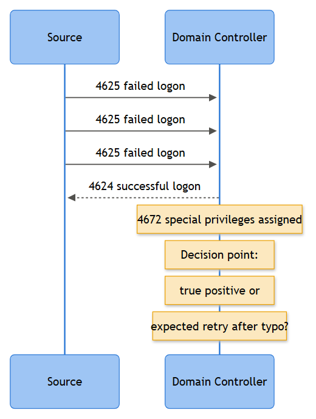

# Successful Login After Failures

**Category:** Identity & Active Directory - Account & Authentication
**Playbook ID:** IAM-004

This is the escalation sibling to *Repeated Login Failures* (IAM-001), and it deserves its own playbook rather than a footnote on that one, because the moment a failure run terminates in a success, the entire risk calculus changes. A string of bad passwords that fizzles out is noise. The same string of bad passwords followed by one clean 4624 is, until proven otherwise, a compromised credential. Analysts who triage this as "well, they got it right eventually" without checking who "they" actually were are the reason password-guessing campaigns quietly succeed in the queue instead of getting caught in it. This playbook exists to force the one question that matters: was the eventual success the legitimate user finally remembering their password, or an attacker who ran out the clock on a guessing attempt.

## Business Risk

**[STAKEHOLDER]** - A successful logon that follows a burst of failures is one of the highest-fidelity early indicators of account takeover available in AD telemetry - far better than the failure run alone, because it tells you the attacker didn't just try, they got in. If this is a privileged or finance-adjacent account, the exposure runs from mailbox and data access straight through to lateral movement and ransomware staging. The business decision this playbook drives is fast: confirm whether the person who logged in is who they claim to be, and if not, cut their access before they use it.

## Severity / Priority Default

- **Default:** High (P2) - this is not a routine authentication event once the pattern is established.
- **Escalates to Critical (P1)** when the account is a Domain Admin, Tier-0 service account, or shows a 4672 special-privilege token on the successful logon; when the source of the successful logon differs geographically or by device from the source of the preceding failures; or when the success is followed by 4648 explicit-credential activity, new scheduled tasks, or group membership changes within the same session.
- Can be downgraded to Medium only after positive confirmation that the same legitimate user generated both the failures and the success (see False Positive indicators).

## MITRE ATT&CK Techniques

- **T1110 Brute Force** - the failure run itself
  - T1110.001 Password Guessing - sustained attempts against one account
  - T1110.003 Password Spraying - low-volume attempts spread across accounts, occasionally landing on one
- **T1078 Valid Accounts** (.002 Domain Accounts) - the state once the guess succeeds; from this point the attacker is operating with legitimate credentials and most subsequent activity will not look "malicious" on its face
- **T1550 Use Alternate Authentication Material** (.002 Pass the Hash, .003 Pass the Ticket) - relevant only as a *follow-on* risk once compromise is confirmed, if the attacker pivots off the newly obtained credential to other hosts
- **T1021 Remote Services** (.001 RDP, .002 SMB/Windows Admin Shares) - the likely next step if the successful logon is used for lateral movement rather than just mailbox/data access

## Trigger / Detection Logic Summary

Alert fires when a 4624 (or successful 4768/4776) for a given Account Name occurs within a defined lookback window (default 30 minutes, tune to domain lockout policy) of **N or more** preceding 4625/4771 failures for that same account, with no successful logon in between.

```
failures(Account Name) >= 3 in trailing 30m
AND success(Account Name) occurs
AND no success(Account Name) occurred earlier in that 30m window
=> fire
```

Set the failure threshold below your domain lockout threshold minus one, so this fires *before* an attacker would otherwise get locked out - if your lockout policy is 5 attempts, alert at 3, don't wait for 4.



*Figure F015 - the classic brute-force-to-compromise pattern.*

## Required Log Sources & Event IDs

| Source | Event IDs | Why |
|---|---|---|
| Domain Controller Security log | 4625, 4771, 4776 | The failure run - captures both NTLM and Kerberos failure paths |
| Domain Controller Security log | 4624, 4768, 4769 | The terminating success - Kerberos TGT (4768) is usually the first authoritative success on AD, 4624 follows for the actual logon session |
| Domain Controller Security log | 4672 | Confirms whether the successful token carries admin-equivalent privileges |
| Domain Controller Security log | 4634, 4647 | Session teardown - useful for session duration and whether logoff was deliberate |
| Domain Controller Security log | 4648 | Explicit-credential use immediately after the success - common lateral-movement follow-on |
| Domain Controller Security log | 4740, 4767 | Confirms whether the account was ever fully locked and later unlocked mid-sequence |
| Endpoint / target host | 4624 (local), 4688 | Confirms what process ran on the box the session landed on |
| Perimeter (VPN/RDP gateway) | vendor auth logs | Needed to resolve the real external source if DC only shows an internal jump-host IP |

## Key Fields to Inspect

**[ANALYST]**
- **Logon ID** on the successful 4624 - use this to pivot forward into every subsequent 4634/4648/4672/4688 event tied to that exact session, not just the account name generally.
- **Source Network Address / Source Port** - compare directly between the failure run and the success. Same source, same rough timing pattern = one continuous attempt. Different source (or a source that never appeared in the failures) landing the success = credential likely obtained elsewhere and used fresh, which is worse, not better.
- **Logon Type** on the 4624 - Type 3 (network), Type 10 (RemoteInteractive/RDP), Type 2 (interactive). A failure run of Type 3 attempts followed by a Type 10 success on the same account is a common "guessed the password, now RDP'ing in" pattern.
- **Authentication Package** - NTLM succeeding where Kerberos should be the norm for that host/account is itself worth flagging, independent of the failure context.
- **Workstation Name** on the 4624 versus the hostname associated with the account's normal working pattern (asset inventory, past 30 days of logon history) - a name that's never been seen for this user is a strong signal.
- **Failure Reason / Sub Status** on the preceding 4625/4771 run - `0xC000006A` (bad password) narrowing down attempt by attempt toward a correct guess is a very different story than a run of `0xC0000064` (account doesn't exist) that then somehow succeeds, which usually means two different accounts got conflated in the query and needs re-verification before anything else.
- **4672 Privilege list** - if present on the success, treat this as an automatic escalation regardless of anything else found.

## Normal vs Suspicious Pattern

| Signal | Normal / Benign | Suspicious |
|---|---|---|
| Source continuity | Success comes from the same device/IP as the failures (user's own laptop, mistyped password a few times) | Success comes from a different IP, ASN, or country than the failure run |
| Timing | Failures and success clustered within seconds to a couple of minutes, business hours | Failures spread out over an unusually patient interval (spray pacing), success lands off-hours |
| Failure count before success | 1-3 typos then correct | Success arrives at attempt 8, 15, or right at the domain lockout boundary minus one |
| Logon Type shift | Consistent logon type throughout | Failures via Type 3 (network probing), success via Type 10 (RDP) or Type 2 (interactive) - vector change mid-sequence |
| Post-logon behavior | Normal session, expected apps/processes, logs off via 4647 | Immediate 4648, 4672, 4688 spawning admin tooling, or a session that never cleanly logs off |
| Account history | Account has logged in from this source before, has a normal usage baseline | First-ever appearance of this source/device for this account |

## Investigation Steps

1. Pull the full failure run (4625/4771/4776) plus the terminating 4624/4768 for the account, ordered by timestamp, and confirm the Logon ID of the success - this is your anchor for everything downstream.
2. Compare Source Network Address and Source Port across the entire sequence. If the success came from a different source than most or all of the failures, treat as likely takeover and move straight to containment prep - don't wait for more evidence to keep accumulating while the session is live.
3. Check whether the account belongs to a privileged group or has 4672 history. If yes, this is an automatic Critical regardless of how "explainable" the pattern looks otherwise.
4. Pivot on the successful Logon ID into 4648 (explicit credential use), 4688 (process creation on the target host), and any 4720-4738 account/group management events tied to the same session - this tells you what the session was actually used for.
5. Contact the account owner directly (out of band - phone or in person, not email to a possibly-compromised mailbox) to confirm whether they generated the failure run and the success themselves.
6. Check the source device/IP against known corporate assets, VPN pool ranges, and any threat-intel feeds for credential-stuffing infrastructure - a residential proxy IP or known malicious ASN on the success is a hard confirm.
7. If the source can't be attributed to the user and the account is still logged on, coordinate immediate session revocation with IAM before continuing deeper analysis - contain first, finish the timeline after.
8. Document full timeline (failure count, sources, logon type transitions, session actions) and assign disposition.

## True Positive Indicators

- Success originates from a source that never appeared in the failure run, or from a geography/ASN inconsistent with the user's normal pattern.
- Success lands at or just before the domain account-lockout threshold (attacker calibrating attempts to avoid triggering a lockout alert).
- Logon Type changes between the failure run and the success in a way that suggests vector-hopping (e.g., web/network auth failures, then a direct RDP success).
- Session activity post-logon includes 4648 explicit-credential use, 4672 privileged token, or new 4688 processes inconsistent with the account's normal role.
- Account owner denies generating either the failures or the success when contacted.

## False Positive / Benign Positive Indicators

- Account owner confirms they mistyped their password several times (often after a recent required rotation) from their own known device, and the success matches source/device/timing expectations.
- MFA prompt was satisfied on the successful attempt and MFA logs (if integrated) show the legitimate registered device/method responding - strong benign signal even if password attempts were rocky beforehand.
- Service account failures tied to a known credential-propagation delay, with the eventual success occurring once the correct credential synced to the calling host.
- Shared kiosk or terminal-server account where multiple physical users legitimately generate failure/success clusters throughout the day - validate against a documented baseline rather than treating every instance as new.

## Escalation Criteria

Escalate to Tier 2 / IR immediately, do not sit on this in the queue, when:
- The successful logon's source differs from the failure run's source.
- The account is privileged (4672 present) or is a Tier-0/service account with broad access.
- The account owner cannot be reached within a reasonable window and the session may still be active.
- Any 4648, new scheduled task, or group membership change follows the success within the same session.

## Containment Options & Approval Authority

**[MANAGEMENT]**
| Action | Approval Needed | Notes |
|---|---|---|
| Force immediate password reset | Tier 1 analyst, standard SOP | Apply on any confirmed or suspected takeover, no need to wait for full investigation |
| Revoke active session / force sign-out | Tier 2 or IAM on-call | For hybrid/cloud-synced accounts this must also hit the identity platform, not just AD |
| Disable account pending review | IAM team or IR lead | Use when owner is unreachable and session risk is high |
| Isolate target host (if session landed on an endpoint) | IR lead, coordinate with EDR/endpoint team | Prevents lateral movement if attacker pivoted post-logon |
| Notify account owner's manager / HR | SOC manager, per incident comms policy | Required once takeover is confirmed, especially for privileged or finance-adjacent accounts |

Review cadence: threshold tuning (failure count vs. domain lockout policy) reviewed quarterly with IAM; every Critical-severity closure from this playbook gets a post-incident review at the next SOC ops meeting regardless of final disposition.

## Example Query (Splunk SPL)

```spl
index=wineventlog EventCode IN (4625,4771,4624,4768) 
| eval outcome=if(EventCode IN (4624,4768), "success", "failure")
| bin _time span=30m
| stats count(eval(outcome="failure")) as failures, 
        values(eval(if(outcome="success", Source_Network_Address, null()))) as success_src,
        values(eval(if(outcome="failure", Source_Network_Address, null()))) as fail_src
        by Account_Name, _time
| where failures>=3 AND isnotnull(success_src)
```

## Closure Criteria

Close as **True Positive** only after the source discrepancy (or lack thereof) has been resolved, containment logged, and account owner notified. Close as **Benign Positive** when the account owner confirms self-generated failures and success from their own device, ideally corroborated by MFA logs. Close as **Insufficient Evidence** only when the account owner cannot be reached, no follow-on session activity (4648/4688/group changes) occurred, and the source resolves to a plausible corporate asset - keep the account flagged for 72 hours rather than closing cleanly.

**Example case note:**
`2026-09-15 09:12 UTC - Account j.alvarez generated 6x 4625 (0xC000006A) from 10.22.4.17 (jalvarez-laptop) between 09:05-09:09, followed by successful 4624 Logon Type 3 from 203.0.113.44 (external, unrecognized ASN) at 09:11. Source mismatch confirmed - laptop attempts were the user re-typing a recently rotated password; external success was not. Contacted user by phone, confirmed no travel/VPN use matching that IP. Session revoked, password reset forced, account temporarily disabled pending IAM review. Escalated to IR as confirmed account takeover, T1110.001 -> T1078.002. No 4648/4688 follow-on observed before revocation.`
