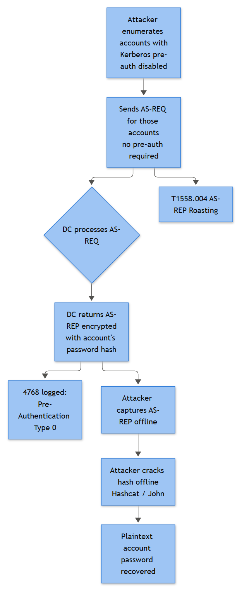

# AS-REP Roasting Detection & Response

## Playbook ID & Name

**IAM-019 — AS-REP Roasting Detection & Response**

## Business Risk

**[STAKEHOLDER]** - An attacker who only knows (or guesses) valid usernames — no password, no prior foothold — can pull back Kerberos material for accounts configured without pre-authentication and crack it offline at their own pace. If one of those accounts turns out to be a service account with elevated rights, that's a straight line from "list of usernames" to domain compromise, with almost nothing visible on the wire until it's too late. The business exposure here is quiet reconnaissance-to-credential-theft with no lockouts, no failed-password alerts, and no endpoint footprint if the attacker runs the tool from their own box off-network.

## Severity / Priority Default

**Medium**, escalate to **High** when the targeted account is privileged (Domain Admins, service accounts with SPNs or delegated rights), when the request pattern is bulk/enumerative rather than a single named target, or when a successful interactive/service logon follows the roast attempt within a plausible cracking window.

## MITRE ATT&CK Technique(s)

- **T1558.004** — Steal or Forge Kerberos Tickets: AS-REP Roasting
- **T1087** — Account Discovery (username list building precedes most real-world roasts)
- **T1078.002** — Valid Accounts: Domain Accounts (if the cracked credential is later used to authenticate)

## Trigger / Detection Logic Summary

Core signal: a Kerberos AS-REQ/AS-REP exchange (Event ID **4768**) where **Pre-Authentication Type = 0** and **Result Code = 0x0**. Under normal Kerberos operation the client proves knowledge of the password via an encrypted timestamp before the DC issues a TGT — that shows up as Pre-Authentication Type **2**. When an account has the `DONT_REQ_PREAUTH` flag set (the "Do not require Kerberos preauthentication" checkbox on the account), the DC hands back the AS-REP — encrypted with a key derived from the account's password — to *anyone* who asks for it, no proof required. That is the entire attack. There is no accompanying 4771 failure because nothing failed; the DC did exactly what it was configured to do.

Correlation rule fires on:
- Any 4768 with Pre-Authentication Type 0 for an account not on the documented exception list, OR
- A single source Client Address generating 4768/Pre-Auth-Type-0 events against multiple distinct target accounts within a short window (username-list sweep), OR
- A 4738 (userAccountControl changed) immediately preceding a 4768/Pre-Auth-Type-0 for the same account — this is the "attacker flips the flag first" variant, relevant when the account didn't previously qualify for roasting and someone with write access (GenericWrite/GenericAll via ACL misconfiguration) toggled it on to enable the attack.



*Figure F018 - accounts without Kerberos pre-auth being roasted offline.*

## Required Log Sources & Event IDs

| Source | Event ID | Purpose |
|---|---|---|
| Domain Controller Security log | 4768 | TGT request — the primary AS-REP roast signal |
| Domain Controller Security log | 4771 | Confirms a *contrast* case: pre-auth required and failed (helps distinguish password guessing from roasting) |
| Domain Controller Security log | 4738 | Account attribute change — watch for `DONT_REQ_PREAUTH` being added |
| Domain Controller Security log | 4724 / 4723 | Follow-up credential reset once a targeted account is confirmed |
| Endpoint Security log (if source is internal) | 4688 | Rubeus / Impacket-style tooling invocation |
| Endpoint PowerShell Operational log | 4103 / 4104 | `Get-ADUser -Filter {DoesNotRequirePreAuth -eq $true}` or similar enumeration/roast wrapper scripts |
| DC Security log | 4624 | Correlate — did the source ever legitimately authenticate, or is this a bare Kerberos packet with no session? |

## Key Fields to Inspect

**[ANALYST]**
- `Account Name` / `Supplied Realm` — the target account being roasted
- `Pre-Authentication Type` — 0 (none) is the flag; 2 is normal encrypted-timestamp pre-auth
- `Result Code` — 0x0 for a successful (and therefore usable) AS-REP; note 0x6 (client not found) and 0x12 (revoked/disabled) mean the attacker's guess missed
- `Client Address` — source of the request; check whether it's a domain-joined host, a jump box, or something you don't recognize on that subnet
- On 4738 for the same account: `Changed Attributes` — confirm whether `DONT_REQ_PREAUTH` was added and by which `Subject`

## Normal vs Suspicious Pattern

| Normal | Suspicious |
|---|---|
| A small, documented set of legacy/legacy-integration accounts consistently show Pre-Auth Type 0 — same accounts, same rough volume, day after day | A new account appears with Pre-Auth Type 0 that wasn't there last week, or a previously-normal account's 4738 history shows the flag was just added |
| One 4768/Pre-Auth-Type-0 request per account per authentication cycle, from an expected service host | Dozens of distinct target accounts queried with Pre-Auth Type 0 from a single Client Address in minutes |
| Source host has other correlated legitimate activity (4624, normal process behavior) | Source has no other footprint on the DC at all — a bare Kerberos client, no logon session, nothing else in the timeline |

## Investigation Steps

1. Pull all 4768 events with `Pre-Authentication Type = 0` and `Result Code = 0x0` for the lookback window; group by `Client Address` and count distinct target accounts per source.
2. Compare the target account list against your documented "legitimately preauth-disabled" exception register. Anything not on that list gets full attention.
3. For high-count sources (many distinct accounts queried), treat as a username-enumeration/spray precursor — check whether the same source also generated 4798/4799 style recon or LDAP query volume elsewhere in the timeline (if visible via other tooling).
4. Check 4738 history on flagged accounts going back further than the alert window — did `DONT_REQ_PREAUTH` get added recently, and by whom? If the `Subject` isn't Tier-0 AD admin staff, that's a red flag on its own regardless of the roast attempt.
5. Correlate `Client Address` against 4624 logons on the DC — legitimate service accounts making these requests usually have *some* other authenticated footprint; a source with zero other DC interaction is more consistent with a raw Kerberos client tool (Rubeus, Impacket `GetNPUsers.py`) than a real application.
6. If the source is an internal Windows host, pull 4688 for that host/timeframe looking for `rubeus.exe`, PowerShell invoking `.NET` Kerberos assemblies, or command lines referencing `asreproast`/`GetNPUsers`. Pull 4104 for script block content if PowerShell was involved — Impacket-based attacks from a Linux box won't leave this trail, so absence here doesn't clear the source.
7. Determine account privilege: is the targeted account a member of a privileged group (cross-reference 4728/4732 group-membership history)? Privileged target = immediate escalation regardless of whether a crack can be proven.
8. If compromise is plausible (privileged account, bulk sweep, tooling confirmed), initiate credential reset (4724) on affected accounts and open a change ticket to review/remove unnecessary `DONT_REQ_PREAUTH` flags domain-wide, not just on the one account in scope.

## True Positive Indicators

- Multiple accounts queried with Pre-Auth Type 0 from one source in a short window
- Source `Client Address` with no other legitimate authentication footprint on the DC
- `DONT_REQ_PREAUTH` flag added via 4738 shortly before the roast, by an unexpected `Subject`
- Rubeus/Impacket command-line or script-block evidence in 4688/4104
- A privileged or service account is among the targets
- A subsequent successful 4624 for the targeted account from an unfamiliar workstation days later (suggests the offline crack succeeded)

## False Positive / Benign Positive Indicators

- Account is on the documented legacy-integration exception list (older Unix/Kerberos interop, certain appliances that don't support pre-auth) and the request volume/source matches historical baseline
- Source is a known scheduled health-check or monitoring service hitting the same account on a fixed interval
- Internal security team running an approved AD security assessment under a change ticket (should be pre-notified to the SOC — check the change calendar before treating as hostile)
- Single isolated request against one already-known exception account with no pattern change

## Escalation Criteria

Escalate to IR when: a privileged/service account is among the targeted accounts; the request pattern is a multi-account sweep rather than a single named target; tooling (Rubeus/Impacket) is confirmed via endpoint telemetry; or a `DONT_REQ_PREAUTH` flag change (4738) on a non-exception account precedes the roast attempt. Also escalate on any 4624 for a targeted account from an unfamiliar host/workstation within the following days — that's the "crack succeeded and they're using it" scenario.

## Containment Options & Approval Authority

**[MANAGEMENT]**
- **Immediate password reset** on targeted account(s) — Tier 2 SOC or AD/IAM admin authority; no CAB needed for a suspected-compromised account, but notify the account owner/service owner.
- **Remove `DONT_REQ_PREAUTH` flag** where unauthorized — requires AD admin action; if the account genuinely needs it (documented legacy dependency), route through change management instead of unilaterally flipping it.
- **Source host isolation** (if internal) — standard EDR isolation authority per existing IR runbook.
- **Domain-wide audit of all `DONT_REQ_PREAUTH` accounts** — this should not be a one-off fix; task IAM/AD engineering with a quarterly review and require documented business justification for every exception. Ownership: AD/Identity engineering team; review cadence: quarterly, or immediately after any confirmed roasting incident.

## Example Query (Microsoft Sentinel / KQL)

```kql
SecurityEvent
| where EventID == 4768
| where PreAuthType == "0" and Status == "0x0"
| summarize TargetCount = dcount(TargetUserName), Targets = make_set(TargetUserName)
    by IpAddress, bin(TimeGenerated, 15m)
| where TargetCount > 3
| order by TargetCount desc
```

## Closure Criteria

Close as **True Positive** once the targeted account(s) are confirmed against the exception list as unauthorized, credential reset is completed, and (where applicable) the write-access path that let an attacker set `DONT_REQ_PREAUTH` is identified and remediated. Close as **Benign Positive / Expected Activity** when the account and request pattern match a documented, approved exception with no change in volume or source. Close as **Insufficient Evidence** when the source cannot be attributed and no follow-on authentication or endpoint tooling evidence exists to support escalation — document the account for a short monitoring watchlist rather than dropping it entirely.

Example case-note line:
> "4768 sweep from 10.20.14.203 (WKSTN-CONTR07, non-domain-admin host) hit 11 distinct accounts with PreAuthType=0 in a 6-minute window; svc-backup-legacy was among targets and is NOT on exception register — 4738 shows DONT_REQ_PREAUTH added to svc-backup-legacy 40 min prior by jsmith-adm, who denies the change. Escalated to IR, password reset issued, ACL review opened on svc-backup-legacy OU."
