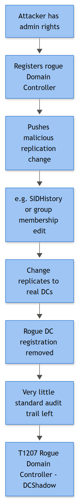

# DCShadow (Rogue Domain Controller Replication Attack)

## Playbook ID & Name

**IAM-021 — DCShadow (Rogue Domain Controller Replication Attack)**

## Business Risk

**[STAKEHOLDER]** - DCShadow is what happens when an attacker who already has (or has stolen) Domain/Enterprise Admin-equivalent rights registers a compromised member server or workstation as a temporary, unofficial "domain controller" and uses Active Directory's own replication channel to push a change — a group membership, a permission, a password attribute — straight into the directory. The reason this playbook exists as its own entry rather than folding into general AD-change monitoring is that the whole point of the technique is to skip the normal audit trail: the change arrives looking like ordinary DC-to-DC replication, not like an admin editing an object. If this succeeds against a Tier 0 object (Domain Admins, AdminSDHolder, a certificate template, the KRBTGT account), the business is looking at a fully authoritative but silently-made change to who has the keys to the kingdom — and the evidence you'd normally show an auditor or a regulator that "this change was approved and logged" simply isn't there. Treat any credible DCShadow finding as domain-compromise-tier, not as a config-drift ticket.

## Severity/Priority Default

**Critical (P1)** on any corroborated indicator — confirmed rogue replication partner behavior, confirmed `lsadump::dcshadow`-style tooling on a non-DC host, or a Tier 0 object change with no matching standard AD modification event. Do not downgrade pending "further investigation" — the whole premise of the attack is that by the time you notice, the write has already landed.

## MITRE ATT&CK Technique(s)

- **T1207** — Rogue Domain Controller (DCShadow) (primary)
- **T1003.006** — OS Credential Dumping: DCSync (closely related — both abuse the same underlying replication rights, `Replicating Directory Changes` / `Replicating Directory Changes All`; DCSync reads via replication, DCShadow writes via replication)
- **T1078.002** — Valid Accounts: Domain Accounts (the operator needs a legitimately privileged or delegated-replication account to make any of this work)
- **T1550.003** — Use Alternate Authentication Material: Pass the Ticket (frequently how the attacker got the privileged session onto the staging host in the first place)
- **T1562.001** — Impair Defenses: Disable or Modify Tools (audit policy tampering or log clearing is a common companion move)

## Trigger / Detection Logic Summary

DCShadow needs two things: a non-DC host running as SYSTEM with Domain Admin-equivalent (or specifically delegated replication) rights, and a target DC willing to accept a replication push from a "partner" that briefly registered itself in the configuration partition. Neither the registration nor the push is a normal LDAP write, so the classic single-event signature most defenders reach for — an attribute-change event on the receiving DC — usually **doesn't fire**. That absence is itself the tell.

Within the Windows Security Event ID set this book works from, you will not get a clean "DCShadow happened" event. You are instead correlating three layers:

1. **Precursor privilege use** — a Domain Admin/Enterprise Admin-equivalent account (or one holding delegated replication rights) authenticating to a real DC from a host that is not in the known-DC inventory (4624 Logon Type 3, paired with 4672 showing high-value privileges).
2. **Attacker tooling on the staging host** — process/PowerShell evidence of Mimikatz's `lsadump::dcshadow` module, DSInternals, or an equivalent Invoke-DCShadow wrapper (4688, 4103, 4104).
3. **A directory change with no matching audit trail** — a Tier 0 object's group membership, SID History, SPN, or `userAccountControl` value has demonstrably changed (confirmed via AD state comparison, not via this Event ID set), but no corresponding 4738/4728/4729/4732/4733 exists on any DC to explain it.

Layer 3 is the structural giveaway; layers 1 and 2 are how you find the source before or while it's happening. Anti-forensics (1102, sometimes preceded by 4719 audit-policy tampering) frequently rounds it out.



*Figure F020 - a rogue DC pushing a change and vanishing.*

## Required Log Sources & Event IDs

| Source | Event ID(s) | Purpose |
|---|---|---|
| Domain Controller Security log (all DCs, not just one) | **4624**, **4672** | Privileged network logon (Type 3) to a DC from a source outside the known-DC IP range — the RPC session the attack rides on |
| Domain Controller Security log | **4648** | Explicit-credential use if the operator authenticated with alternate creds (RunAs, WMI, PsExec-style) before issuing DRS calls |
| Domain Controller Security log | **4738, 4728/4729, 4732/4733** | Baseline of *expected* AD modification events — used to prove their **absence** around a confirmed directory-state change |
| Domain Controller Security log | **4719** | Audit policy tampering that could precede the attack to reduce log fidelity |
| Domain Controller Security log | **1102** | Anti-forensics — log clearing on the DC or the staging host after the write lands |
| Domain Controller Security log | **4768, 4769** | Ticket activity for the privileged account around the event window; unusual Client Address or realm context is corroborating, not primary |
| Staging host (source of the attack) Security log | **4688** | Process creation for `mimikatz.exe`, `rundll32.exe`, reflective-loader patterns invoking `lsadump::dcshadow` (command line only if auditing enabled) |
| Staging host PowerShell-Operational log | **4103, 4104** | Script block/module logging catching `Invoke-Mimikatz`, DSInternals cmdlets, or the literal string `dcshadow` |
| Staging host Security log | **4697** / System log **7045** | Service creation if the operator used a service-based technique to get SYSTEM on the staging host before running the attack |

**[ENGINEERING]** - The events above are the AD-audit-log slice of this attack; they are deliberately not sufficient on their own. The classic, higher-fidelity DCShadow indicators — a transient `nTDSDSA` object appearing under a site's `CN=Servers` container in the configuration partition, DRSUAPI (MS-DRSR) RPC traffic sourced from a host that has never been a replication partner, and AD replication metadata (`repadmin /showobjmeta`, originating server GUID on the changed attribute) — live outside this book's supplied Windows Event ID list and outside native Security-log telemetry entirely. If you have Microsoft Defender for Identity, a SACL-based DS-object-auditing pipeline, or network capture on DC-facing RPC ports, wire those in as a first-class detection source for this scenario rather than treating the table above as complete.

## Key Fields to Inspect

**[ANALYST]**

| Event | Field | What to look for |
|---|---|---|
| 4624 | Source Network Address, Logon Type, Authentication Package | Type 3 logon to a DC from an IP that isn't one of your known DCs; Workstation Name often blank on RPC-style sessions |
| 4624 / 4672 | New Logon Account Name, Privileges | Is this a Domain/Enterprise Admin, or an account holding delegated `Replicating Directory Changes All`? Cross-check against your Tier 0 account inventory |
| 4648 | Account Whose Credentials Were Used, Target Server | Explicit alternate-credential use targeting a DC from a non-DC process |
| 4688 | New Process Name, Command Line, Creator Process Name | `mimikatz.exe`, `rundll32.exe` loading an unsigned/reflective module, command line containing `dcshadow`, `lsadump`, or DSInternals cmdlet names |
| 4103 / 4104 | Script Block Text | Literal `lsadump::dcshadow`, `Invoke-Mimikatz`, DSInternals `Add-DSObjectFake`/replication cmdlets, or heavily obfuscated blocks decoding to the same |
| 4738 / 4728 / 4732 | Changed Attributes, Member Name, Group Name | Check for **absence** matching a known state change on a Tier 0 object — this is a negative-evidence field, not a positive hit |
| 4719 | Subcategory, old/new setting | Any reduction in DS Access or Account Management auditing shortly before the event window |
| 1102 | Subject | Who cleared the log, on which machine, and how close in time to the suspected write |

## Normal vs Suspicious Pattern

| Normal | Suspicious |
|---|---|
| Domain Admin-equivalent 4624/4672 to a DC originates from a jump box, PAW, or another DC in your documented admin-access inventory | Same privilege level authenticating to a DC from an unmanaged workstation, dev box, or a host never used for AD administration |
| Every Tier 0 attribute/group change has a matching 4738/4728/4732/4733 on some DC, tied to a known admin's Logon ID and a change ticket | A confirmed directory-state change (group membership, SID History, SPN, UAC flags) with **no** matching 4738/4728/4732/4733 anywhere across all DCs |
| Replication traffic exists only between actual DCs and known-good replication partners (Azure AD Connect, backup/DR tooling on the allowlist) | RPC/replication-flavored session behavior from a host with no legitimate replication role |
| 4103/4104 shows routine admin scripting (AD module cmdlets, `Get-ADUser`, patch scripts) | Script block content referencing Mimikatz modules, DSInternals replication cmdlets, or the string `dcshadow` in any casing/encoding |
| 1102 is rare, scheduled, and tied to a documented log-management task | 1102 appears shortly after an unexplained privileged session or directory-state change, with no maintenance ticket |

## Investigation Steps

1. Establish the anchor: is this alert-driven (EDR flagged `lsadump::dcshadow`, an unusual 4624/4672 to a DC) or discovery-driven (someone noticed an account has permissions it shouldn't, and you're working backward)? The order of steps below adapts either way.
2. Pull 4624/4672 across **every** DC (not just one — replication/load balancing means the session could land anywhere) for the suspect account/timeframe, and check Source Network Address against your known-DC and known-admin-jump-host inventory.
3. On the suspect source host, pull 4688 (with command line, if auditing is enabled) and 4103/4104 for the same window — look specifically for Mimikatz, DSInternals, or obfuscated PowerShell decoding to replication/DCShadow-flavored cmdlets.
4. Identify what actually changed in AD around that window — group membership, SID History, SPNs, `userAccountControl`, delegation settings — using AD state comparison or replication metadata (`repadmin /showobjmeta` on the affected object, checking the originating server GUID against your real DC inventory) if available.
5. For every change identified in step 4, search all DCs for a matching 4738/4728/4729/4732/4733. **No match is the confirming signature** — a legitimate admin action always leaves this trail; a DCShadow-delivered write does not.
6. Check 1102 on all DCs and the suspect host for the same window and the hours following — anti-forensics is a common last step once the write has landed.
7. Check 4719 in the days prior for any DS Access or Account Management audit-policy weakening that would have suppressed the very events you're relying on in step 5.
8. Scope the blast radius: enumerate every object touched, whether any now holds Domain Admin-equivalent rights, replication delegation, an unexpected SPN (Kerberoasting setup), or SID History granting cross-domain access — this drives both containment urgency and remediation scope.

## True Positive Indicators

- Confirmed `lsadump::dcshadow` (or equivalent DSInternals/Invoke-DCShadow) execution evidence in 4688/4103/4104 on a non-DC host
- Domain Admin/Enterprise Admin-equivalent 4624 (Type 3) + 4672 to a real DC originating from a host outside the documented admin-access/replication-partner inventory
- A confirmed AD attribute or group-membership change on a Tier 0 object with **no** matching 4738/4728/4729/4732/4733 across any DC
- 1102 log clearing correlated in time with either the anomalous privileged session or the unexplained directory change
- Replication metadata (where available) showing an originating server GUID that doesn't map to any real DC's NTDS Settings object

## False Positive / Benign Positive Indicators

- Legitimate DC promotion, demotion, or replication topology change by the AD team, matched to a documented change ticket — new nTDSDSA-style registrations and privileged replication sessions are expected during these windows
- Known backup/DR or directory-sync tooling (Azure AD Connect, Semperis, Quest, Veeam AD-aware backup) using delegated replication rights from a known service account/host — must be on the replication-partner allowlist, not assumed benign by tool name alone
- Authorized red team or purple team exercise exercising DCShadow specifically — check the engagement calendar before escalating
- Multi-DC search gap: the 4738/4728/4732 you're looking for landed on a DC outside your initial query scope, or fell outside a misaligned time window due to clock skew — re-run across all DCs with normalized time before calling "absence" confirmed
- Legitimate AdminSDHolder/SDProp background process reasserting inherited permissions on protected objects, which can look like an unexplained attribute touch to an analyst unfamiliar with that mechanism — verify against known SDProp cycle timing before treating as an incident

## Escalation Criteria

Escalate immediately to Incident Response and CISO/security leadership on any of: confirmed Mimikatz/DSInternals DCShadow tooling anywhere in the environment; a Tier 0 object change with confirmed absence of matching 4738/4728/4732/4733 domain-wide; or 1102 clearing correlated with either of the above. This is not a "monitor and reassess next shift" finding — by definition the attacker already has (or had) Domain Admin-equivalent access, and the technique exists specifically to buy them time before detection.

## Containment Options & Approval Authority

**[MANAGEMENT]**

| Action | Approval Required | Notes |
|---|---|---|
| Isolate the staging host (source of the DCShadow activity) | SOC Lead / IR Lead | Standard EDR isolation once source is confirmed; no need to wait for full scope before cutting off the platform being used |
| Disable/reset the privileged account used for the rogue session | AD/Identity Team Lead + IR Manager | High blast radius if it's a real Domain/Enterprise Admin — coordinate timing, but do not delay past initial containment given the access level involved |
| Revert confirmed malicious AD changes (group membership, SID History, SPNs, UAC flags) | AD/Identity Team Lead, under IR direction | Must be done carefully against live replication — reverting on one DC and letting it replicate out is the correct approach, not editing every DC independently |
| Strip delegated replication rights from any account found holding them without justification | AD/Identity Team Lead | Review `Replicating Directory Changes` / `Replicating Directory Changes All` delegations domain-wide, not just the one implicated account |
| KRBTGT rotation (twice, with replication gap) | CISO / IR Lead | Only if the scope indicates broader ticket-forgery capability was also established (e.g., KRBTGT hash exposure suspected) — treat as its own decision, not an automatic DCShadow follow-on |
| Full incident declaration and executive notification | CISO | Mandatory once tooling or a confirmed unaudited Tier 0 change is verified — this is board-level reportable in most governance frameworks |

Post-incident: review and tighten who holds `Replicating Directory Changes All` outside the built-in DC computer accounts (this delegation is the actual prerequisite for both DCShadow and DCSync), and confirm Tier 0 administrative workstations are the only source permitted to establish privileged sessions to DCs.

## Example Query (Microsoft Sentinel — KQL)

```kql
let KnownDCs = datatable(IP:string) ["10.10.1.10","10.10.1.11","10.10.1.12"];
SecurityEvent
| where EventID in (4624, 4672) and Computer has "DC"
| where LogonType == 3 and AccountType == "User"
| where IpAddress !in (KnownDCs)
| summarize Events = make_set(EventID), first = min(TimeGenerated)
    by Computer, IpAddress, TargetUserName, bin(TimeGenerated, 15m)
```

This surfaces privileged network logons to domain controllers from hosts outside the known-DC inventory — a starting hunt list for the precursor session, not a standalone confirmation. Always pair with a manual check for matching 4738/4728/4732 on any subsequent directory-state change.

## Closure Criteria

Close as **True Positive — Confirmed Compromise** only after the staging host is contained, the privileged account is reset/reviewed, all identified unauthorized AD changes are reverted and verified across every DC, and replication delegation rights have been audited domain-wide. Close as **Benign Positive** when the privileged session and any directory changes map cleanly to a documented change ticket, known backup/DR tooling on the allowlist, or an authorized red team engagement. Close as **Insufficient Evidence** only after confirming the 4738/4728/4732 search covered all DCs with normalized timestamps and endpoint telemetry (4688/4103/4104) was actually available on the suspect host — do not close this category on partial log coverage, and log the telemetry gap itself as a follow-up hardening item (command-line auditing, PowerShell logging, DS-object SACL auditing) if any of it was missing.

**Example case note:**
> 2026-09-15 — 4624 (Type 3) + 4672 on dc02.example.com at 02:14 UTC for account svc-adreplica, source 10.10.40.55 (WKSTN-DEV07), not in known-DC/jump-host inventory. 4104 on WKSTN-DEV07 shows Invoke-Mimikatz script block containing `lsadump::dcshadow` at 02:12 UTC. AD state review shows sidHistory added to user jharrison@example.com granting Domain Admins-equivalent access; no matching 4738 found on dc01–dc04 for that change in a 24h window. No change ticket on file. Escalated to IR as confirmed DCShadow use; WKSTN-DEV07 isolated, svc-adreplica disabled pending reset, sidHistory stripped and verified post-replication, replication-rights audit opened as JIRA AD-2091. Closed True Positive — Confirmed Compromise.
