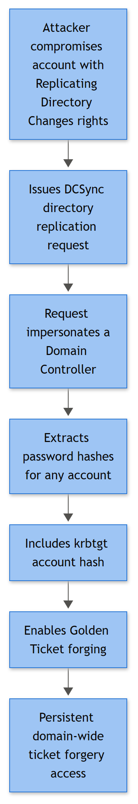

# DCSync (Domain Replication Credential Theft)

## Playbook ID & Name

**IAM-020 — DCSync (Domain Replication Credential Theft)**

## Business Risk

**[STAKEHOLDER]** - DCSync lets an attacker who holds — or has stolen — Active Directory replication rights ask a real domain controller to hand over password material for any account in the directory, including `krbtgt`, by impersonating another domain controller over the same protocol DCs use to talk to each other. There's no malware involved and no vulnerability exploited: Active Directory is doing exactly what it's built to do for a domain controller, requested from a laptop that isn't one. The blast radius is the whole credential database in one request, not one account, which is why this gets treated as domain-compromise-tier the moment it's corroborated. Sit on it and the attacker doesn't just have a password — they have the means to forge Kerberos tickets for anyone, crack every NTLM hash offline at their own pace, and walk back in later even after the one account you noticed gets reset. In practice DCSync is usually step one and a forged ticket is step two; catching it here is catching the attack before it becomes unrecoverable without a `krbtgt` rotation.

## Severity/Priority Default

**Critical (P1)** on any corroborated indicator — confirmed replication-style RPC activity from a non-DC host, confirmed DCSync tooling execution, or an account holding delegated replication rights that no one on the AD team can account for. This is not a "watch and reassess next shift" finding.

## MITRE ATT&CK Technique(s)

- **T1003.006** — OS Credential Dumping: DCSync (primary)
- **T1078.002** — Valid Accounts: Domain Accounts (the requesting principal needs to look "valid" to the DC — either genuinely privileged or holding delegated rights it shouldn't)
- **T1550.002** — Use Alternate Authentication Material: Pass the Hash (the near-term follow-on once NTLM hashes are exfiltrated)
- **T1558.001** — Steal or Forge Kerberos Tickets: Golden Ticket (the classic downstream move once the `krbtgt` hash specifically is captured — see that playbook for the forged-ticket side of this story)
- **T1207** — Rogue Domain Controller (DCShadow) — the sibling technique; DCSync *reads* via the replication channel, DCShadow *writes* via it, and both depend on the exact same underlying permission set

## Trigger / Detection Logic Summary

DCSync abuses MS-DRSR (the directory replication RPC interface) — specifically the `GetNCChanges` call a real DC issues to pull updates from a replication partner. Any principal holding **Replicating Directory Changes** and **Replicating Directory Changes All** on the domain object can issue that same call, and the target DC answers it, because from the DC's point of view it's just talking to a replication partner — it has no native way to ask "are you actually a domain controller?" beyond checking that permission. Built-in DCs hold this by default; so, deliberately, do a handful of things that are *not* DCs — Azure AD Connect/Entra Connect's sync account is the big one, and some backup, identity-governance, and PAM tools hold a scoped version of it too. That legitimate population is the founding false-positive risk for this entire playbook, and you should have it documented before your first DCSync alert ever fires, not while triaging one.

Same caveat as this book's DCShadow entry: within the Windows Security Event ID set this book works from, there is no single clean "DCSync happened" event. The `GetNCChanges` call itself isn't represented anywhere in the supplied Event ID list — the native way to catch it directly is directory-service-access auditing with a SACL scoped to the two replication extended rights on the domain object, and that event sits outside this book's ground-truth ID set. So detection here runs on the same three-layer correlation model as DCShadow, mirrored for the read side of the same abuse:

1. **Carrier authentication** — the RPC session the replication call rides on has to authenticate first: a non-DC-looking account establishing a session to a domain controller (4624 Logon Type 3, plus 4672 if the token is privileged, or 4776 if the leg was NTLM — common with pass-the-hash-fed DCSync runs).
2. **Tooling evidence** — `mimikatz.exe lsadump::dcsync`, Impacket's `secretsdump.py` (from a Linux attack host hitting the DC over SMB/RPC, which frequently means no Windows process telemetry at all on the source side — a real and common gap), or PowerShell wrappers like DSInternals' `Get-ADReplAccount` (4688, 4103, 4104).
3. **Effect layer** — a subsequent Golden Ticket, widescale password cracking activity, or unexplained access by an account that should never have authenticated interactively confirms the credential theft actually paid off; absence of a documented replication-partner justification for the session in layer 1 is the core negative-evidence tell.



*Figure F019 - a compromised account abusing replication rights to pull password hashes.*

**[ENGINEERING]** - Treat the table below as the AD-audit-log slice of this attack, not a complete detection story. The higher-fidelity native signal — directory-service-access auditing on the domain object scoped to the replication extended-right GUIDs — is outside this book's supplied Event ID list; if your environment has it enabled (it's expensive in volume against a busy domain object, which is exactly why many environments never turn it on), treat a hit from a non-allowlisted source as the single strongest signal available and everything here as supporting context. Microsoft Defender for Identity, a SACL-based DS-object auditing pipeline, or a network capture on DC-facing RPC/SMB ports watching for `DRSUAPI` interface calls from unexpected sources are all first-class detection sources for this scenario — wire one of them in if you have it rather than relying on the correlation below alone.

## Required Log Sources & Event IDs

| Source | Event ID(s) | Purpose |
|---|---|---|
| Domain Controller Security log (all DCs, not just the alerting one) | **4624**, **4672** | Privileged/anomalous network logon (Type 3) to a DC from a source outside the known-DC and known-replication-partner inventory — the session the DRSUAPI call travels inside |
| Domain Controller Security log | **4776** | NTLM credential validation on the DC itself, e.g. pass-the-hash-fed access — Source Workstation shows the real originating host |
| Domain Controller Security log | **4648** | Explicit alternate-credential use (RunAs, PsExec-style) against a DC before issuing replication calls |
| Domain Controller Security log | **4768**, **4769** | Kerberos ticket activity for the account used, if Kerberos rather than NTLM carried the session; unusual Client Address or a workstation requesting a ticket for a DC's own service is corroborating |
| Domain Controller Security log | **4738**, **4728/4729**, **4732/4733** | Baseline of legitimate replication-rights delegation changes — check whether the account in question was *recently and quietly* granted `Replicating Directory Changes All` via group nesting, which is a common privilege-escalation path into DCSync |
| Domain Controller Security log | **1102** | Anti-forensics — log clearing on the DC after the replication pull, to remove evidence of the carrier session |
| Domain Controller Security log | **4719** | Audit-policy weakening shortly before the event window |
| Source/staging host Security log | **4688** | Process creation for `mimikatz.exe`, `secretsdump.py` (via `python.exe`), or similar, command line if auditing is enabled |
| Source/staging host PowerShell-Operational log | **4103**, **4104** | Script block/module logging catching `Invoke-Mimikatz`, DSInternals `Get-ADReplAccount`, or the literal string `dcsync` in any casing/encoding |

## Key Fields to Inspect

**[ANALYST]**

| Event | Field | What to look for |
|---|---|---|
| 4624 | Source Network Address, Logon Type, Authentication Package, Workstation Name | Type 3 logon to a DC from an IP outside your documented DC/replication-partner range; Workstation Name is frequently blank on RPC-style sessions, which is itself a mild tell worth noting, not proof on its own |
| 4624 / 4672 | New Logon Account Name, Privileges | Is this a genuine Domain/Enterprise Admin, the Azure AD Connect sync account (on the allowlist?), or an unfamiliar account holding delegated replication rights? |
| 4776 | Logon Account, Source Workstation, Error Code | Successful NTLM validation on a DC from a workstation that has no business talking to that DC directly |
| 4688 | New Process Name, Command Line, Creator Process Name | `mimikatz.exe` with `lsadump::dcsync`, `python.exe`/`python3` invoking `secretsdump.py`, or a signed LOLBin loading an unsigned module |
| 4103 / 4104 | Script Block Text | DSInternals `Get-ADReplAccount`, `Invoke-Mimikatz`, or obfuscated PowerShell decoding to replication cmdlets; capture the target account name being requested — `krbtgt` or `Administrator` in the argument is as good as a confession |
| 4728 / 4732 | Member Name, Group Name, Subject | Recent, undocumented additions to a group that itself (directly or via nesting) holds `Replicating Directory Changes All` — this is frequently the actual privilege-escalation step that made DCSync possible in the first place |
| 4738 | Changed Attributes | Direct ACL/permission changes on the domain object rather than group membership — a subtler path to the same rights |
| 1102 | Subject | Who cleared the log, where, and how close in time to the suspected replication window |

## Normal vs Suspicious Pattern

| Normal | Suspicious |
|---|---|
| Sessions authenticating to a DC with replication-flavored privileges come from other DCs, the documented Azure AD Connect/Entra Connect server, or an allowlisted backup/PAM service account | Same privilege class authenticating from a user workstation, a dev/test VM, or any host not on the replication-partner allowlist |
| Accounts holding `Replicating Directory Changes All` are a short, documented, reviewed list (built-in DCs, sync account, maybe one backup tool) | An account nobody on the AD team recognizes holds the right, or gained it recently through group nesting with no change ticket |
| 4103/4104 activity shows routine AD administration cmdlets (`Get-ADUser`, `Set-ADAccountPassword` on a helpdesk-approved reset) | Script block content referencing DSInternals replication cmdlets, Mimikatz, or the string `dcsync`/`secretsdump` in any form |
| 4688 on domain-joined hosts shows expected LOB and admin tooling | `mimikatz.exe`, unexpected `python.exe` with RPC/SMB libraries, or a renamed binary making outbound connections to DC ports 445/135/high RPC range from a non-admin workstation |
| 1102 is rare, scheduled, tied to a documented log-retention task | 1102 shortly after an unexplained privileged session to a DC, with no maintenance ticket |
| Group membership changes to replication-capable groups are infrequent and always tied to a change ticket | A quiet addition to a nested group that resolves to replication rights, discovered only when you trace the ACL back |

## Investigation Steps

1. Establish the anchor — did this come from EDR flagging `lsadump::dcsync`/`secretsdump.py`, from an unusual 4624/4672/4776 to a DC, or from someone in the AD team noticing an account holds rights it shouldn't? Work forward or backward from whichever fired first.
2. Pull 4624/4672/4776 across **every** DC for the suspect account and timeframe — replication and load balancing mean the session could have landed on any DC, not just the one that logged the alert. Check Source Network Address/Source Workstation against your documented DC and replication-partner inventory.
3. Confirm whether the account actually holds `Replicating Directory Changes` and `Replicating Directory Changes All`, and — critically — *how*: direct ACL grant, or inherited through a nested group. Trace back through 4728/4729/4732/4733/4738 to find when and by whom that right was granted, and whether there's a change ticket behind it.
4. On the suspect source host, pull 4688 (with command line if enabled) and 4103/4104 for the same window. Look for Mimikatz, `secretsdump.py` invocation via a Python interpreter, or DSInternals cmdlets — and capture which account names appear as arguments, since `krbtgt` in the target list changes the entire severity conversation.
5. If the source is non-Windows (Impacket-based tooling is commonly run from a Linux box or a compromised Windows host with no PowerShell footprint), accept that host-based Windows telemetry may be genuinely absent on that side — pivot to network evidence (firewall/NetFlow/Zeek for RPC/SMB sessions from that host to DC ports) and log the telemetry gap rather than closing on "no process evidence found."
6. Check 1102 across all DCs and the suspect host for the event window and the hours following — log clearing right after a replication pull is a common cleanup step.
7. Check 4719 in the days prior for DS Access or Account Management audit-policy weakening that would suppress the very events steps 3 and 6 depend on.
8. Scope impact: assume every account material was pulled for, not just the one that triggered the alert, is now compromised — start with `krbtgt`, Domain/Enterprise Admins, and any service account with broad reach, and check for early Golden Ticket or pass-the-hash indicators (see those playbooks) as confirmation the theft was actually exploited.

## True Positive Indicators

- Confirmed `lsadump::dcsync`, `secretsdump.py`, or DSInternals replication-cmdlet execution evidence (4688/4103/4104) from a host not on the replication-partner allowlist
- An account authenticating to a DC (4624 Type 3, or 4776 via NTLM) from a workstation, with recently and quietly granted `Replicating Directory Changes All` rights that no change ticket explains
- `krbtgt` or other Tier 0 account named explicitly in captured script block text or process command line as a replication target
- Subsequent confirmed Golden Ticket use, mass NTLM hash-cracking activity, or unexplained privileged access consistent with stolen credential material
- 1102 log clearing on a DC correlated in time with an unexplained privileged session

## False Positive / Benign Positive Indicators

- Azure AD Connect / Entra Connect sync account performing its documented, scheduled directory-sync replication pull — verify the source server matches the actual sync server and the timing matches the configured sync interval before treating as suspicious
- Known backup/DR, identity-governance, or PAM tooling (Semperis, Quest, Veeam AD-aware backup, certain SIEM/UEBA collectors) legitimately holding a scoped replication permission from a documented service account/host — confirm against your replication-rights allowlist, don't assume benign by product name alone
- Authorized red/purple team exercise specifically testing DCSync detection — check the engagement calendar before escalating
- Multi-DC search gap: the carrier logon or the rights-grant event landed on a DC outside your initial query scope, or clock skew misaligned the correlation window — re-run across all DCs with normalized time before calling this confirmed
- A newly stood-up, legitimate secondary DC or RODC still completing initial replication, which can superficially resemble an unfamiliar host pulling directory data — verify against the AD team's deployment record

## Stakeholder Communication

**[STAKEHOLDER]** - There is no Benign Positive holding pattern here the way there is for a lockout or a spray - by the time this playbook's Escalation Criteria are met, a call to leadership is mandatory (see Escalation Criteria and the "Full incident declaration" row below), not optional. What to say, in order:

- **What happened:** "An account not on our documented replication-partner list pulled directory replication data from a domain controller at [time], consistent with an attacker requesting password material for accounts across the domain, not just one."
- **The risk:** This isn't one compromised account - it's the credential database. The attacker may now be able to forge Kerberos tickets for anyone, crack every NTLM hash offline at their own pace, and regain access later even after the one account that was noticed gets reset.
- **The evidence:** The carrier account and source host, how that account came to hold replication rights (direct grant vs. quiet group nesting), and whether `krbtgt` specifically appeared as a target in captured tooling output or script block text.
- **The decision needed:** Whether to execute a `krbtgt` password reset (twice, with a replication gap) now, given the operational disruption that carries (it invalidates every outstanding Kerberos ticket in the domain, forcing widespread re-authentication).
- **GO (reset krbtgt now) vs. NO-GO (hold pending fuller scoping):** GO closes the attacker's highest-value path (forging tickets domain-wide) but causes a disruptive, domain-wide re-authentication event that itself needs a change window and user communication. NO-GO avoids that disruption in the moment but leaves a forgeable trust anchor live for as long as the attacker had — or still has — access to it. This is a CISO/IR Lead decision per the Containment table below, not an Tier 1 call, and the default assumption per this playbook is to treat `krbtgt` as compromised until proven otherwise.

## Escalation Criteria

Escalate immediately to Incident Response and CISO/security leadership on any of: confirmed DCSync tooling execution anywhere in the environment; an account outside the documented allowlist confirmed to hold or have recently gained `Replicating Directory Changes All`; or any indication `krbtgt` specifically was a target. Do not wait for confirmation that a Golden Ticket has actually been used — by the time that shows up, the attacker has had standing, hard-to-revoke access since the moment the replication pull succeeded.

## Containment Options & Approval Authority

**[MANAGEMENT]**

| Action | Approval Required | Notes |
|---|---|---|
| Isolate the source/staging host | SOC Lead / IR Lead | Standard EDR isolation once the source is confirmed; don't wait on full scope before cutting off the platform used to run the attack |
| Audit and strip unauthorized `Replicating Directory Changes` / `Replicating Directory Changes All` delegations domain-wide | AD/Identity Team Lead, under IR direction | Review every principal holding the right, not just the one implicated — this is the actual root-cause fix, not just the symptom |
| Disable/reset the account used to carry the replication session | AD/Identity Team Lead + IR Manager | Coordinate timing if it's a real privileged account with legitimate uses elsewhere |
| `krbtgt` password reset (twice, with replication gap) | CISO / IR Lead, coordinated with AD team | Mandatory once evidence suggests `krbtgt` specifically was targeted or pulled — treat as the default assumption until proven otherwise, given how cheap the attacker's next step (Golden Ticket) becomes otherwise |
| Force targeted password resets for other high-value accounts confirmed or suspected in the pull | AD/Identity Team Lead | Prioritize Tier 0 accounts and anything with broad service-account reach |
| Full incident declaration and executive notification | CISO | Mandatory once tooling or unauthorized replication rights are confirmed — board-level reportable in most governance frameworks given the scope of access implied |

Post-incident: mandate a recurring review of who holds replication rights outside the built-in DC computer accounts and the documented sync/backup service accounts (this delegation is the actual prerequisite for both DCSync and DCShadow), and confirm command-line auditing plus PowerShell script block logging are enabled domain-wide — this playbook's biggest recurring gap in practice is discovering mid-investigation that the source host had neither.

## Example Query (Microsoft Sentinel — KQL)

```kql
// NOTE: WorkstationName on 4624/4776 is normally the short NetBIOS computer name
// (e.g. "DC01"), not an FQDN - match your allowlist format accordingly, and verify
// against a few known-good replication sessions in your own environment first.
// 4672 carries no WorkstationName field at all, so it's deliberately left out of this
// query rather than included as a useless filter - once a suspect Logon ID is found via
// the 4624/4776 rows below, pull matching 4672 separately (on Computer + Logon ID) to
// confirm privilege level.
let KnownReplicationPartners = datatable(Host:string)
    ["DC01","DC02","AADCONNECT01"];
SecurityEvent
| where EventID in (4624, 4776) and Computer has "DC"
| where (EventID != 4624) or LogonType == 3
| where WorkstationName !in (KnownReplicationPartners) and isnotempty(WorkstationName)
| summarize Events = make_set(EventID), first = min(TimeGenerated)
    by Computer, IpAddress, WorkstationName, TargetUserName, bin(TimeGenerated, 15m)
```

This surfaces privileged/NTLM sessions to domain controllers from hosts outside the documented replication-partner list — a starting hunt list, not a standalone confirmation. `WorkstationName` is frequently blank on RPC-style sessions (noted under Key Fields above) - the `isnotempty` filter above keeps blank-workstation sessions out of this particular query so you don't chase an empty string as a "host," but a blank Workstation Name on a privileged session to a DC is itself worth a manual look, not something to silently drop; pull those rows separately. Always cross-check the resulting accounts against your actual `Replicating Directory Changes All` delegation inventory before escalating, and pull 4672 separately for any Logon ID this query surfaces to confirm privilege level.

## Closure Criteria

Close as **True Positive — Confirmed Compromise** only after the source host is contained, the carrier account is reset/reviewed, unauthorized replication-rights delegations are stripped and re-audited domain-wide, and a `krbtgt` reset decision has been explicitly made (executed or explicitly ruled out with documented reasoning). Close as **Benign Positive** when the session maps cleanly to a documented sync/backup service account on the allowlist, a legitimate new DC/RODC completing initial replication, or an authorized red team exercise. Close as **Insufficient Evidence** only after confirming the multi-DC search was actually complete with normalized timestamps and that the absence of host-based tooling evidence isn't simply an artifact of the source being non-Windows or lacking command-line/PowerShell logging — log any such telemetry gap as a follow-up hardening item rather than letting it silently justify the closure.

**Example case note:**
> 2026-09-15 — 4776 on dc03.example.com at 03:41 UTC, account svc-report validated via NTLM from source workstation 10.10.55.19 (WKSTN-FIN22), not a documented DC or replication partner. 4728 history shows svc-report added to grp-adreports on 2026-09-08 by helpdesk ticket HD-8823; grp-adreports found (via ACL trace) to hold `Replicating Directory Changes All` on the domain object since a 2024 migration, undocumented since. No 4688/4103/4104 available on WKSTN-FIN22 — host is non-domain-joined Linux running Impacket per NetFlow (RPC/SMB session to dc03 port 445, 03:40–03:42 UTC). No corresponding legitimate replication purpose identified. Escalated to IR as confirmed DCSync; WKSTN-FIN22 network-isolated at the switch, svc-report disabled, grp-adreports stripped of replication rights, krbtgt reset scheduled (first of two), domain-wide replication-rights audit opened as JIRA AD-2114. Telemetry gap (no host logging on source) logged as hardening follow-up. Closed True Positive — Confirmed Compromise.
