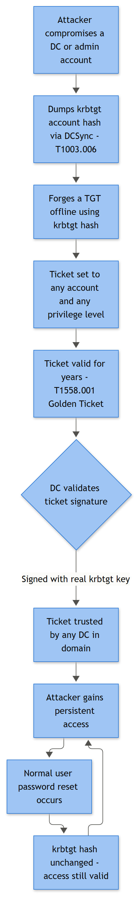

# Golden Ticket Indicators

**Category:** Identity & Active Directory — Kerberos & Advanced Attacks
**Playbook ID:** IAM-016

---

## Business Risk

**[STAKEHOLDER]** - A Golden Ticket means an attacker forged a domain-wide "master key" using a stolen KRBTGT account hash. Once in hand, it lets them impersonate any user — including Domain Admins — from any machine, for as long as they want, without touching a password. This is not a foothold, it's domain takeover. The only reliable fix is a KRBTGT password reset (done twice, with replication time between resets), which has real operational blast radius, so this playbook exists to get the decision to leadership fast and with evidence, not to argue about it after ransomware lands.

## Related Playbooks
See Windows Event ID Reference: 4769 for the ticket-request telemetry a Golden Ticket abuses. The KRBTGT hash behind a Golden Ticket is most commonly obtained via Playbook IAM-020 (DCSync) — check for it as a precursor. See Playbook IAM-017 (Silver Ticket) for the narrower, single-service variant of ticket forgery, and Playbook IAM-018 (Kerberoasting) for the credential-theft path that targets a service account's password rather than the KRBTGT.

## Severity / Priority Default

**Critical (P1)** on any corroborated indicator. This escalates immediately regardless of time of day — do not sit on it until the next shift.

## MITRE ATT&CK Techniques

- **T1558.001** — Steal or Forge Kerberos Tickets: Golden Ticket (primary)
- **T1558** — parent technique, general Kerberos ticket theft/forgery
- **T1550.003** — Use Alternate Authentication Material: Pass the Ticket (how the forged TGT is actually used)
- **T1003.001 / T1003.006** — OS Credential Dumping (LSASS Memory / DCSync) — typical precursor used to steal the KRBTGT hash in the first place; covered in its own playbook, referenced here as the usual root cause
- **T1078.002** — Valid Accounts: Domain Accounts — the impersonated identity looks "valid" to every downstream system

## Trigger / Detection Logic Summary

Golden Ticket attacks are forged offline — the attacker builds the TGT on their own box using the stolen KRBTGT hash and never actually asks a domain controller to issue it. That means the single most reliable structural tell is a **TGS request (4769) with no corresponding AS request (4768)** for that account/session on the DC that issued the service ticket, combined with one or more of:

- Kerberos ticket lifetime far outside domain policy (default AD max ticket lifetime is commonly 10 hours; the classic Mimikatz golden ticket default is 10 years unless the operator overrides it)
- Ticket Encryption Type of `0x17` (RC4) presented in an environment that enforces AES (`0x12`/`0x11`) — RC4 is Mimikatz's default unless `/aes` flags are supplied
- Service ticket activity for an account that is disabled, expired, or has since been deleted from AD, yet still authenticates successfully
- A single principal accessing many services/hosts across the domain in a tight time window with no matching interactive or network logon history to explain it
- Ticket use continuing after a KRBTGT password reset that should have invalidated it (a very strong retroactive confirmation once you've already rotated the hash)



*Figure F023 - forging unlimited access using the krbtgt hash.*

## Required Log Sources & Event IDs

| Source | Event IDs | Purpose |
|---|---|---|
| Domain Controller Security log | **4768** | Baseline of legitimate TGT issuance — used to prove absence for a given service-ticket request |
| Domain Controller Security log | **4769** | Service ticket requests — the primary hunting surface; check Ticket Encryption Type |
| Domain Controller Security log | **4771** | Pre-auth failures — helps rule out brute-force noise as the cause of an anomaly |
| Domain Controller / target host | **4624**, **4672** | Confirms the forged ticket was actually used to establish a session, and whether it carried privileged rights |
| Target host | **4648** | Explicit-credential logons if the attacker pivoted using alternate creds after landing |
| Domain Controller Security log | **1102** | Attackers sometimes clear logs after using a golden ticket to remove the evidence trail — treat as a related critical event |
| Domain Controller Security log | **4738** | Watch for SID History tampering on the impersonated account around the same window |

## Key Fields to Inspect

**[ANALYST]**

| Event | Field | What to look for |
|---|---|---|
| 4769 | Account Name | Does this account exist, is it enabled, does its normal behavior match this request? |
| 4769 | Service Name | What resource is being touched — file shares, LDAP, CIFS, a second DC? |
| 4769 | Ticket Encryption Type | `0x17` (RC4) in an AES-enforced domain is a red flag |
| 4769 | Client Address | Does this source IP match the account's normal workstation, or is it a jump box/attacker infra? |
| 4769 | Failure Code | `0x0` success is expected here — the anomaly is context, not failure |
| 4768 | Account Name / Client Address / Result Code | Absence of a matching 4768 for the session in question is the core signature |
| 4624 | Logon Type, Authentication Package, Logon ID | Confirm Kerberos was the auth package and trace the Logon ID forward to what the session actually did |
| 4672 | Privileges | Confirm whether the forged ticket carried Domain Admin-equivalent rights |
| 4738 | Changed Attributes | Look specifically for SID History additions — golden tickets are frequently paired with SID History injection to grant access without touching group membership events |

## Normal vs Suspicious Pattern

| Normal | Suspicious |
|---|---|
| Every 4769 has a preceding 4768 from the same DC within the ticket's lifetime | 4769 exists with no corresponding 4768 anywhere in DC logs for that window |
| Ticket lifetime matches domain Kerberos policy (commonly 10 hours, renewable up to 7 days) | Ticket active far beyond policy max, or still valid weeks/months later |
| Encryption Type is AES (`0x12`/`0x11`) domain-wide once modern policy is enforced | RC4 (`0x17`) service ticket in an AES-only environment |
| Account activity matches the account's normal role and hours | Disabled/deleted/service account suddenly authenticating interactively across many hosts |
| SID History empty for standard user/service accounts (rare legitimate migration exceptions) | New SID History entries appearing on accounts outside a known domain migration project |

## Investigation Steps

1. Pull the 4769 event(s) that triggered the alert and record Account Name, Service Name, Client Address, Ticket Encryption Type, and timestamp.
2. Search all DCs (not just the one that logged the 4769 — replication lag and load balancing mean the AS-REQ may have hit a different DC) for a matching 4768 for that account within the plausible ticket lifetime window. Absence across all DCs is the key finding.
3. Check the account's status in AD: enabled/disabled, last legitimate logon, group memberships, and SID History (4738 history) for unexplained changes.
4. Trace the Logon ID from any resulting 4624/4672 forward — what did the session actually do (file access, further 4769s to other services, new 4648 explicit-credential logons suggesting further lateral movement)?
5. Check whether this account or KRBTGT itself has recent 4771 failures nearby that might indicate a related brute-force or Kerberoasting attempt rather than a forged ticket — rule out the simpler explanation first.
6. Search for 1102 (audit log cleared) on the source DC and any DC touched by the suspicious ticket, in a window around the event — attackers sometimes clean up immediately after using a golden ticket.
7. Identify the real source: Client Address on the 4769/4624, and pivot to host-based telemetry (4688 process creation, 4103/4104 PowerShell logging) on that source to look for Mimikatz-style tooling or ticket-injection activity (`kerberos::ptt` equivalents).
8. If confirmed, immediately determine blast radius: what other accounts, hosts, and DCs did this Logon ID or related sessions touch, since golden tickets are almost always used for domain-wide lateral movement, not a single hop.

## True Positive Indicators

- 4769 with no matching 4768 anywhere in the domain for that account/session, confirmed after checking all DCs
- Ticket lifetime or continued use inconsistent with domain Kerberos policy, especially surviving past a KRBTGT rotation
- RC4 ticket encryption where the domain is documented as AES-enforced
- Disabled, deleted, or nonexistent account still authenticating successfully via Kerberos
- Unexplained SID History additions correlating with privileged access the account should not have
- Confirmed prior KRBTGT hash exposure (e.g., a DCSync event or LSASS dump on a DC in the preceding weeks)

## False Positive / Benign Positive Indicators

- Load-balanced DC environment where the 4768 legitimately landed on a DC outside your initial search scope — always re-check across all DCs before calling this confirmed
- Legacy application or appliance still configured for RC4 due to unpatched Kerberos libraries (common with older NAS, printers, or line-of-business software) — verify against a known inventory of RC4-dependent systems before treating encryption type alone as proof
- Clock skew or replication delay between DCs producing an apparent timing mismatch between AS-REQ and TGS-REQ that resolves once you check the correct DC's log with correct time normalization
- Genuine SID History from a documented, in-flight domain migration project — confirm against the change record before treating as tampering
- Ticket renewal behavior (renew-until) misread as "lifetime violation" — confirm actual domain Kerberos policy settings (`maxticketage`, `maxrenewage`) before flagging

## Escalation Criteria

Escalate to Incident Response lead and CISO/security leadership immediately on any corroborated indicator (missing 4768, confirmed policy-violating ticket lifetime, or confirmed prior KRBTGT/LSASS compromise). Do not wait for "more evidence" once absence-of-4768 is confirmed across all DCs — this is a domain-compromise scenario by definition, and time spent waiting is time the attacker has standing access.

## Containment Options & Approval Authority

**[MANAGEMENT]**

| Action | Approval Required | Notes |
|---|---|---|
| KRBTGT password reset (first of two, twice with replication gap) | CISO / IR lead, coordinated with AD team | Invalidates all outstanding Kerberos tickets domain-wide — plan for a service disruption window and communicate to the business before executing |
| Second KRBTGT reset after replication settles | CISO / IR lead | Required — a single reset alone is not sufficient; attacker can re-derive from the old hash cached elsewhere until the second reset lands |
| Disable/reset the impersonated account(s) | IR lead | Buys time but does not stop the attack — the KRBTGT compromise is the actual root cause |
| Isolate identified source host(s) | IR lead, with IT Ops | Standard containment for the attacker's staging box once Client Address is confirmed |
| Force logoff of all active sessions post-KRBTGT reset | AD team, under IR direction | Confirms invalidation actually took hold domain-wide |
| Full incident declaration and executive notification | CISO | Mandatory once Golden Ticket use is confirmed — this is a board-level reportable event in most governance frameworks given the scope of access implied |

Post-incident: mandate a review of KRBTGT rotation cadence (many environments never rotate it — this should become a recurring calendar item, not a one-time reset), and confirm DCSync permissions and LSASS protections (Credential Guard, Protected Process Light) are in place to close the original theft vector.

## Example Query (Splunk SPL)

```spl
index=wineventlog EventCode=4769
| eval enc=case(Ticket_Encryption_Type=="0x17","RC4","AES")
| stats count min(_time) as first_tgs by Account_Name, Service_Name, Client_Address, enc
| join type=left Account_Name
    [ search index=wineventlog EventCode=4768
      | stats count as tgt_count by Account_Name ]
| where isnull(tgt_count) OR tgt_count=0
| where enc="RC4"
| table Account_Name, Service_Name, Client_Address, enc, first_tgs
```

This surfaces service-ticket accounts that never generated a matching AS-REQ in the same index window — treat as a starting hunt list, not an auto-confirmed verdict, and always re-run against every DC's log before drawing conclusions.

## Closure Criteria

Close as **True Positive — Confirmed Compromise** only after KRBTGT has been reset (twice) and session invalidation confirmed; close as **Benign Positive** where the RC4/missing-4768 pattern is fully explained by a documented legacy system or multi-DC search gap; close as **Insufficient Evidence** only after confirming the search covered every DC's Security log and time was normalized — do not close this category on partial log coverage.

**Example case note:**
> 2026-09-15 — Investigated 4769 for svc-backup@example.com requesting cifs/fs01.example.com from 10.10.4.77, encryption RC4. No matching 4768 found on any of the four DCs (dc01–dc04) within a 24h window. Account is a disabled service account, last legitimate use 2026-06-02. Confirmed prior LSASS access alert on dc02 on 2026-09-10 (ref INC-4471). Escalated to IR lead as confirmed Golden Ticket use — KRBTGT reset scheduled, incident declared.
