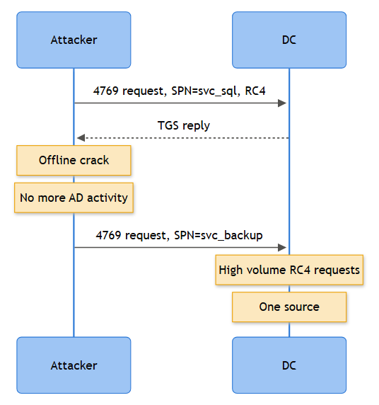

# Playbook: Kerberoasting Detection & Response

## Playbook ID & Name
**IAM-018 — Kerberoasting (Service Ticket Extraction for Offline Cracking)**

## Business Risk
**[STAKEHOLDER]** - Kerberoasting lets any authenticated domain user — no admin rights needed — request service tickets for accounts with a Service Principal Name and try to crack the ticket's encrypted portion offline, potentially recovering a plaintext service account password. Those accounts often run SQL Server, IIS app pools, backup agents, or scheduled jobs with broad rights across the estate. A cracked service account password is frequently the pivot point from "one user account phished" to "domain admin by Friday." This is one of the highest ROI attacks for an intruder because it requires no exploit, no malware on disk, and no elevated privilege to launch — it hides inside a completely legal Kerberos request.

## Severity/Priority Default
**High** on confirmed RC4 service-ticket requests against privileged/legacy SPNs; **Medium** for isolated single-account requests pending validation; escalate to **Critical** if followed by a successful logon (4624/4672) using the roasted account from an unfamiliar host.

## MITRE ATT&CK Technique(s)
- T1558.003 — Steal or Forge Kerberos Tickets: Kerberoasting (primary)
- T1087 — Account Discovery (frequently precedes roasting via SPN enumeration, e.g., `setspn.exe`, PowerView, or LDAP queries against `servicePrincipalName`)
- T1078.002 — Valid Accounts: Domain Accounts (follow-on use of a cracked service account password)
- T1550.003 — Use Alternate Authentication Material: Pass the Ticket (if ticket itself, not the password, is reused before cracking completes)

## Related Playbooks
See Windows Event ID Reference: 4769 (`07d-windows-events-lockout-kerberos-ntlm.md`) for the full field breakdown behind the detection logic below. See Playbook IAM-016 for the related Golden Ticket pattern (forged TGT vs. this playbook's stolen/cracked service-account password) and IAM-017 for Silver Ticket (forged service ticket using a stolen service-account hash directly, skipping the offline-cracking step entirely).

## Trigger / Detection Logic Summary
Detection hinges on the encryption type field inside Kerberos service ticket requests. Legitimate, healthy AD environments with AES-enabled service accounts almost never request RC4 (0x17) tickets at volume — modern domain functional levels and Group Policy defaults push AES256. A burst of 4769 events from a single source, spanning multiple distinct SPNs, with `Ticket Encryption Type = 0x17`, is the classic Kerberoasting signature — this is what tools like Rubeus and Impacket's GetUserSPNs generate when they enumerate every SPN in the domain and request a ticket for each. A second, quieter pattern: a small number of requests but targeting high-value SPNs (MSSQLSvc, HTTP, WSMAN) tied to accounts with elevated group membership.



*Figure F017 - abnormal RC4 service-ticket volume leading to offline cracking.*

## Required Log Sources & Event IDs
| Source | Event ID(s) | Purpose |
|---|---|---|
| Domain Controller Security log | 4769 | Core signal — service ticket request, encryption type, target SPN |
| Domain Controller Security log | 4768 | TGT context — confirms the requesting account authenticated normally beforehand |
| Domain Controller Security log | 4771 | Pre-auth failures, useful if attacker also attempts AS-REP roasting in parallel |
| Endpoint (source host) | 4688 | Command line for `setspn.exe`, `Rubeus.exe`, `.ps1` invoking `Get-DomainUser -SPN` |
| PowerShell Operational | 4103/4104 | Script block capture for PowerView/Rubeus wrapped in PowerShell |
| Follow-on logon | 4624, 4672 | Confirms whether the cracked password was actually used to log on somewhere |

## Key Fields to Inspect
**[ANALYST]**
- **4769 — Account Name**: the requesting principal (attacker's own account, not the target service account)
- **4769 — Service Name**: the SPN being roasted — cluster these across a short window from one source
- **4769 — Ticket Encryption Type**: 0x17 (RC4) is the flag; 0x12 (AES256) is expected/benign in a hardened domain
- **4769 — Client Address**: source IP/host of the requester — watch for a workstation that has no business talking to that many SPNs
- **4769 — Failure Code**: 0x0 for success; a wall of successes across dozens of SPNs in seconds is the tell, not failures
- **4688 — Command Line** (if auditing enabled): `setspn -T corp -Q */*`, `Get-DomainUser -SPN`, `Invoke-Kerberoast`, `Rubeus.exe kerberoast`
- Timestamps across the burst — human-driven queries are irregular; tool-driven enumeration is machine-fast and evenly spaced

## Normal vs Suspicious Pattern
| Normal | Suspicious |
|---|---|
| A service or scheduled task requests a ticket for the one or two SPNs it actually talks to, AES256, spread naturally through the day | One account requesting tickets for 10+ distinct SPNs within a couple of minutes |
| Encryption type 0x12 (AES256) dominant | Encryption type 0x17 (RC4) appearing for accounts/domain that otherwise defaults to AES |
| Requesting account is a workstation, application, or the service's own machine account | Requesting account is a regular user or helpdesk account with no legitimate reason to touch that SPN |
| Client Address matches the app server that normally calls that service | Client Address is an unmanaged workstation, jump box, or unfamiliar subnet |

## Investigation Steps
1. Pivot on the 4769 burst — pull all events from the same `Account Name` and `Client Address` in the surrounding 15-minute window; count distinct `Service Name` values.
2. Check `Ticket Encryption Type` distribution for that account historically — run the same 4769 query for that `Account Name` over the trailing 30 days (`TimeGenerated > ago(30d)`, no SPN-count filter) and look at the encryption-type split. If it's almost entirely `0x12` (AES256) and suddenly a wall of `0x17` (RC4) appears in the alert window, that's a strong signal of tooling, not a client quirk. If the account has always requested RC4, treat that as a separate, lower-urgency hardening finding (see False Positive Indicators) rather than evidence of this specific incident.
3. Identify the requesting account's normal role (service account, human, app server) — a human help-desk account roasting 40 SPNs has no legitimate explanation.
4. Correlate `Client Address` back to endpoint telemetry — pull 4688/4104 for `setspn`, `Rubeus`, `GetUserSPNs.py`, `Invoke-Kerberoast`, or obfuscated PowerShell around the same timestamp.
5. Enumerate which SPNs were targeted and check whether any belong to accounts with `AdminSDHolder` membership, Domain Admins, or nested privileged groups — this drives your urgency.
6. Check for a preceding SPN-enumeration sweep (4769 low-and-slow reconnaissance, or LDAP query volume against `servicePrincipalName` if directory-service access auditing is enabled).
7. If a targeted account's password is later used, hunt for 4624/4672 from the roasted account on hosts it has never logged into before — this is your confirmation the crack worked.
8. Rotate scope decision: is this a pentest/red team exercise (check the calendar / engagement tracker before you panic), or unscheduled and real.

## True Positive Indicators
- Single source requesting many distinct SPNs in a tight window, RC4 encryption type, no legitimate automation reason
- Requesting account is a standard user, not a service/machine account
- Endpoint evidence of Rubeus, Impacket, PowerView, or `setspn.exe -Q */*` on the source host
- Subsequent successful logon from the targeted service account on an unusual host or at an unusual time

## False Positive / Benign Positive Indicators
- Legitimate vulnerability scanner or AD health-check tool configured to enumerate SPNs (should be documented and allow-listed by source IP)
- Approved penetration test / red team engagement with signed rules of engagement covering the window
- A legacy application server genuinely calling many SPNs at startup (rare, but check against known app inventory before dismissing)
- RC4 usage explained by a genuinely legacy service account that has never had AES enabled — annoying, but not itself malicious; flag for remediation separately

## Escalation Criteria
Escalate to Tier 2/IR immediately if: the targeted SPN belongs to a privileged account (Domain Admins, Enterprise Admins, Tier 0 service accounts); if a follow-on logon (4624/4672) using the roasted account appears from an unfamiliar host; or if endpoint tooling (Rubeus/Impacket) is confirmed on the source workstation. Treat as an active credential-theft incident, not a hygiene finding, once any of those conditions are met.

## Stakeholder Communication

**[STAKEHOLDER]** - Reserve this for once the case clears Escalation Criteria (privileged SPN, follow-on logon, or confirmed attacker tooling) - a documented scanner or pentest window closes without ever reaching a stakeholder. When it does escalate, cover:

- **What happened:** "[Account] requested service tickets for [N] distinct services in [window] using outdated encryption, consistent with an offline password-cracking attempt against [service account(s)]."
- **The risk:** The targeted service account's password may already be recoverable offline, off-network, with no further logging generated until it's used - a cracked service account is frequently the pivot from one compromised user to domain admin.
- **The evidence:** The SPN list targeted, confirmation the requesting account has no legitimate reason to touch those services, and whether a follow-on logon (4624/4672) from the targeted service account has appeared on an unfamiliar host.
- **The decision needed:** Whether to rotate the targeted service account's password now versus wait for a change window, given the account may underpin a production service (SQL, IIS).
- **GO (rotate now) vs. NO-GO (wait for a change window):** GO closes the exposure immediately but risks an outage if the application wasn't warned or doesn't handle a mid-session credential change gracefully. NO-GO avoids that outage risk but leaves a potentially-cracked password valid until the window opens - the service/business owner needs to make this call, not the SOC alone, and it needs to happen inside the SLA in the Containment table below.

## Containment Options & Approval Authority
**[MANAGEMENT]**
- **Immediate (Analyst/Tier 2, no approval needed)**: Isolate the source workstation from the network if endpoint tooling is confirmed; disable network logon for the source account pending review.
- **Password reset on targeted service account(s)** — requires Identity/AD team approval and a change window if the account underpins production services (SQL, IIS); coordinate timing to avoid an outage.
- **Force AES-only Kerberos encryption / disable RC4 domain-wide** — architectural change, requires AD Engineering + Change Advisory Board sign-off; test against legacy app compatibility first.
- **Managed Service Account (gMSA) migration** for the affected SPN — medium-term remediation, owned by Identity Engineering, tracked as a project not an incident action.
- SLA: containment decision on privileged-account roasting within 1 hour of confirmed detection; password rotation completed within 4 hours for Tier 0/1 accounts.

## Example Query (Microsoft Sentinel — KQL)
```kql
SecurityEvent
| where EventID == 4769 and TicketEncryptionType == "0x17"
| where TargetUserName !endswith "$"
| summarize SPNCount = dcount(ServiceName), SPNs = make_set(ServiceName)
    by Account, IpAddress, bin(TimeGenerated, 5m)
| where SPNCount >= 5
| order by SPNCount desc
```

## Closure Criteria
Close as **True Positive - Contained** once the requesting host is isolated/remediated, targeted service account password(s) rotated (or migrated to gMSA), and no follow-on logon from the roasted credential is observed in a 24-hour watch period. Close as **Benign Positive** when the burst maps to a documented scanner, health-check tool, or approved pentest with matching source IP and engagement window. Close as **Insufficient Evidence** when command-line auditing wasn't enabled and endpoint corroboration is unavailable, but note the RC4 SPN exposure as a standing hardening finding regardless of verdict.

**Example case note:** *"4769 burst from WKST-042 (10.20.30.15) acct jsmith requested tickets for 14 distinct SPNs in 90 seconds, all RC4 (0x17), including MSSQLSvc/sqlprod01.corp.example.com. 4104 confirms Invoke-Kerberoast execution at 14:02:07. No follow-on logon observed from svc-sql-prod within 24h watch. Endpoint isolated, svc-sql-prod password rotated 14:47, migration to gMSA opened as JIRA AD-1187. Closed True Positive - Contained."*
