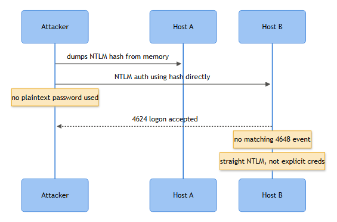

# Pass the Hash

**Playbook ID:** IAM-022 — Pass the Hash (NTLM Credential Replay / Lateral Movement)

**Business Risk**
**[STAKEHOLDER]** - An attacker who has stolen a password's NTLM hash from one machine can authenticate as that user everywhere the hash is accepted, without ever knowing the plaintext password. If the stolen hash belongs to a helpdesk or server admin account, one compromised laptop can turn into domain-wide access within minutes. This is the single fastest way a contained malware infection becomes a full domain compromise, which is why it gets escalated fast and closed carefully rather than closed quickly.

**Severity/Priority default:** High (Sev 2) on first confirmed detection; escalate to Critical (Sev 1) if the account is Tier 0/Domain Admin or a domain controller is a target.

**Related Playbooks:** the hash usually comes from somewhere — see Playbook EP-020 (Credential Dumping / LSASS Access / Mimikatz Indicators) for the typical precursor. See Playbook IAM-023 (Pass the Ticket) for the Kerberos-ticket equivalent of this technique.

**MITRE ATT&CK Techniques**
- T1550.002 Use Alternate Authentication Material: Pass the Hash (primary)
- T1003.001 OS Credential Dumping: LSASS Memory (typical precursor — where the hash was lifted)
- T1078.002 Valid Accounts: Domain Accounts (the identity being ridden)
- T1021.002 Remote Services: SMB/Windows Admin Shares (common lateral-movement vector once the hash is replayed)
- T1543.003 Create or Modify System Process: Windows Service (psexec-style follow-on execution)

## Trigger / Detection Logic Summary

**[ENGINEERING]** Core logic: flag a successful network logon (4624, Logon Type 3) where the Authentication Package is NTLM, for an account that should be capable of Kerberos (domain-joined source and destination, DC reachable), especially where no corresponding 4768/4769 Kerberos ticket activity exists for that account in the surrounding window. Weight it higher when the same account authenticates via NTLM to multiple distinct destination hosts within a short window (fan-out) — a human cannot type credentials into six RDP or SMB sessions in ninety seconds, but a script replaying a captured hash can. Also weight higher when the source workstation shows no preceding interactive logon (Type 2/10) for that account, meaning the "logon" didn't originate from someone sitting at that keyboard.

NTLM fallback by itself is not proof of attack — it's extremely common in real environments (legacy apps, NAS appliances, IP-literal connections). The signature you're actually hunting is NTLM + privileged account + unfamiliar destination + no interactive session behind it + speed.



*Figure F021 - reusing an NTLM hash directly without cracking it.*

## Required Log Sources & Event IDs

| Source | Event IDs | Purpose |
|---|---|---|
| Destination host(s) Security log | 4624, 4672, 4634/4647 | The replayed logon itself, privilege level, session duration |
| Source (origin) host Security log | 4624, 4648, 4688 | Was there a real interactive session, or a dumping tool spawned |
| Domain Controller Security log | 4768, 4769, 4771, 4776 | Absence/presence of Kerberos activity for correlation |
| Destination host Security/System log | 4697 / 7045, 4698 | Service or scheduled task created post-logon (psexec/PsExec-style execution) |
| PowerShell Operational log | 4103, 4104 | Mimikatz-style or hash-replay tooling invoked via PowerShell |
| Security log (any touched host) | 1102 | Anti-forensics cleanup after the fact |

## Key Fields to Inspect

**[ANALYST]**
- **4624** — Logon Type (expect 3, occasionally 9 for `runas /netonly`-style tooling), Authentication Package (NTLM, not Kerberos), New Logon Account Name/Domain/SID, Logon ID, Workstation Name, Source Network Address/Port.
- **4672** — fires alongside 4624 if the replayed token carries admin-equivalent rights; confirms the attacker landed with privilege, not just a plain user session.
- **4648** — check the *source* host for explicit-credential logons around the same time; genuine RunAs activity produces this, silent hash injection tools usually don't.
- **4688** — Command Line (if auditing enabled) and Creator Process Name on the source host; look for dumping/replay tool signatures (mimikatz.exe, procdump.exe -ma lsass.exe) or unusual parent processes spawning cmd.exe/powershell.exe.
- **4768/4769** — presence or absence for the same account/timeframe at the DC; a privileged account that's active on the network but has zero Kerberos ticket activity is the tell.
- **4697/7045** — Service Name and Service File Name; PSEXESVC or a randomly named service dropped right after the suspicious logon is a classic psexec/Impacket footprint.

## Normal vs Suspicious Pattern

| Signal | Normal | Suspicious |
|---|---|---|
| Auth package on 4624 | Kerberos, for domain-joined host-to-host access | NTLM, where Kerberos was fully available |
| Source session | Preceding interactive 4624 (Type 2/10) or documented RunAs (4648) for the same account | No interactive session on the source host at all |
| Destination fan-out | One account, one or two hosts, spread over a normal workday | One account, 5+ distinct hosts, inside a 2–5 minute window |
| Post-logon activity | Nothing, or expected app behavior | New service (4697/7045) or scheduled task (4698) created within seconds of logon |
| Account type | Service account with a documented NTLM dependency | Human/admin account suddenly behaving like a service account |

## Investigation Steps

1. Pull the destination 4624 event in full. Record Logon ID, Logon Type, Authentication Package, Source Network Address/Port, and the account name — this is your anchor for every subsequent pivot.
2. Query the DC for 4768/4769/4771 for that account across the same window. No Kerberos activity at all, for an account capable of Kerberos, is the strongest single indicator you have.
3. Go to the source workstation named in Source Network Address. Look for a preceding interactive 4624 (Type 2/10) or a legitimate 4648 explicit-credential logon matching this account and time. If there's nothing there, the credential material almost certainly didn't originate from a live human session on that box.
4. On the source workstation, review 4688 process creation (command line if available) and 4103/4104 PowerShell logs for dumping or replay tooling — mimikatz `sekurlsa::pth`, Impacket wrapper scripts, procdump against lsass.exe. Note: this Security-log-only playbook has no native visibility into LSASS memory access itself (that requires Sysmon/EDR telemetry, outside this scope) — flag that gap explicitly in the case notes rather than assuming absence of evidence means absence of activity.
5. On the destination host, check 4672 to confirm privilege level of the session, then 4697/7045 and 4698 for anything created immediately after logon — PSEXESVC-style services or scheduled tasks are the usual next move.
6. Search across the estate for the same account authenticating via NTLM (Type 3) to other hosts in the same window. Fan-out to multiple destinations in a tight timeframe is the fingerprint of an automated hash-replay tool, not a person.
7. Trace what happened after landing — 4688 process chains, further 4648 hops to a third host (chained pass-the-hash), file or share access — to size the blast radius.
8. Check every touched host for 1102 (log cleared). If present, treat this as confirmed intrusion regardless of anything else found, and hand to IR immediately.

## True Positive Indicators
- NTLM 4624 (Type 3) for a privileged account to a host it has no business or history touching, no interactive session behind it.
- Fan-out: same account, multiple destination hosts, within minutes, all via NTLM.
- Mimikatz/Impacket artifacts in 4688 command line or 4104 script block text on the source host.
- PSEXESVC-style service (4697/7045) or new scheduled task (4698) appearing seconds after the logon.
- Zero corresponding 4768/4769 for the account despite active network authentication.

## False Positive / Benign Positive Indicators
- Account is a documented service account (backup agent, SQL linked server, print server, monitoring tool) with a known, long-standing NTLM dependency — check the service account inventory before escalating.
- Authenticated vulnerability scanner (Nessus/Qualys/Rapid7) running its normal cycle — this produces an almost identical fan-out signature (one account, many hosts, short window, often NTLM) and is one of the most common benign-positive triggers for this exact detection. Verify against the scan schedule before treating it as an incident.
- Access via IP address rather than hostname, or cross-forest without a functioning trust — both force NTLM fallback by design, not attack behavior.
- Legacy application or NAS appliance that has never supported Kerberos.
- Documented, ticketed `runas /netonly` usage by an admin for a legitimate cross-domain task.

## Stakeholder Communication

**[STAKEHOLDER]** - Applies once this clears Escalation Criteria below — a documented scanner or known service-account NTLM dependency closes without a stakeholder call. When it escalates:

- **What happened:** "[Account]'s Windows credential material was reused to log on to [N] systems it does not normally access, within [window], without a matching interactive session or Kerberos ticket to explain it."
- **The risk:** The attacker doesn't have the password, but doesn't need it — they can keep authenticating as this account anywhere the hash is accepted until the password itself is changed. If the account is a helpdesk or server-admin identity, this is the fast path from one infected laptop to domain-wide access.
- **The evidence:** The account and destination host list, whether a credential-dumping tool (Mimikatz/procdump) was found on the source host, and whether any destination shows a new service or scheduled task created right after the logon — that last point indicates the attacker already took a next step, not just landed.
- **The decision needed:** Whether to force a password reset and kill sessions immediately, versus coordinating the reset with the application owner first if the account underpins a production service.
- **GO (reset and kill sessions now) vs. NO-GO (coordinate with the app owner first):** GO cuts off the attacker's access within minutes — the hash becomes worthless the moment the password changes — but can break a dependent application that isn't ready for a mid-cycle credential change. NO-GO avoids that outage but leaves the account usable by the attacker for as long as the coordination takes. For a standard user account this is a same-shift SOC-lead call per the Containment table below; for a privileged/service account it needs Identity/IAM sign-off precisely because that trade-off is real.

## Escalation Criteria
Escalate to IR immediately if: the account is Tier 0 (Domain Admin, Enterprise Admin, or a service account with DA-equivalent rights); a domain controller appears as a destination host; 1102 is found on any touched system; the fan-out spans more than roughly 3–5 hosts; or credential-dumping tool artifacts are confirmed on the source host. Any one of these moves it out of Tier 1 SOC handling and into the incident response process for this book's containment/eradication chapter.

## Containment Options & Approval Authority

**[MANAGEMENT]** Resetting the account's password is the actual fix here — unlike a stolen Kerberos ticket, an NTLM hash is derived directly from the password, so a password change invalidates it immediately. For a standard user account, the on-call SOC lead can authorize a forced reset and session kill without further approval. For a privileged/service account, require sign-off from the IAM or Identity team lead given the risk of breaking a dependent application, and coordinate the reset with the application owner. Network isolation of the source and destination endpoints can be actioned by IR/SOC directly for standard workstations and servers; isolating a domain controller or a production system in a critical business segment requires Change Advisory Board or IR-manager sign-off first, given the operational blast radius of getting it wrong.

## Example Query (Splunk SPL)

```spl
index=wineventlog EventCode=4624 Logon_Type=3 Authentication_Package=NTLM
| bucket _time span=5m
| stats dc(Computer) as dest_count values(Computer) as dest_list by _time, Account_Name
| where dest_count >= 4
| sort - dest_count
```

`Computer` here is the destination host — each 4624 is logged on the machine being logged onto, so the DC/server/workstation that generated the event *is* the destination in the fan-out count. If your source uses a CIM-normalized Authentication data model instead of raw `wineventlog` fields, substitute `dest` for `Computer` consistently, but don't mix the two — this query intentionally matches the raw-field convention used elsewhere in this book (see Account Lockouts, Repeated Login Failures, Brute Force) rather than assuming CIM normalization is in place.

## Closure Criteria
Close as **True Positive — Confirmed Intrusion** only once the source of the hash theft, the full set of destination hosts touched, and any persistence created (service/task) are all identified and remediated (password reset, session termination, host reimage if the source box shows dumping-tool execution). Close as **Benign Positive** when the NTLM fan-out is attributed to a known scanner or documented service account with evidence to support it. Close as **Insufficient Evidence** if command-line auditing wasn't enabled and no PowerShell logs exist to confirm or rule out tooling on the source host — note the visibility gap for the engineering backlog rather than guessing.

**Example case-note line:**
> 2026-09-15 14:22 UTC — Confirmed Pass the Hash: svc-helpdesk NTLM logon (4624, Type 3) from WKSTN-FIN22 (10.20.4.51) to SRV-APP03 and SRV-APP07 within 90 seconds, no 4768/4769 for account in DC log; source host shows procdump.exe against lsass.exe at 14:19 (4688), no interactive 4624 preceding. PSEXESVC created on SRV-APP03 (7045) at 14:23. Escalated to IR, password reset executed, WKSTN-FIN22 isolated pending forensic imaging.
