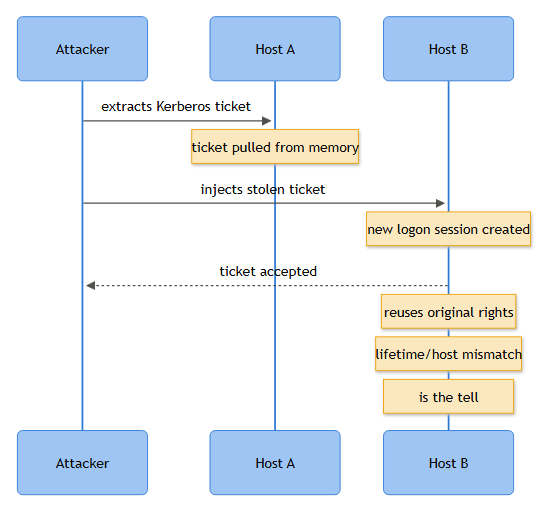

# Playbook: Pass the Ticket

## Playbook ID & Name

**IAM-023 — Pass the Ticket (Kerberos Ticket Theft & Reuse)**

## Business Risk

**[STAKEHOLDER]** - An attacker who successfully steals and replays a Kerberos ticket can move across the network as a trusted employee or admin without ever knowing that person's password. This bypasses password rotation, MFA prompts on subsequent hops, and most "did they log in from a weird place" alerting - which is exactly why it shows up in almost every serious domain compromise timeline once an attacker has a foothold. The business impact is usually lateral movement toward finance, backup infrastructure, or domain controllers, not the initial host.

## Severity/Priority default

**High.** Escalates to **Critical** if the reused ticket belongs to a Domain Admin, Enterprise Admin, or a service account with DCSync-equivalent rights, or if the target of the replayed ticket is a domain controller.

## MITRE ATT&CK Technique(s)

- **T1550.003** - Use Alternate Authentication Material: Pass the Ticket (primary)
- **T1003.001** - OS Credential Dumping: LSASS Memory (usual precursor - this is how the ticket got extracted in the first place)
- **T1021.002** - Remote Services: SMB/Windows Admin Shares (common follow-on once the stolen ticket is used to reach a second host)
- **T1078.002** - Valid Accounts: Domain Accounts (the identity being impersonated)

## Trigger / Detection Logic Summary

Pass the Ticket is *not* ticket forgery - the ticket was legitimately issued by a real KDC to a real account. What makes it detectable is the **mismatch between where the ticket was issued and where it gets used**. A TGT requested (4768) on the victim's actual workstation gets exported from LSASS (Mimikatz `sekurlsa::tickets /export`, Rubeus `dump`), then injected into a logon session on a second host (Mimikatz `kerberos::ptt`, Rubeus `ptt` or `createnetonly /ptt`). The result: service ticket requests (4769) for that account start arriving from a source address that never issued the matching 4768, or the same Logon ID / ticket set appears active on two hosts simultaneously.

Detection logic centers on correlating 4768/4769 client address with the account's normal issuing host, plus watching for Logon Type 9 (NewCredentials, the Rubeus `createnetonly` sacrificial-process pattern) immediately followed by a burst of 4769 requests to multiple SPNs - a strong lateral-movement staging signal.



*Figure F022 - extracting and replaying a Kerberos ticket on another host.*

## Required Log Sources & Event IDs

| Source | Event IDs | Purpose |
|---|---|---|
| Security log (Domain Controllers) | 4768, 4769, 4771 | TGT/service ticket issuance and pre-auth failures - the source of truth for "who requested what, from where" |
| Security log (Domain Controllers) | 4624, 4634, 4647 | Logon/logoff correlation, Authentication Package = Kerberos |
| Security log (workstation/server, target of lateral move) | 4624, 4672 | Confirms the impersonated session landed and whether it carried privileged rights |
| Security log (source host, e.g. attacker-controlled box) | 4688 | Process creation for Mimikatz, Rubeus, or renamed equivalents; also captures `createnetonly` sacrificial process spawn |
| Security log | 4648 | Explicit-credential logon if the operator wraps the injected ticket with runas/netonly semantics |
| Microsoft-Windows-PowerShell/Operational | 4103, 4104 | PowerShell-based ticket handling (Invoke-Mimikatz, PowerSploit Kerberos modules, custom loaders) |
| Security log | 1102 | Check for log clearing if the intrusion is further along - Pass the Ticket operators sometimes wipe the DC or jump host logs after lateral movement |

## Key Fields to Inspect [ANALYST]

- **4768**: Account Name, Client Address, Pre-Authentication Type, Result Code - this is your baseline for "where did this account's TGT actually get minted."
- **4769**: Account Name, Service Name, Client Address, Ticket Encryption Type, Failure Code - compare Client Address here against the 4768 baseline for the same account/time window.
- **4624**: Logon ID, Authentication Package (should read Kerberos, not NTLM), Logon Type, Workstation Name, Source Network Address.
- **4672**: fires alongside 4624 if the replayed ticket carries admin-equivalent privileges - treat any 4672 tied to an unexplained 4624 as a priority lead.
- **4688**: Command Line (if auditing enabled) for `mimikatz`, `rubeus`, `.ticket`, `ptt`, `/nowrap`, `createnetonly` strings, or renamed binaries with matching hash/behavior.

## Normal vs Suspicious Pattern

| Normal | Suspicious |
|---|---|
| 4768 and subsequent 4769s for the same account come from the same Client Address (the user's actual workstation) within the TGT's lifetime | 4769 for an account arrives from a Client Address that has no corresponding 4768 in the current ticket lifetime window |
| One active Kerberos logon session per user per host at a time, normal renewal every ~10 hours | Same account authenticating via Kerberos on two unrelated hosts within minutes, with no VPN roam or jump-host context to explain it |
| Logon Type 9 (NewCredentials) is rare and usually tied to a known runas-with-alternate-creds workflow (e.g., admin using `runas /netonly` for cross-forest work) | Logon Type 9 immediately followed by a burst of 4769 requests to multiple distinct SPNs (file, LDAP, HTTP, CIFS) - classic Rubeus `createnetonly /ptt` staging |
| Ticket encryption types match domain's configured minimum (AES) | Sudden RC4 tickets appearing for an account/domain that's otherwise AES-only can indicate a downgraded or replayed ticket, though check this isn't just an unpatched legacy service |

## Investigation Steps

1. Pull the alerting event (4769 with no matching 4768, or Logon Type 9 + SPN burst) and note Account Name, Client Address, target Service Name, and exact timestamp (check DC time sync first - clock skew between DCs is a frequent false alarm generator).
2. Query all 4768/4769 events for that account across every DC for the prior 12-24 hours, sorted by Client Address. Build a simple timeline of "issuing host" vs "using host."
3. Check the account's real workstation (per asset inventory / AD `msDS-lastKnownRDN` or your CMDB) against the Client Address seen in the anomalous 4769s. If they don't match and there's no legitimate jump-host/RDS/Citrix path in between, that's your working hypothesis confirmed.
4. On the host that presented the ticket, review 4688 for Mimikatz/Rubeus process creation, and 4103/4104 for PowerShell ticket-handling activity in the same window. Also check for LSASS access patterns reported by EDR (outside this playbook's Event ID scope but worth cross-referencing).
5. Check 4624/4672 on every host the impersonated account touched afterward - this defines blast radius. Pay particular attention to any 4672 (privileged logon) tied to the stolen ticket.
6. Pull 4634/4647 to see if sessions were torn down cleanly (attacker cleanup) versus left open.
7. Check 1102 on affected hosts/DCs - if logs were cleared post-activity, treat this as a materially worse incident and loop in IR leadership immediately.
8. Interview or contact the actual account owner - confirm whether they were logged in from the "legitimate" host at the time the real TGT was issued, and whether they recognize the second host at all.

## True Positive Indicators

- 4769 service ticket requests from a Client Address with no corresponding 4768 for that account in the current ticket lifetime.
- Rubeus/Mimikatz command-line artifacts in 4688, or `Invoke-Mimikatz`/ticket-dump patterns in 4104.
- Logon Type 9 followed by rapid multi-SPN 4769 bursts from a host the account owner doesn't normally use.
- Account owner denies being on the second host at the time in question, and no RDS/Citrix/jump-host explains the discrepancy.
- Subsequent 4672 privileged logon on a sensitive host (domain controller, backup server) tied to the suspect session.

## False Positive / Benign Positive Indicators

- Jump host, RDS farm, or Citrix environment where many users' Kerberos traffic legitimately appears to originate from one gateway IP - this is the single most common false alarm source for this detection.
- Load balancer or NAT device masking true client address on the DC side, making Client Address comparisons unreliable until you correlate with the LB's session log.
- Roaming laptop that switched Wi-Fi access points or VPN concentrators mid-session, causing a new source IP without a new host.
- IT helpdesk performing legitimate remote support with `runas /netonly` for cross-domain administration (Logon Type 9 is expected there - check change record).
- Clock skew between DCs producing an apparent "ticket used before it was issued" artifact - verify NTP sync before escalating on timing alone.

## Escalation Criteria

Escalate to Tier 2/IR immediately if the impersonated account is a Domain Admin, Tier 0 service account, or backup/EDR-management account; if the second host is unmanaged or outside the asset inventory; if 1102 log clearing is present; or if the ticket was used to reach a domain controller. Escalate to IR leadership if credential dumping tooling (Mimikatz/Rubeus artifacts) is confirmed on any host - this is no longer "investigate and close," it's active compromise.

## Containment Options & Approval Authority [MANAGEMENT]

| Action | Approval Authority | Notes |
|---|---|---|
| Force logoff / kill Kerberos session on the suspect host | SOC Tier 2 lead | Low-risk, fast, doesn't require change approval - do this first |
| Reset the impersonated account's password (invalidates cached TGTs domain-wide) | IAM team lead or on-call AD admin | Standard for confirmed TP; note this doesn't revoke already-issued *service* tickets until their own lifetime expires |
| Force krbtgt password reset (twice, per Microsoft guidance) | Domain/AD architecture owner, CAB or emergency-change approval | Reserved for confirmed Golden Ticket concerns downstream of this incident, not routine Pass the Ticket closure |
| Isolate the second (attacker-used) host from network | Incident Commander | Standard containment for confirmed lateral movement |
| Disable the account pending investigation | Account owner's manager + IAM (business impact review) | Use when account may be fully compromised, not just the ticket |

## Example Query (Microsoft Sentinel - KQL)

```kql
SecurityEvent
| where EventID in (4768, 4769)
| project TimeGenerated, EventID, TargetUserName, IpAddress, Computer
| summarize DistinctSourceIPs = make_set(IpAddress, 10),
            IPCount = dcount(IpAddress)
          by TargetUserName, bin(TimeGenerated, 10h)
| where IPCount > 1
| order by TimeGenerated desc
```

*This buckets ticket activity per account into 10-hour windows (default TGT lifetime) and flags accounts whose 4768/4769 events span more than one source IP in that window - a practical proxy for "issued in one place, used in another." Tune the bin size to your domain's actual `MaxTicketAge` policy, and pre-filter known jump hosts/RDS gateways to cut noise before this ever reaches an analyst queue.*

## Closure Criteria

Close as **True Positive - Contained** once the second-host session is killed, the impersonated account's password (and where warranted, krbtgt) has been reset, blast-radius hosts identified via 4624/4672 have been checked for follow-on activity, and dumping tool artifacts are removed/quarantined. Close as **Benign Positive** when the address mismatch is fully explained by an approved jump-host/RDS path, VPN roam, or documented `runas /netonly` support activity, with the account owner confirming no unauthorized access. Close as **Insufficient Evidence** when 4768/4769 correlation is inconclusive due to NAT/load-balancer address masking and no corroborating 4688/4104 or EDR evidence exists - document the telemetry gap so the next occurrence isn't blocked by the same blind spot.

**Example case note:** *"4769 for svc-backup01 observed from 10.20.5.44 (JMP-ADM01) at 14:32 UTC with no matching 4768 in the prior 9h window; real TGT issued 13:58 from WKSTN-FIN07 (10.20.14.61). 4688 on JMP-ADM01 shows rubeus.exe execution at 14:31 with command-line containing 'ptt'. Account owner confirms no activity on JMP-ADM01. Password reset for svc-backup01 completed 15:10, JMP-ADM01 isolated for forensic imaging. Closed as True Positive - Contained; blast radius limited to file share \\\\FS-CORP03\\finance (single 4769 for cifs/FS-CORP03, no successful 4624 observed on target)."*
