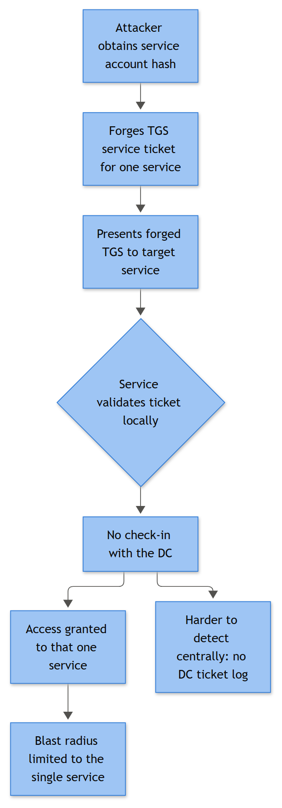

# Silver Ticket Indicators

## Playbook ID & Name

**IAM-017 — Silver Ticket Indicators (Forged Kerberos Service Ticket)**

## Business Risk

**[STAKEHOLDER]** - An attacker who has stolen the password hash of a single service account can forge a valid-looking access pass for that one service and walk in as any user they choose, including an administrator, without the domain controller ever being asked to approve it. It's narrower in blast radius than a Golden Ticket, but it's also quieter — the usual "who logged into what" trail at the domain controller can be entirely absent, which is exactly why it's dangerous for high-value services like file shares, SQL, or the domain controller's own CIFS/LDAP service.

## Severity / Priority Default

**High** as opened. Escalates to **Critical** if the targeted Service Principal Name (SPN) belongs to a domain controller computer account, or if reuse across multiple hosts is confirmed.

## MITRE ATT&CK Techniques

- **T1558.002** — Steal or Forge Kerberos Tickets: Silver Ticket (primary)
- **T1003.001** — OS Credential Dumping: LSASS Memory (likely precursor — this is where the service account's NTLM hash was obtained)
- **T1550.003** — Use Alternate Authentication Material: Pass the Ticket (the forged ticket is presented to the target service in place of a legitimately issued one)
- **T1078.002** — Valid Accounts: Domain Accounts (the identity being impersonated inside the forged ticket)

## Trigger / Detection Logic Summary

A Silver Ticket is built entirely offline. The attacker who holds a service account's (or computer account's) NTLM hash crafts a Kerberos service ticket (TGS) and signs/encrypts it themselves — the domain controller is never contacted to issue it. That is the single most important fact for detection: **the KDC has no record of this ticket ever being requested.**

**[ENGINEERING]** - Primary detection logic is a negative correlation, not a positive match on one event: a successful Kerberos-authenticated logon against a resource server (**4624**, Logon Type 3, Authentication Package = Kerberos) or a privileged-token assignment (**4672**) that has **no corresponding 4769** (or antecedent 4768) on the domain controller for that account/service/time window, allowing for clock skew and normal ingestion lag. Secondary logic looks for encryption-type downgrade on any 4769 that *does* exist for that SPN (RC4, `0x17`, in an environment where that SPN normally negotiates AES), and for privilege/group claims in the resulting token that don't match the account's actual AD group memberships.



*Figure F024 - forging a service ticket for one service using its account hash.*

## Required Log Sources & Event IDs

| Source | Event ID | Purpose |
|---|---|---|
| Domain Controller Security log | 4768 | TGT issuance baseline — used to prove absence for a given principal/time |
| Domain Controller Security log | 4769 | Service ticket issuance baseline — used to prove absence for the target SPN |
| Target/resource server Security log | 4624 | The actual use of the forged ticket to log on |
| Target/resource server Security log | 4672 | Privileged token assignment — flags over-privileged impersonation |
| Target/resource server Security log | 4634 / 4647 | Session teardown, useful for session duration/lifetime anomalies |
| Target/resource server Security log | 4688 | What the attacker did once authenticated |
| Domain Controller Security log | 1102 | Anti-forensic follow-up if attacker tries to clear the trail afterward |

## Key Fields to Inspect

**[ANALYST]**

- **4624**: New Logon Account Name/SID, Logon Type (expect 3 for service access; 2 or 10 is a bigger red flag if the SPN is service-only), Authentication Package (must read "Kerberos", not NTLM), Workstation Name (often blank, or the name of the box the ticket was forged on — not where you'd expect), Source Network Address, Logon ID.
- **4672**: The privilege list on the token. A service account with `SeDebugPrivilege`, `SeTcbPrivilege`, or Domain Admin-equivalent SIDs it has no business holding is the single strongest artifact you can pull out of this event.
- **4768/4769** (on the DC, for the correlation check): Account Name, Service Name, Client Address, Ticket Encryption Type, Result/Failure Code. You are checking for a *matching* record, not reading these in isolation.
- **4688** post-logon: New Process Name, Command Line, Creator Process Name — establishes what the attacker actually touched once inside.

## Normal vs Suspicious Pattern

| Normal | Suspicious |
|---|---|
| Every 4624 (Kerberos, Type 3) against a resource server has a preceding 4769 at the DC for that SPN within seconds, from the same client address | 4624 with Authentication Package = Kerberos, no matching 4769 anywhere in DC logs for that account/SPN/window |
| Ticket encryption type matches domain policy (AES-256 in most modern estates) | 4769 shows RC4 (`0x17`) for an SPN that has consistently negotiated AES for months |
| Token privileges (4672) match the account's actual AD group membership | 4672 privileges exceed what 4728/4732 history shows the account was ever granted |
| Service accounts authenticate from expected app-tier hosts only | Same account/SPN combination logging on from a workstation subnet, or from a host associated with a recent LSASS-access alert |
| Ticket lifetime matches domain Kerberos policy (default max 10 hours) | Session lifetime wildly outside domain policy, or ticket reused hours/days after normal renewal would have expired it |

## Investigation Steps

1. Pull the triggering 4624/4672 event: capture Logon ID, Account Name, target host/SPN, source IP, Authentication Package, and exact timestamp (note DC vs. resource-server clock offset before you go further).
2. Query the domain controller Security log for 4768/4769 for that Account Name and target Service Name within a window of ±10 minutes around the logon. No match is the core finding — but first rule out ingestion delay or log-forwarding drop before treating "no match" as confirmed forgery.
3. Check the account's actual state and group membership in AD (enabled/disabled, last password reset, current group SIDs via 4728/4732 history). Compare against anything privileged claimed in the 4672 token.
4. If a historical 4769 exists for the same SPN, compare Ticket Encryption Type over the last 30–90 days. A sudden RC4 downgrade for an AES-negotiating SPN is a strong forgery artifact.
5. Pivot to 4688 on the target server using the Logon ID from step 1 — what did the session actually do (file access, process spawn, further 4648 explicit-credential hops to other hosts)?
6. Identify the owning account for the targeted SPN and treat its NTLM hash as compromised regardless of investigation outcome — that hash is a static secret and doesn't rotate on its own.
7. Sweep other hosts/services for the same account identity or source IP in the surrounding 24–72 hours; Mimikatz-style hash dumps frequently harvest several SPNs from one host in a single pass, so one confirmed Silver Ticket is rarely the only one.
8. Scope the blast radius: is the targeted SPN a line-of-business app account, or a domain controller computer account (CIFS/LDAP on a DC)? The latter is a domain-compromise-level event, not a single-service incident.

## True Positive Indicators

- Confirmed 4624/4672 with Kerberos auth package and no corresponding 4768/4769 chain at any DC, after ruling out ingestion gaps.
- Token privileges in 4672 exceeding the account's real AD group membership.
- Ticket encryption downgrade (RC4) for an SPN that otherwise negotiates AES.
- Successful logon for an account that AD shows as disabled, expired, or password-expired — the forged ticket bypasses the KDC's real-time account-state check entirely.
- The same forged identity reused against multiple distinct SPNs/hosts in a short window.

## False Positive / Benign Positive Indicators

- SIEM ingestion delay or EPS throttling dropped the legitimate 4769 — check raw DC logs directly, not just the indexed copy, before calling it confirmed.
- Clock skew between DC and collector producing a false "no match" inside a narrow correlation window.
- Cross-forest/trust ticket referrals, where the issuing KDC is in a different realm and the local DC's 4769 view is legitimately incomplete.
- Constrained delegation or S4U2Self/S4U2Proxy activity, which changes the normal ticket-issuance chain and can look like a gap to a naive correlation rule.
- Service account genuinely reconfigured with new legitimate privileges (check change tickets/4728 history before assuming forgery).

## Escalation Criteria

Escalate to Tier 3 / IR immediately if: the targeted SPN belongs to a domain controller computer account; the privilege mismatch in 4672 includes Domain Admin-equivalent SIDs; the same forged identity is confirmed across more than one host; or the finding coincides with a 1102 log-clear event or a recent LSASS-access alert on the same host (ties this directly back to T1003.001).

## Containment Options & Approval Authority

**[MANAGEMENT]** - Containment centers on the compromised secret, not the ticket itself (tickets can't be individually revoked short of Kerberos policy changes). Reset the NTLM hash of the implicated service/computer account — twice, since hash history means one reset alone doesn't fully invalidate prior derivations — coordinated with the application owner because most service accounts require a service restart to pick up new credentials. Isolate the host believed to be the source of the hash theft pending forensic triage. Service-account credential resets require Tier 3/IR Lead approval given the outage risk; anything touching a domain controller computer account or krbtgt requires sign-off from the AD architecture owner or CISO given the domain-wide blast radius.

## Example Query (Sentinel / KQL)

```kql
let TicketRequests = SecurityEvent
| where EventID == 4769
| project SvcAcct = TargetUserName, TicketTime = TimeGenerated;
SecurityEvent
| where EventID == 4624 and LogonType == 3
    and AuthenticationPackageName == "Kerberos"
| join kind=leftanti TicketRequests on $left.TargetUserName == $right.SvcAcct
| project TimeGenerated, TargetUserName, IpAddress, WorkstationName, Computer
```

## Closure Criteria

Close as **True Positive** once absence of a matching 4768/4769 is confirmed against raw DC logs (not just indexed data), the implicated account's hash has been rotated, and lateral scope is documented. Close as **Benign Positive** if the "missing" ticket request is explained by ingestion delay, trust referral, or delegation flow. Close as **Insufficient Evidence** if the correlation gap can't be reproduced and no privilege/encryption anomaly is found, with the account flagged to a watchlist for 14 days.

**Example case note:** *"4624 on FS01 for svc-sqlreports (Type 3, Kerberos) at 09:14 UTC, no matching 4769 on DC02/DC03 raw logs within ±15 min; 4672 shows SeDebugPrivilege not present in account's AD groups. Confirmed hash theft on APP03 via prior LSASS alert INC-4471. NTLM hash reset x2 on svc-sqlreports, app owner notified for service restart. Closed as True Positive, escalated to IR for lateral scope review."*
