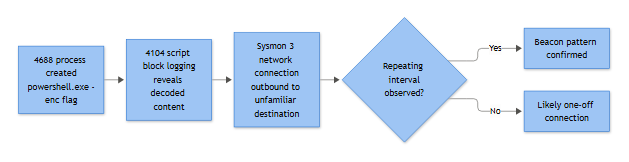

# EP-003: Encoded/Obfuscated PowerShell

**Category:** Endpoint - Execution & LOLBins
**Playbook ID & Name:** EP-003 — Encoded/Obfuscated PowerShell Execution

**[STAKEHOLDER]** - PowerShell is the single most abused legitimate tool on Windows because it is already installed, already trusted, and can run entirely in memory. Attackers encode or obfuscate their commands specifically to slip past both the analyst's eyes and older signature-based tools. This playbook covers the alert that fires when someone is trying to run PowerShell in a way that looks deliberately hidden — Base64 blobs, character-substitution tricks, compression, or string-splitting used to break up known-bad keywords. The business risk is that this is frequently the first foothold step after phishing or a compromised script, not the end state — catching it early is materially cheaper than catching it after data leaves the building.

## Severity / Priority Default
**High** on first detection per host/user. Downgrade to Medium only after the analyst confirms a known, whitelisted admin tool or vendor deployment script is the source (see False Positive section) and a suppression is formally logged.

## MITRE ATT&CK Techniques
- **T1059.001** — Command and Scripting Interpreter: PowerShell (primary)
- **T1027** — Obfuscated Files or Information (the "why" behind the encoding)
- **T1562.001** — Impair Defenses: Disable or Modify Tools (common payload goal — killing AMSI, Defender, or logging itself)
- **T1105** — Ingress Tool Transfer (common follow-on — encoded command is frequently a download cradle)

## Trigger / Detection Logic Summary
Alert fires when a PowerShell process launches with a command line matching one or more obfuscation signatures: `-EncodedCommand` / `-enc` flags carrying Base64, `-e` short-form abuse, heavy use of string concatenation/reordering (`'p'+'ow'+'ershell'`), character-code building (`[char]0x70`), compression cmdlets chained with `IO.Compression` and `FromBase64String`, or an execution policy bypass (`-ep bypass`, `-nop`, `-w hidden`) paired with any of the above. Sysmon Event ID 1 and Event ID 4104 are the anchor sources — 4104 is what actually lets you read through the obfuscation, because Script Block Logging logs the de-obfuscated content PowerShell itself resolves internally before execution, not just what was typed on the command line.

## Required Log Sources & Event IDs
| Source | Event ID | Why it matters here |
|---|---|---|
| Microsoft-Windows-PowerShell/Operational | **4104** | Script block logging — captures actual (often de-obfuscated) script content, including multi-block reassembly for long scripts |
| Microsoft-Windows-PowerShell/Operational | **4103** | Module logging — pipeline execution detail, parameters passed to cmdlets like `Invoke-Expression` |
| Sysmon | **1** | Full command line always present (unlike 4688, not dependent on audit policy), parent process, integrity level, hashes |
| Windows Security | **4688** | New process creation — command line only if process-creation command-line auditing is enabled via GPO |
| Sysmon | **3** | Network connection from powershell.exe — confirms a download cradle actually reached out |
| Sysmon | **22** | DNS query attributed to powershell.exe — catches C2 domain resolution before the connection |
| Sysmon | **11** | File creation — payload dropped to disk after decode/decompress |

## Key Fields to Inspect

**[ANALYST]**
- **CommandLine** (Sysmon 1 / 4688) — look for `-enc`, `-EncodedCommand`, `-e `, `FromBase64String`, `IO.Compression.GzipStream`, `[char]`, backtick insertion (`i`ex`), `-w hidden`, `-nop`, `-noni`, `-ep bypass`
- **ScriptBlockText** (4104) — the de-obfuscated payload; check for `Invoke-Expression`, `IEX (New-Object Net.WebClient).DownloadString`, `Add-Type`, reflective assembly loading, AMSI bypass strings (`amsiInitFailed`, `System.Management.Automation.AmsiUtils`)
- **ParentImage / ParentCommandLine** (Sysmon 1) — winword.exe, excel.exe, outlook.exe, mshta.exe, wscript.exe, or cmd.exe spawning powershell.exe is far more suspicious than explorer.exe or an RMM agent doing it
- **IntegrityLevel** — a script trying to elevate or already running High/System from an odd parent is a red flag
- **User / LogonId** — tie back to the originating 4624 to confirm it's an interactive session vs. a scheduled task or service account
- **Hashes** (Sysmon 1, if configured) — hash the powershell.exe binary itself and any dropped file from Sysmon 11 against known-good/known-bad
- **DestinationIp / DestinationPort** (Sysmon 3) and **QueryName** (Sysmon 22) — outbound connection or DNS lookup immediately following decode

## Normal vs Suspicious Pattern
Encoded PowerShell is not inherently malicious — SCCM, Intune, Azure Automation, and plenty of legitimate vendor installers pass Base64-encoded commands to avoid quoting/escaping issues over remote sessions. Normal: encoded command decodes cleanly to a readable, mundane script (a registry check, a software inventory query), parent process is a known management agent (`CcmExec.exe`, `MMAgent`, RMM service), execution is scheduled or matches a known change window. Suspicious: parent is Office, a browser, or an email client; decoded content references `DownloadString`, `Net.Sockets.TcpClient`, `-Sta`/reflection loading, AMSI patching strings, or the decode reveals a *second* layer of encoding (nested obfuscation is a strong tell — legitimate tooling almost never double-encodes).

## Investigation Steps
1. Pull the Sysmon Event ID 1 record for the flagged process — capture full CommandLine, ParentImage, ParentCommandLine, User, and IntegrityLevel.
2. Pull matching **4104** entries by ProcessId and a ±5 minute window around the Sysmon 1 timestamp, from the same host — reconstruct the full script block (long scripts split across multiple 4104 events, correlated by `ScriptBlockId`).
3. Decode the payload manually if 4104 didn't fully resolve it (Base64 decode, then check for gzip/deflate wrapper) — never execute it, static-review only, ideally in an isolated analysis VM if dynamic behavior needs confirming.
4. Identify the parent process lineage back two to three hops — was this spawned from a document, a browser download, a scheduled task (4698), or an RMM tool?
5. Check Sysmon 3 and 22 for outbound connections/DNS lookups from the same PID within the following 60 seconds — did it actually reach out, and where?
6. Check Sysmon 11 for files dropped in the same timeframe by the same process tree — secondary payload, persistence artifact, or staged exfil data.
7. Search the environment for the same command-line hash or decoded script fingerprint across other hosts — default lookback 7 days; extend to 30 days once this is confirmed True Positive or lateral spread is suspected. Single-host anomaly vs. spray.
8. Check EDR/AV telemetry and AMSI logs (if available) for a block/detection event around the same timestamp — sometimes the endpoint already stopped it and this is a benign-positive cleanup.



*Figure F026 - 4688 to 4104 to an outbound beacon.*

## True Positive Indicators
- Decoded script contains `IEX`/`Invoke-Expression` piped straight from a web download
- AMSI bypass or logging-disable strings present in the decoded block
- Nested/multi-layer encoding (Base64 wrapping gzip wrapping another Base64 layer)
- Parent process is Office, a script host (wscript/cscript), or mshta with no legitimate business reason
- Confirmed outbound connection to an IP/domain with no prior reputation or hosted on infrastructure unrelated to the business

## False Positive / Benign Positive Indicators
- Parent is a known management agent, and decoded content is a routine inventory/config script
- Command line matches an approved, version-controlled deployment script in the change log
- Execution occurred inside a documented patch/maintenance window under a known service account
- No network activity, no dropped files, decoded content is trivial (e.g., a single `Get-Service` call obfuscated only because the deployment tool encodes everything by default)

## Escalation Criteria
Escalate to Tier 2 / IR immediately if: the decoded payload references credential access, LSASS, or known C2 frameworks by name/pattern; the process spawned from a phishing-delivered document within the last 24 hours; lateral spread is suspected (same script hash on 3+ hosts); or an AMSI/logging-disable attempt succeeded (logging gap afterward is itself a red flag — treat the silence as suspicious, don't assume the quiet host is clean).

## Containment Options & Approval Authority

**[MANAGEMENT]**
- **Isolate host from network** (EDR quarantine) — Tier 2 analyst can action unilaterally on confirmed True Positive with active C2 connection; no manager approval needed for isolation itself, notify on-call IR lead within 15 minutes.
- **Kill process / block hash across environment** — Tier 2 or above, logged in the case ticket.
- **Disable user account** — requires IR lead or SOC manager sign-off if the account is a service account tied to production workflows; standard user accounts can be disabled by Tier 2 with notification to the account owner's manager.
- **Full forensic image / memory capture** — IR lead approval, required before any remediation that would destroy volatile evidence (reboot, reimage).

SLA target: triage start within 15 minutes of alert for High severity, containment decision within 30 minutes once the decoded payload's intent (download cradle, AMSI bypass, credential access) is confirmed.

## Example Query (Sentinel / KQL)
```kql
DeviceProcessEvents
| where FileName in~ ("powershell.exe","pwsh.exe")
| where ProcessCommandLine has_any ("-enc","-EncodedCommand","FromBase64String",
    "IO.Compression","-ep bypass","-nop","-w hidden","[char]")
| where InitiatingProcessFileName !in~ ("CcmExec.exe","MMAgent.exe")
| project Timestamp, DeviceName, AccountName, InitiatingProcessFileName,
    ProcessCommandLine, InitiatingProcessCommandLine
| order by Timestamp desc
```

## Closure Criteria
Close as **True Positive - Contained** once the host is isolated/remediated, the decoded payload and its network/file artifacts are documented in the case, and a hash/IOC has been pushed to blocklists. Close as **Benign Positive** or **Expected Activity** when the decoded content and parent process trace cleanly to an approved administrative tool or change ticket, with the decoded script attached as evidence. Close as **Insufficient Evidence** when 4104 was not enabled on the host and no other source captured the actual decoded content — flag this as a logging gap for the engineering team rather than guessing at intent.

**Example case-note line:** *"WKS-FIN-042 (user: jsmith) — powershell.exe spawned from WINWORD.EXE with -enc payload; decoded via 4104 to Net.WebClient download from hxxp://cdn-update-service[.]example.net/a1.ps1; Sysmon 3 confirms outbound to 198.51.100.22:443 seconds later; host isolated 14:32 UTC, hash pushed to EDR blocklist, escalated to IR for phishing-source tracing."*
