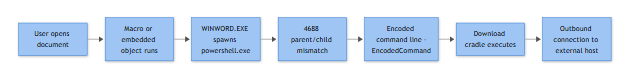

# PowerShell Spawned by an Office Application

## Playbook ID & Name

**EP-006** — PowerShell Spawned by an Office Application (winword.exe / excel.exe / powerpnt.exe / outlook.exe → powershell.exe)

## Business Risk

**[STAKEHOLDER]** - This is the opening move of the vast majority of document-based phishing compromises we see: a user opens an attachment, clicks "Enable Content", and a macro silently launches PowerShell to fetch the real payload. If we catch it here, the incident is a cleanup on one laptop. If we miss it, it's ransomware or a business email compromise three days later, and the business impact moves from "analyst hour" to "board conversation." This detection is one of the highest-value tripwires in the whole detection stack for the effort it costs to maintain.

## Severity/Priority Default

**High** on first fire per host/user. Downgrade to Medium only after a documented, recurring benign cause (see False Positive section) is whitelisted at the specific parent-child-command-line level — never blanket-suppress the parent/child pair itself.

## MITRE ATT&CK Techniques

- T1566.001 — Phishing: Spearphishing Attachment (delivery)
- T1204 — User Execution (macro/content enablement)
- T1059.001 — Command and Scripting Interpreter: PowerShell (execution)
- T1027 — Obfuscated Files or Information (encoded/obfuscated command lines, common in this chain)
- T1105 — Ingress Tool Transfer (PowerShell pulling second-stage payload)
- T1071.004 — Application Layer Protocol: DNS (frequently used for staging/C2 beaconing immediately after)

## Trigger / Detection Logic Summary

Fires when a Microsoft Office parent process (WINWORD.EXE, EXCEL.EXE, POWERPNT.EXE, OUTLOOK.EXE, MSACCESS.EXE) directly spawns powershell.exe, pwsh.exe, or powershell_ise.exe as a child process. This parent-child relationship almost never happens in legitimate, unassisted end-user activity — Office applications don't shell out to PowerShell as part of normal document viewing or editing. The detection is parent/child pair based, not command-line-content based, which is deliberate: it catches the behavior even before you know what the obfuscated payload does.



*Figure F025 - the classic WINWORD-to-PowerShell execution chain.*

## Required Log Sources & Event IDs

| Source | Event ID | Purpose |
|---|---|---|
| Sysmon | 1 (Process Creation) | Primary trigger — full command line, parent command line, hashes, integrity level |
| Windows Security | 4688 (New Process Created) | Backup/cross-check if command-line auditing is enabled; weaker parent linkage than Sysmon |
| PowerShell Operational | 4104 (Script Block Logging) | Reveals de-obfuscated script content — critical for this chain |
| PowerShell Operational | 4103 (Module Logging) | Pipeline execution detail, cmdlets invoked |
| Sysmon | 3 (Network Connection) | Outbound connection made by the spawned powershell.exe |
| Sysmon | 22 (DNSEvent) | DNS lookups attributed to powershell.exe — stager/C2 domain resolution |
| Sysmon | 11 (FileCreate) | Second-stage payload dropped to disk (temp, AppData, ProgramData) |

## Key Fields to Inspect

**[ANALYST]**

- Sysmon 1: `ParentImage`, `ParentCommandLine`, `Image`, `CommandLine`, `IntegrityLevel`, `CurrentDirectory`, `Hashes`, `User`
- Sysmon 1: whether `ParentCommandLine` references a specific document filename/path (e.g. `Invoice_88213.docm`) — ties the launch to a specific delivered file
- 4104: full script block text — look for `-EncodedCommand`, `-enc`, `FromBase64String`, `IEX`, `DownloadString`, `Net.WebClient`, `Invoke-Expression`, `-WindowStyle Hidden`, `-NoProfile`, `-ExecutionPolicy Bypass`
- Sysmon 3/22: destination IP/domain, port, whether it's a first-seen domain for the environment, TTL/registration age if enrichable
- Sysmon 11: dropped file path, extension mismatch (e.g. `.jpg` that's actually a PE), location under `%TEMP%`, `%APPDATA%`, or `%PUBLIC%`

## Normal vs Suspicious Pattern

| Normal | Suspicious |
|---|---|
| Office spawns splwow64.exe, sndvol.exe (print/UI helpers), or nothing at all | Office spawns powershell.exe, cmd.exe, wscript.exe, mshta.exe directly |
| User opens a document from a known internal template repository, no macro prompt | Document arrived as an email attachment or download minutes before, macro/content-enable prompt was shown |
| PowerShell (if ever a child of Office via a sanctioned add-in) runs with a visible window, signed script path, logged business function | PowerShell runs `-WindowStyle Hidden`, `-NoProfile`, `-ExecutionPolicy Bypass`, encoded command, or immediately reaches out over the network |

## Investigation Steps

1. Pull the Sysmon 1 event: confirm exact parent Office binary, `ParentCommandLine` (identify the source document path/name), and the full child `CommandLine`.
2. Pull the source document. Check Outlook/mail gateway logs or the browser download history for delivery vector — email attachment (T1566.001), SharePoint/OneDrive link, USB, internal share.
3. Retrieve the 4104 script block log for the same time window/PID chain. Decode any `-EncodedCommand` Base64 blob offline (never execute) to recover the real instructions — usually a downloader (`IEX (New-Object Net.WebClient).DownloadString(...)`).
4. Check Sysmon 3/22 for outbound connections or DNS queries from the powershell.exe PID. Note destination IP/domain, and check it against threat intel and DNS reputation.
5. Check Sysmon 11 for files dropped by the same PID or its children — this is usually the actual malware stage (loader, RAT, ransomware precursor).
6. Check for persistence set up afterward — Run key writes, scheduled task creation, or new services — since this chain frequently pivots straight into establishing a foothold.
7. Identify the logged-on user (Sysmon 1 `User` field / correlate to 4624 Logon ID) and check whether other hosts received the same document or sender (mail-wide search) — this is rarely a single-target event.
8. If network activity or a dropped second-stage binary is confirmed, escalate to containment before continuing deep-dive analysis; time matters more than completeness at this point.

## True Positive Indicators

- `-EncodedCommand`, Base64 blobs, or heavy string concatenation obfuscation in the script block
- Immediate outbound connection to a low-reputation, newly-registered, or non-corporate domain/IP
- A binary or script dropped to `%TEMP%`/`%APPDATA%` within seconds of the PowerShell launch
- Document delivered via external email with a generic lure subject ("Invoice", "Remittance", "Signed Document")
- `-WindowStyle Hidden` combined with `-ExecutionPolicy Bypass`

## False Positive / Benign Positive Indicators

- Known, digitally-signed internal Office add-in or macro-driven reporting tool that legitimately shells to PowerShell for an approved automation task (should be documented and hash-pinned, not just assumed)
- Security/IT-deployed macro-based inventory or asset-tagging script running from a controlled internal template on a change-managed schedule
- Script block content that is plaintext, unobfuscated, references only internal file shares/APIs, and matches a known business script hash
- No network egress and no file drop — sometimes a macro just queries local WMI/registry via PowerShell for legitimate diagnostic reasons

## Escalation Criteria

Escalate immediately to Incident Response (do not wait for full investigation) when any of the following are true: outbound connection to a non-allowlisted external destination is confirmed, a binary payload is dropped to disk, script block content contains a known malware family signature or C2 framework artifact (Cobalt Strike-style beacon patterns, known loader strings), or the same lure document is found delivered to more than one mailbox.

## Containment Options & Approval Authority

**[MANAGEMENT]**

| Action | Approval Authority | Notes |
|---|---|---|
| Isolate endpoint from network (EDR) | Tier 2 analyst, notify IR lead | Immediate, no business sign-off needed for a single workstation |
| Disable affected user's AD account temporarily | SOC shift lead | Reversible, use if account credentials may be exposed next |
| Block confirmed C2 domain/IP at proxy/firewall | SOC shift lead | Fast, low blast radius |
| Purge/quarantine the lure email org-wide (mail gateway) | SOC shift lead, notify Security Awareness team | Prevents further clicks; notify affected recipients |
| Disable macros org-wide via GPO/Intune | CISO or Security Engineering Manager | High blast radius on business workflows — requires change approval |
| Full incident declaration and forensic imaging | IR Manager | Once dropped payload or lateral movement is confirmed |

SLA target: triage start within 15 minutes of alert for High severity, containment decision within 30 minutes once outbound activity or a dropped payload is confirmed.

## Example Query (Splunk SPL, Sysmon EventCode 1)

```spl
index=sysmon EventCode=1
| where ParentImage IN ("*\\WINWORD.EXE","*\\EXCEL.EXE","*\\POWERPNT.EXE","*\\OUTLOOK.EXE")
| where Image IN ("*\\powershell.exe","*\\pwsh.exe","*\\powershell_ise.exe")
| table _time, ComputerName, User, ParentImage, ParentCommandLine, CommandLine
| sort -_time
```

## Closure Criteria

Close as **True Positive** once payload behavior, C2 destination, and scope (single host vs multiple) are documented and containment/eradication is complete. Close as **Benign Positive** only when the parent macro/script is hash-verified as an approved internal tool and added to the suppression list at the hash+command-line level. Close as **Insufficient Evidence** if command-line auditing/script block logging was not enabled on the host and the actual payload content cannot be recovered — flag the logging gap to Engineering rather than assuming benign.

**Example case-note line:** *"WKSTN-FIN22 (user d.osei@acmelogistics.example.com) opened 'Remittance_Advice_08841.docm' from external sender at 09:14; macro spawned powershell.exe with -EncodedCommand at 09:14:07 (Sysmon PID 6820), decoded to a WebClient download from hxxp://sync-cdn-update[.]net; no outbound connection succeeded (proxy blocked, unknown category) and no file drop observed on disk — endpoint isolated as precaution, user account not compromised, closing as True Positive / Contained, no further spread confirmed."*
