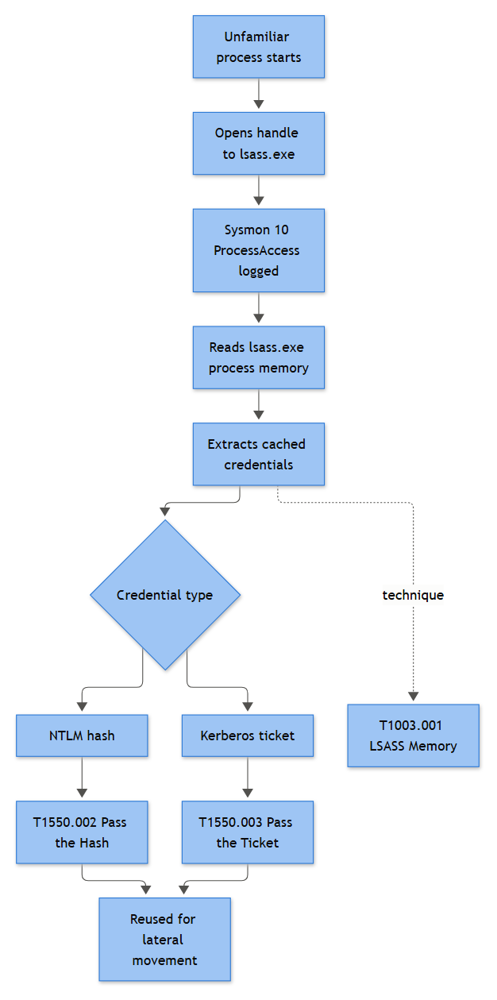

# Credential Dumping / LSASS Access / Mimikatz Indicators

## Playbook ID & Name
**EP-020 — Credential Dumping / LSASS Access / Mimikatz Indicators**
Category: Endpoint - Persistence & Impact

## Business Risk

**[STAKEHOLDER]** - LSASS (Local Security Authority Subsystem Service) holds every credential material object currently cached on a Windows host: NTLM hashes, Kerberos tickets, and in some configurations plaintext passwords. Once an attacker dumps this, one compromised laptop can turn into domain-wide compromise within minutes, because the harvested material lets them log on as other people without ever guessing a password. This is the pivot point between "we cleaned a malware infection" and "we are now doing a full domain credential reset." The business decision that matters here isn't whether to alert - it's how fast the SOC can name *which accounts* were exposed, because that drives how big the remediation footprint gets.

## Severity/Priority Default

**Sev-2 (High)** on a confirmed unsigned-tool LSASS access with a high-risk access mask. Auto-escalates to **Sev-1 (Critical)** if the host is a domain controller, a Tier-0/Tier-1 admin workstation, or if follow-on authentication using a plausible harvested account is observed within the correlation window.

## MITRE ATT&CK Techniques

- **T1003 / T1003.001** - OS Credential Dumping: LSASS Memory (primary scope of this playbook)
- **T1003.006** - DCSync (related, out of primary scope - see note below)
- **T1055** - Process Injection (when the dumping tool injects rather than opening a direct handle)
- **T1550.002** - Use Alternate Authentication Material: Pass the Hash (typical follow-on)
- **T1562.001** - Impair Defenses: Disable or Modify Tools (LSA Protection tampering, audit policy changes ahead of the dump)
- **T1027** - Obfuscated Files or Information (renamed binaries, encoded PowerShell loaders)
- **T1059.001** - Command and Scripting Interpreter: PowerShell (reflective in-memory loaders such as Invoke-Mimikatz style tooling)

> Note on DCSync (T1003.006): that technique abuses directory-replication rights over LDAP rather than opening a handle to lsass.exe, so it does not produce Sysmon Event ID 10 activity. It sits outside this playbook's detection logic and belongs with directory-services abuse detections; it's listed here only because analysts will see it in the same threat-actor playbooks as LSASS dumping and shouldn't assume this alert covers it.

## Trigger / Detection Logic Summary

**[ENGINEERING]** - Primary trigger: Sysmon Event ID 10 (ProcessAccess) where `TargetImage` = `lsass.exe`, `GrantedAccess` matches a high-risk mask, and `SourceImage` is not on the fleet's EDR/AV allowlist. Secondary/corroborating triggers: Sysmon Event ID 1 (Process Creation) command lines matching known credential-dumping syntax; Sysmon Event ID 11 (FileCreate) writing a `.dmp`-style file shortly after; Sysmon Event ID 8 (CreateRemoteThread) targeting the lsass PID; Sysmon Event ID 13 (RegistryEvent - value set) flipping `RunAsPPL` to disable LSA Protection immediately before the access attempt.

Commonly documented `GrantedAccess` masks worth alerting on (validate against your own Sysmon build/version, these shift slightly across Windows releases):

| Mask | Rough meaning | Typical source |
|---|---|---|
| `0x1010` | QUERY_LIMITED_INFORMATION + VM_READ | Usually benign - AV/EDR periodic scan |
| `0x1400` / `0x1410` | Limited query + partial VM rights | Mixed - some legitimate tooling, some early-stage dumping |
| `0x1438` | Adds DUP_HANDLE + VM_OPERATION/READ/WRITE | Classic dump-tool duplicate-handle pattern |
| `0x143a` | `0x1438` + TERMINATE | Frequently associated with Mimikatz-style sekurlsa modules |
| `0x1fffff` | PROCESS_ALL_ACCESS | Most blatant, rarely legitimate |



*Figure F027 - the ProcessAccess-to-credential-reuse chain.*

## Required Log Sources & Event IDs

| Source | Event ID | Purpose |
|---|---|---|
| Sysmon | 10 (ProcessAccess) | Core signal - handle opened to lsass.exe |
| Sysmon | 1 (Process Creation) | Full command line, parent, hash, integrity level |
| Sysmon | 8 (CreateRemoteThread) | Injection-based dumping variant |
| Sysmon | 11 (FileCreate) | Dump file artifact (`.dmp`) written to disk |
| Sysmon | 13 (RegistryEvent - value set) | `RunAsPPL` tampering ahead of the attempt |
| Sysmon | 6 (Driver Loaded) | Signed-vulnerable-driver / EDR-killer loaded pre-dump |
| Windows Security | 4688 | Fallback process creation if Sysmon absent (command line only populated with auditing enabled) |
| Windows Security | 4672 | Confirms the acting session already holds admin-equivalent/SeDebugPrivilege-capable rights |
| Windows Security | 4624 | Logon context (type, account, workstation) of the session that ran the tool |
| Windows Security | 4104 | PowerShell script block content - catches reflective/in-memory loaders |
| Windows Security | 4719 / 1102 | Anti-forensics: audit policy change or log clear around the same timestamp |

## Key Fields to Inspect

**[ANALYST]**
- `TargetImage` / `TargetProcessId` - confirm it is genuinely `lsass.exe`, not a decoy process
- `SourceImage` / `SourceProcessId` / `Hashes` - signed vendor binary vs. unsigned or renamed executable
- `GrantedAccess` and `CallTrace` - the CallTrace shows the module chain (e.g., `dbghelp.dll`/`dbgcore.dll` MiniDumpWriteDump chain vs. an unknown unsigned module)
- `CommandLine` (Sysmon 1 or 4688, if command-line auditing is on) - look for `sekurlsa::`, `lsadump::`, `privilege::debug`, `procdump -ma lsass`, `comsvcs.dll` + `MiniDump`
- `ParentImage` / `IntegrityLevel` - a dumping tool needs High or System integrity; check what launched it
- Subject/account on the 4624/4672 pair - was this session already privileged, and how did it get that way
- File path and name from the FileCreate event - `.dmp` files dropped in `%TEMP%`, `C:\Windows\Temp`, or a user profile are far more suspicious than one written by a sanctioned troubleshooting tool to a ticketed location

## Normal vs Suspicious Pattern

| Normal | Suspicious |
|---|---|
| EDR/AV process (signed, known hash) opens lsass.exe repeatedly fleet-wide with `0x1010` | Unsigned or renamed binary opens lsass.exe once, from a single host, with `0x1438`/`0x143a`/`0x1fffff` |
| Source path is `Program Files\<vendor>` | Source path is `%TEMP%`, `Downloads`, a user profile, or a scheduled-task staging folder |
| No accompanying file write or network activity | Followed by a `.dmp` file write, then a delete (Sysmon 23), or a network egress from the same PID |
| Command line absent or matches known vendor syntax | Command line references `sekurlsa`, `lsadump`, `-ma lsass`, or `comsvcs.dll ... MiniDump` |
| `RunAsPPL` untouched | `RunAsPPL` flipped to `0` minutes before the access attempt |

## Investigation Steps

1. Pull the raw Sysmon 10 event: confirm `TargetImage`, `SourceImage`, `GrantedAccess`, and `CallTrace`. Check the source binary's signature status and hash against threat intel and your own allowlist before doing anything else - a huge share of these alerts are the endpoint's own AV/EDR agent.
2. Pivot on host + PID + timestamp to the Sysmon 1 process-creation event for the source process. Get the full command line, parent process, and integrity level. Renamed binaries (`svchost32.exe`, `winlogon_.exe`, etc.) are a strong tell.
3. Check for a Sysmon 11 FileCreate of a dump-style file in the same timeframe, and Sysmon 3 network connections from the same PID - a dump that's about to leave the host usually gets zipped and pushed out shortly after.
4. Check Sysmon 13 for `RunAsPPL` registry tampering and Security 4719/1102 for logging changes in the same window - both indicate a deliberate, prepared attempt rather than an accident.
5. Establish the account context: pull 4624/4672 for the logon session that spawned the tool. Was this an already-compromised admin session, a service account, or IT staff running an approved diagnostic (check the change ticket before assuming malice)?
6. Search the fleet for the same file hash, command-line fragment, or `RunAsPPL` change to scope how many hosts are affected - this is rarely a single-host event once it's real.
7. Identify which accounts had active or recently-terminated sessions on the affected host at the time of the dump (correlate 4624/4634/4647 history) - these are your candidate exposed-credential list, not just the account that ran the tool.
8. Watch for follow-on use of the harvested material: 4624 Logon Type 3 or 9 to other hosts, 4648 explicit-credential logons, 4776 NTLM validations, or 4768/4769 Kerberos activity for the exposed accounts against systems they don't normally touch.

## True Positive Indicators

- Unsigned or renamed source binary opening lsass.exe with `0x1438`/`0x143a`/`0x1fffff`
- Command line containing `sekurlsa`, `lsadump`, `privilege::debug`, `-ma lsass`, or `comsvcs.dll`/`MiniDump`
- `.dmp` file written to a non-standard path then deleted shortly after (Sysmon 23)
- `RunAsPPL` disabled immediately prior to the access attempt
- Harvested-account logons appearing on unrelated hosts within hours of the dump

## False Positive / Benign Positive Indicators

- Source process is the organization's known EDR/AV agent with a matching signed hash and the low-risk `0x1010` mask, recurring fleet-wide on a predictable schedule
- Help-desk or IT running Sysinternals `procdump.exe -ma lsass.exe` against a genuinely hung process, tied to an open change/incident ticket
- Manual Task Manager "Create dump file" performed by an admin during a support session, with the admin's own logon corroborating intent
- Vulnerability-scanning or monitoring agents enumerating process handles fleet-wide (breadth and regularity are the tell vs. a targeted one-off)

Note: not every alert here resolves to malicious. A fair number close as **Benign Positive** (known tooling, no ticket but a known recurring pattern once baselined) or **Insufficient Evidence** when Sysmon config on that host filters ProcessAccess events for performance and you're working from partial telemetry - flag that gap for the endpoint engineering team rather than closing it as clean.

## Escalation Criteria

- Escalate immediately (Sev-1) if the host is a domain controller, Tier-0/Tier-1 admin workstation, or PAM/jump host.
- Escalate if the source binary is unsigned/unknown AND a dump file artifact or exfil-style network connection is confirmed.
- Escalate if any candidate exposed account shows follow-on authentication (T1550.002 pattern) to a different host within the correlation window.
- Escalate if `RunAsPPL` or audit policy tampering (4719/1102) is found alongside the access - this indicates deliberate anti-forensics, not an accident.

## Containment Options & Approval Authority

**[MANAGEMENT]**
- Network isolation of the affected endpoint via EDR - SOC Tier 2 authority, no additional sign-off for a standard workstation; isolating a domain controller or production server requires IR Lead + infrastructure on-call approval given availability impact.
- Kill process / fleet-wide hash and IOC block - SOC Tier 2 authority, pushed through EDR policy.
- Forced password reset and Kerberos ticket invalidation for candidate-exposed accounts - requires IAM/AD team execution, approved by IR Lead; for privileged accounts (Domain Admin, service accounts with broad delegation) this needs a coordinated change window, not an ad-hoc reset.
- Disabling a compromised user account - requires the account owner's manager or IR Lead sign-off given the business disruption.
- Full memory/disk forensic capture before remediation - IR Lead decision; may briefly delay containment on high-value hosts to preserve evidence for legal/HR-adjacent cases.

## Example Query (Sentinel KQL)

```kql
Sysmon
| where EventID == 10
| where TargetImage has "lsass.exe"
| where GrantedAccess in ("0x1438", "0x143a", "0x1fffff")
| where SourceImage !in~ (KnownEdrAndAvBinaries)
| project TimeGenerated, Computer, SourceImage, SourceProcessId,
          GrantedAccess, CallTrace
| order by TimeGenerated desc
```

## Closure Criteria

Close only once: (1) the source binary has been identified and confirmed as either a legitimate signed tool with a corroborating ticket, or a malicious artifact fully scoped across the fleet; (2) the list of accounts with cached credentials on the host at dump-time has been enumerated; and (3) for any confirmed True Positive, affected account credentials have been rotated or ticket handed to IAM with an SLA, and follow-on lateral-movement checks (4624/4648/4776) came back clean.

**Example case-note line:** *"Confirmed unsigned binary `svchost32.exe` (SHA256 <hash>) opened lsass.exe with GrantedAccess 0x1438 on WKSTN-FIN-047 at 14:22 UTC; command line recovered via Sysmon 1 shows `sekurlsa::logonpasswords`; three cached accounts identified (svc-backup, j.alvarez, helpdesk-t1) - passwords rotated via IAM ticket SOC-4471, no follow-on lateral logons observed in 24h window; closing as True Positive, host reimaged."*
