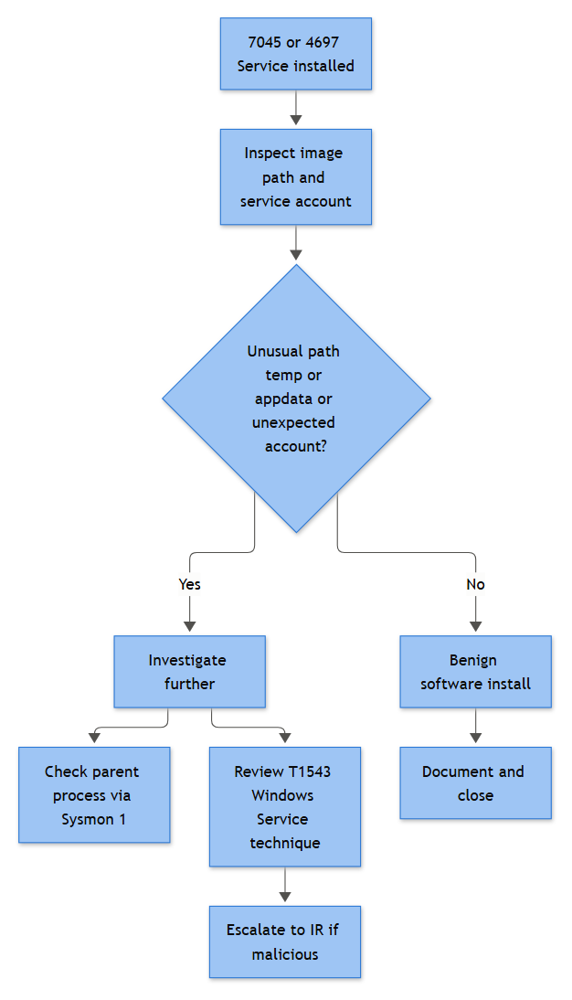

# EP-017: New Service Creation

**Category:** Endpoint - Persistence & Impact

## Business Risk

**[STAKEHOLDER]** - Windows services survive reboots, survive logoffs, and usually run as SYSTEM. That combination is exactly what an attacker wants once they've got a foothold: a way back in that doesn't depend on a user clicking anything again, running with more privilege than most user-mode malware ever gets handed voluntarily. The catch for defenders is that services are also how legitimate software works - agents, backup jobs, monitoring tools, the EDR product itself all install as services constantly, often several times a week across a mid-size fleet. This playbook exists to separate "IT pushed an agent update" from "someone just planted a foothold that will still be here after the next patch cycle," and to do it fast enough that the second case doesn't get a full day's head start.

## Severity / Priority Default

**Medium** on initial trigger from an unrecognized service on a standard workstation. **High** when the service binary path points outside expected install directories (`Temp`, `AppData`, `ProgramData`, `Public`), the service was created by a non-admin-tooling account, the binary is unsigned, or the host is a server / domain controller / VIP asset. **Critical** when paired with a driver load (Sysmon 6) of an unsigned or unusually-privileged kernel driver, or when the creating session shows signs of prior lateral movement or credential theft in the same timeframe.

## MITRE ATT&CK Techniques

- **T1543.003** - Create or Modify System Process: Windows Service (primary technique)
- **T1059.001 / T1059.003** - Command and Scripting Interpreter: PowerShell / Windows Command Shell (common vehicle - `sc.exe create`, `New-Service`, `reg.exe add` against the service key)
- **T1027** - Obfuscated Files or Information (encoded service binary path or launch arguments)
- **T1055** - Process Injection (occasionally the service exists solely to load a DLL into another process at boot)
- **T1562.001** - Impair Defenses: Disable or Modify Tools (when the new service is itself an EDR-killer driver or is created specifically to stop/uninstall a security agent)
- **T1105** - Ingress Tool Transfer (the service binary was just dropped moments before install)

## Trigger / Detection Logic Summary

Fires on Security Event ID 4697 and/or System Event ID 7045 (both fire on the same install - correlate, don't double-count) where any of: the Service File Name / Image Path resolves outside `%SystemRoot%\System32` or a recognized vendor Program Files directory; the path is in a user-writable location (`Temp`, `AppData`, `ProgramData`, `Users\Public`); the binary is unsigned or the hash has no prior-seen record in the environment; the Start Type is `Auto Start` or `Demand Start` combined with a Service Type of kernel/file-system driver; or the creating process (from the correlated Sysmon Event ID 1 / 4688 leading up to it) is `powershell.exe`, `cmd.exe`, `wscript.exe`, or a process already flagged elsewhere in the case. Also alert independently on `HKLM\SYSTEM\CurrentControlSet\Services\<name>` key creation (Sysmon 12) that has no matching 4697/7045 within a short window - that gap itself is worth investigating, since it can mean audit policy is blind on that host, not that nothing happened.



*Figure F029 - unusual service image paths/accounts as a persistence signal.*

## Required Log Sources & Event IDs

| Source | Event ID | Purpose |
|---|---|---|
| Windows Security | 4697 | Service installed - Service Name, Service File Name, Service Type, Start Type, Service Account |
| Windows System | 7045 | Duplicate/independent record of the same install (Service Control Manager source) - useful when Security log has gaps or short retention |
| Sysmon | 1 (Process Creation) | The `sc.exe`, `services.exe`, `powershell.exe`, or `svchost.exe` process that performed the install, with full command line and parent chain |
| Sysmon | 12/13 (RegistryEvent) | Creation of the `Services\<name>` key and its `ImagePath`/`ObjectName`/`Start` values under `HKLM\SYSTEM\CurrentControlSet\Services` |
| Sysmon | 6 (Driver Loaded) | If Service Type indicates a kernel driver, confirm the actual load and its signature status |
| Sysmon | 3 / 22 (Network Connection / DNSEvent) | Beaconing or C2 callback from the new service's host process shortly after start |
| Sysmon | 11 (FileCreate) | The service binary landing on disk, if it was just dropped rather than pre-existing |
| Windows Security | 4688 | Fallback process-creation record if Sysmon isn't deployed on that host |
| Windows Security | 4672 | Confirms the creating logon session held admin-equivalent privileges (services require it) |

## Key Fields to Inspect

**[ANALYST]**
- `Service Name` / `Service File Name` (4697/7045) - the display/internal name and the full path+arguments of the binary; check both, attackers sometimes pick a service name that mimics a legitimate one (`WindowsUpdateSvc` vs. the real `wuauserv`) while the file name gives it away
- `Service Type` - own process, share process, kernel driver, file-system driver; kernel/driver types on an unexpected host warrant immediate escalation
- `Start Type` - `Auto Start` for persistence across reboot vs. `Demand Start` which still needs a trigger but is lower urgency
- `Service Account` - `LocalSystem` is normal for many legitimate services but is also the most attractive target for abuse; a service running as a specific domain user is worth checking against that account's normal role
- `Subject` (who performed the install, from 4697) and the corresponding Sysmon 1 `User`/`ParentImage` - was this SCCM/Intune/a signed installer, or an interactive admin session, or a service account that has no business installing software
- `ImagePath` under the registry key (Sysmon 12/13) - matches the 4697 Service File Name; discrepancies between the two are themselves suspicious
- Hash and signature status of the service binary (Sysmon 1 `Hashes`, or EDR file reputation) - the single fastest pivot to TI
- Any Sysmon 3/22 activity from the resulting host process (`services.exe` spawning the actual binary, or `svchost.exe -k` for a shared-process service) in the minutes after start

## Normal vs Suspicious Pattern

| Attribute | Normal | Suspicious |
|---|---|---|
| Install source | SCCM/Intune/GPO push, signed vendor MSI, EDR agent updater | Interactive `sc.exe create`/`New-Service` from a logon session, PowerShell one-liner |
| Binary path | `C:\Program Files\Vendor\agent.exe`, `C:\Windows\System32\*.exe` | `C:\Windows\Temp\svc32.exe`, `C:\Users\Public\update.exe`, `C:\ProgramData\svchosts.exe` |
| Signature | Microsoft or known vendor cert, valid chain | Unsigned, self-signed, or expired/revoked cert |
| Timing vs. change record | Falls inside a known patch/deployment window, ticket exists | No corresponding change ticket, off-hours, weekend |
| Service/display name | Descriptive, matches vendor naming (`CSFalconService`) | Generic/random (`svc32`, `WinHelper`, single-character names), or name typo-squatting a real service |
| Account context | Deployment tooling service account, `LocalSystem` for a recognized product | Interactively-logged-on user account, an account already flagged elsewhere in the case |
| Downstream behaviour | No network activity, or expected check-in to vendor's known cloud endpoint | Immediate outbound connection to a bare IP or newly registered domain |

## Investigation Steps

1. Pull the 4697 (or 7045 if Security log lacks it) record in full: Service Name, Service File Name, Service Type, Start Type, Service Account, and Subject/creating account.
2. Correlate the timestamp against Sysmon Event ID 1 on the same host to identify the process that actually performed the install (`sc.exe`, `PowerShell`, an MSI installer, an RMM agent) and its full parent chain.
3. Check the binary's hash and signature status. Unsigned + path outside `System32`/Program Files is close to an automatic escalation on its own; a valid Microsoft/vendor signature in an expected path is often enough to move toward Benign Positive if nothing else stands out.
4. Cross-reference against your change/deployment records - is there a ticket, a known software rollout, an EDR agent update push covering this host and timeframe? Don't skip this step even when the binary looks clean; unauthorized-but-benign software still needs a paper trail.
5. Check the Service Account. `LocalSystem` running a recognized product is routine; a domain user account, especially one with no prior service-account history, running a newly created service is worth pulling that account's recent 4624/4648 activity for.
6. If Service Type indicates a driver, confirm the actual Sysmon Event ID 6 load and its signature - unsigned kernel drivers are a strong indicator of an EDR-killer or rootkit component, treat as high-priority regardless of anything else found.
7. Look at Sysmon 3/22 for the resulting process in the minutes after service start - beaconing, DNS to a suspicious domain, or a connection to infrastructure already flagged in TI moves this straight to True Positive.
8. If findings support malicious intent, preserve the service binary, the registry key contents, and relevant Sysmon/EDR telemetry before removing the service - deleting it first destroys evidence you'll want for the write-up and for any related incident.

## True Positive Indicators

- Service binary unsigned, located in a user-writable path (`Temp`, `AppData`, `ProgramData`, `Public`), with no corresponding vendor or install record
- Service created via an interactive `sc.exe create` or `New-Service` PowerShell command rather than a recognized deployment tool
- Service name deliberately mimics a legitimate Windows service (typo-squat, near-identical display name) while the file path/hash don't match the real one
- Kernel/file-system driver service type, unsigned, loaded on a host with no legitimate reason to load third-party drivers
- Immediate outbound connection or DNS lookup to infrastructure with no prior legitimate history on that host
- Creating account has no history of software installs and shows other suspicious activity (recent lateral movement, credential access indicators) in the same session

## False Positive / Benign Positive Indicators

- Install coincides with a documented SCCM/Intune deployment ring or a scheduled patch/agent-update window
- Binary is signed by Microsoft or a recognized vendor and resides in the expected Program Files/System32 location
- Service Account is a known deployment or monitoring service account with an established pattern of installing services on that host population
- No unusual network activity, no child processes, no registry discrepancy between the 4697 Service File Name and the actual `ImagePath` value
- Service name and binary match a product already inventoried in the asset/software catalog

## Escalation Criteria

Escalate to Tier 2/IR when: the binary is unsigned and located outside expected install paths with no change record; the service is a kernel/file-system driver and unsigned; the affected host is a server, domain controller, or VIP endpoint; the same service name or binary hash appears on more than one host in a short window (campaign indicator); the new service's process accesses `lsass.exe` or exhibits injection behaviour (hand off to the credential-dumping or process-injection playbooks); or EDR independently flags the binary or blocks its execution.

## Containment Options & Approval Authority

**[MANAGEMENT]**
- Stop and delete the service, quarantine the binary - Tier 2 analyst authority on a standard workstation once TP is confirmed
- Isolate a standard user workstation via EDR network isolation - Tier 2 analyst may action directly under delegated authority
- Isolate/contain a server, domain controller, or VIP asset - requires IR Lead (or on-call manager) sign-off given business-continuity impact
- Block the binary hash and any associated C2 domain/IP at EDR/proxy/firewall - SOC Engineering actions on Tier 2 request, logged in the ticket
- Disable or rotate credentials for the account that created the service, if the account itself appears compromised rather than the tooling being legitimate - routed to IAM/Helpdesk with IR Lead approval
- Preserve the service binary, registry key export, and relevant Sysmon/EDR telemetry before deletion whenever malicious intent is suspected - do not let cleanup outrun evidence collection

## Example Query (Splunk SPL)

```spl
index=wineventlog (EventCode=4697 OR EventCode=7045)
| eval svc_path=coalesce(Service_File_Name, ImagePath)
| where NOT match(svc_path, "(?i)^c:\\\\windows\\\\system32\\\\")
       AND NOT match(svc_path, "(?i)^c:\\\\program files")
| eval flag=if(match(svc_path, "(?i)\\\\(temp|appdata|programdata|public)\\\\"),
               "high","review")
| table _time, Computer, Service_Name, svc_path, Service_Start_Type, Service_Account, Subject_Account_Name, flag
```

## Closure Criteria

Close as **True Positive - Malicious Persistence** once the service binary is confirmed unsigned/malicious via hash reputation or sandboxing, the installing process/account chain is identified, and the service plus binary are removed and blocked across all affected hosts. Close as **Benign Positive** or **Expected Activity** when the install matches a documented deployment ticket or recognized vendor software and the binary/signature/path all check out clean. Close as **Insufficient Evidence** when the host had no Sysmon coverage and command-line auditing was disabled, leaving no way to confirm who or what actually performed the install beyond the bare 4697/7045 record.

**Example case note:**
> 2026-09-15 09:14 UTC - HOST-OPS-118 (server, DMZ segment) - Event ID 7045/4697 logged new service `WinSvcHelper32`, Service File Name `C:\ProgramData\Microsoft\svchosts.exe`, Start Type Auto, Service Account LocalSystem. Correlated Sysmon Event ID 1 showed install performed via `cmd.exe /c sc create WinSvcHelper32 ...` spawned from a PowerShell session (`powershell.exe -enc <base64>`) itself launched by `wscript.exe` roughly 90 seconds earlier - no matching change ticket for this host. Binary unsigned, SHA256 had zero prior-seen history in the environment and matched a known loader family (41/71 vendors) in TI lookup. Sysmon 3 showed outbound connection to 198.51.100.77:8443 approximately 20 seconds after service start; no legitimate reason found for this host to contact that address. Classified True Positive - persistence mechanism via malicious Windows service (T1543.003), likely delivered through an earlier obfuscated PowerShell stage (T1059.001/T1027). Host isolated (IR Lead approval obtained given DMZ server classification), service stopped and binary quarantined, hash and destination IP blocked org-wide. Escalated to IR to trace the wscript.exe parent chain back to initial access.
