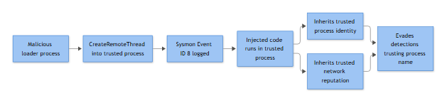

# EP-021: Process Injection

## Overview

| Field | Value |
|---|---|
| **Playbook ID** | EP-021 |
| **Name** | Process Injection |
| **Category** | Endpoint – Persistence & Impact |
| **MITRE ATT&CK** | T1055 (Process Injection) — commonly chained with T1218.011 (Rundll32), T1027 (Obfuscated Files or Information), T1562.001 (Impair Defenses), and, when the target process is lsass.exe, T1003.001 (OS Credential Dumping: LSASS Memory) |
| **Default Severity** | High (Sev 2) at first confirmed CreateRemoteThread/ProcessAccess pairing into a sensitive target; escalates to Sev 1 if the target is lsass.exe, an EDR process, or a domain controller |

**[STAKEHOLDER]** - Process injection is how malware and post-exploitation frameworks hide inside a process your business already trusts — explorer.exe, svchost.exe, a browser, sometimes your own security software. It's rarely the first thing that happens in an intrusion; it's usually the second or third move, after initial access, done specifically to blend in and survive a casual look at Task Manager. An injection alert firing on a finance workstation or a domain controller means someone is actively trying to operate undetected on that box right now, not that a policy was violated three weeks ago. This is a "call it in" alert, not a "log it and move on" alert.

## Trigger / Detection Logic Summary

Process injection covers a family of techniques (DLL injection, process hollowing, thread hijacking, APC injection, reflective loading) that share one observable trait: **one process manipulates the memory or execution flow of another process it did not spawn as a normal child.** Detection logic centers on two Sysmon events fired in close succession from an unusual source process:

- **Sysmon Event ID 8 (CreateRemoteThread)** — Process A creates a thread inside Process B. This is the single strongest indicator in the playbook; legitimate CreateRemoteThread activity from anything other than known debuggers, installers, or EDR/AV self-instrumentation is rare.
- **Sysmon Event ID 10 (ProcessAccess)** — Process A opens a handle to Process B with access rights that permit memory read/write (`GrantedAccess` values like `0x1F0FFF` or `0x1FFFFF` are near-total access; `0x1010` / `PROCESS_VM_WRITE | PROCESS_VM_OPERATION` is the classic injection combination). ProcessAccess into lsass.exe overlaps heavily with the credential-dumping playbook — cross-check that one if the target is lsass.

A single ProcessAccess event with low-privilege `GrantedAccess` (e.g., `0x1000` query-only) is not injection on its own and fires constantly from AV/EDR scanning — the correlation logic should require either a CreateRemoteThread hit, or a ProcessAccess with a write/VM-operation mask combined with a subsequent unsigned or newly-written module load (Sysmon 7) in the target process.



*Figure F030 - CreateRemoteThread injecting into a trusted process.*

## Required Log Sources & Event IDs

| Source | Event ID(s) | Purpose |
|---|---|---|
| Sysmon | 8 (CreateRemoteThread) | Primary injection indicator |
| Sysmon | 10 (ProcessAccess) | Handle-open with write-capable access mask into target |
| Sysmon | 7 (Image Loaded) | Detects the injected/reflectively-loaded module in the target process, or unsigned DLL sideloading feeding the injector |
| Sysmon | 1 (Process Creation) | Full command line + parent chain of the source (injecting) process |
| Sysmon | 3 (Network Connection) | Beacon/C2 traffic from the now-compromised target process after injection |
| Sysmon | 11 (FileCreate) | Dropped injector binary/DLL/shellcode staging file preceding the injection |
| Security | 4688 | Native process-creation fallback where Sysmon coverage is incomplete |
| Security | 4689 | Confirms whether the source/injector process exited immediately after injecting (hit-and-run pattern) |

## Key Fields to Inspect

**[ANALYST]**

| Field | Where | What to look for |
|---|---|---|
| `SourceImage` | Sysmon 8 / 10 | The process doing the injecting — is it something a user just launched from Downloads, or Office spawning something odd? |
| `TargetImage` | Sysmon 8 / 10 | The victim process — lsass.exe, explorer.exe, svchost.exe, browser processes, and EDR/AV binaries are the highest-value targets attackers pick |
| `GrantedAccess` | Sysmon 10 | Access mask — `0x1F0FFF`, `0x1FFFFF`, or any mask including `0x0008` (PROCESS_VM_WRITE) / `0x0020` (PROCESS_VM_OPERATION) is the concerning combination |
| `StartAddress` | Sysmon 8 | Thread start address inside the target — a location outside the target's normal loaded-module range is suspicious |
| `SourceProcessGUID`/`TargetProcessGUID` | Sysmon 8/10 | Pivot key to tie the injection event to the full process lineage in Sysmon 1 |
| `ImageLoaded` + `Hashes` + `Signed`/`Signature` | Sysmon 7 | Was the module loaded into the target signed, from a normal path, and previously on disk — or unsigned, path-less (memory-only), or newly written seconds earlier |
| `CommandLine`, `ParentCommandLine` | Sysmon 1 / 4688 | Source process ancestry — PowerShell, rundll32.exe, regsvr32.exe, or a script host launching moments before the injection is a strong pattern |
| `IntegrityLevel` | Sysmon 1 | Medium-integrity process injecting into a High-integrity or SYSTEM process indicates a privilege-escalation attempt riding on the injection |

## Normal vs Suspicious Pattern

| Pattern | Normal | Suspicious |
|---|---|---|
| CreateRemoteThread source | EDR/AV agent, debugger (windbg, Visual Studio), Citrix/RDP session-host helper processes | Office app, script interpreter, browser, unsigned binary from Temp/Downloads/AppData |
| ProcessAccess target | Own child process, printer spooler helper, known agent-to-agent communication | lsass.exe, winlogon.exe, another user's session process, EDR/AV process (tamper attempt) |
| GrantedAccess mask | Query-only (`0x1000`, `0x1400`) from monitoring tools, high-frequency, steady baseline | Full/VM-write masks (`0x1F0FFF`, `0x1FFFFF`, anything with `0x0008`/`0x0020`) from a process with no prior baseline of touching that target |
| Timing | Injection events tied 1:1 to known EDR scan cycles or software update processes | Injection event immediately preceded by a dropped file (Sysmon 11) or a spawned script interpreter, then followed by outbound network activity (Sysmon 3) within seconds |
| Module load in target | Modules the target normally loads at startup, signed, present on disk with matching path | A module appearing in `Image Loaded` for a long-running process well after startup, with no corresponding on-disk file, or a mismatched/unsigned hash |

## Investigation Steps

1. **Confirm the event pair.** Pull Sysmon 8/10 for the alerting host and identify `SourceImage` → `TargetImage`, `GrantedAccess`, and exact timestamps. Note whether this is CreateRemoteThread (high confidence) or ProcessAccess-only (needs corroboration).
2. **Establish the source process lineage.** Pivot to Sysmon 1 / 4688 for the `SourceImage` PID — full command line, parent process, parent's parent, integrity level, and signer. A browser plugin host spawning cmd.exe spawning an unsigned binary that then injects is a materially different story than a signed backup agent doing the same.
3. **Baseline the target process.** Check whether `TargetImage` has been accessed this way from this source before (or from any source, historically) on this host and across the fleet. Anti-virus and EDR agents legitimately touch lsass.exe and other processes at query-only access — confirm the access mask, not just the target name.
4. **Inspect what landed in the target.** Query Sysmon 7 for `Image Loaded` events in the target process around the same timestamp — look for unsigned modules, modules with no on-disk backing file (reflective load), or a hash that doesn't match any known-good inventory.
5. **Check for a staging artifact.** Search Sysmon 11 (FileCreate) in the minutes prior for a dropped DLL/EXE/shellcode blob in Temp, AppData, or a world-writable path that correlates with the source process.
6. **Look for post-injection network activity.** If the target process (now potentially running attacker code under a trusted name) shows new outbound connections in Sysmon 3 or DNS lookups in Sysmon 22 that don't match its normal behavior, treat this as active C2.
7. **Check whether the source process is still running.** Sysmon 1/4689 — a source process that injected and then exited within seconds ("hit and run") is a strong TP indicator and complicates live memory acquisition; escalate for containment before the target process is naturally recycled or rebooted.
8. **Cross-reference EDR telemetry.** Most EDR platforms tag injection natively (often with higher fidelity module/memory-scan detail than Sysmon alone) — reconcile the EDR verdict against the raw Sysmon trail rather than trusting either source in isolation, especially if the target is the EDR agent itself.

## True Positive Indicators

- CreateRemoteThread from an unsigned or newly-dropped binary into lsass.exe, winlogon.exe, a browser process, or the EDR/AV process itself.
- ProcessAccess with a VM-write-capable mask into a target process, followed within seconds by an unsigned module appearing in that target's Image Loaded events.
- Source process chain traces back to a phishing payload, macro-spawned script host, or a known LOLBin abuse pattern (e.g., rundll32.exe with no legitimate DLL export, regsvr32.exe with a remote or unusual argument).
- Target process begins new outbound network activity immediately after the injection event that doesn't match its historical baseline.
- Injection targets an EDR/AV process specifically — near-certain defense-evasion/tamper attempt (cross-reference the EDR-tampering playbook).

## False Positive / Benign Positive Indicators

- Source process is a known EDR/AV agent, a debugger, or a legitimate application-virtualization/sandboxing product performing self-instrumentation or hooking, with query-level (not write) `GrantedAccess`.
- Source and target are both components of the same signed vendor software suite (common with some backup, RMM, and licensing agents that inject for legitimate reasons — validate against a documented allow-list, don't just assume).
- .NET runtime or Java JIT behavior misclassified by an overly broad Sysmon 10 rule with no access-mask filtering — usually resolved by tightening the mask condition rather than dismissing the host.
- Citrix/RDS/VDI session-broker helper processes performing normal session hand-off between processes under the same user context.

## Escalation Criteria

Escalate immediately to IR/Tier 3 when: the target process is lsass.exe, a domain controller process, or the endpoint's own EDR/AV agent; the source process is unsigned and has no prior fleet history; post-injection network activity is observed; or the host is a Tier 0/Tier 1 asset (DC, PAM server, backup infrastructure, exec workstation). Do not wait for a second corroborating alert on lsass.exe or EDR-process targets — treat the first confirmed high-access-mask event as escalation-worthy on its own.

## Containment Options & Approval Authority

**[MANAGEMENT]**

| Action | Approval Authority | Notes |
|---|---|---|
| Isolate host via EDR network containment | SOC Tier 2/3 analyst, standing authority for Sev 1/2 endpoint alerts | Preferred first move — preserves memory/process state for forensics while cutting C2 |
| Kill/suspend the source (injecting) process | Tier 2/3 analyst, no additional approval if source is clearly non-critical | If source is a business-critical signed process misbehaving, get IR lead sign-off before killing |
| Full memory capture prior to reboot | IR lead approval | Required before any remediation reboot on Sev 1 cases (lsass/DC targets) — rebooting first destroys volatile evidence |
| Force credential reset (if lsass.exe was the target) | IR lead + IAM/Identity team | Treat as probable credential exposure regardless of confirmed exfil |
| Reimage/rebuild endpoint | IR lead + asset owner sign-off | Standard closure step once evidence is preserved, on any confirmed TP |

## Example Query (Splunk SPL)

```spl
index=sysmon (EventCode=8 OR EventCode=10)
| eval flagged_mask=if(EventCode=10 AND (like(GrantedAccess,"%1F0FFF%") OR like(GrantedAccess,"%1FFFFF%") OR like(GrantedAccess,"0x1010")), "yes", "no")
| where EventCode=8 OR flagged_mask="yes"
| stats earliest(_time) as first_seen latest(_time) as last_seen count
    by ComputerName, SourceImage, TargetImage, GrantedAccess, EventCode
| where TargetImage IN ("*lsass.exe","*winlogon.exe","*MsMpEng.exe","*explorer.exe") OR count < 5
| sort - first_seen
```

## Closure Criteria

Close as **True Positive – Malicious** only after source-process lineage, staging artifact, and (where present) post-injection network activity have been documented, and containment/reimage has been actioned. Close as **Benign Positive** only with a validated vendor allow-list entry for the specific source/target/access-mask combination. Close as **Insufficient Evidence** if Sysmon 8/10 coverage was gapped on the host (check sensor health first) and EDR shows no corroborating detection — do not default to Benign Positive just because the raw Windows event trail is thin.

**Example case-note line:** *"Sysmon EventID 8 confirmed CreateRemoteThread from unsigned binary C:\Users\jchen\AppData\Local\Temp\upd_svc.exe (PID 6812, unsigned, dropped via Sysmon 11 at 14:02:07) into explorer.exe (PID 2244) on host FIN-WKS-0447 (10.20.31.118) at 14:02:19; Sysmon 7 shows unsigned module loaded into explorer.exe seconds later with no on-disk backing file; Sysmon 3 shows explorer.exe originating a new outbound connection to 203.0.113.44:443 at 14:02:41 not present in 30-day baseline. Host isolated via EDR at 14:11; memory capture completed 14:38; escalated to IR as confirmed TP, T1055 with T1071 follow-on C2."*
