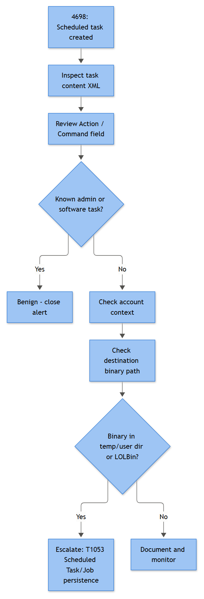

# EP-018 — Scheduled Task Persistence

## Playbook ID & Name
**EP-018** — Scheduled Task Persistence (Endpoint – Persistence & Impact)

## Business Risk
**[STAKEHOLDER]** - A scheduled task is one of the cheapest, most durable footholds an attacker can plant on a Windows host — it survives reboots, survives the user logging off, and runs with whatever privilege level the attacker managed to grab at creation time, including SYSTEM. Unlike a malicious process that gets killed once, an unaddressed scheduled task means the attacker gets to re-enter the environment on a schedule of their choosing, even after an incident responder thinks the host has been cleaned. This is also one of the most common techniques used by commodity malware loaders, ransomware affiliates for pre-detonation staging, and red team operators alike, so it shows up across almost every intrusion maturity level.

## Severity/Priority Default
**High** for task creation on servers, domain controllers, or any host running as SYSTEM/admin-equivalent with a suspicious action. **Medium** for task creation on a standard user workstation pending payload review — plenty of this is legitimate software self-updating.

## MITRE ATT&CK Technique(s)
- **T1053.005** Scheduled Task/Job: Scheduled Task (primary)
- Frequently paired with: **T1059.001** PowerShell / **T1059.003** Windows Command Shell (task action), **T1105** Ingress Tool Transfer (payload staged before task creation), **T1027** Obfuscated Files or Information (encoded task action), **T1218.005/.010/.011** System Binary Proxy Execution (mshta/regsvr32/rundll32 as the task's action), **T1071.004** Application Layer Protocol: DNS (beacon callback from the executed task), **T1562.001** Impair Defenses (if the task is used to periodically re-disable a security control)

## Trigger / Detection Logic Summary
Alert on scheduled task creation (4698) or modification (4702) where the Task Content XML contains any of: a command interpreter (`cmd.exe`, `powershell.exe`, `pwsh.exe`), a LOLBin (`mshta.exe`, `regsvr32.exe`, `rundll32.exe`, `certutil.exe`), an execution path in a user-writable location (`\AppData\`, `\Temp\`, `\ProgramData\`, `\Users\Public\`), a `-enc`/`-EncodedCommand`/`-nop`/`-w hidden` PowerShell flag, or a `RunLevel` of `HighestAvailable` combined with a Subject that is a non-admin account. Also alert on tasks created by an unexpected parent (task creation not preceded by an interactive admin session, or created via a service account that has no business touching Task Scheduler). Secondary detection layer: Sysmon 11 FileCreate under `C:\Windows\System32\Tasks\` and Sysmon 12/13 RegistryEvent under the TaskCache registry hive, which catches task creation performed via the COM `ITaskService` API or the PowerShell `ScheduledTasks` module — both of which can create a fully functional task **without ever spawning `schtasks.exe`**, so don't rely on process telemetry alone.

## Required Log Sources & Event IDs
| Source | Event ID(s) | Purpose |
|---|---|---|
| Security log | 4698, 4699, 4700, 4701, 4702 | Task created/deleted/enabled/disabled/updated, Task Content XML |
| Security log | 4688 | Process creation for `schtasks.exe`, `powershell.exe`, parent chain |
| Security log | 4624, 4672 | Logon type and privilege context of the account that created the task |
| Sysmon | 1 | Full command line + parent command line for task-creation process, if one was spawned |
| Sysmon | 11 | File creation under `C:\Windows\System32\Tasks\<TaskName>` |
| Sysmon | 12/13/14 | Registry activity under `HKLM\SOFTWARE\Microsoft\Windows NT\CurrentVersion\Schedule\TaskCache\` |
| Sysmon | 1 (at trigger time) | Process launched *by* the task when it fires — usually parented by `svchost.exe` (Schedule service) or `taskhostw.exe` |
| Sysmon | 3, 22 | Network connection / DNS query from the task's executed payload, if it phones home |

## Key Fields to Inspect
**[ANALYST]**
- **Task Name** — legitimate-sounding names copying real vendor tasks are common (`GoogleUpdateTaskMachineUA`, `OneDriveStandaloneUpdate`, `MicrosoftEdgeUpdateTaskMachineCore`), check for subtle misspellings, wrong casing, or a duplicate name in the wrong path.
- **Task Content XML → Actions → Exec → Command / Arguments** — this is the actual payload; always resolve the full command, not just the binary name.
- **Task Content XML → Triggers** — `LogonTrigger`, `BootTrigger`, `TimeTrigger` with a short `Repetition Interval` is a common beaconing pattern (e.g., every 15 minutes).
- **Task Content XML → Principal → RunLevel / UserId / LogonType** — is it set to run as SYSTEM, or with `S4U`/`Password` stored logon type?
- **Subject (4698)** — the account that created the task; compare against that account's normal duties.
- **Author** field inside the XML — sometimes retains the real creating host/user even when Subject is a service account.
- File hash and signer of the executed binary (Sysmon 1 `Hashes`, `SignatureStatus`), if this is not a script.
- Parent process at trigger time — should be `svchost.exe -k netsvcs` (hosting the Schedule service) or `taskhostw.exe`; a task whose action spawns directly from `explorer.exe` at the scheduled time is a parsing anomaly worth double-checking.

## Normal vs Suspicious Pattern
| Attribute | Normal | Suspicious |
|---|---|---|
| Creator | Software installer running as SYSTEM/admin during setup (Chrome, Adobe, backup agents) | Standard user account, or a service account outside its normal function |
| Action path | `C:\Program Files\<Vendor>\...` | `%TEMP%`, `%APPDATA%`, `C:\Users\Public\`, `C:\ProgramData\<random-looking folder>` |
| Command | Signed vendor updater binary | `powershell.exe -enc`, `mshta.exe http://...`, `rundll32.exe` with a DLL in a temp path |
| Trigger | Daily/weekly at a fixed time, or logon trigger for a startup helper | Very short repeating interval (every 5-15 min), or trigger set for odd hours (03:00-04:00) with no user activity history at that time |
| RunLevel | Matches the creating account's normal privilege | `HighestAvailable` requested by a non-admin account that shouldn't have been able to set that |
| Task visibility | Visible in Task Scheduler GUI under a sensible folder | Hidden flag set, or nested under an unrelated existing vendor folder to blend in |



*Figure F028 - deciding whether a new scheduled task is persistence or routine admin work.*

## Investigation Steps
1. Pull the full Task Content XML from the 4698 event (or from `schtasks /query /tn <name> /xml` on the live host if still present) and resolve every path/argument in the Action block.
2. Identify the creating Subject and cross-reference their 4624 logon session (Logon Type, Source Network Address) — was this an interactive session, RDP, or a remote PowerShell/WinRM session from another host?
3. Check Sysmon 1 for a process that created the task (`schtasks.exe /create`, `powershell.exe New-ScheduledTaskAction`); if none exists, check Sysmon 11/12/13 for the TaskCache file/registry writes — this confirms COM-based creation without a visible process.
4. Pivot to the executed binary/script referenced in the task action: pull its hash, check EDR/AV verdict and any threat intel match, and check Sysmon 1 for every time it has actually fired since creation (trigger history).
5. If the task has already executed, follow the resulting child process's full tree — network connections (Sysmon 3), DNS queries (Sysmon 22), file writes (Sysmon 11), and any subsequent LSASS access (Sysmon 10) or further task/service creation on the same host.
6. Check whether the same task name, hash, or C2 indicator appears on other hosts — scheduled task persistence is frequently deployed fleet-wide by a loader in one push.
7. Review command-line/script-block logs (4104/4103) if the action is PowerShell-based, to see the de-obfuscated real command rather than the encoded blob stored in the task XML.
8. Confirm whether Task Scheduler operational log or the Security audit policy itself was recently modified (4719) — some intrusions disable scheduled-task auditing before planting the task specifically to blind this detection.

## True Positive Indicators
- Task action references a binary/script in a user-writable path with no legitimate install history on that host.
- Payload hash matches known malware family, or is unsigned and was written to disk minutes before the task was created (check Sysmon 11 FileCreate timestamp against 4698 timestamp).
- Task created remotely via WinRM/PSRemoting/RDP session immediately following a suspicious 4688/Sysmon 1 chain (e.g., initial access → task creation within the same session).
- Encoded or obfuscated PowerShell in the action, decodes to a download-and-execute or C2 beacon loop.
- Task set to run as SYSTEM created by an account with no admin rights to that host under normal change management.
- Task name mimics a legitimate vendor task but path, hash, or signer doesn't match the real thing.

## False Positive / Benign Positive Indicators
- Task created during a known, change-ticketed software deployment or patch cycle (correlate with your patch management tool's own logs/timestamps).
- Action points to a properly signed vendor binary in its standard Program Files location, matching a task name that exists identically on other hosts of the same build image.
- Task created by an EDR/backup/RMM agent's own self-update routine — validate against your approved software inventory before closing.
- Repetition interval matches a documented internal automation job (e.g., internal script that syncs a share every 30 minutes) with a ticket or CMDB entry backing it.

## Escalation Criteria
Escalate to IR/Tier 2 immediately if: the task runs as SYSTEM and its action has already executed and connected outbound to a non-corporate destination; the same task/hash appears on more than one host; the task was created immediately after a phishing-related user-execution alert on the same endpoint; or the creating account is a domain admin or service account not normally associated with interactive logons on that host. Also escalate if audit policy tampering (4719) or log clearing (1102) is found in the same timeframe — that combination indicates a deliberate attempt to operate under reduced visibility.

## Containment Options & Approval Authority
**[MANAGEMENT]**
- **Delete or disable the task (4699/4701)** — Tier 1/2 analyst authority once confirmed malicious; no CAB approval needed for a confirmed-bad artifact, but must be logged in the case ticket with the full XML preserved as evidence first.
- **Isolate the host from network (EDR containment)** — Tier 2 authority for a single workstation; requires shift-lead sign-off for a server or domain controller given business-continuity impact.
- **Disable the creating account** — requires IAM/on-call manager approval if the account is a shared service account, since downstream automation may break; standard user accounts can be disabled at analyst discretion pending investigation.
- **Fleet-wide hunt and removal of the same task/hash** — SOC Manager approval to authorize a scripted removal push across multiple hosts; this is a change with blast-radius implications even though the intent is remediation.
- **Root cause remediation** (patch the initial access vector, rotate credentials used to create the task remotely) — owned by IR lead, tracked to closure with a named owner and target date, not left as an open action item.

## Example Query
Microsoft Sentinel / KQL — flag scheduled task creation with a suspicious action embedded in the Task Content XML:

```kql
SecurityEvent
| where EventID == 4698
| extend TaskXML = tostring(EventData)
| where TaskXML has_any ("powershell", "mshta", "regsvr32", "rundll32", "cmd.exe")
   and TaskXML has_any (@"\AppData\", @"\Temp\", @"\ProgramData\", @"\Users\Public\")
| project TimeGenerated, Computer, SubjectUserName, SubjectDomainName, TaskName = extract(@"<TaskName>(.*?)</TaskName>", 1, TaskXML), TaskXML
| order by TimeGenerated desc
```

## Closure Criteria
Close as **True Positive – Contained** once the task has been deleted or disabled, the payload has been hashed and submitted to your threat-intel platform, host has been scanned/reimaged per your persistence-eradication standard, and the creating account's origin has been traced and remediated. Close as **Benign Positive / Expected Activity** once the action, path, and creating account are confirmed to match a documented software deployment or internal automation job. Close as **Insufficient Evidence** only after confirming the relevant Sysmon/Security logging was actually enabled and collecting on that host at the time in question — a quiet TaskCache with no corresponding 4698 due to a retention gap is not the same as "nothing happened."

**Example case-note line:** *"4698 on WIN-FIN-042 created task 'AdobeUpdateSvc' (Subject: CORP\\j.alvarez, standard user, no local admin) running `powershell.exe -enc <b64>` from `C:\\Users\\j.alvarez\\AppData\\Roaming\\svc\\upd.ps1`, decoded via 4104 to a download-and-execute loop against 45.9.x.x over HTTPS; Sysmon 11 shows upd.ps1 dropped 40s before task creation. Task deleted, host isolated, hash submitted to TI, IR engaged for full timeline — closed True Positive, escalated."*
