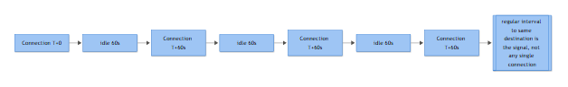

# NW-005 — Beaconing (C2 Periodic Callback Activity)

**Category:** Network | **Playbook type:** Detection & Response

## Business Risk

**[STAKEHOLDER]** - A compromised host that is quietly "checking in" with an external controller on a fixed schedule is usually the first durable evidence of a live intrusion, not a false alarm to be triaged away — left unaddressed it becomes the channel an attacker uses to pull down more tools, move laterally, or stage data for theft, and by the time it's noticed through other means (ransom note, data leak) the cost has already multiplied.

## Severity/Priority Default

**High** when the destination is unresolvable, newly registered, or already flagged by threat intel; **Medium** when the destination is a known cloud/CDN service being used in an unusual way (still needs a human to rule out C2-over-legitimate-service); downgrade to **Low** only after the source and destination pair has been explicitly whitelisted by the network engineering team with a documented business reason.

## MITRE ATT&CK Techniques

| Technique | Name | Relevance |
|---|---|---|
| T1071 | Application Layer Protocol | Beacon riding HTTP/HTTPS as cover traffic |
| T1071.004 | Application Layer Protocol: DNS | Beacon riding DNS queries/TXT responses |
| T1090 | Proxy | C2 relayed through intermediate proxy/redirector infrastructure |
| T1572 | Protocol Tunneling | C2 wrapped inside another protocol to evade egress controls |
| T1567 | Exfiltration Over Web Service | Legitimate cloud service (paste site, chat app, storage) abused as C2/exfil channel |
| T1048 | Exfiltration Over Alternative Protocol | Non-standard port/protocol used for the callback channel |
| T1105 | Ingress Tool Transfer | Follow-on stage-2 payload pulled down over the same beacon channel |
| T1027 | Obfuscated Files or Information | Encoded/encrypted beacon payload or check-in string |

## Trigger / Detection Logic Summary

Fires when a single internal host establishes repeated outbound sessions to the same external destination (or small destination pool, common with domain-fronted or CDN-hosted C2) at a statistically regular interval over a sustained observation window — typically 12-24 hours minimum, longer for low-and-slow implants. Detection is interval-based, not signature-based: the analytic looks for low variance (jitter) in time-between-connections, consistent session size/duration, and a destination that doesn't match the host's normal traffic baseline. Complementary triggers include DNS query volume spikes to a single domain with abnormally short TTLs, and TLS sessions with a JA3/JA3S fingerprint matching known C2 frameworks.



*Figure F031 - why regular interval matters more than any single connection.*

## Required Log Sources

- NGFW / firewall session (traffic) logs — source/dest IP, port, protocol, bytes, session duration, action
- Secure web gateway / proxy logs — URL, method, user-agent, TLS SNI, category, bytes sent/received
- DNS resolver query logs — queried FQDN, record type, response, client IP, TTL
- NetFlow/IPFIX or Zeek `conn.log` — flow start/end, byte counts, connection state, repeated 5-tuple frequency
- TLS/JA3 fingerprinting logs (if TLS inspection or JA3-capable sensor deployed)
- EDR network-connection telemetry, correlated to the initiating process on the endpoint (used to tie the flow back to a specific binary — no specific Windows/Sysmon event ID is asserted here; use whatever your EDR's process-network correlation event/table is called in your environment)

## Key Fields to Inspect

**[ANALYST]**

- Source host, logged-on user, and the initiating process (via EDR correlation) — is this a workstation, a server, a headless service account context?
- Destination IP/FQDN, ASN, hosting provider, domain registration date, WHOIS privacy status
- Interval regularity: time delta between consecutive sessions (mean, standard deviation, jitter %)
- Session/flow size consistency — near-identical byte counts session to session is a strong beacon signature; wildly varying sizes suggest normal browsing
- TLS SNI vs. certificate CN/SAN mismatch, self-signed or freshly issued certs
- User-Agent string — missing, generic, or inconsistent with the OS/browser actually on the host
- DNS answer TTL and query frequency — legitimate services rarely get queried every 30-60 seconds indefinitely
- Whether the destination has ever been contacted by any other host in the environment (single-host-only contact is more suspicious than org-wide)

## Normal vs Suspicious Pattern

| Attribute | Normal traffic | Suspicious beacon |
|---|---|---|
| Interval | Bursty, tied to user activity, irregular gaps | Near-fixed interval (e.g., every 60s, 300s, 3600s) with low jitter, persists overnight/weekends |
| Session size | Highly variable, correlates with page/content weight | Small, near-identical size every time (e.g., 512-900 bytes out, similar in) |
| Destination | Matches known browsing/business patterns, resolves to established CDNs/services | Rarely-visited domain, recently registered, no other host in the org talks to it |
| User correlation | Traffic tracks logged-in user's working hours | Continues when user is logged off, screen locked, or host idle |
| Protocol hygiene | Standard TLS handshake, valid cert chain, sensible SNI/host header match | SNI/cert mismatch, self-signed cert, HTTP over non-standard port, DNS TXT record abuse |

## Investigation Steps

1. Pull the full connection history for the src-dest pair over the longest retention window available; plot inter-arrival times to confirm regularity and calculate jitter — don't assume the event is malicious on volume alone.
2. Identify the initiating process/parent process on the endpoint via EDR; check binary hash, signer, install path, and whether it's persistence-backed (scheduled task, service, run key).
3. Enrich the destination — WHOIS/registration age, hosting ASN, passive DNS history, threat-intel reputation (VirusTotal, internal TI feed), and check whether the domain resolves to shared/CDN infrastructure that other legitimate services also use.
4. Check whether any other internal host has ever contacted the same destination; single-host contact against a low-reputation domain is a strong indicator.
5. Pull proxy/TLS logs for the actual payload characteristics — user-agent, SNI/cert mismatch, JA3/JA3S hash — and compare against known C2 framework fingerprints.
6. Check DNS logs around the same window for any co-occurring lookups (staging domains, secondary C2, DGA-pattern queries) that might indicate fallback channels.
7. Review host-based telemetry for lateral movement or credential access artifacts in the same timeframe — a beacon rarely arrives alone once it's had time to phone home successfully.
8. Determine dwell time: first-seen timestamp for this pattern vs. detection time — this drives both severity and whether other hosts need retroactive hunting.

## True Positive Indicators

- Regular, low-jitter interval sustained across multiple days including outside business hours
- Destination has no legitimate business justification and is recently registered or intel-flagged
- Session/flow sizes are near-identical across dozens/hundreds of connections
- Beacon continues while the user is logged off or the endpoint is locked
- Correlated endpoint artifacts: unsigned binary, unusual parent process, persistence mechanism tied to the same process making the connections

## False Positive / Benign Positive Indicators

- Legitimate monitoring/telemetry agent, MDM check-in, software update service, or licensing heartbeat with a documented, known interval
- SaaS application "keep-alive" or health-check traffic (collaboration tools, backup agents, EDR's own cloud console)
- Destination is a well-established CDN/cloud provider with heavy multi-tenant traffic from many unrelated orgs — regularity alone doesn't prove malice here
- NAT/proxy aggregation causing what looks like one "source" to actually be many hosts behind a shared egress IP — verify true internal source before concluding single-host anomaly
- Retention gaps or clock/timezone mismatches between firewall and proxy logs producing an artificially "clean" interval that doesn't hold up once corrected

## Escalation Criteria

Escalate to Incident Response when: the destination is confirmed malicious or unknown-and-unresolvable via reputable intel sources; the beaconing host also shows credential access, lateral movement, or persistence artifacts; more than one host in the environment beacons to the same or related infrastructure; or the beacon channel shows signs of an active follow-on payload pull (ingress tool transfer) rather than a static check-in.

## Containment Options & Approval Authority

**[MANAGEMENT]**

| Action | Approval Authority | Notes |
|---|---|---|
| Block destination IP/domain at firewall/proxy | SOC Lead (standing authority for confirmed-malicious indicators) | Fastest containment step, low business disruption if scoped narrowly |
| Isolate host via EDR network containment | SOC Lead, notify asset owner | Preferred over a full network block when the process/persistence hasn't been fully mapped yet |
| Disable associated user/service account | IR Lead + account owner's manager | Only if account compromise (T1078) is separately confirmed, not on beacon evidence alone |
| Full segment/VLAN isolation | CISO or designated deputy | Reserved for multi-host beaconing or suspected ongoing lateral spread |
| Domain/DNS sinkhole across the environment | Network Engineering + SOC Lead joint sign-off | Prevents re-resolution but can have unintended effect on shared infrastructure (CDN-hosted C2) |

## Example Query (Splunk SPL)

```spl
index=firewall sourcetype=fortinet_traffic action=allow
| bin _time span=1h
| stats count as hourly_count values(dest_port) as ports by src_ip, dest_ip, _time
| stats avg(hourly_count) as avg_conn stdev(hourly_count) as sd_conn dc(_time) as active_hours
    by src_ip, dest_ip
| where sd_conn < (avg_conn * 0.15) AND active_hours > 18
```

This flags src-dest pairs with connection counts that stay unusually consistent hour-over-hour (low standard deviation relative to the mean) across most of the observed day — the statistical fingerprint of a scheduled check-in rather than human-driven browsing.

## Closure Criteria

Close as **True Positive** once the destination is confirmed malicious (via TI/OSINT or sandbox detonation of a related payload), the initiating process/persistence is identified, and containment has been applied and verified (no further callback attempts observed for at least one full expected interval cycle post-block). Close as **Benign Positive** or **Expected Activity** when the destination and interval map to a documented, approved application/service and no endpoint compromise indicators are present. Close as **Insufficient Evidence** when logs don't extend far enough back to establish a reliable baseline interval and no corroborating endpoint telemetry exists — flag the host for a short-term watchlist rather than closing silently.

**Example case-note line:** "Host WKSTN-FIN-0231 (10.20.14.87) observed beaconing to update-cdn-secure[.]net (registered 9 days prior, ASN hosting known for bulletproof leasing) every 300s ±4s jitter for 36h including overnight; EDR correlation ties sessions to unsigned binary `svchost32.exe` running from `%APPDATA%`, persisted via scheduled task; blocked at proxy/firewall, host isolated via EDR, escalated to IR for full forensic triage — classified True Positive."
