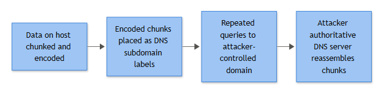

# DNS Tunnelling

## Playbook ID & Name

**NW-006 — DNS Tunnelling / Covert C2 or Exfiltration over DNS**

DNS tunnelling is the one that gets waved off as "probably just some SaaS analytics beacon" more often than any other alert in the network category, right up until someone finds 40MB of base32-encoded archive fragments sitting in a query log. It deserves a playbook of its own because the triage path is genuinely different from generic C2-over-HTTP: you are reading query *names*, not payload bytes, and the detection signal lives in entropy, volume and record-type patterns rather than in a domain reputation list.

## Business Risk

**[STAKEHOLDER]** - DNS is almost never blocked or proxied the way web traffic is, so it's one of the few channels that reliably crosses segmented networks, isolated OT zones, and guest Wi-Fi. If an attacker can get a command-and-control channel or a slow data-exfiltration path running over DNS, most of the network segmentation investment the business paid for stops mattering for that traffic. The risk isn't "a slow trickle of data" — it's that DNS tunnelling is frequently the fallback channel malware uses specifically because every other channel got blocked, which means when you see it, something has already gotten past earlier controls.

## Severity/Priority Default

**High** for confirmed tunnelling client software (iodine, dnscat2, DNSExfiltrator-style tooling) or sustained encoded-query volume to a single suspicious domain. **Medium** for a single host showing anomalous query patterns without confirmed payload encoding, pending investigation. Escalate to **Critical** if the destination domain correlates with known ransomware or APT infrastructure, or if the source host is a domain controller, jump box, or sits in a segment that should have no internet-facing DNS resolution path at all.

## MITRE ATT&CK Techniques

- **T1071.004** — Application Layer Protocol: DNS (using DNS itself as the C2 transport)
- **T1572** — Protocol Tunneling (wrapping arbitrary traffic inside DNS queries/responses)
- **T1048** — Exfiltration Over Alternative Protocol (DNS used as the exfil channel instead of the malware's normal channel)
- **T1105** — Ingress Tool Transfer (staged tooling pulled down via DNS TXT-record chunking)
- **T1090** — Proxy (DNS tunnel endpoint often doubles as a relay/proxy back to attacker infra)

## Trigger / Detection Logic Summary

Alert fires when a single internal source generates a statistically abnormal volume or shape of DNS queries against one or a small cluster of related parent domains, where the query names show high Shannon entropy, unusual length, or subdomain structure consistent with data encoding (base32/base64/hex) rather than human-typed or CDN-generated hostnames. Secondary triggers include disproportionate use of TXT, NULL, or CNAME record types (used for larger response payloads), NXDOMAIN rates far above baseline for a single apex domain, and query volume-per-host that spikes well outside the org's per-endpoint DNS baseline (tunnelling tools typically need many small queries to move meaningful data, since UDP DNS payloads are small).



*Figure F032 - data chunked into subdomain labels and reassembled.*

## Required Log Sources & Event IDs

| Source | Field/Event | Why it matters |
|---|---|---|
| DNS server logs (Windows DNS debug logging / analytic logs, or BIND query log) | Query name, query type, source IP, response code | Primary evidence — this is where the encoded payload lives |
| Sysmon | **Event ID 22** (DNSEvent - DNS query) | Ties the resolving *process* on the endpoint to the query, critical for attribution |
| Sysmon | **Event ID 3** (Network connection) | Confirms whether the resolving process also opened a direct outbound connection, or if DNS truly is the only egress path |
| Sysmon | **Event ID 1** (Process creation) | Identifies the parent process launching the suspected tunnel client |
| Firewall / proxy logs | Allowed/denied outbound port 53 and 853 (DoT) flows | Confirms whether traffic is going direct-to-internet vs through the sanctioned resolver |
| NetFlow / packet capture (if available) | Packet size distribution, query rate per minute | Confirms tunnelling behavior pattern independent of DNS log parsing quirks |
| EDR process telemetry | Command line, loaded modules | Identifies known tunnelling binaries (iodine, dnscat2, dns2tcp) or PowerShell wrapping raw socket/DNS calls |

## Key Fields to Inspect

**[ANALYST]**

- **Query name length and structure** — legit hostnames are short and readable; tunnelling payloads produce long strings of seemingly random characters, often 40-63 characters per label (DNS label limit), frequently multiple such labels chained under one apex domain.
- **Query name entropy** — a rough Shannon entropy calculation on the leftmost label; human/CDN-generated names cluster low, base32/base64 encoded payload clusters high (roughly 3.5+ bits/char is worth a second look, context-dependent).
- **Record type distribution per domain** — a domain that's 90% TXT or NULL queries from one host is not behaving like a normal website lookup.
- **Query rate per source IP per apex domain** — tunnelling needs volume; normal browsing to a domain rarely exceeds single or low-double-digit queries in a session.
- **TTL values in responses** — some tunnel servers set unusually low or zero TTLs to prevent caching, since caching would break the channel's real-time nature.
- **Apex domain registration age and NS delegation** — attacker-controlled tunnel domains are often recently registered, with NS records pointing at a bulletproof host or dynamic DNS provider.
- **Which process on the endpoint issued the query** (Sysmon Event ID 22 `Image` field) — `svchost.exe`, browsers and known agents resolving to weird domains is one thing; an unsigned binary in `%TEMP%` doing it is another.

## Normal vs Suspicious Pattern

| Normal | Suspicious |
|---|---|
| Query names are short, human-readable, match known CDNs/SaaS (`api.example.com`) | Long, high-entropy subdomains (`a8f3c91b2e4d7f01aa3c.tunnel.badinfra.example`) |
| Record types dominated by A/AAAA, occasional CNAME/MX | Disproportionate TXT/NULL record queries to one apex domain |
| Query volume per host to a given domain: low, bursty around page loads | Sustained, metronomic query volume (one query every few seconds, 24/7) regardless of user activity |
| NXDOMAIN rate low, isolated to typos/stale cache | High NXDOMAIN rate against subdomains of one apex — tunnel client fishing for a live tunnel server |
| Resolves go through the corporate DNS resolver/forwarder | Endpoint resolving directly to an external DNS server on 53/UDP, bypassing internal resolver |

## Investigation Steps

1. **Pull the raw query log** for the source host and suspect apex domain across at least a 24-48 hour window — you need volume and timing patterns, not just a single alert-triggering query.
2. **Compute or eyeball entropy/length on the query labels.** If tooling is available, run them through an entropy scorer; if not, sample 20-30 queries manually and check for base32/base64/hex character sets.
3. **Identify the resolving process** on the endpoint via Sysmon Event ID 22 or EDR process-to-network telemetry. Pull the parent process chain (Sysmon Event ID 1) — a tunnelling client is often spawned from a script, scheduled task, or a process with no legitimate reason to be doing DNS resolution directly.
4. **Check whether the host is bypassing the sanctioned resolver.** Look at firewall/proxy logs for direct outbound UDP/TCP 53 or 853 from the endpoint rather than to the internal DNS server IP — many tunnelling clients hardcode a resolver.
5. **Correlate apex domain against threat intel** — WHOIS registration date, passive DNS history, any vendor/OSINT reputation hits. A domain registered two weeks ago with wildcard NS delegation to a dynamic DNS provider is a strong signal.
6. **Attempt to reconstruct payload** if record types and volume suggest exfiltration (TXT/NULL heavy) — decode sampled labels as base32/base64 and see if you get coherent fragments (filenames, command strings, archive headers).
7. **Check egress scope** — is this one host, or the same apex domain appearing across multiple hosts (suggests malware family with DNS C2 built in, spreading laterally)? Pivot in the SIEM across all DNS logs for the same apex.
8. **Determine business justification** — check with the asset owner/app team whether any legitimate software on that host does dynamic DNS lookups, DNS-based licensing checks, or CDN failover behavior that could explain the pattern before escalating as confirmed malicious.

## True Positive Indicators

- Query labels decode cleanly to base32/base64/hex and reconstruct into recognizable file headers, command strings, or chunked archive data.
- Apex domain resolves to infrastructure already flagged in threat intel feeds, or NS delegation points to known bulletproof/dynamic DNS providers.
- Query pattern is metronomic and independent of user activity (keeps running overnight, over weekends, while user is logged off).
- Resolving process is unsigned, located in a user-writable temp/download directory, or matches known tunnelling tool signatures (iodine, dnscat2, dns2tcp) in command-line or binary hash.
- Multiple internal hosts querying the same encoded-pattern apex domain, suggesting a malware family with built-in DNS C2 rather than an isolated one-off tool.

## False Positive / Benign Positive Indicators

- Legitimate security or management agents that use DNS for health-check beaconing, licensing validation, or CDN/anycast steering (some EDR and network-optimization products genuinely do this — check the vendor's documented domains before escalating).
- Content delivery networks and ad-tech platforms that legitimately use long, semi-random-looking hostnames for cache-busting or per-session tracking (verify against known CDN domain patterns, not just "looks random").
- Split-DNS or DNS-based service discovery in containerized/Kubernetes environments generating high query volume with unusual label structure — internal, not exfiltration.
- Captive portal or Wi-Fi authentication systems using DNS-based redirect mechanisms that produce elevated NXDOMAIN and unusual query shapes for a short window.
- Insufficient Evidence closure is appropriate when entropy/volume look suspicious but the resolving process is a known-good binary and there's no corroborating egress-bypass or threat-intel hit — flag for a monitoring watchlist rather than force a verdict either direction.

## Escalation Criteria

Escalate immediately to IR/Tier 2 if: the source host is a domain controller, certificate authority, jump box, or any Tier 0/Tier 1 asset; the apex domain matches known threat actor infrastructure; payload reconstruction yields recognizable exfiltrated data (credentials, source code fragments, PII patterns); or the same tunnelling signature appears on more than one host in the same time window (suggests active spread, not an isolated test/tool).

## Containment Options & Approval Authority

**[MANAGEMENT]**

| Action | Approval Needed | Notes |
|---|---|---|
| Block apex domain at DNS resolver/firewall (sinkhole or NXDOMAIN response) | SOC Team Lead — can act immediately for confirmed malicious domains | Fast, low business impact; preferred first move |
| Isolate endpoint via EDR | SOC Team Lead, notify asset owner | Standard for confirmed tunnelling client on the host |
| Block outbound UDP/TCP 53 direct-to-internet (force all resolution through internal resolver) | Network Engineering + CISO sign-off | Broader change, can break misconfigured but legitimate apps — needs a change window unless active incident |
| Full network segment isolation (if lateral spread confirmed across multiple hosts) | IR Lead + CISO | Business-impacting; reserve for confirmed multi-host compromise |

SLA target: initial triage decision (escalate vs monitor vs close) within 4 hours of alert for Medium severity, 1 hour for High/Critical given the exfiltration risk window.

## Example Query (Splunk SPL)

Native SPL has no built-in `entropy()` eval function — running one raw will error out with `Unknown function: entropy`. Use the free "URL Toolbox" Splunkbase app's `ut_shannon()` macro (widely deployed specifically for this DNS/URL entropy use case) if it's installed; if it isn't, drop the entropy filter and lean on `label_len` plus the record-type/volume filters below, then eyeball a sample per Investigation Step 2.

```spl
index=dns sourcetype=dns_query
| eval label=mvindex(split(query,"."),0)
| eval label_len=len(label)
| eval apex_domain=mvjoin(mvindex(split(query,"."),-2,-1),".")
`ut_shannon(label)`
| rename ut_shannon as entropy
| where label_len>40 AND entropy>3.5
| stats count as query_count, values(query_type) as record_types by src_ip, apex_domain
| where query_count>50
| sort -query_count
```

`apex_domain` is derived above by taking the last two labels of the query name (`split(query,".")` with `mvindex(...,-2,-1)`), since raw DNS query logs don't come with a pre-parsed registrable-domain field. That last-two-labels heuristic under-splits on multi-part public suffixes (`.co.uk`, `.com.au` would group as one apex when they shouldn't) — if your environment sees meaningful traffic to those TLD patterns, swap in a public-suffix-list lookup instead of trusting this line as-is.

If URL Toolbox isn't installed and you have no other entropy-scoring lookup available, use this fallback (no external app required — approximates entropy via distinct-character ratio, which is weaker but catches the same base32/64/hex-heavy labels):

```spl
index=dns sourcetype=dns_query
| eval label=mvindex(split(query,"."),0)
| eval label_len=len(label)
| eval apex_domain=mvjoin(mvindex(split(query,"."),-2,-1),".")
| eval distinct_chars=mvcount(mvdedup(split(label,"")))
| eval char_ratio=round(distinct_chars/label_len,2)
| where label_len>40 AND char_ratio>0.5
| stats count as query_count, values(query_type) as record_types by src_ip, apex_domain
| where query_count>50
| sort -query_count
```

## Closure Criteria

Close as **True Positive** once the resolving process is identified, containment (domain block + host isolation as warranted) is confirmed effective, and payload/beacon reconstruction (if performed) is documented in the case. Close as **Benign Positive / Expected Activity** when the vendor or internal owner confirms the DNS pattern as documented product behavior, with the domain added to an allowlist and baseline updated to suppress future false triggers from that pattern. Close as **Insufficient Evidence** when entropy/volume indicators are present but no corroborating process, egress-bypass, or threat-intel signal materializes — add to a 14-day watchlist rather than closing silent.

**Example case note:** *"Host WKS-FIN-0231 (10.12.4.87) generated 3,140 TXT-type queries over 6 hours against apex domain updatecheck-cdn-svc[.]example, labels averaging 52 chars with entropy 4.1. Resolving process traced via Sysmon EID 22 to unsigned binary C:\Users\jsmith\AppData\Local\Temp\svcupd.exe, parent process spawned via scheduled task created 2 days prior. Domain registered 11 days ago, NS delegated to dynamic DNS provider, no vendor match. Decoded label sample reconstructed partial ZIP local file header — consistent with staged exfiltration. Escalated to IR, host isolated via EDR, domain sinkholed at resolver. Classified True Positive — T1071.004 / T1572 / T1048."*
