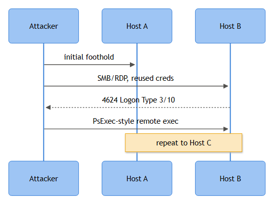

# Lateral Movement (Network View)

## Playbook ID & Name
**NW-016 — Lateral Movement (Network View)**

This playbook covers the flow/session-level signature of lateral movement: a source host establishing SMB, RDP, SSH, or WinRM sessions against a spread of internal destinations it has no established relationship with. It is the network-telemetry companion to the identity/host-based lateral movement playbook elsewhere in this book — that version is built on EDR process trees and Kerberos ticket forensics on the endpoint itself; this one is built on the assumption that all you have to start with is a firewall/NetFlow record or a Zeek `conn.log` line showing who talked to whom. In a lot of real cases that's exactly what triggers first, hours before EDR telemetry from the affected hosts even makes it into the SIEM.

## Business Risk
**[STAKEHOLDER]** - Lateral movement is the step between "one machine got popped" and "the whole environment is compromised." Every hop an attacker makes without being stopped increases blast radius, increases the number of accounts and systems that need to be rebuilt, and increases the odds they reach a domain controller or backup infrastructure before anyone notices. Catching this at the network layer — often before the destination host even shows local symptoms — is usually the cheapest point left to contain an intrusion before it becomes a full domain compromise or a ransomware event.

## Severity/Priority Default
**High** by default given the direct path to domain compromise. Escalate to **Critical** if the chain touches a domain controller, backup server, PAM/vault system, or an account with Domain Admin/Enterprise Admin rights, or if pass-the-hash/pass-the-ticket indicators are present.

## MITRE ATT&CK Techniques
- T1021.001 Remote Services: RDP
- T1021.002 Remote Services: SMB/Windows Admin Shares
- T1021.004 Remote Services: SSH
- T1550.002 Use Alternate Authentication Material: Pass the Hash (companion technique — network auth reuse without a password)
- T1550.003 Use Alternate Authentication Material: Pass the Ticket (companion technique — Kerberos ticket reuse across hosts)
- T1078.002 Valid Accounts: Domain Accounts (the credential fuel behind most confirmed cases)
- T1046 Network Service Discovery (frequent immediate precursor — see the internal recon playbook)

## Trigger / Detection Logic Summary
Correlation rule on session/flow logs: for a given source host and authenticated account, count **distinct destination hosts** contacted on lateral-movement ports (445, 3389, 22, 5985/5986, plus RPC/WMI dynamic range 135 + ephemeral) within a rolling window (commonly 10-15 minutes). A fan-out above baseline for that host's role — a workstation, not a jump host or backup server — fires the alert. A second, higher-fidelity rule chains hops: same account, host A to host B, then host B to host C, inside a short overall window, which is a much stronger signal than raw fan-out and is worth building as its own correlation search once you have session-graph tooling in the SIEM.

## Required Log Sources & Event IDs
| Source | Event ID / Field | Purpose |
|---|---|---|
| Firewall/NGFW, internal segmentation firewalls | Session/conn logs (src, dst, port, bytes, duration) | Primary fan-out and hop-chain evidence |
| NetFlow/IPFIX, Zeek `conn.log` | Flow records, `conn_state` | Surviving record once firewall logs age out |
| Windows Security (destination hosts, DCs) | 4624 (Logon — Type 3 Network / Type 10 RemoteInteractive), 4625, 4648, 4672 | Confirms authentication and privilege at each hop |
| Windows Security (file servers) | 5140 (share accessed), 5145 (detailed share access) | Admin-share use (`ADMIN$`, `C$`, `IPC$`) |
| Windows System log | 7045 (service installed) | PsExec-style remote service creation after admin-share connect |
| Sysmon | Event ID 3 (network connection), Event ID 17/18 (named pipe created/connected) | Source-side connection, PsExec/WMI pipe artifacts |
| RDP-specific operational logs | TerminalServices-RemoteConnectionManager Event 1149; LocalSessionManager Event 21/24/25 | RDP auth success, session logon/disconnect/reconnect |
| Kerberos (DC) | 4769 (service ticket request) | Correlates ticket reuse across multiple hosts (pass-the-ticket) |
| Linux/Unix syslog | `sshd` "Accepted password/publickey for user from IP port" | SSH hop evidence — no native Windows Event ID equivalent |

## Key Fields to Inspect
**[ANALYST]**
- Source and destination host/IP, destination port, protocol, session duration
- Distinct destination count per source-account pair per window — the core derived metric for this playbook
- `LogonType` in 4624 (3 = network/SMB, 10 = RemoteInteractive/RDP) and whether auth was NTLM or Kerberos
- Account name/SID reused across hops — the same account touching many hosts in minutes is the classic pattern
- Share name in 5140/5145 — admin shares (`ADMIN$`, `C$`) are a stronger signal than a mapped data share
- Service name and `ImagePath` in 7045 — random/obfuscated service names dropped in temp paths are a strong PsExec-family indicator
- Session bytes transferred — a large SMB push right before a service install suggests tool staging, not routine admin work
- Whether the source host itself has a prior alert (credential dumping, phishing, recon) in the same timeline

## Normal vs Suspicious Pattern
Normal: helpdesk/sysadmin RDP sessions originating from a documented jump host or bastion to a handful of servers during business hours; backup, SCCM, or vulnerability-scanner service accounts touching dozens of hosts nightly on a fixed, known schedule via admin shares or WinRM.
Suspicious: workstation-to-workstation RDP or SMB with no configuration-management relationship; the same account hopping across five or more distinct hosts within minutes; admin-share connections immediately followed by remote service creation; SSH between servers that have never talked before per the CMDB; any of this originating from a host recently flagged for credential access.

## Investigation Steps
1. Identify the source host and authenticated account behind the flagged fan-out; pull the full destination list with ports, protocols, and timestamps.
2. Build a session graph, not just a count — plot hops chronologically and look for chains (A→B, then B→C within minutes using the same or harvested credentials).
3. Check the account's charter: documented service account with lateral rights (backup, patch management, monitoring) versus an interactive human/workstation identity with no business touching that many hosts.
4. Correlate the authentication event at each hop (4624/4648/4769) — logon type, NTLM vs. Kerberos, and whether the same ticket or hash appears reused against multiple hosts in a way inconsistent with normal ticket lifecycle (T1550.002/.003).
5. Check for execution artifacts at each hop — 7045 service installs, named-pipe events, WMI/WinRM process creation, unexpected scheduled tasks — these turn "a connection happened" into "something ran."
6. Pull the timeline backward for a credential-access or recon precursor on the source host, and forward for follow-on suspicious activity at each destination.
7. Validate against the change calendar and CMDB for legitimate admin relationships before ruling true or false positive.
8. If confirmed, map the entire blast radius — every host touched in the chain — before scoping containment; lateral-movement cases are almost always wider than the triggering alert.



*Figure F033 - credential reuse hopping host to host.*

## True Positive Indicators
- Same compromised account or hash reused across three or more hosts with no documented admin relationship
- Admin-share connection immediately followed by remote service creation (7045) with a randomly named or obfuscated service
- RDP/SSH/WinRM sessions between peer workstations or unrelated servers with no CMDB-documented relationship
- Hop chain traceable back to a host with a prior credential-access or phishing alert
- Recognizable lateral-movement tooling artifacts (PsExec-style pipe names, WMIC-spawned processes with encoded arguments, Impacket-style SMB session behavior)

## False Positive / Benign Positive Indicators
- Source matches a documented jump host, bastion, PAM session broker, backup server, or patch-management platform with a matching schedule
- Account is a known service account with a charter covering multiple hosts (SCCM, backup agent, scanner with remote-check capability)
- Activity falls inside an approved change/maintenance/DR-test window
- Single isolated hop with a documented business reason (helpdesk remoting into one user's machine for an open ticket)

## Escalation Criteria
Escalate to Incident Response immediately if the hop chain reaches a domain controller, backup infrastructure, or PAM/vault system; pass-the-hash or pass-the-ticket indicators are present; the account used carries Domain Admin/Enterprise Admin rights; the chain spans multiple subnets or sites in a short window; or any ransomware-precursor activity (mass share enumeration, backup-deletion attempts) appears anywhere along the path.

## Containment Options & Approval Authority
**[MANAGEMENT]**
- Network isolation of the source and every confirmed hop (EDR containment or switch port shutdown) — Tier 1/2 authority under standing containment policy once two or more hosts are confirmed touched.
- Disable/force credential reset for the account used across the chain — requires IAM sign-off; if the account is a production service account, requires the owning engineering team's sign-off first to avoid breaking dependent jobs.
- Kerberos ticket invalidation or krbtgt reset for confirmed golden/silver-ticket indicators — AD team plus IR lead approval only; this is a disruptive, forest-wide action.
- Segmentation/ACL tightening between VLANs to break the observed path — Network Engineering executes, SOC scopes and justifies, Change Management approval required outside the active-incident emergency-change process.

## Example Query (Splunk SPL)
```spl
index=firewall OR index=netflow dest_port IN (445,3389,22,5985,5986)
| bin _time span=15m
| stats dc(dest_ip) as distinct_hosts, values(dest_port) as ports_used
    by src_ip, user, _time
| where distinct_hosts > 5
| sort - distinct_hosts
```

## Closure Criteria
Close as **True Positive** once every host in the confirmed hop chain is contained/remediated and IR has documented the full blast radius. Close as **Benign Positive** when the source matches a documented jump host or service account with a matching schedule and CMDB entry. Close as **Expected Activity** when tied to an approved change window. Close as **Insufficient Evidence** when flow retention has already rolled past the earlier hops or intermediate hosts lack Sysmon/EDR coverage and the account's own audit trail can't confirm or rule out interactive human use — don't force a verdict just to clear the queue.

**Example case-note line:** *"WKS-FIN-072 opened SMB admin-share sessions (ADMIN$) to 6 distinct servers between 02:14-02:19 UTC using account jchen, followed by remote service creation (Event 7045, service name 'WinUpdSvc32') on 3 of the 6; jchen holds no admin rights per IAM, and WKS-FIN-072 had an LSASS-access alert 40 minutes prior. All 6 destination hosts isolated, jchen disabled forest-wide, krbtgt reset recommended to IR lead, escalated as confirmed lateral movement linked to case INC-20260915-0104."*
