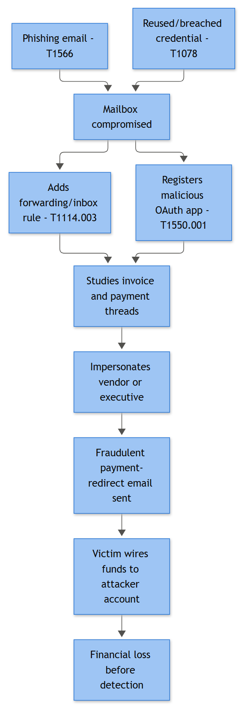

# EML-003 — Business Email Compromise (Cloud Mailbox Takeover & Financial Fraud)

## Business Risk

**[STAKEHOLDER]** - BEC is the incident type that actually moves money out the door. Unlike ransomware, there's no encrypted-file evidence forcing a conversation - the first sign is often a vendor calling to ask "did you get our invoice?" after a fraudulent wire already cleared. The FBI IC3 has ranked BEC among the highest-dollar-loss categories of cybercrime for years running, and losses are usually not recoverable once funds land in a mule account. The decision that matters most here belongs to Finance/AP and Legal, not IT: whether to place an emergency hold on any pending or recent wire transfer the moment this playbook opens, before the technical investigation even concludes.

## Severity / Priority Default

**High / P1** at open. Escalate to **Critical / P0** immediately if there is any indication of a pending, in-flight, or already-executed wire transfer, ACH change, or payroll redirection tied to the compromised mailbox.

## MITRE ATT&CK Techniques

T1078.004 (Valid Accounts: Cloud Accounts), T1110.001 / T1110.003 (Brute Force: Password Guessing / Password Spraying), T1566.001 / T1566.002 (Phishing: Attachment / Link), T1114.003 (Email Collection: Email Forwarding Rule), T1098.002 (Account Manipulation: Additional Email Delegate Permissions), T1098.001 (Additional Cloud Credentials), T1119 (Automated Collection), T1087 (Account Discovery), T1538 (Cloud Service Dashboard), T1567 (Exfiltration Over Web Service).

## Trigger / Detection Logic Summary

The scenario almost always starts one of two ways: a credential-harvesting phish (T1566.002, a fake M365/Google sign-in page) or password spraying against the tenant (T1110.003) succeeds against an account with no MFA, weak conditional access, or a legacy protocol enabled (IMAP/POP/SMTP AUTH). The detection trigger is rarely the initial logon alone - it's the *combination* of an atypical sign-in (new country, new ASN, impossible travel, non-corporate device) followed within minutes to hours by a mailbox configuration change: a new inbox rule that forwards or hides mail matching finance-related keywords, a new delegate added to the mailbox, or an MFA method/app password registered on the account. That sequence - anomalous auth + mailbox rule/permission change - is the highest-confidence BEC signal available and should fire as a correlation rule, not two separate low-priority alerts sitting in different queues.



*Figure F036 - forwarding rules and invoice fraud after mailbox compromise.*

## Required Log Sources & Event IDs

BEC investigations live almost entirely in cloud audit logs rather than Windows Event/Sysmon telemetry, so there are no Windows Event IDs in scope for this playbook.

| Source | What to pull |
|---|---|
| Microsoft 365 Unified Audit Log (Entra ID + Exchange Online) | Operations: `UserLoggedIn`, `UserLoginFailed`, `New-InboxRule`, `Set-InboxRule`, `UpdateInboxRules`, `Set-Mailbox`, `Add-MailboxPermission`, `MailItemsAccessed`, `Send`, `New-TransportRule` |
| Entra ID Sign-in Logs | Interactive + non-interactive sign-ins, risky sign-in / Identity Protection detections, legacy auth protocol usage |
| Secure Email Gateway (Defender for Office 365 / Proofpoint / Mimecast) | Phishing/URL-click verdicts, quarantine release events, lookalike-domain detections |
| Google Workspace equivalent (if tenant uses Workspace) | Login audit, Gmail settings audit (forwarding + filters), Admin audit log for delegate grants |
| CASB / DLP | External forwarding rule alerts, mass mailbox export/download events |
| Proxy / Firewall | Source IP reputation, ASN, TLS SNI to known phishing kits |

## Key Fields to Inspect

**[ANALYST]** UserPrincipalName / mailbox owner; source IPAddress, ISP/ASN, and Country on the sign-in; ClientAppUsed (flag `Other clients` / legacy IMAP/SMTP); ConditionalAccessStatus and whether MFA was satisfied or bypassed; InboxRule Parameters - specifically `ForwardTo`, `RedirectTo`, `DeleteMessage`, `StopProcessingRules`, and any `SubjectContainsWords`/`BodyContainsWords` filtering on terms like "invoice," "wire," "payment," "bank details," "urgent"; delegate/Send-As grants and to whom; MailItemsAccessed folder and message-id list (tells you exactly what the attacker read, critical for scoping data exposure); any new registered MFA method or app password (T1098.001); OAuth app consent grants added around the same window.

## Normal vs Suspicious Pattern

| Signal | Normal | Suspicious |
|---|---|---|
| Sign-in geography | Consistent country/ASN, known device | New country/ASN, anonymizer or VPS-hosted IP, device never seen before |
| Inbox rules | User-created rules for folder sorting, no external forward | Rule created outside business hours, forwards/hides mail matching finance keywords, no visible name or a name mimicking Outlook defaults (e.g., ".") |
| Delegate/Send-As | Rare, tied to admin-assistant or shared-mailbox workflows, documented | Newly added delegate with no ticket/change record, especially on an executive or AP mailbox |
| Mail volume/pattern | Steady baseline for that user | Burst of `MailItemsAccessed` across dozens of old messages in a short window (attacker searching for invoice threads) |
| Outbound email content | Normal correspondence | Payment-detail change requests sent from a legitimate-but-compromised address, or from a lookalike domain (`contoso-invoices.com` vs `contoso.com`) |

## Investigation Steps

1. Pull the full Entra ID sign-in history for the mailbox owner across the last 30 days; identify the first anomalous sign-in (new ASN/country/device) and note the exact timestamp - this is your patient-zero moment for the account.
2. Query the Unified Audit Log for every mailbox configuration change (`New-InboxRule`, `Set-Mailbox`, `Add-MailboxPermission`, MFA/app-password registration) in the 24 hours following that sign-in.
3. If a forwarding/redirect rule exists, capture its full rule definition (conditions, target address, StopProcessingRules flag) before removing it - you'll need it for the case file and for the affected-party notification.
4. Run `MailItemsAccessed` for the account across the compromise window to build the list of messages/attachments the attacker actually opened; flag anything referencing invoices, wire instructions, W-2/payroll data, or vendor bank details.
5. Check for outbound `Send` events during the window - did the attacker send anything from the mailbox? Pull recipients and content; this tells you who else may have received the fraud email.
6. Cross-reference recipients against Finance/AP contact lists and any pending vendor payments; if a payment change or wire request went out, notify Finance/Treasury immediately - do not wait for full scoping to complete.
7. Check for related tenant activity: new OAuth app consents, other mailboxes touched by the same source IP, or the same forwarding-rule pattern appearing elsewhere (attacker often hits multiple mailboxes from one password-spraying run).
8. Determine root cause of initial access (phishing click, sprayed weak password, reused credential from a breach dump) so the fix addresses the actual entry point, not just this one mailbox.

## True Positive Indicators

- Forwarding/redirect rule created shortly after an anomalous sign-in, targeting an external or freemail address, with `StopProcessingRules`/`DeleteMessage` set to hide the activity from the user.
- Sign-in from a data-center/VPS ASN or known phishing-infrastructure IP, especially where MFA was satisfied via a suspicious method (e.g., MFA fatigue, session token replay) rather than a fresh prompt.
- New delegate or Send-As grant on a finance/executive mailbox with no corresponding change ticket.
- Outbound email to a real vendor/customer altering payment or banking details, sent from the legitimate but compromised mailbox.
- Multiple mailboxes in the tenant compromised from the same source IP/ASN within a short window (password-spraying campaign, not an isolated event).

## False Positive / Benign Positive Indicators

- Legitimate travel or new device sign-in confirmed directly with the user, no mailbox rule/permission changes followed.
- Inbox rule created by the user themselves for personal organization (e.g., forwarding newsletters to a personal folder) with no finance-related keyword targeting and no external forward.
- Delegate grant tied to a documented change ticket (new executive assistant onboarding, shared-mailbox handoff).
- Sign-in flagged only for a new browser/OS fingerprint on an otherwise consistent IP/ASN - common after a corporate device refresh or browser update, not itself evidence of compromise.
- Vendor invoice-change email that, on callback verification, turns out to be a legitimate accounts-payable change (closes as Benign Positive, not every altered-invoice report is fraud).

## Escalation Criteria

Escalate to IR lead and notify Finance/Legal immediately when: a forwarding rule targeting finance keywords is confirmed, any wire/ACH/payroll change request is found in sent mail, delegate access was granted to an executive mailbox, or the same attacker infrastructure is touching more than one account. Escalate to Legal/Privacy specifically if `MailItemsAccessed` shows exposure of PII, payroll, or client data - this may trigger breach-notification obligations independent of any financial loss.

## Containment Options & Approval Authority

**[MANAGEMENT]** Tier 1 (SOC analyst authority, immediate): force password reset and revoke all active sessions/refresh tokens for the account; remove the malicious inbox rule; disable the compromised delegate grant. Tier 2 (requires IR lead sign-off): tenant-wide review/blocking of the source IP/ASN via conditional access, revocation of any newly registered MFA method or app password. Tier 3 (requires Finance/Treasury + Legal, time-critical): emergency recall or hold request to the bank on any wire initiated during the compromise window - this must happen in parallel with, not after, the technical containment, since banking recall windows are measured in hours. External notification to the impersonated vendor or affected customer requires Legal/Comms sign-off before it goes out.

## Example Query

```kql
OfficeActivity
| where TimeGenerated > ago(14d)
| where Operation in ("New-InboxRule","Set-InboxRule","UpdateInboxRules")
| where Parameters has_any ("ForwardTo","RedirectTo") 
| extend ForwardTarget = extract(@"SMTP:([^\];]+)", 1, tostring(Parameters))
| where isnotempty(ForwardTarget) and ForwardTarget !endswith "@contoso.com"
| project TimeGenerated, UserId, ClientIP, Operation, ForwardTarget
```

## Closure Criteria

Close only once: password reset and session revocation are confirmed, malicious inbox rules/delegates/MFA methods are removed and verified gone, all sent-mail fraud attempts have been traced to their recipients and those parties notified where a payment change was requested, Finance has confirmed no funds moved (or Legal/Treasury has taken over any funds-recovery workflow separately), and root cause (phishing vs. password spraying vs. credential reuse) is documented for the lessons-learned log. Valid closures include True Positive (contained, with or without completed fraud), Benign Positive (verified legitimate vendor change), and Insufficient Evidence (anomalous sign-in never corroborated by a mailbox change or user confirms travel).

**Example case-note line:** *"Sign-in from AS-14061 (Kyiv, UA) at 2026-09-11 03:14 UTC on j.alvarez@contoso.com, no MFA prompt satisfied via legacy IMAP; forwarding rule 'invoice-filter' created 03:19 UTC targeting external freemail address, StopProcessingRules=true; MailItemsAccessed shows 6 finance threads read; no outbound fraud email sent before rule removed 09:02 UTC. Password reset, sessions revoked, rule deleted, legacy auth disabled tenant-wide pending Conditional Access rollout. Closed as True Positive — contained, no funds impact."*
