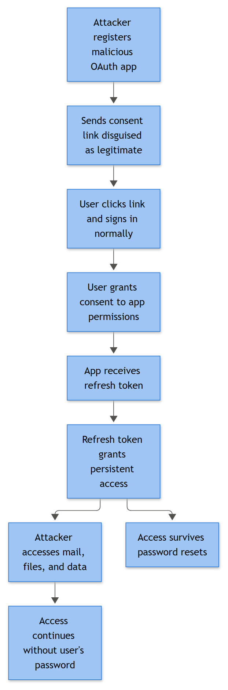

# OAuth App Abuse / Consent Phishing

## Playbook ID & Name

**EML-011 — OAuth App Abuse / Consent Phishing (Illicit Consent Grant)**

This one gets filed under Email because the lure almost always arrives as a message, but the actual compromise happens in the identity plane, not the mailbox. The user never types a password. They click a link, land on a real Microsoft or Google consent screen, and click "Accept" on a permissions list most people don't read past the second line. No credential theft, no MFA prompt to bypass, no malware to detonate. The attacker just asks nicely, in a legitimate-looking dialog, for a token that outlives any password reset you throw at the account. If your phishing detections only look for spoofed login pages, this whole technique sails past them.

## Business Risk

**[STAKEHOLDER]** - A malicious or over-permissioned OAuth app can read mail, list files, and enumerate contacts without ever triggering a password-reset-driven lockout, because the attacker isn't holding a password — they're holding a token the user handed over voluntarily. Resetting the victim's password does nothing here; the access lives at the application/service-principal layer until someone explicitly revokes the grant. Left unnoticed, this is a quiet, long-running data exposure (mailbox content, OneDrive/SharePoint files, calendar) rather than a loud ransomware event, which is exactly why it tends to be under-reported until a breach notification obligation surfaces it. Decisions to tighten tenant-wide user consent settings, or to communicate a confirmed exposure to affected business units, sit with IAM/Identity leadership or the CISO delegate — not with the analyst closing the ticket.

## Severity/Priority Default

**High** at intake for any user consent grant to an unverified publisher requesting mail, file, or directory scopes. Escalates to **Critical** if the grant is tenant-wide (admin consent), the affected account is a VIP/executive/finance mailbox, or evidence shows the app already pulled mail/file content after consent.

## MITRE ATT&CK Techniques

- T1566.002 Phishing: Link — the consent-phishing lure itself
- T1204 User Execution — user clicks through and grants consent
- T1078.004 Valid Accounts: Cloud Accounts — the resulting access rides the legitimate cloud identity, no separate "hacked account" needed
- T1550.001 Use Alternate Authentication Material: Application Access Token — the OAuth access/refresh token itself is the credential MITRE has a dedicated sub-technique for; this is the most specific ID for "consented token abused to bypass normal authentication," and it survives a password reset because it isn't password-based
- T1098.002 Account Manipulation: Additional Email Delegate Permissions — some malicious apps also add delegate/mailbox permissions post-consent
- T1114.003 Email Collection: Email Forwarding Rule — frequently added by the app itself via Graph API, not interactively
- T1567 Exfiltration Over Web Service — mailbox/file content pulled out to attacker-controlled infrastructure over the same API channel
- T1530 Data from Cloud Storage — when the granted scope includes Files.Read/Files.ReadWrite
- T1087 Account Discovery — enumeration of directory/contacts once Graph access is live
- T1538 Cloud Service Dashboard — attacker reviewing Enterprise Applications / Azure portal to check grant status pre- or post-consent

## Trigger / Detection Logic Summary

Any one of the following opens a case:

1. Entra ID Audit log shows a `Consent to application` or `Add OAuth2PermissionGrant` operation where `ConsentType` is `Principal` (single-user consent, not admin) and the granted scope includes any of: `Mail.Read`, `Mail.ReadWrite`, `Mail.Send`, `Files.Read.All`, `Files.ReadWrite.All`, `Contacts.Read`, `offline_access`.
2. The consenting application's publisher is unverified, or the app was registered in the tenant/directory within the last 30 days, or `signInAudience` is multitenant/personal-account and the app has no prior consent history in your tenant.
3. Multiple distinct users grant consent to the same `AppId` within a short window (minutes to a few hours) — a strong signal of a mass phishing campaign rather than one person adopting a SaaS tool.
4. Microsoft Defender for Cloud Apps (or equivalent CASB) fires an "OAuth app with high privilege scope" or "unusual app consent" anomaly alert.
5. Downstream pivot: a new inbox forwarding rule or a burst of `MailItemsAccessed`/Graph API calls appears in the Unified Audit Log (Microsoft Purview Audit) for a user immediately after a consent event, with no corresponding interactive sign-in from the same session — apps act on their own token, not through a browser session, so this pattern is diagnostic on its own.



*Figure F037 - persistent access via a malicious OAuth app grant.*

## Required Log Sources & Event IDs

| Source | What it gives you |
|---|---|
| Entra ID Audit logs | `Consent to application`, `Add OAuth2PermissionGrant`, `Add app role assignment to service principal`, `Add service principal`, `Update application - Certificates and secrets management` |
| Entra ID Sign-in logs | Interactive sign-in immediately preceding the consent event — user, IP, device, location, conditional access result |
| Microsoft Graph Activity Logs | API calls made by the service principal post-consent — which Graph endpoints (`/me/messages`, `/me/drive`, `/users`) it actually hit, volume, timing |
| Unified Audit Log (M365) | `New-InboxRule`, `Set-Mailbox` (ForwardingSmtpAddress), `MailItemsAccessed`, `Send` operations tied to the same mailbox |
| Microsoft Defender for Cloud Apps / CASB | OAuth app risk scoring, anomaly detection, app-to-app data movement |
| Web proxy / URL click logs (Safe Links or equivalent) | The original lure link and redirect chain that led to the consent screen |
| Enterprise Applications registry (Entra ID admin center) | App metadata: publisher verification status, redirect URIs, requested scopes, creation date, sign-in audience |

## Key Fields to Inspect

**[ANALYST]**

- `AppId` / `AppDisplayName` — check the exact display name against known brands; consent-phishing apps commonly use names like "Office 365 Security" or "DocuSign Connector" that mimic legitimate integrations but resolve to an unrelated `AppId`.
- `ConsentType` — `AllPrincipals` (tenant-wide admin consent) versus `Principal` (single user). A single-user consent to a high-risk scope is the core signature of this playbook.
- `Permissions` / delegated scope list on the grant — specifically whether `offline_access` is present (issues a refresh token, meaning access persists well beyond the browser session and survives a normal password change).
- Publisher verification status and `signInAudience` on the app registration — unverified + multitenant is the classic combination for phishing-kit apps.
- Redirect URI (`ReplyUrls`) — pointing to a non-Microsoft domain, a URL shortener, or a domain registered days before the campaign.
- `IPAddress` and `UserAgent` on the consent event itself, and whether that IP matches the user's normal baseline.
- Graph Activity Logs: endpoint path, response size, and call frequency in the hours after consent — a jump to `/me/messages?$top=999` style paging calls is a data-pull pattern, not a UI-driven click pattern.
- Unified Audit Log `ClientAppId` field on any inbox rule or mailbox change created afterward — confirms whether the app itself made the change versus the user doing it interactively.

## Normal vs Suspicious Pattern

| Normal | Suspicious |
|---|---|
| Admin consent (tenant-wide) for a known, verified-publisher SaaS app already in the approved app catalog | Single-user consent to an unverified publisher, scopes never seen granted before in this tenant |
| Requested scope limited to `User.Read` / `profile` / `openid` (basic sign-in) | Requested scope includes `Mail.Read`, `Files.ReadWrite.All`, `Contacts.Read`, and `offline_access` together |
| App registration months/years old with a consistent history of use across the tenant | App created in the last few days/weeks, no prior grants, generic or brand-mimicking display name |
| Consent follows a deliberate IT-led procurement/reauthorization process | Consent follows a click on a link from an unsolicited email, shared document notification, or "review this file" style lure |
| Graph API calls from the service principal match the app's stated purpose and stay within normal volume | Graph calls hit mail/file endpoints at high volume within minutes of consent, from an ASN/region unrelated to the app vendor |
| Inbox rules and forwarding created interactively by the user, visible in a normal OWA/Outlook session | Inbox rule or forwarding change attributed to the app's `ClientAppId`, with no matching interactive session |

## Investigation Steps

1. Pull the Entra ID Audit log entry for the consent event — capture `AppId`, exact permission scope, `ConsentType`, actor UPN, source IP, and timestamp. This is the anchor record for the whole case.
2. Check the app registration in Enterprise Applications: publisher verification status, creation date, `signInAudience`, redirect URIs, and any other tenants/users it's already been granted to. An app that's brand new and unverified with broad scope is a strong early signal on its own.
3. Query Microsoft Graph Activity Logs for the service principal's `AppId` for the period immediately following consent — identify which endpoints were called, response volumes, and source IP/ASN. This tells you whether the app actually did anything or just sat there with an unused grant.
4. Search the Unified Audit Log for the same user for `New-InboxRule`, forwarding changes, and spikes in `MailItemsAccessed` in the hours/days after consent, and check whether those changes are attributed to the app's `ClientAppId` rather than an interactive session.
5. Determine scope of the campaign: query Entra ID Audit logs tenant-wide for the same `AppId` across all users in the same time window. Isolated single-user shadow-IT adoption reads very differently from twenty users consenting within a ten-minute span off the same phishing link.
6. Pivot back to the lure: check Safe Links/URL click telemetry and message trace for the email or Teams/SharePoint notification that carried the consent link, to identify the original delivery vector and any other recipients who received but haven't yet clicked.
7. Cross-check Defender for Cloud Apps or CASB anomaly alerts for the same `AppId` or IP — vendor risk scoring often has more context (known malicious infrastructure, prior campaigns) than the raw audit trail alone.
8. If mail or file scope was granted and API activity confirms access, quantify what was actually touched — message count, folders accessed, files listed/downloaded — for the breach-scoping conversation with IAM/legal.

## True Positive Indicators

- Unverified publisher, app created recently, requesting `offline_access` plus mail or file read/write scope, granted via single-user (not admin) consent.
- Display name impersonates a known brand or internal tool but resolves to an unrelated `AppId`/publisher domain.
- Graph Activity Logs show high-volume calls to mail or file endpoints within minutes of consent, from an IP/ASN with no legitimate business tie to the stated app vendor.
- Inbox rule or forwarding change attributed to the app's `ClientAppId` with no corresponding interactive user session.
- Same `AppId` consented to by multiple users in a tight time window, all originating from the same phishing link or campaign infrastructure.

## False Positive / Benign Positive Indicators

- Verified-publisher app with narrow scope (`User.Read` only) consented to as part of a legitimate SaaS onboarding — shadow IT, but benign; route to IT/vendor-management for retroactive approval rather than treating as an incident.
- Re-consent event triggered by a routine app update that added a new, low-risk scope to an already-trusted, long-standing integration.
- Admin-approved test/pilot app in a sandbox tenant, consented to by an app developer as part of expected testing — confirm against change records before assuming malicious intent.
- Insufficient Evidence closure applies when the consent event is found but Graph Activity Logs have already aged out of retention and no downstream mailbox/file activity can be correlated — document what was checked and the retention gap, and flag the retention limit itself as a gap worth raising with IAM.

## Escalation Criteria

Escalate to Incident Response / Tier 3 or IAM leadership immediately if any of:

- Tenant-wide (admin) consent was granted to an unverified or malicious app, exposing the whole directory rather than one mailbox.
- Confirmed data access (mail content read, files listed/downloaded) rather than just an unused grant.
- The consenting user holds a privileged role, or the mailbox belongs to an executive, finance approver, or legal counsel.
- The same `AppId` shows consent grants across multiple business units or a double-digit user count, indicating an active org-wide campaign.
- Evidence the app added a forwarding rule or delegate permission autonomously — this typically means active, ongoing collection, not a one-time pull.

## Containment Options & Approval Authority

**[MANAGEMENT]**

| Action | Who approves |
|---|---|
| Revoke the OAuth2 permission grant / disable the service principal for the confirmed malicious `AppId` | SOC shift lead, immediate action for confirmed malicious verdict, no additional sign-off needed |
| Revoke user's refresh tokens / sign-in sessions (`Revoke-MgUserSignInSession` or portal equivalent) | SOC shift lead; notify the user and their manager |
| Remove app-created inbox rule or forwarding | SOC shift lead, coordinate with M365 admin |
| Delete/ban the app tenant-wide (`Remove-MgServicePrincipal` or Enterprise Applications block) | SOC manager or IAM team, since this affects any other tenant users who may have legitimately consented |
| Tighten tenant-wide user consent policy (require admin consent for all future app grants) | IAM/Identity leadership or CISO delegate — this is a policy change with organization-wide friction, not a per-incident containment step |
| Notify affected users / executive communication if data exposure confirmed | SOC manager plus comms/legal, depending on data sensitivity and breach-notification obligations |
| Force password reset | Optional and secondary here — note in the case that password reset alone does **not** revoke the OAuth grant; token revocation is the actual containment action |

## Example Query

Microsoft Sentinel / Entra ID Audit logs (KQL) — find single-user consent events granting high-risk scopes:

```kusto
AuditLogs
| where OperationName == "Consent to application"
// modifiedProperties array order is not guaranteed to be stable across tenants/schema versions -
// confirm the [0]/[1] index positions against the raw TargetResources JSON for your tenant before
// trusting this in production; matching on modifiedProperties[*].displayName is more robust than a fixed index.
| extend Scope = tostring(TargetResources[0].modifiedProperties[0].newValue)
| extend ConsentType = tostring(TargetResources[0].modifiedProperties[1].newValue)
| where Scope has_any ("Mail.Read", "Mail.ReadWrite", "Files.ReadWrite.All", "offline_access")
| where ConsentType has "Principal"
| project TimeGenerated, InitiatedBy, TargetResources, Scope, ConsentType
```

## Closure Criteria

Close only after: the app's actual scope and post-consent Graph activity have been reviewed (confirmed access vs. unused grant), the grant has been revoked or explicitly approved and documented as legitimate, any app-created inbox rule/forwarding has been removed, and — for confirmed malicious cases — the campaign's full affected-user list has been pulled tenant-wide rather than closing on the single reported case. Attach the `AppId`, scope list, and consent timestamp to the case regardless of verdict.

**Example case note:**
`2026-09-15 10:41 UTC - User d.oyelaran@example.com consented to app "Office365 DocSync" (AppId 3f2a9c1e-...), unverified publisher, registered 6 days prior, scope Mail.Read+Files.ReadWrite.All+offline_access, ConsentType=Principal. Graph Activity Logs show /me/messages paging calls totaling ~1,400 messages within 12 minutes of consent, source IP 185.220.x.x (no prior tenant history). Tenant-wide AppId search found 4 additional users consented via same phishing link (SharePoint "shared file" lure, message trace confirms delivery 09:58-10:05 UTC). Service principal disabled, refresh tokens revoked for all 5 users, forwarding rule found on 1 mailbox and removed. Escalated to IAM for tenant-wide consent policy review. Closed as True Positive; mailbox content accessed, campaign scoped and contained.`
