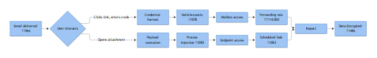

# Playbook: Phishing

## Playbook ID & Name

**EML-001 — Phishing (General / Commodity Email-Borne Initial Access)**

Category: Email

This is the umbrella playbook for a reported or filter-flagged phishing email where you don't yet know what flavor you're dealing with. If triage confirms this is a targeted spear-phish against a specific executive, an active BEC mailbox takeover, a mailbox-forwarding-rule abuse case, or an OAuth consent-phishing attempt, hand off to the matching sibling playbook in this category — this one exists to get you from "someone reported a weird email" to "here's what it actually is" as fast as possible.

## Business Risk

**[STAKEHOLDER]** - Phishing is still the cheapest, most reliable way for an outsider to get a foothold inside the business, because it targets a person, not a firewall rule. One click can hand an attacker a working set of credentials, a beachhead on an endpoint, or both — and from there the cost stops being "an email" and starts being incident response hours, potential regulatory notification if data moves, and reputational damage if a compromised account is used to attack customers or partners. The decision point for leadership isn't "did we get phished" (you will, repeatedly) — it's how fast the loop closes between click and containment.

## Severity/Priority Default

- **Low/Medium** — user-reported suspicious email, not yet delivered to other mailboxes, no click/open confirmed, gateway verdict pending or benign.
- **Medium/High** — confirmed malicious verdict (gateway or sandbox), delivered to multiple mailboxes, at least one recipient opened the message, but no click, credential entry, or execution confirmed yet.
- **High** — confirmed click-through on a malicious link, attachment opened on an endpoint, or any follow-on endpoint execution chain observed.
- **Critical** — confirmed credential submission on a phishing page, subsequent sign-in from unfamiliar infrastructure, malware execution with network callback, or the targeted mailbox belongs to finance, executive, or an account with elevated mailbox/application permissions.

## MITRE ATT&CK Techniques

Primary (delivery and execution):
- **T1566 Phishing** (.001 Attachment, .002 Link)
- **T1204 User Execution** — opening the attachment or clicking the link
- **T1027 Obfuscated Files or Information** — obfuscated macro/script inside the lure document
- **T1059 Command and Scripting Interpreter** (.001 PowerShell, .003 Windows Command Shell) — spawned from the attachment's execution chain
- **T1218 System Binary Proxy Execution** (.005 Mshta, .010 Regsvr32, .011 Rundll32) — living-off-the-land execution stages seen in malicious attachment chains
- **T1105 Ingress Tool Transfer** — second-stage payload download following initial execution

Follow-on (only if credential harvest or mailbox access is confirmed — pivot to the specialized playbook once identified):
- **T1078 Valid Accounts** (.002 Domain Accounts, .004 Cloud Accounts) — harvested credential reused
- **T1552.001** Unsecured Credentials: Credentials In Files — credential-harvesting form or dropped creds file
- **T1114.003** Email Forwarding Rule, **T1098.002** Additional Email Delegate Permissions, **T1098.001** Additional Cloud Credentials — mailbox weaponization after takeover
- **T1562.001** Impair Defenses — malware disabling local AV/EDR post-execution
- **T1136** Create Account — attacker-created identity for persistence after account compromise

## Trigger / Detection Logic Summary

Two entry points, and they should both land in the same queue:

1. **User-reported** — Report Message/Report Phishing button submission, or a forward to the abuse mailbox/helpdesk ticket. This is still the single highest-volume and often fastest-to-fire trigger in most environments, because a human noticed something off before any control did.
2. **Filter/gateway-driven** — Secure Email Gateway (Defender for Office 365, Proofpoint, Mimecast, or equivalent) fires on a malicious verdict, a known-bad sender/URL/attachment hash, an impersonation heuristic (display name spoof, lookalike domain, newly registered sending domain), or a post-delivery detonation result that downgrades a message already sitting in inboxes.

Correlation logic worth building regardless of vendor: group alerts by `NetworkMessageId` (or vendor equivalent) so that one phishing campaign delivered to forty mailboxes shows up as one case with forty recipients, not forty separate tickets.



*Figure F035 - delivery to interaction to follow-on access.*

## Required Log Sources & Event Types

| Source | Key Data | Purpose |
|---|---|---|
| Secure Email Gateway / Defender for Office 365 (or Proofpoint, Mimecast) | Delivery/quarantine verdict, URL click-time verdict, attachment sandbox/detonation result | Primary detection surface, confirms whether message was ever actually delivered |
| Microsoft Purview Audit (Unified Audit Log, M365) / Exchange mailbox audit | `MailItemsAccessed`, `Send`, `New-InboxRule`, `Set-InboxRule`, `Set-Mailbox` (forwarding), `Add-MailboxPermission`, `Add-RecipientPermission` | Detects follow-on mailbox weaponization if account was compromised |
| Entra ID sign-in logs (or equivalent IdP) | IP, ASN, geolocation, device compliance, MFA result, legacy-auth protocol flag, risk detection | Confirms whether harvested credentials were actually used to authenticate |
| Endpoint EDR telemetry | Process creation chain, parent-child relationships, outbound network connections | Confirms whether attachment/link resulted in code execution on the host |
| DNS / Web proxy logs | Resolution and connection attempts to the phishing/C2 infrastructure | Confirms scope beyond the reporting user, catches silent clicks |
| Abuse mailbox / ticketing system | Original report, reporter identity, submission timestamp | Source of truth for the human-reported trigger, and for scoping "who else got this" |

## Key Fields to Inspect

**[ANALYST]** -

- **Full message headers** (not a forward, not a screenshot — get the `.eml` or a proper message trace): `Authentication-Results` (SPF/DKIM/DMARC pass/fail and alignment), the `Received` chain for the true originating IP versus the display sender, `Return-Path` and `Reply-To` divergence from the `From` address.
- **Sending domain** — exact string comparison against the legitimate domain (lookalike substitution, added hyphen, wrong TLD), and domain registration age if available from threat intel.
- **URL data** — the rewritten/Safe-Links-style URL versus the original destination in the raw message, click timestamp versus delivery timestamp, and the detonation verdict for that URL.
- **Attachment data** — file hash, true file type versus displayed extension, presence of macros or embedded objects, sandbox verdict.
- **Recipient list for the same `NetworkMessageId`** — every mailbox that received the identical or near-identical message, not just the one that reported it.
- **Post-click sign-in telemetry** for any user confirmed to have clicked: source IP/ASN, whether MFA was satisfied or a legacy/non-interactive auth protocol was used to bypass it, device compliance state.
- **Mailbox audit trail** in the hours following a suspected click, for any user whose credentials may have landed on a harvesting page: new inbox rules, forwarding changes, delegate/permission grants.

## Normal vs Suspicious Pattern

| Normal | Suspicious |
|---|---|
| Newsletter, vendor marketing, or internal comms flagged by an aggressive filter — SPF/DKIM pass, sending domain matches the known vendor exactly | Sending domain is a one-character-off lookalike (`northwind-aero.com` vs `northw1nd-aero.com`), or display name says "IT Helpdesk" but the address resolves to a free webmail domain |
| Internal phishing-simulation platform (KnowBe4, Defender simulation, Proofpoint Security Awareness) — check the known simulation sender list/header marker before escalating | SPF/DKIM fail with no alignment, or pass on an unrelated third-party domain relaying the message |
| Legitimate password-reset or MFA-registration email tied to a change the user actually initiated (helpdesk ticket exists) | Urgency/authority pretext (invoice overdue, account suspension, executive request) paired with a link to a credential-entry page hosted on infrastructure unrelated to the claimed sender |
| One or two recipients, consistent with normal internal distribution | Same message, same or near-identical body, delivered to a wide and seemingly unrelated set of mailboxes in a short window — classic spray |
| Click occurs, but destination resolves to a known, reputable domain the recipient does business with | Click occurs, and the endpoint or sign-in logs show follow-on activity (new process spawn, unfamiliar-ASN authentication) within minutes of the click |

## Investigation Steps

1. Pull the original message artifact — `.eml` or full message trace via the gateway/M365 console, not a forwarded copy — and confirm current delivery status (delivered, quarantined, junk, already purged).
2. Inspect headers for SPF/DKIM/DMARC alignment, true originating IP, and sender/Reply-To/Return-Path mismatches; compare the sending domain character-by-character against the legitimate domain.
3. Establish blast radius: query the gateway or Unified Audit Log for every recipient sharing the same `NetworkMessageId` (or matching sender/subject/body-hash if that field isn't available) across the tenant — this is very often larger than the one person who reported it.
4. Check click/open telemetry for every recipient: who clicked the link, who opened the attachment, and when, relative to delivery. Pull the sandbox/detonation verdict for the URL or attachment if not already resolved.
5. For any user who clicked or opened the payload, pull endpoint EDR telemetry for a resulting execution chain (unexpected child process, script interpreter, LOLBin usage) and check sign-in logs for authentication from an IP/ASN inconsistent with that user's normal pattern.
6. If credential submission is suspected or confirmed, check mailbox audit logs for that user for new inbox rules, forwarding changes, or delegate/permission grants in the hours following the click — this is the handoff point to the Credential Phishing or Account Takeover playbook.
7. Determine why the message reached the inbox in the first place (new/unlisted domain, compromised legitimate partner account, typosquat not yet on any blocklist) — this feeds directly into gateway rule tuning, not just this case's closure.
8. Document full scope (recipients, clicks, executions, confirmed compromises) before writing disposition; this record is what the containment and comms decisions below get built on.

## True Positive Indicators

- Lookalike or spoofed sending domain, or SPF/DKIM failure without valid alignment
- Urgency, authority, or reward pretext paired with a credential-entry page or payload delivery link
- Gateway or sandbox verdict of malicious for the URL or attachment
- Confirmed click-through followed by credential submission, or attachment execution followed by an endpoint process chain
- Message delivered to an unusually broad or seemingly random set of recipients in a short window
- Sign-in from unfamiliar IP/ASN shortly after a confirmed click, especially where a legacy authentication protocol bypassed MFA

## False Positive / Benign Positive Indicators

- Internal phishing-simulation platform traffic — confirm against the known simulation sender/header allowlist before spending further time
- Legitimate marketing, newsletter, or automated notification caught by an aggressive heuristic, with clean SPF/DKIM/DMARC alignment on the real vendor domain
- Vendor or partner domain migration (new mail provider, new SPF record) temporarily breaking alignment on genuinely legitimate mail — verify with the vendor relationship owner before whitelisting
- User reported a legitimately odd but authentic internal email (unusual wording from a non-native English speaker, a new automated system nobody documented)

## Escalation Criteria

Escalate to Incident Response when: credential submission or malware execution is confirmed; the affected mailbox belongs to an executive, finance, or an account holding elevated mailbox/application permissions (route to Executive Impersonation or BEC playbook as appropriate); the blast radius extends beyond a handful of recipients; a sign-in from suspicious infrastructure follows a confirmed click; or mailbox audit shows a new forwarding rule, inbox rule, or delegate permission change following the incident (route to Mailbox Forwarding Rule Abuse or Account Takeover playbook).

## Containment Options & Approval Authority

**[MANAGEMENT]** -

| Action | Who Can Approve | Notes |
|---|---|---|
| Purge message tenant-wide from all mailboxes | SOC Analyst (standing authority via gateway/Defender purge tooling) | Fastest and lowest-risk first move once verdict is confirmed malicious |
| Block sender domain / URL at the gateway | Email Security Engineering on-call | Coordinate if the domain has any legitimate secondary use (shared hosting, URL shortener) |
| Force password reset and revoke active sessions | IAM lead | Mandatory once credential submission is confirmed, not optional |
| Disable/quarantine affected account pending investigation | IAM lead + IR lead joint sign-off | Business-impact check first — don't disable an on-call or executive account without a heads-up |
| Isolate affected endpoint | Endpoint/IR on-call | Applies where attachment execution or a process chain is confirmed |
| Organization-wide user notification / awareness comms | Security Awareness team, with Management sign-off for large blast radius | Balance urgency against panic — coordinate wording with Comms for exec-targeted cases |

## Example Query (KQL — Microsoft Sentinel / Defender for Office 365)

```kql
EmailEvents
| where ThreatTypes has "Phish" or LatestDeliveryLocation == "Junk"
| join kind=inner (EmailUrlInfo) on NetworkMessageId
| join kind=inner (UrlClickEvents | where ActionType == "ClickAllowed" or ActionType == "ClickBlocked")
    on NetworkMessageId
| project Timestamp, RecipientEmailAddress, SenderFromAddress, Url, ActionType, NetworkMessageId
| join kind=inner (SigninLogs | where ResultType == "0") on
    $left.RecipientEmailAddress == $right.UserPrincipalName
| where TimeGenerated between (Timestamp .. Timestamp + 30m)
| project Timestamp, RecipientEmailAddress, Url, ActionType, TimeGenerated, IPAddress, Location
```

This joins delivered-and-flagged phishing mail to click events, then checks for any sign-in against the recipient's account within 30 minutes of the click — a fast way to surface "clicked and then authenticated from somewhere odd" without waiting for a separate identity alert to fire.

*Note: `SigninLogs.ResultType` is a string field ("0" = success), not an int — compare as `"0"`, not `0`, or the filter silently returns nothing.*

## Closure Criteria

Close as **True Positive** once blast radius, click/execution/credential outcome, and containment actions (purge, block, reset, isolate as warranted) are all documented and confirmed applied — this covers both a message that led to a real click/compromise and one that was confirmed malicious but purged before any recipient clicked, opened, or entered credentials; note which case it was in the closing note rather than inventing a separate label for it. Close as **Benign Positive** when traced to a known simulation platform or a legitimate sender with a filter false-positive, naming the platform or vendor confirmed. Close as **Insufficient Evidence** only when the original message can no longer be retrieved (past retention, already purged by the user) and no downstream sign-in or endpoint indicator exists — flag the sender/domain for a watchlist rather than dropping it silently.

**Example case-note line:** *"2026-09-15 09:47 UTC — User rlin@northwind-aero.com reported email from 'IT Service Desk' <helpdesk@northw1nd-aero.com> (lookalike domain, SPF fail, no DKIM). Gateway trace shows delivery to 6 mailboxes; 1 click confirmed (jsantos@northwind-aero.com, 09:52 UTC) on hxxps://secure-0365-verify[.]com; sign-in log shows successful auth for jsantos from 203.0.113.44 (unfamiliar ASN, legacy auth, no MFA challenge) at 09:55 UTC. Message purged tenant-wide, sender domain blocked at gateway, jsantos password reset and sessions revoked, no inbox rule changes found on mailbox audit. Escalated to IR for account-takeover scope-check per Credential Phishing playbook. Closed as True Positive (compromise confirmed and contained); remaining 5 recipients confirmed no click, closed as Benign Positive for those mailboxes."*
