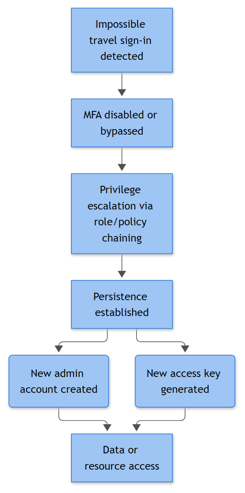
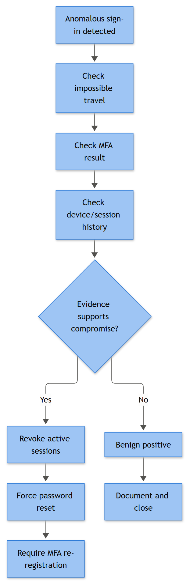

# CLD-007: Impossible Travel (Cloud Sign-In)

**Category:** Cloud (AWS / Azure / M365 / Entra ID / GCP)

## Business Risk

**[STAKEHOLDER]** - A user account authenticating from two locations that no human being can physically travel between in the elapsed time almost always means the password (and often the session token) is in someone else's hands, not the legitimate user's. This is one of the highest-signal, lowest-cost detections available in a cloud identity stack - it needs no new tooling, most providers calculate it natively, and it catches account takeover early, before the attacker gets to mailbox rules, file exfiltration, or MFA fatigue attacks. The business exposure isn't the sign-in itself, it's everything that account is allowed to touch afterward: shared mailboxes, SharePoint/OneDrive, admin consoles, financial systems. Who decides whether to force a password reset and kill sessions on a live business user without warning is usually the SOC shift lead under standing authorization - waiting for approval on this one defeats the point.

## Severity / Priority Default

**High / P2** on initial detection for a standard user; escalates to **Critical / P1** if the account holds any administrative role, if MFA was satisfied on the "impossible" sign-in (not just password), or if post-sign-in activity includes mailbox rule creation, new app consent, or MFA method changes.

## MITRE ATT&CK Techniques

T1078.004 (Valid Accounts: Cloud Accounts) - the technique this alert directly represents. Commonly preceded by T1110.001 (Password Guessing) or T1110.003 (Password Spraying), and commonly followed, if the takeover is real, by T1098.001 (Additional Cloud Credentials), T1114.003 (Email Forwarding Rule), or T1538 (Cloud Service Dashboard) as the attacker orients themselves in the tenant.



*Figure F038 - impossible travel through to persistence.*

## Trigger / Detection Logic Summary

Two (or more) successful, non-interactive-excluded sign-ins for the same identity, from geographically distant locations, within a time window too short for actual travel between them at any plausible speed (commercial flight ceiling is generally used as the outer bound, roughly 900-1000 km/h, with padding for connection times). Most platforms expose this natively rather than requiring you to build it from scratch:

- **Entra ID / M365** - Identity Protection's built-in `riskEventType: unlikelyTravel` (surfaced to analysts as "Atypical travel" / impossible travel risk detection) in `RiskyUsers` / `UserRiskEvents` / `AADUserRiskEvents`, correlated against `SigninLogs`.
- **AWS** - no native impossible-travel detection; build it in the SIEM/GuardDuty by comparing consecutive `ConsoleLogin` / `GetSessionToken` events' `sourceIPAddress` geo-resolution and `eventTime` delta for the same `userIdentity.arn`.
- **GCP** - Cloud Identity/Workspace login audit records compared the same way; Security Command Center can surface anomalous location findings for some editions.
- **Okta** (if it sits in front of the cloud apps) - `user.session.start` events carrying `client.geographicalContext` compared across consecutive sessions.

The core detection logic is always: same principal, two successful auths, distance/time ratio exceeds a physically plausible travel speed threshold.

## Required Log Sources & Event Data

| Platform | Source | Key Fields / Identifiers |
|---|---|---|
| Entra ID / M365 | Sign-in logs, Identity Protection risk detections, Unified Audit Log (Purview) | `riskEventType = unlikelyTravel`, `SigninLogs` (`Location`, `IPAddress`, `ResultType`), UAL operation `UserLoggedIn` |
| AWS | CloudTrail (management events) | `eventName = ConsoleLogin` / `GetSessionToken`, `sourceIPAddress`, `userIdentity.arn`, `additionalEventData.MFAUsed` |
| GCP | Cloud Identity login audit log, Cloud Audit Logs | `protoPayload.authenticationInfo.principalEmail`, login event `ipAddress`, `loginType` |
| Okta (if applicable) | System Log | `eventType = user.session.start`, `client.geographicalContext`, `client.ipAddress` |
| Network/Threat intel enrichment | Internal or third-party IP geolocation/ASN feed | Needed to validate or challenge the platform's own geo-resolution - this is where most false positives get resolved or confirmed |

## Key Fields to Inspect

**[ANALYST]**
- `userPrincipalName` / `userIdentity.arn` - confirm it's a real human identity, not a service principal or shared/break-glass account (those get excluded from this detection for good reason - they legitimately hop IPs).
- `ipAddress` (both events) - resolve ASN/owner, not just city. A "Seattle" and "Dublin" pair from the same corporate VPN provider's egress pool is a different story than two unrelated residential ISPs.
- `location` (city/state/country as resolved by the platform) - cross-check against a second geo-IP source before trusting either blindly (e.g., ipinfo.io, ip-api.com, or your TIP's IP-enrichment module - anything independent of the platform that generated the alert); MaxMind/GeoIP2-style databases lag on newly assigned ranges and get carrier NAT wrong constantly.
- `deviceDetail` (`deviceId`, `trustType`, `isCompliant`, `isManaged`) - known corporate device on one leg, unknown/non-compliant on the other is a strong signal.
- `clientAppUsed` / `appDisplayName` and `isInteractive` - non-interactive sign-ins (background token refresh, Exchange Online backend hops) frequently trigger false impossible-travel because Microsoft's own infrastructure relays traffic through multiple regions; interactive sign-ins on both legs raise real concern.
- `authenticationRequirement` / `conditionalAccessStatus` / `mfaAuthenticated` - was MFA actually satisfied on the anomalous sign-in, or just password? MFA-satisfied on the "impossible" leg is worse, not better - it usually means MFA fatigue, a stolen session token, or SIM-swap-enabled SMS interception.
- `correlationId` - pull every event with the same correlation ID to see the full auth flow, not just the summary risk event.
- Time delta between the two sign-ins and calculated distance/speed - do this math yourself, don't just trust the platform's risk label at face value.

## Normal vs Suspicious Pattern

| Normal | Suspicious |
|---|---|
| Single location per session, consistent with known travel (calendar shows the user flew to a conference), device is a known managed laptop | Two interactive sign-ins, incompatible geography, time delta physically impossible, no travel record, no calendar entry |
| Location "jump" explained by VPN client reconnecting to a different exit node, or mobile carrier CGNAT reassigning IP mid-session | Location jump paired with a new/unrecognized device ID or a newly registered MFA method |
| Non-interactive sign-in flagged due to Microsoft/Google backend infrastructure relaying across regions | Interactive sign-in flagged, followed within minutes by mailbox rule creation, app consent, or new credential/MFA method addition |
| User confirms travel when contacted, previous sign-in pattern already showed the departure location | User denies both sign-ins, or denies the second one specifically |

## Investigation Steps

1. Pull both (or all) flagged sign-in events in full, not just the risk detection summary - get IP, ASN, device, client app, MFA status, and `correlationId` for each.
2. Independently verify the geolocation of both IPs against a second source; check ASN ownership (residential ISP, hosting provider, VPN provider, mobile carrier, or corporate range).
3. Calculate the actual required travel speed between the two points and time delta - confirm it genuinely exceeds plausible travel, don't accept the platform's label uncritically (geo-IP databases misplace IPs more often than people expect). Do this with: `speed_kmh = great_circle_distance_km / (time_delta_hours)`, using the great-circle (haversine) distance between the two resolved lat/long pairs - most geo-IP lookups return lat/long directly, or you can drop both city names into any online great-circle distance calculator. Compare the result against the ~900-1000 km/h commercial-flight ceiling from the Trigger section above. Worked example matching this playbook's case note: Austin, TX to Warsaw, PL is ~8,300 km; at a 16-minute (0.267 hr) delta that's ~31,000 km/h - roughly 30x the flight ceiling, i.e., not remotely possible by any commercial or private means. If your calculated speed comes out under ~1,200 km/h (allowing some padding for a fast connecting flight), treat the case as a candidate false positive and dig into the VPN/CGNAT/non-interactive explanations below before calling it impossible travel.
4. Check the user's calendar, recent travel booking/expense records, or HR-confirmed location if available, and directly contact the user through a channel other than email (their email may be the thing that's compromised).
5. Review session activity immediately following both sign-ins: new mailbox rules, forwarding rule creation, app registrations/consents, new MFA method registration, new access key or additional cloud credential creation, download/access to sensitive SharePoint/Drive/S3 content.
6. Check sign-in history for the account over the preceding 30 days for a baseline - is this genuinely new behavior, or does the account routinely show multi-region access (e.g., a consultant who works from two countries)?
7. Determine whether MFA was satisfied on the anomalous leg and if so, how (push, OTP, FIDO2, SMS) - and check MFA method registration timestamps for anything added shortly before.
8. If any credential-theft indicator or unauthorized mailbox/app change is found, treat as confirmed account compromise and move directly into containment rather than waiting on user confirmation.



*Figure F016 - the investigation path from anomalous sign-in to takeover confirmation.*

## True Positive Indicators

- User denies traveling or denies one of the two sign-ins entirely.
- MFA satisfied on the anomalous leg via a method registered in the hours/days prior, or via a push notification the user does not recall approving.
- Post-sign-in activity includes mailbox forwarding rule creation, new OAuth app consent, additional cloud credential/access key creation, or admin console access.
- Source IP on the anomalous leg resolves to known malicious infrastructure, an anonymizing VPN/proxy service, or a country with no business relationship to the user or organization.
- Repeat pattern across multiple accounts from the same anomalous IP/ASN in a short window (suggests a broader password-spray or credential-stuffing campaign, not an isolated case).

## False Positive / Benign Positive Indicators

- Confirmed legitimate travel (conference, business trip, relocation) matching calendar/expense records.
- VPN client failover between exit nodes in different countries, or a mobile carrier's CGNAT pool reassigning the user's apparent location mid-session.
- Non-interactive sign-ins caused by the cloud provider's own backend infrastructure relaying auth tokens across regions (very common with Exchange Online/Teams background refresh) - check `isInteractive` before treating these as real.
- Stale or inaccurate geo-IP database entry for a newly reassigned IP block - second-source lookup resolves the discrepancy.
- Satellite internet (e.g., Starlink) or certain enterprise SD-WAN/SASE architectures that route egress through a different country than the user's physical location, by design.
- Shared corporate NAT gateway used by multiple offices, where "impossible travel" is actually two different employees behind the same egress IP misattributed by the platform (rare, but worth ruling out for shared IP pools).

## Escalation Criteria

Escalate to IR/CIRT immediately if: the user denies the sign-in, MFA was satisfied on the anomalous leg, any mailbox rule/app consent/credential change occurred post-sign-in, or the anomalous IP correlates with other compromised accounts or known threat infrastructure. Notify IAM/identity engineering regardless of disposition if the pattern recurs for the same account after remediation - that suggests the attacker retained a valid refresh token or re-compromised the credential.

## Containment Options & Approval Authority

**[MANAGEMENT]**
- Revoke all active sessions/refresh tokens for the account - SOC analyst can execute immediately on confirmed or high-confidence suspected compromise under standing authorization; no prior approval needed given the low cost of a false positive (user just re-authenticates).
- Force password reset and require MFA re-registration - SOC lead authorizes, IAM/helpdesk executes; notify the user via phone/SMS, not corporate email.
- Temporarily block sign-in for the account pending investigation - SOC lead can execute for non-VIP accounts; VIP/executive accounts require IAM manager or CISO sign-off given business disruption, unless active malicious activity (mailbox rule, exfil) is confirmed, in which case emergency authority applies.
- Review and remove any mailbox rules, OAuth app consents, or additional credentials created during the suspect session before closing - IAM engineering executes, SOC verifies.
- Tune or exclude the account/IP range from future alerting only after confirmed benign root cause (e.g., known VPN provider added to allowlist) - requires detection engineering change ticket, not an ad hoc analyst suppression.

## Example Query (Microsoft Sentinel - KQL)

```kql
SigninLogs
| where TimeGenerated > ago(24h)
| where ResultType == "0"
| summarize Logins = make_list(pack("Time", TimeGenerated, "IP", IPAddress, "City", LocationDetails.city))
    by UserPrincipalName
| where array_length(Logins) > 1
| mv-expand Logins
// Cross-reference against Identity Protection risk detections for confirmed calc:
// AADUserRiskEvents | where RiskEventType == "unlikelyTravel"
```

## Closure Criteria

Close only after: both sign-in events independently verified (geo-IP cross-checked), user contacted through an out-of-band channel and travel/legitimacy confirmed or denied, post-sign-in activity fully reviewed for tampering, and a disposition of True Positive, Benign Positive (travel/VPN/carrier explained), or Insufficient Evidence (user unreachable, geo-IP data inconclusive - do not force a verdict just to close the ticket) recorded.

**Example case note:**
"2026-09-15 09:02 UTC - Impossible travel flagged for j.reyes@example.com: sign-in #1 from 198.51.100.22 (Austin, TX, US) at 08:41 UTC, sign-in #2 from 203.0.113.190 (Warsaw, PL) at 08:57 UTC, both interactive, both MFA-satisfied via push. 16-minute delta, ~8,300 km apart - not physically possible. User reached by phone, confirms she is in Austin and did not approve any MFA push around that time; states she received an unexpected push notification around 08:55 and denied it. Warsaw IP resolves to a known VPN exit node with prior abuse reports. No mailbox rules or app consents found in the session window. Disposition: True Positive (T1078.004, likely preceded by credential phishing). Sessions revoked, password reset forced, MFA re-registration required, IAM notified to monitor for recurrence."
