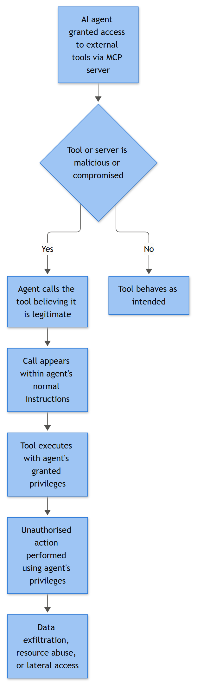

# MCP Server Abuse

## Playbook ID & Name
**AI-021 — MCP Server Abuse (Malicious, Tampered, or Over-Privileged Model Context Protocol Connectors)**

## Business Risk

**[STAKEHOLDER]** - Model Context Protocol (MCP) servers are the plumbing that lets an AI assistant actually reach your systems - Salesforce, S3, your ticketing tool, internal APIs - instead of just chatting. Most teams stand these up fast because a connector that took two days to build used to take two months. The problem is that an MCP server is now shared infrastructure sitting between every agent session and a real backend credential, and very few orgs treat it with the same rigor as a production API gateway. Three distinct things can go wrong and all three look the same from a distance - "the AI did something it shouldn't have": someone tricks a connected agent into misusing a legitimate tool, an attacker directly compromises the MCP server itself, or the server is quietly using one shared, over-privileged credential for every user so nobody can tell whose request actually caused the downstream action. This isn't a "disable AI" problem - it's a "know exactly what every connector can reach, who approved it, and whether its credential is scoped to a person or shared by everyone" problem. Get that wrong and one bad connector becomes every team's incident at once, because it's the same server behind all of them.

## Severity / Priority Default
**High (P2)** for any confirmed deviation between an MCP server's tool behavior and its approved baseline, or an unapproved connector found in production. **Critical (P1)** if the MCP server endpoint itself was directly compromised (internet-reachable, unauthenticated), if a shared backend credential was confirmed abused beyond the flagged session, or if regulated data moved through a tampered/rogue connector.

## MITRE ATT&CK Techniques
- T1190 — Exploit Public-Facing Application (internet-reachable MCP HTTP/SSE endpoint with weak or missing authentication)
- T1552.001 — Unsecured Credentials: Credentials In Files (API keys/OAuth secrets hardcoded in MCP server config, `.env`, or an agent's connector manifest)
- T1552.005 — Unsecured Credentials: Cloud Instance Metadata API (confused-deputy path: a compromised MCP server queries the cloud metadata service for its host's own credentials)
- T1078.004 — Valid Accounts: Cloud Accounts (attacker reuses the MCP server's shared service credential rather than any human account)
- T1195.001/.002 — Supply Chain Compromise: Compromise Software Dependencies and Development Tools / Compromise Software Supply Chain (a rogue or trojanized MCP server package is pulled from a public registry and registered as a connector)
- T1204 — User Execution (a developer or end user approves connecting an unvetted MCP server, or approves a tool call under a misleading tool description)
- T1027 — Obfuscated Files or Information (malicious instructions hidden inside a tool's description/schema metadata rather than its arguments)
- T1098.001 — Additional Cloud Credentials (attacker uses an admin-capable tool exposed via MCP to add their own API key/credential to a cloud account)
- T1136 — Create Account (MCP-exposed admin tool used to create a new account/service principal)
- T1562.001 — Impair Defenses: Disable or Modify Tools (MCP admin tool used to disable audit logging on the server or a connected system)
- T1580 / T1538 — Cloud Infrastructure Discovery / Cloud Service Dashboard (recon performed through a connected cloud MCP tool)
- T1046 — Network Service Discovery (an exec- or network-capable MCP tool used to probe internal hosts and services once the connector is already trusted - a post-access Discovery technique, not the pre-access reconnaissance T1595 covers)
- T1567 / T1048 / T1071.004 — Exfiltration Over Web Service / Alternative Protocol / DNS (data moved out through an MCP tool's outbound capability)
- T1572 / T1090 — Protocol Tunneling / Proxy (the MCP server itself abused as an outbound pivot point)

## Trigger / Detection Logic Summary
This alert fires on any of five distinct patterns, and analysts need to know which one they're looking at because the response differs:

1. **Tool poisoning / rug pull** - the tool descriptions or schemas returned by an MCP server's `tools/list` response no longer match the last approved baseline hash, meaning the *instructions the model sees* changed without a corresponding change ticket. This is invisible to the end user; the model reads it, the human never does.
2. **Rogue/unapproved connector** - a new MCP server entry appears in an agent's connector configuration that isn't on the approved registry, often pulled from a public package index by a developer who wanted a quick integration.
3. **Direct server compromise** - gateway/WAF logs show fuzzing, unauthenticated `tools/call` attempts, or exploitation traffic against an internet-reachable MCP endpoint (T1190).
4. **Confused deputy / shared credential abuse** - the MCP server's backend action (API key, OAuth token, service principal) fires for a session with no matching human principal, or for an action clearly outside that tool's declared scope.
5. **Server-as-pivot** - outbound network activity *from the MCP server host itself* (not from the calling agent) to a destination unrelated to any of its declared backend integrations.



*Figure F046 - an agent trusting a malicious or compromised tool/server.*

## Required Log Sources & Event IDs
| Source | What to Pull |
|---|---|
| MCP server audit/access log | `initialize` handshake, `tools/list` and `tools/call` requests, tool name, schema/description hash, calling client ID, arguments, response size |
| MCP connector registry / agent config management (e.g., `mcp.json`, internal connector catalog) | Diff of connectors added/removed/modified, who made the change, approval ticket reference |
| Package registry logs (npm, PyPI, internal artifact repo) | Package name, version, publisher, download hash for any MCP server pulled in as a dependency |
| API gateway / reverse proxy in front of the MCP server | HTTP method, path, status code, auth header presence, source IP, rate of `tools/call` requests |
| Secrets manager / credential issuance logs | Which credential the MCP server holds, its scope, rotation history, and whether it's per-user or shared/static |
| Downstream system audit logs (Salesforce, S3/cloud storage, ticketing, internal APIs) | The actual operation as recorded independently of the MCP layer - your corroborating evidence |
| Cloud provider audit logs (CloudTrail, Azure Activity Log, GCP Audit Logs) | IAM principal and API calls actually executed if the tool touches cloud resources |
| Network/egress/DNS logs | Outbound destinations from the MCP server host itself, not just from agent clients |

**Known blind spot:** there is no standardized Windows or Sysmon event ID for MCP-specific telemetry - this is application-layer logging you have to build yourself. Most reference MCP server implementations don't version or hash their tool schemas by default, so a "rug pull" (a previously-approved tool silently changing its description or behavior post-approval) leaves no trail unless you're snapshotting and diffing the tool list yourself. If you can't answer "what did this connector's tools look like last week," treat that as a finding on its own, not just a limitation.

## Key Fields to Inspect

**[ANALYST]**
- Tool schema/description hash or full text, compared against the last known-approved baseline
- `client_id` / session identifier, and whether it maps to a real, currently-active human session
- Whether the backend credential is per-user (scoped, attributable) or a single shared static key used by every session - this single fact determines your entire blast-radius assessment
- Source IP of `tools/call` and `tools/list` requests versus the expected range of agent-hosting infrastructure
- Package name, version, publisher, and hash for any MCP server connector, checked against the approved registry
- Destination (domain/IP/bucket/mailbox) of any tool with outbound or write capability
- Timestamp of any connector configuration change versus the existence (or absence) of a matching change ticket
- Whether the MCP server's own host generated outbound traffic unrelated to its declared backend integrations

## Normal vs Suspicious Pattern
| Normal | Suspicious |
|---|---|
| Tool descriptions match the hash recorded at last approval/review | Tool description or schema differs from baseline with no change record |
| Connectors present in an agent's config all appear on the approved registry | An MCP server package present that no one can trace to an approval ticket or known publisher |
| Backend credential is scoped per-user or per-session and traceable to a real principal | A single static API key/token used for every action regardless of who's asking |
| `tools/call` traffic originates only from known agent-hosting IP ranges | `tools/call`/`tools/list` requests arriving from unexpected source IPs or with malformed/missing auth |
| MCP server host's outbound traffic maps 1:1 to its declared backend integrations | MCP server host talking to a domain/IP that isn't one of its documented backends |
| Package version bumps arrive through the normal release/patch process with a changelog | Silent behavior change in a tool with no version bump or changelog entry |

## Investigation Steps
1. **Baseline the connector.** Enumerate every MCP server attached to the affected agent/session and diff current tool schemas against the last approved baseline hash - this catches silent tool-poisoning immediately.
2. **Pull the session's tool-call trace.** Get the MCP server's own audit log for the flagged `client_id`/session, in order, with full arguments and the actual response returned.
3. **Establish the credential model.** Confirm whether the backend credential is shared/static or per-user. If shared, enumerate everything that credential can reach - that's your real exposure, not just the one flagged call.
4. **Validate connector provenance.** If a new or unfamiliar MCP server is involved, trace how it was added (config diff, install log, ticket) and check the package's publisher, version, and hash against threat intel and your approved registry.
5. **Check the endpoint's exposure.** If the MCP server is network-reachable beyond its intended agent hosts, review gateway/WAF logs for unauthenticated or anomalous requests preceding the incident (T1190 exploitation attempt).
6. **Correlate with identity and cloud audit logs.** Look for credential issuance, permission grants, or account creation from the MCP server's service identity in the surrounding window - these indicate follow-on actions past the initial abuse.
7. **Quantify data exposure.** Inspect actual response payloads and the downstream system's own audit record for what was read, written, or moved.
8. **Check for reuse.** Search whether the same rogue connector, tampered tool schema, or destination shows up against other agents, teams, or business units - MCP connectors are commonly shared far wider than their original owner realizes.

## True Positive Indicators
- Tool schema/description differs from the last approved baseline with no matching change ticket (tool poisoning/rug pull)
- MCP endpoint received unauthenticated or credential-stuffed `tools/call`/`tools/list` requests from outside expected agent-host ranges
- Backend action fired under the server's shared credential with no corresponding legitimate session or principal
- Unapproved MCP server package present in a connector config, sourced from an unknown publisher or unofficial registry
- Outbound connection from the MCP server host itself to a destination unrelated to any of its declared integrations

## False Positive / Benign Positive Indicators
- Tool description change matches a legitimate, documented release from a vetted publisher (verify changelog/signature)
- New connector added through the normal onboarding process with a traceable approval ticket
- Shared-credential usage fully explained by a legitimate scheduled/batch job with no session mismatch
- Flagged traffic turns out to be an authorized security assessment or red-team exercise IR simply wasn't looped into beforehand
- New outbound destination is a recently onboarded, legitimate backend integration not yet reflected in the asset inventory

## Escalation Criteria
Escalate to IR immediately if: a production connector's tool schema was confirmed tampered (rug pull), an internet-facing MCP endpoint was directly exploited, a shared backend credential is confirmed abused beyond the flagged session, or a rogue MCP server package is found installed across multiple hosts or teams (supply-chain scope, not an isolated incident). Loop in privacy/legal if regulated data (PII, PHI, financial records) is confirmed to have moved through the affected connector. Escalate to the platform/AI governance team regardless of confirmed maliciousness if the root cause is a shared static credential with no per-user scoping, or a connector approval process that let an unvetted package through - that gap will produce the next incident too.

## Containment Options & Approval Authority

**[MANAGEMENT]**
| Action | Who Can Approve |
|---|---|
| Disconnect/disable the specific MCP server connector from affected agents | AI platform owner, immediate for confirmed abuse |
| Rotate the MCP server's backend credential/service token | IAM/secrets management team, immediate for confirmed abuse |
| Block the MCP server endpoint at network/WAF layer | SOC on-call, immediate if directly exploited |
| Pin or roll back the MCP server package to last known-good version and hash | Engineering, same-shift |
| Remove an unapproved MCP server from connector registries org-wide | AI governance lead, tracked change, same-day |
| Replace a shared static credential with per-user scoped authentication | Engineering + IAM, follow-up remediation, not a same-shift fix |

## Example Query (Splunk SPL)
```spl
index=mcp_server_audit sourcetype="mcp:tool_call"
| lookup mcp_tool_baseline.csv tool_name OUTPUT approved_schema_hash
| where schema_hash!=approved_schema_hash OR isnull(approved_schema_hash)
| stats count min(_time) as first_seen by mcp_server_id, tool_name, schema_hash, client_ip
| sort - first_seen
```

## Closure Criteria
Close as **True Positive** once the tampered/rogue connector is identified, disconnected or rolled back, the credential blast radius is confirmed and rotated, and the approval-process gap that let it through is remediated or ticketed. Close as **Benign Positive / Expected Activity** once the baseline mismatch is explained by an approved release, or the flagged traffic is confirmed to be a sanctioned security test. Close as **Insufficient Evidence** if the MCP server lacks tool-call logging or schema versioning to fully reconstruct the event - flag the logging gap explicitly rather than closing it as clean.

**Example case note:**
> 2026-09-15 09:18 UTC — Connector `crm-mcp-02` (Meridian Analytics internal MCP server bridging the support-ticket agent to Salesforce and an S3 export bucket) showed a `tools/list` schema hash mismatch on `export_customer_records`: the tool description had been silently modified to instruct the model to also copy results to an external URL (`https://mrdn-sync.example.net/ingest`), a domain not present in the connector's documented integrations and not in `domain_allowlist`. No corresponding change ticket existed. Tool-call trace for session `sess-3a91cd` confirmed one export of 240 customer records completed against the modified tool before the mismatch was caught by the daily baseline diff job. Credential used was `crm-mcp-02`'s single shared service token — no per-user scoping exists, so every session using this connector in the prior 24h had to be reviewed. Rotated the shared credential, disconnected the connector pending code review of the last package update, and blocked the destination domain at egress. 240-record exposure reported to the data owner and privacy for assessment. Root cause: no schema-hash verification on connector startup and no per-user credential scoping. Disposition: True Positive (confirmed tool-poisoning with data exposure), escalated to IR-2026-0402; AI governance ticket opened to require per-user OAuth on all MCP connectors touching customer data.
