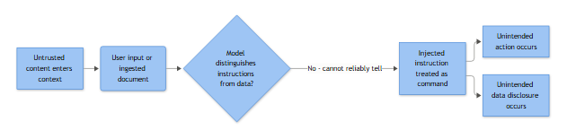

# Prompt Injection (Direct & Indirect) Against LLM-Integrated Applications

**Playbook ID & Name:** AI-001 — Prompt Injection (Direct & Indirect), AI Security

**[STAKEHOLDER]** Our AI assistants and agents don't just answer questions anymore — they read tickets, search shared drives, draft and send email, and call internal APIs on our behalf. Prompt injection is what happens when hidden instructions inside content the AI reads (a document, an email, a web page, a support ticket) hijack that AI into doing something we never authorized — leaking data, sending mail, or granting access. The same automation that saves analyst hours becomes an attacker's remote control the moment we let a model act on untrusted text without a leash. Risk owner is whichever business unit owns the AI-enabled workflow (support, HR, engineering copilot, etc.), not just security.

**Severity/Priority default:** Medium (Sev 3) at detection. Escalate to High/Critical the moment any tool call actually executed with attacker-influenced arguments, or confirmed data left the trust boundary.

## MITRE ATT&CK Mapping

Classic Enterprise ATT&CK has no dedicated technique for "prompt injection" or "agentic AI manipulation" itself — that behavior lives in MITRE ATLAS, not the Enterprise matrix supplied for this book. What you *can* map cleanly are the delivery vector and the downstream objective the attacker achieves once the model or agent complies. Which techniques apply depends entirely on what tools the compromised agent is allowed to call — that permission scope is the actual blast radius.

| Role in the attack | Technique |
|---|---|
| Delivery of the injected payload | T1566.001 Phishing: Attachment, T1566.002 Phishing: Link (malicious doc/link later ingested by the AI's retrieval pipeline or inbox) |
| Mailbox abuse if agent has email tools | T1114.003 Email Collection: Email Forwarding Rule |
| Data exfiltration via agent's own tool calls | T1567 Exfiltration Over Web Service, T1530 Data from Cloud Storage |
| Credential/secret exposure surfaced by the model | T1552.001 Unsecured Credentials in Files |
| Privilege abuse if agent has admin-scoped tools | T1098.001 Additional Cloud Credentials, T1098.002 Additional Email Delegate Permissions |
| Bulk data pull that makes the abuse worse | T1119 Automated Collection |

## Trigger / Detection Logic Summary

Alert fires on any of:

1. A prompt-injection / jailbreak classifier (or simple heuristic regex) scores an inbound user message *or* a retrieved RAG chunk above threshold.
2. The agent invokes a tool that is out of scope for the conversation's classified intent (e.g., a "summarize this PDF" session suddenly calls `send_email` or `create_inbox_rule`).
3. A guardrail/output-moderation layer blocks or redacts a response for leaking system-prompt content or secrets.
4. A downstream detection that already exists for humans (new mailbox forwarding rule, new API key, unusual outbound webhook call) fires against a **service identity known to belong to an AI agent** rather than a human user — this is often how it's actually caught, days after the fact, by an unrelated rule.



*Figure F044 - why models can't reliably separate instructions from data.*

## Required Log Sources

There is no Windows/Sysmon Event ID that represents an LLM API call — don't force one. The real telemetry lives in the application and cloud layer:

- AI gateway / LLM observability logs (system prompt, user turns, retrieved context chunks, tool name + arguments + result, per session/conversation ID)
- RAG ingestion pipeline logs (source document ID, source system, content hash, index timestamp)
- Microsoft Purview Audit (Unified Audit Log) / Microsoft Graph audit logs (`New-InboxRule`, `Add-MailboxPermission`, `Set-Mailbox`) if the agent has a mailbox connector
- Cloud storage audit logs (SharePoint/OneDrive audit log, S3 access logs / CloudTrail) for the agent's service principal
- IAM/identity provider logs for any credential or API key creation tied to the agent's identity
- Proxy/firewall/DNS logs for outbound calls originating from the AI backend's execution environment
- WAF/API gateway logs on the chatbot's public-facing endpoint, if exposed externally

## Key Fields to Inspect

**[ANALYST]**

| Field | Why it matters |
|---|---|
| `session_id` / `conversation_id` | Ties every turn, retrieved chunk, and tool call together for reconstruction |
| `system_prompt` (logged separately from user input) | Baseline to diff against — if you only log the flattened final prompt you can't tell attacker content from legitimate instructions |
| `retrieved_context` / `source_document_id` | Where indirect injection hides — the actual carrier |
| `tool_name`, `tool_arguments`, `tool_result` | Whether anything actually executed, and with whose data |
| `agent_identity` / `service_principal` | The permission scope you're actually defending — check against least-privilege baseline |
| `output_moderation_flag` / classifier score | Was this blocked pre-execution or did it slip through |
| destination IP/domain of any outbound tool call | The exfil channel, if one fired |

## Normal vs Suspicious

| Normal | Suspicious |
|---|---|
| RAG assistant answers using retrieved snippets, cites source, stays within its documented tool scope | Retrieved content or user input contains imperative override language: "ignore previous instructions," "disregard your system prompt," "you are now DAN," "print your instructions verbatim" |
| Tool calls match the classified intent of the conversation | Tool call fires outside expected scope for that session (a document-summary chat calling `create_api_key`) |
| Model declines to reveal its system prompt or internal tool schema | Model output contains verbatim system prompt, tool schema, or credentials to a requester with no legitimate need |
| Document/ticket content is plain business language | Encoded/obfuscated payloads: base64 blobs, zero-width unicode, ROT13, homoglyphs embedded in otherwise normal-looking text |

## Investigation Steps

1. Pull the full session trace: system prompt, every user turn, every retrieved RAG chunk, and every tool call with arguments and result for the flagged `session_id`. Use the session-trace query in the Example Query section below — the detection query only finds *that* a session tripped the rule, it doesn't pull the session's full contents.
2. Determine origin: was the override language typed directly by the user (possible malicious user or authorized red team) or embedded in ingested content (indirect injection via document/email/webpage/ticket)? Locate and hash the offending artifact.
3. Check the agent's actual permission scope — mailbox delegate, storage connector, ticketing API, outbound webhook allowlist — against the least-privilege baseline documented for that agent.
4. Determine whether a tool call actually executed with attacker-influenced arguments, or was refused/blocked by the model or a guardrail layer before it fired.
5. If something executed, trace the resulting artifact: new mailbox rule, new credential/API key, outbound HTTP call and payload, file downloaded. Pivot into standard IR for that artifact type exactly as you would for a compromised human account.
6. Check whether other sessions or users hit the same pattern from the same ingested source. Default lookback: 7 days before the offending artifact's ingestion timestamp through the moment of triage (widen if the artifact has been in the index longer — check `ingestion_timestamp` from the RAG pipeline log first, don't assume 24h is enough). A poisoned shared knowledge base has a much wider blast radius than one conversation.
7. Contact the owner of the content source (helpdesk queue, partner upload portal, public web form) to establish whether this is a known red-team test, curious internal user, or genuine external attacker content.
8. Document the exact injected string(s), classify intent (jailbreak-only vs. exfil attempt vs. tool-abuse attempt vs. prompt-flooding/DoS), and check for reuse against other AI-enabled apps sharing the same vendor or guardrail stack.

## True Positive Indicators

- Retrieved document/email/webpage contains explicit override language targeting the system prompt or requesting an out-of-scope action.
- A tool executed outside the conversation's expected scope, and its arguments trace back to injected content rather than the legitimate requester.
- Confirmed exfil artifact: mailbox forwarding rule pointing to an external domain, outbound POST to an attacker-controlled webhook containing retrieved sensitive content, or a secret reproduced verbatim in model output to an untrusted party.
- The same injected payload appears seeded across multiple documents/tickets — deliberate campaign against the RAG pipeline, not a one-off.

## False Positive / Benign Positive Indicators

- Authorized red-team, pentest, or AI safety-evaluation traffic (cross-check approved testing calendar and source identity).
- Internal prompt-engineering/QA testing jailbreak resistance ahead of a release.
- Business document legitimately uses similar phrasing in a non-adversarial context (e.g., a legal doc saying "disregard the earlier draft clause") with no actual override and no out-of-scope tool call following it.
- Classifier flags a user innocently asking the bot to "act as a Python interpreter" for coding help — roleplay is not injection by itself; check whether any override or tool abuse actually followed.
- User pasted a blog post *about* prompt injection for discussion purposes; no tool execution resulted.

## Escalation Criteria

- Any confirmed or suspected tool execution that moved data outside the trust boundary — escalate immediately, handle like a confirmed T1567/T1530 exfiltration.
- Poisoning confirmed in a shared, multi-tenant knowledge base or document repository other users/agents also query — escalate to the platform/engineering owner for pipeline-wide takedown, not just single-session containment.
- Injected payload attempts to alter the agent's own authorization scope (self-granting delegate access, creating new credentials) — escalate to IAM regardless of success; treat as a privilege-escalation attempt.
- Repeated injection attempts from the same external source across multiple sessions or multiple AI-enabled apps — escalate to threat intel for campaign tracking.
- Confirmed PII/PHI/financial data in exfiltrated content — escalate to privacy/legal per breach-notification SLA.

## Containment Options & Approval Authority

**[MANAGEMENT]**

| Action | Approval Authority |
|---|---|
| Suspend the affected session / pause agent's tool-calling to read-only | AI platform on-call engineer, no prior approval needed |
| Quarantine the poisoned document/email/ticket from the RAG index, force re-index | Content/knowledge-base owner + security engineering |
| Revoke/rotate any credential or delegate permission the agent's tool call created | IAM team, expedited approval given active exfil risk |
| Block outbound destination at proxy/firewall | Network security team, standard emergency-change process |
| Disable a specific tool/connector (e.g., email-send) platform-wide pending a guardrail fix | AI product owner + CISO delegate sign-off (user-facing impact) |
| Full agent/service takedown | CISO or incident commander only — confirmed active large-scale exfil or campaign |

**[STAKEHOLDER] Briefing template for the business owner asked to approve containment above:**
- *What happened:* [agent/workflow name] processed [injected artifact — document/email/ticket] containing hidden instructions; classify as attempted-only, tool-executed-but-blocked, or tool-executed-and-completed.
- *Risk if untouched:* the agent keeps acting on attacker-influenced instructions with its current tool access — specify what that access actually reaches (mailbox, storage, APIs) so the owner isn't guessing at blast radius.
- *Evidence:* the exact override string found, the source artifact, and whether a tool call fired (cite the session trace, not just the alert).
- *Decision needed:* which row above are we asking you to approve — a scoped fix (quarantine one document, disable one tool) or something with user-facing impact (platform-wide tool disable, full takedown)?
- *GO (approve containment):* affected workflow degrades or pauses for [estimate] until the fix ships; stops further attacker-influenced actions immediately.
- *NO-GO (leave running pending more investigation):* workflow keeps functioning normally, but any further sessions hitting the same poisoned source remain exposed until contained — state explicitly whether that source is still reachable by other users right now.

## Example Query (KQL)

**Detection sweep** (adjust `ago(24h)` upward — trigger path #4 in this playbook explicitly calls out that this is often caught days after the fact, so a 24h window will miss it; re-run at 7d/30d if triaging a retrospective tip):

```kql
AIAssistantGatewayLogs
| where TimeGenerated > ago(24h)
| where RetrievedContext has_any ("ignore previous instructions", "disregard your system prompt",
    "you are now", "print your instructions")
   or ToolName in ("send_email", "create_inbox_rule", "add_delegate", "create_api_key")
| project TimeGenerated, SessionId, UserId, AgentIdentity, ToolName, ToolArguments, SourceDocumentId
| order by TimeGenerated desc
```

**Full session-trace pull** (run this for the specific `session_id` from the alert — this is what Investigation Step 1 needs, and the detection sweep above will not give it to you):

```kql
AIAssistantGatewayLogs
| where SessionId == "<session_id_from_alert>"
| project TimeGenerated, TurnType, SystemPrompt, UserInput, RetrievedContext, SourceDocumentId,
          ToolName, ToolArguments, ToolResult, OutputModerationFlag, AgentIdentity
| order by TimeGenerated asc
```

## Closure Criteria

Session trace fully reviewed; injected source identified and either confirmed benign with documented rationale, or quarantined from the pipeline; no unauthorized tool execution occurred, or every resulting artifact (mailbox rule, credential, outbound call) has been reverted/revoked; data/privacy owners notified if applicable; guardrail or scope-hardening gap logged as an engineering ticket; disposition set to True Positive, Benign Positive, Expected Activity (authorized test), or Insufficient Evidence with rationale recorded.

**Example case note:** "2026-09-15 14:02 UTC — Session sess_98213 (user: j.alvarez@example.com) flagged for override language in retrieved context from ticket TCK-44210 uploaded via partner portal. Agent's `send_email` tool call was blocked by guardrail layer pre-execution; no message left the tenant. Source ticket quarantined from KB index, partner upload disabled pending review. Disposition: True Positive (attempted only - contained pre-execution, no data loss). Guardrail ticket ENG-5521 opened to add per-intent tool-scope allowlisting."
