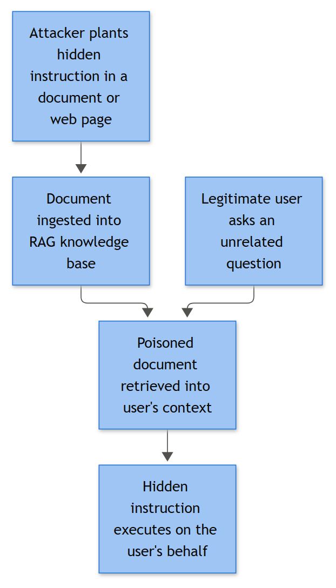

# AI-009: RAG Poisoning (Knowledge Base / Retrieval Corpus Injection)

## Business Risk

**[STAKEHOLDER]** - Our internal AI assistants and customer-facing chatbots don't "know" things - they retrieve document snippets from a knowledge index and let a language model summarize them. If an attacker can get a crafted document into that index, they don't need to breach the model at all; they just quietly rewrite what the assistant tells every user who asks a related question. That can mean bad security guidance handed out at scale, users redirected to phishing infrastructure, leaked system prompts/config, or an AI agent with tool access being manipulated into taking an action on the attacker's behalf. This is a trust and integrity risk, not a traditional intrusion, and it's often first noticed by an end user saying "the bot told me something weird" rather than by an alert.

**Related Playbooks:** See Playbook AI-010 (Knowledge Base Poisoning) for the closely related pattern where the tampered source is a wiki/ITSM/SharePoint article rather than the vector index itself — the two are frequently confused at intake; this one applies once the retrieval index/embedding store is the confirmed tamper point, not the source document.

## Severity/Priority Default

**High (Sev-2)** on initial confirmation of injected content in a production-facing index. Escalate to **Critical (Sev-1)** if the poisoned content targeted credential harvesting, referenced regulated/PII data, or there is evidence a human or a downstream automated agent already acted on the malicious guidance.

## MITRE ATT&CK Mapping

| ID | Technique | Relevance to this scenario |
|---|---|---|
| T1190 | Exploit Public-Facing Application | Public ingestion channel (support portal, upload form, ticketing system) is the injection vector into the RAG corpus |
| T1136 | Create Account | Throwaway/anonymous account used to submit poisoned content without prior reputation |
| T1078.004 | Valid Accounts: Cloud Accounts | Alternate path - a compromised legitimate account is used instead of a new one, harder to spot |
| T1027 | Obfuscated Files or Information | Hidden instructions via zero-width characters, white-on-white text, HTML comments, base64 blobs inside the ingested document |
| T1119 | Automated Collection | Abuses the pipeline's own automated crawl/ingest job that pulls content into the vector store without human review |
| T1552.001 | Unsecured Credentials: Credentials In Files | Poisoned document engineered to either expose planted credentials or trick the assistant into surfacing real ones from adjacent context |
| T1567 | Exfiltration Over Web Service | If the assistant has tool-calling/agent capability, injected instructions attempt to push retrieved data to an attacker-controlled web endpoint |
| T1071.004 | Application Layer Protocol: DNS | Alternate covert channel if the agent's tool layer is coerced into DNS-based data movement |
| T1204 | User Execution | End user follows a malicious link or instruction surfaced in the assistant's poisoned response |

## Trigger / Detection Logic Summary

**[ENGINEERING]** No single event indicates RAG poisoning - it's a correlation between an ingestion-side anomaly and a retrieval-side anomaly:

1. A document/chunk is ingested from a low-trust source (anonymous submission, newly created account, external email attachment, unmoderated auto-sync job) and bypasses the human moderation/review gate.
2. That same chunk then shows a retrieval pattern inconsistent with a normal knowledge-base entry: retrieved across a disproportionately wide range of unrelated query topics, or suddenly dominates retrieval rank for a specific high-value query ("MFA reset", "wire transfer approval", "password policy exception").
3. Guardrail/output-filtering logs flag the generated response for policy violations (external URL not in the approved domain allowlist, instruction to disable a control, request for credentials, attempt to invoke a tool outside expected scope).

Any two of the three above from the same document within a short window should trigger a case.



*Figure F045 - a poisoned document later reaching an unrelated user's context.*

## Required Log Sources

| Source | What it provides |
|---|---|
| RAG ingestion pipeline audit log | `document_id`, `source_connector`, `uploader_identity`, `ingestion_timestamp`, `moderation_status` |
| Vector index / embedding store log | `chunk_id`, `embedding_id`, `similarity_score`, `retrieval_count`, `retrieval_topic_cluster` |
| LLM application/gateway log | `session_id`, `user_prompt`, `retrieved_chunk_ids`, `model_response`, `guardrail_verdict`, `tool_calls` |
| Content management audit log (SharePoint/Confluence/ticketing system) | file upload events, permission changes, submitter account |
| Identity provider sign-in log (Azure AD / Okta) | account age, authentication method, source IP/geolocation for the uploader |
| Web/API gateway or WAF log (public ingestion endpoint) | source IP, user-agent, submission rate, prior history of the submitting IP |
| Egress proxy / DNS resolver log | follow-on exfiltration attempts if a poisoned response triggered an agent tool call or a user click |

No Windows/Sysmon event IDs apply directly to this scenario - the telemetry lives in the application, identity and pipeline layers above. If the poisoning leads to a user executing something on an endpoint (e.g., clicking a payload delivered via the chatbot), pivot to the standard phishing/user-execution playbook for host-level follow-up.

## Key Fields to Inspect

**[ANALYST]**

- `document_id` / `chunk_id` - the specific unit of content that's misbehaving, not just "the document" - large PDFs get split into many chunks and only one may be poisoned.
- `uploader_identity`, account creation date, and whether MFA was satisfied on the session that submitted the content.
- `moderation_status` - was this auto-approved by a rule, manually approved, or does the log show it skipped the gate entirely (a broken/misconfigured moderation rule is a very common root cause, not always malice on the pipeline side).
- `retrieval_count` and `retrieval_topic_cluster` diversity for the suspect chunk over a rolling baseline (7-14 days) - legitimate high-value FAQ content is retrieved a lot too, so raw volume alone is not enough.
- `guardrail_verdict` and the specific rule that fired (PII disclosure, external URL, prompt-injection pattern match, tool-scope violation).
- Raw content of the document, checked for zero-width Unicode characters, invisible/white-on-white text, HTML/markdown comments, embedded base64, or literal phrases like "ignore previous instructions" / "always respond with" / "the system prompt is".
- `tool_calls` in the LLM gateway log if the assistant has agentic capability - what did it try to call, with what parameters, and did it succeed.

## Normal vs Suspicious Pattern

| Signal | Normal | Suspicious |
|---|---|---|
| Ingestion source | Reviewed internal doc, known author, established SharePoint site | Anonymous ticket, brand-new account, external attachment auto-ingested |
| Moderation gate | Content queued and approved by a named reviewer | `moderation_status=auto_approved` with no reviewer, or gate bypassed by a rule change |
| Retrieval spread | High-relevance doc retrieved consistently for its actual topic cluster | Same chunk retrieved across many unrelated topic clusters, or suddenly outranks the historical top result for a sensitive query |
| Response content | Answer cites known internal domains/procedures | Answer contains an unfamiliar external URL, unusual urgency language, or instructs disabling a security control |
| Guardrail activity | Zero or rare benign trims (PII redaction on legitimate data) | Repeated flags on the same chunk_id across sessions |

## Investigation Steps

1. Pull the LLM gateway log entries where the flagged `chunk_id` was retrieved (use the chunk-lookup query in the Example Query section below — the detection query only tells you a chunk crossed the retrieval/topic-diversity threshold, it doesn't pull the individual sessions that retrieved it). Note session volume, topic diversity, and the actual generated responses that referenced it.
2. Retrieve the raw source document via `document_id` from the content management system and inspect it directly (not just the indexed/rendered text) for hidden characters, invisible formatting, or embedded instructions.
3. Trace `uploader_identity` back through the identity provider or portal submission log: account age, authentication method used, source IP/ASN, and whether that IP or account has any prior benign history.
4. Check the ingestion pipeline's moderation configuration history for recent changes - a poisoning campaign frequently rides in right after a moderation rule was loosened or a connector was reconfigured.
5. Determine blast radius: how many user sessions received a response influenced by the poisoned chunk, over what time window, and whether any of those sessions show a user clicking a link, submitting credentials, or an agent executing a tool call as a result.
6. Check the egress proxy/DNS logs for any outbound activity tied to a domain referenced in the poisoned response.
7. Search the rest of the same source connector (same SharePoint library, same ticket queue, same uploader) for sibling documents - poisoning is rarely a single isolated file.
8. Compare the current response for the affected query against the response the assistant gave before the poisoned document was ingested, to confirm actual behavioral drift.

## True Positive Indicators

- Hidden instructions confirmed in the raw document (invisible text, zero-width characters, injected comments) directing the model to disclose data, recommend an insecure action, or emit a specific external link.
- Retrieval anomaly confirmed: the chunk's topic-cluster diversity or retrieval rank is a statistical outlier against baseline.
- Uploader account is newly created, unauthenticated, or geographically/behaviorally inconsistent with legitimate submitters for that channel.
- Guardrail fired on multiple independent sessions referencing the same `chunk_id`.
- Downstream evidence of impact: a user reached the injected URL, an agent tool call attempted an out-of-scope action, or credentials were exposed.

## False Positive / Benign Positive Indicators

- The document is genuinely the most authoritative match for a broad range of queries (e.g., a company-wide FAQ or policy doc legitimately gets retrieved often across many topics).
- Formatting artifacts (leftover tracked-changes markup, copy-paste whitespace, template boilerplate) that resemble obfuscation but carry no actual injected instruction.
- Retrieval count spike explained by a re-sync/re-index job duplicating the same content, inflating counts without any new or malicious document involved.
- Content submitted as part of an approved red-team/AI red-teaming exercise against the assistant, with prior coordination logged.

## Escalation Criteria

Escalate immediately to the AI/ML platform owner and IR if: the injected content targets credential harvesting or contains a working phishing link; there is confirmed evidence a user or an autonomous agent acted on the poisoned guidance; the poisoning was delivered via a compromised valid account rather than an anonymous one (implies broader account compromise); or the affected corpus/response involves regulated data, triggering Privacy/Legal notification requirements.

## Containment Options & Approval Authority

**[MANAGEMENT]**

| Action | Approval Authority |
|---|---|
| Quarantine/remove the poisoned document from the source repository and vector index | AI platform/product owner |
| Force re-embedding of the affected index segment after purge | AI platform owner + engineering on-call |
| Roll back the vector index to last known-good snapshot | AI platform owner, coordinated with change management |
| Disable or tighten the public ingestion endpoint (require human moderation, rate-limit, block submitting IP) | Security team + application owner |
| Reset credentials / revoke sessions for a compromised uploader account | IAM/security team |
| Notify affected end users if bad guidance was actually delivered | Product owner + Communications, with Legal input if externally facing |
| Add/tune guardrail rule to catch the specific injection pattern | Engineering, reviewed by security |

**[STAKEHOLDER] Briefing template for the product/content owner asked to approve action above:**
- *What happened:* a poisoned document/chunk entered the [assistant name] knowledge base via [ingestion path] and was served to [retrieval_count] sessions across [topic_diversity] unrelated topics.
- *Risk if untouched:* every user who asks a related question keeps receiving the attacker's content (bad guidance, a phishing link, or a credential-harvesting prompt) until the index is purged and rebuilt — this is a trust/integrity issue affecting all users of the assistant, not just the one who reported it.
- *Evidence:* the raw document's hidden instructions (if found), the retrieval-anomaly numbers, and whether any user or downstream agent is confirmed to have acted on the bad guidance.
- *Decision needed:* approve quarantine + re-embed now (temporary quality/availability dip while the index rebuilds) vs. roll back to the last known-good snapshot (loses any legitimate content added since that snapshot too).
- *GO (quarantine + rebuild now):* the assistant may give degraded or incomplete answers in the affected topic areas until re-embedding finishes; stops the bad guidance from spreading further.
- *NO-GO (leave the index as-is pending more review):* the assistant keeps serving the poisoned content to every user who asks a related question in the meantime — confirm this is acceptable for the specific topic areas affected before deferring.

## Example Query (Splunk SPL)

**Detection sweep** (default lookback is whatever your `rag_query_logs` retention supports for a 7-14 day rolling baseline per Key Fields above; thresholds below are illustrative, tune to your own corpus's normal retrieval volume):

```spl
index=rag_query_logs
| stats count as retrieval_count dc(session_topic) as topic_diversity by chunk_id, source_document
| where retrieval_count > 500 AND topic_diversity < 3
| join type=left chunk_id
    [ search index=rag_ingestion_logs
      | fields chunk_id, uploader_identity, moderation_status, ingested_time ]
| where moderation_status IN ("auto_approved","bypassed")
```

**Chunk-specific pull** (run this for the flagged `chunk_id` — this is what Investigation Step 1 needs: every session that retrieved it, and what the model actually said):

```spl
index=rag_query_logs chunk_id="<chunk_id_from_alert>"
| table _time, session_id, user_query, session_topic, model_response, guardrail_verdict, tool_calls
| sort _time asc
```

## Closure Criteria

Case can close once: the poisoned content is confirmed, removed from both the source repository and the vector index, and the index has been rebuilt/re-embedded; the ingestion path (account, connector, or moderation rule) that allowed the bypass has been identified and remediated; blast radius (affected sessions/users) has been assessed and reported to Privacy/Legal if regulated data or credentials were involved; and a guardrail or moderation-gate update has been deployed to catch the same pattern going forward. Valid closures include True Positive (confirmed data/RAG poisoning), False Positive (content is genuinely high-relevance, not poisoned), or Insufficient Evidence if the source document can no longer be retrieved for inspection (common when a connector re-sync overwrites the original ingested version before the case is opened - note this gap explicitly rather than assuming benign intent).

**Example case note:**
"Confirmed RAG poisoning: anonymous ticket #48291 submitted via support.contoso.com on 2026-09-10 contained a zero-width-character payload instructing AskContoso to direct users to hxxp://secure-contoso-support[.]net for 'password reset verification.' Chunk cs_8841 was retrieved across 612 sessions spanning 41 distinct topic clusters within 48 hours of ingestion (baseline <5 sessions per cluster). Submitting IP 203.0.113.77 had no prior ticket history and no authenticated session. Root cause: moderation gate on the public ticket connector was set to auto-approve following a config change on 2026-09-09. Document quarantined, index rebuilt from the 2026-09-08 snapshot, moderation gate re-enabled. Proxy logs show no user actually reached the phishing domain. Disposition: True Positive (RAG data poisoning / indirect prompt injection via public ingestion channel)."
