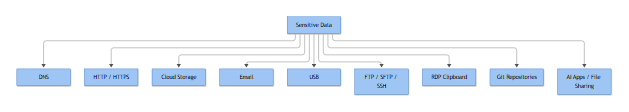
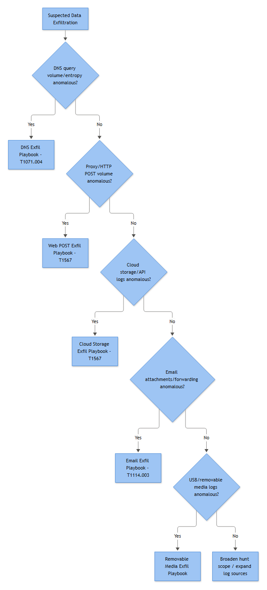

# Data Exfiltration Master Playbook
### Multi-Channel Detection, Investigation, and Response

*Part of SIGNAL TO ACTION: The Complete SOC Playbook Handbook*

Every exfiltration case starts the same way: something tripped a wire — a DLP hit, a CASB alert, a proxy anomaly, an insider-threat UEBA score, an EDR device-control event — and the ticket lands on your desk with a working theory but no confirmed channel. "Data may have left the organization" is not an investigation, it's a hypothesis. This playbook exists to turn that hypothesis into a channel, and the channel into an evidenced verdict.

Unlike a single-alert playbook, this one is a routing document. Sections 4 and 5 (Detection Logic Summary and Investigation) are organized by the ten channels attackers and insiders actually use to move data out: DNS, HTTP/S, cloud storage, email, USB, FTP/SFTP/SSH, RDP clipboard/file transfer, git repositories, AI applications, and file-sharing/messaging platforms. You don't work all ten in parallel on every case — you use the presence or absence of each channel's specific tells to eliminate the ones that didn't happen and converge on the one (or, often enough, the combination) that did.



*Figure F034 - the full set of channels covered in the exfiltration master playbook.*

Fictional environment used for the worked examples below: **Solace Underwriting Group**, a mid-size commercial insurer running hybrid AD (domain `SOLACE`, synced to Entra ID), Microsoft 365 for mail and collaboration, AWS for policy-processing workloads, and a Zscaler-fronted egress path. SIEM is Microsoft Sentinel. One incident threads through the Investigation Workflow below — **SUG-2026-0904-PELLETIER** — to keep the channel-narrowing matrix honest about what real telemetry looks like: partial, gap-ridden, and rarely as clean as a hypothetical query result implies.

---

## 1. Identity & Governance

| Field | Value |
|---|---|
| **Playbook ID** | EXF-001 |
| **Playbook Name** | Data Exfiltration Master Playbook — Multi-Channel Detection, Investigation & Response |
| **Version** | 1.0 |
| **Status** | Active – Production |
| **Owner** | SOC Detection & Response, Data Protection Track |
| **Technical Owner** | Renata Solis, Senior Detection Engineer |
| **Business Owner** | Data Protection Officer (delegate of the CISO) |
| **Approver** | Marcus Feld, SOC Manager |
| **Last Updated** | 2026-09-15 |
| **Next Review Date** | 2026-12-15 (quarterly — channel destinations and SaaS baselines drift fast enough that a longer cycle lets false-positive rates creep) |

## 2. Detection & Purpose

**Detection Source:** Aggregated — Microsoft Purview DLP, CASB (Netskope/Zscaler), proxy/SWG logs, EDR device-control and process telemetry, M365 Unified Audit Log, cloud provider audit trails (AWS CloudTrail, Google Workspace, Entra ID sign-in), self-hosted git provider audit logs, and the insider-threat UEBA baseline. This playbook is invoked once any of those sources raises a "possible unauthorized data movement" signal without a confirmed channel attached.

**Alert Name:** EXFIL-000 — Suspected Data Exfiltration, Channel Undetermined (parent umbrella; channel-specific child rules are numbered EXFIL-0xx and referenced throughout Section 4).

**Description:** Fires on any correlated signal — volume, destination, content match, or behavioral anomaly — indicating that sensitive or regulated data may be leaving the organization's control through a channel not yet identified.

**Objective:** Determine which of the ten covered channels actually carried the data (or rule all ten out), establish what left and how much, and hand off to containment and, where warranted, Legal/HR before the window for remediation closes.

**Business Risk**

**[STAKEHOLDER]** - The specific mechanism matters less to the business than the outcome, but it matters enormously to the response: a DNS tunnel implies a compromised host and possible ongoing C2; a personal webmail forward implies a standing leak that predates today's alert; a USB copy on a departing employee's last day implies a legal/HR case, not a network containment action. Misidentifying the channel wastes the SLA clock on the wrong control and can leave the real leak running while the SOC blocks a decoy.

**[STAKEHOLDER]** - The decision this playbook exists to produce is narrow but consequential: **which channel, how much data, and whose call is it next** — Tier 2 containment, Tier 3/IR, or a referral to HR/Legal/the business-relationship owner with no IR action at all (Section 5, Decision Points; Section 7, Escalation Criteria). Getting the channel right but the routing wrong is its own failure mode: a clean cloud-storage upload by a departing employee using their own, unrevoked access is not an intrusion, and forcing it into an IR queue anyway delays the referral that actually protects the business — the client notification, the legal hold, the HR conversation — while the SOC keeps chasing a compromise that was never there. The SLA clock in Section 9 starts at acknowledgment regardless of which of those paths a given case turns out to need.

**Severity:** High by default at the umbrella level; re-scored per channel once triage narrows it (see Section 4). Escalates to Critical when the data classification is regulated (PII, PHI, cardholder data, material non-public information) and the destination resolves to an external, unaffiliated party.

**Priority:** P2 by default; auto-escalates to P1 when the source account is privileged/VIP, the host is a domain controller or file server holding classified data, or a departing-employee/HR flag is already open on the user.

**MITRE ATT&CK** (grouped by channel; see Section 4 for how each is used; all technique IDs are drawn from MITRE, "MITRE ATT&CK," MITRE Corporation, accessed 2026: https://attack.mitre.org/ — see appendices/38b-references.md)

| Channel | Techniques |
|---|---|
| DNS tunneling | T1071.004, T1572, T1048, T1090 |
| HTTP/HTTPS | T1567, T1071, T1048, T1090, T1572 |
| Cloud storage | T1567.002, T1048, T1530, T1538, T1580, T1098.001, T1552.001, T1119 |
| Email (forwarding, attachment, webmail) | T1114 (.003 Email Forwarding Rule), T1098.002, T1567, T1048 |
| USB removable media | T1052.001, T1119, T1027 |
| FTP/SFTP/SSH | T1048, T1021.004, T1552.001, T1078, T1572, T1090 |
| RDP clipboard/file transfer | T1021.001, T1048, T1078.002 |
| Git repositories | T1567.001, T1048, T1071 |
| AI applications | T1048, T1567, T1027 |
| File-sharing/messaging | T1567.002, T1530, T1098.001, T1048 |

## 3. Scope & Data

**Applicable Systems:** Domain-joined Windows endpoints and servers; Linux/Unix hosts reachable via SSH; Microsoft 365 and Google Workspace tenants; AWS/Azure/GCP storage services; self-hosted and SaaS git providers; managed egress infrastructure (proxy, firewall, DNS resolvers). Unmanaged/BYOD devices are covered only where CASB or SaaS-side audit logging reaches them — a real and recurring gap, not an oversight.

**Data Sources:** Identity and authentication logs, endpoint process/EDR telemetry, DNS query logs, proxy/firewall/NetFlow, SaaS and cloud-provider audit logs, DLP/CASB content inspection, email transport and mailbox-configuration logs, git provider audit logs, device-control/USB registry artifacts.

**Log Sources**

| Category | Example Systems | Typical Gap |
|---|---|---|
| Identity | AD DS Security log, Entra ID sign-in logs | VPN/NAT collapses source attribution |
| Endpoint | EDR, Sysmon-equivalent, Windows Security log | Command-line auditing frequently disabled |
| Network | Proxy/SWG, NGFW, NetFlow, DNS debug/analytical log | SSL inspection coverage partial; DNS logging off by default |
| SaaS/Cloud | M365 UAL, Google Workspace audit, AWS CloudTrail, CASB | Standard/free tiers often lack audit API entirely |
| Code hosting | Self-hosted GitLab/Bitbucket/GHE audit log | No visibility once destination is attacker's personal account |

**Required Fields**

| Event ID | Fields Used |
|---|---|
| 4624 / 4625 | Logon Type, Source Network Address, Account Name, Process Name |
| 4634 / 4647 | Logon ID linkage, session teardown type (deliberate vs. system) |
| 4648 | Account Whose Credentials Were Used, Target Server |
| 4672 | Privileged token confirmation alongside 4624 |
| 4688 / 4689 | New Process Name, Command Line (audit-dependent), Creator Process Name, Exit Status |
| 4697 / 7045 | Service Name, Image Path, Service Account |
| 4698 | Task Name, Task Content XML |
| 4103 / 4104 | Module invocation, full script block text |
| 1102 | Subject — who cleared the Security log, and when relative to the suspected transfer |

**Prerequisites:** Command-line auditing enabled fleet-wide (without it, 4688 tells you *what process* ran, never *what it was told to do*); DNS query logging enabled on internal resolvers; SSL/TLS inspection deployed on egress paths where feasible; SaaS tenants on a tier with audit-log/API access; DLP content inspection covering at minimum email, web upload, and endpoint clipboard; NTP sync across all logged systems.

**Dependencies:** CASB and SaaS audit connectors feeding the SIEM; VPN/NAT session logs for true-source resolution; CMDB for asset criticality; IAM/HR roster for privileged, VIP, and open-case flags; the org's approved-SaaS and sanctioned-git-remote allowlists; the **Account Lockout Storm Triage**, **Large Download**, and **Departing Employee Activity** playbooks this one frequently hands off to or receives cases from.

## 4. Detection Logic

### Trigger Condition

No single trigger — this playbook activates on any qualifying signal from Section 2's Detection Source list where the initiating alert does not itself identify a channel, or where the identified channel needs corroboration before escalation. Each channel subsection below carries its own specific trigger logic; treat them as parallel hypotheses to test, not a sequential checklist.

### Detection Logic Summary — By Channel

**1. DNS Tunneling (T1071.004, T1572, T1048, T1090).** Legitimate DNS is low-cardinality per apex domain and mostly resolves; tunneling inverts both properties. Baseline per source IP, per rolling hour: distinct subdomains against one apex, NXDOMAIN ratio, and average label length/entropy.

```kql
DnsEvents
| where TimeGenerated > ago(1h)
| extend ApexDomain = extract(@"([a-z0-9-]+\.[a-z]{2,})$", 1, Name)
| summarize DistinctSubdomains = dcount(Name),
            NxdomainRatio = countif(ResultCode == 3) * 1.0 / count(),  // ResultCode 3 = NXDOMAIN
            AvgLabelLen = avg(strlen(tostring(split(Name, ".")[0])))
          by SourceIP = ClientIP, ApexDomain
| where DistinctSubdomains > 40 and NxdomainRatio > 0.7 and AvgLabelLen > 32
```

**2. HTTP/HTTPS (T1567, T1071, T1048, T1090, T1572).** Baseline per host/destination, not a flat byte threshold — backup and sync jobs will otherwise flood or hide in a global number.

```kql
ProxyLog
| summarize TotalBytesOut = sum(BytesOut), PostCount = countif(HttpMethod == "POST"), TotalRequests = count()
          by SourceHost, DestinationDomain, bin(TimeGenerated, 1h)
| where TotalBytesOut > 50000000 and PostCount > (TotalRequests * 0.7)
```
Layer in a first-seen-destination join (domain not observed in the prior 30 days) to prioritize triage.

**3. Cloud Storage (T1567.002, T1048, T1530, T1538, T1580, T1098.001, T1552.001, T1119).** Watch for upload/download byte-ratio inversion against known storage-provider domains, combined with CLI tooling (`rclone`, `s3cmd`, `gsutil`) rather than a browser.

```sql
index=proxy dest_domain IN ("*.dropboxusercontent.com","drive.google.com","*.googleapis.com",
  "mega.nz","*.s3.amazonaws.com","*.blob.core.windows.net","wetransfer.com","pcloud.com")
| stats sum(bytes_out) as up, sum(bytes_in) as down by src_ip, user, dest_domain
| eval ratio = up / (down + 1)
| where up > 50000000 AND ratio > 3
```

**4. Email.** Three distinct sub-patterns, each with its own trigger: (a) `New-InboxRule`/`Set-Mailbox` events where `ForwardTo`/`ForwardingSmtpAddress` resolves to a personal-webmail domain — maps to **T1114.003**; (b) message-tracking size outlier against the mailbox's own 30/60-day baseline paired with a DLP policy match; (c) proxy/CASB hit on webmail URL categories with large POST volume to compose/attachment endpoints (**T1567**). Delegate/SendAs grants (**T1098.002**) are a fourth, lower-volume trigger worth its own watch.

**5. USB Removable Media (T1052.001).** No network signal exists by definition, so the trigger is device-plus-process correlation: a new-to-inventory device serial (from EMDMgmt/USBSTOR) inside a time-boxed window of a 4688 file-copy binary (`robocopy.exe`, `xcopy.exe`, `explorer.exe`) whose command line references a non-C: drive letter, scored higher when volume exceeds the user's role-based baseline.

**6. FTP/SFTP/SSH (T1048, T1021.004, T1552.001, T1078, T1572, T1090).** For cleartext FTP, Zeek-style flow logs give you the actual `STOR` command and filename — decisive. For SFTP/SSH, correlate a 4688 client-binary launch (`ftp.exe`, `winscp.exe`, `pscp.exe`, PowerShell + Posh-SSH) within ~10 minutes of an outbound flow on TCP 21/22/990 whose upload-direction byte count exceeds the host's 30-day baseline to a destination with no prior connection history.

**7. RDP Clipboard/File Transfer (T1021.001, T1048, T1078.002).** No native event records clipboard content or redirected-drive byte counts — the trigger is inferential: a Logon Type 10 session (4624) followed within the session window by `\\tsclient\` paths appearing in a 4688 command line or 4104 script block.

```kql
SecurityEvent
| where EventID == 4624 and LogonType == 10
| project SessionHost = Computer, SourceIP = IpAddress, LogonId = TargetLogonId, LogonTime = TimeGenerated
| join kind=inner (
    SecurityEvent | where EventID == 4688 and CommandLine has @"\\tsclient\"
    | project SessionHost = Computer, LogonId = SubjectLogonId, ProcName = NewProcessName, CommandLine, ExecTime = TimeGenerated
  ) on SessionHost, LogonId
| where ExecTime between (LogonTime .. LogonTime + 30m)
```

**8. Git Repositories (T1567.001, T1048, T1071).** Trigger on a first-seen-in-environment git remote, specifically `git-receive-pack` (push) traffic to a personal-tier account pattern rather than the corporate GitLab/GHE tenant path.

```kql
DeviceProcessEvents
| where FileName in~ ("git.exe","git-remote-https.exe","ssh.exe")
| where ProcessCommandLine has_any ("push","remote add")
| where ProcessCommandLine !has "gitlab.solaceunderwriting.example.com"
```

**9. AI Applications (T1048, T1567, T1027).** Trigger on a POST to a maintained AI-app watchlist domain exceeding a bytes-out threshold where the CASB session identity is *not* a corp-SSO session — the personal-vs-corporate identity split is the single highest-value filter in this channel.

**10. File-Sharing/Messaging (T1567.002, T1530, T1098.001, T1048).** Trigger on a `FileUploaded`/`file_upload` event followed within a short window by `AnonymousLinkCreated`/`file_public_link_created` on the same object — "stage then share externally" is the fingerprint; bytes-out to a chat domain with no matching audit-log upload event is noise (call signaling/presence), not a trigger.

### Known Limitations

- **No content visibility, several channels.** RDP clipboard, USB device-to-file mapping without EDR, and WhatsApp/Signal-style apps have no native event recording *what* moved, only that a mechanism capable of moving it was active.
- **Logging gaps by default.** DNS query logging, SSL/TLS inspection, and command-line auditing are all commonly disabled out of the box; absence of evidence in any of these is not evidence of absence.
- **NAT/VPN collapse source attribution** on RDP01-style jump hosts and any egress path behind a shared corporate IP.
- **SaaS audit-log tier gaps** — free/standard tiers of Slack, Google Workspace, and several git providers simply don't expose the audit API this playbook assumes.
- **Destination-side blindness** when the attacker's endpoint is their own personal account (GitHub, Gmail, personal AWS) — evidence stops at the org's own logs.
- **Retention windows** (commonly 7–30 days on DNS/CASB platforms) frequently fall short of dwell time for slow-drip exfiltration.

### Known False Positives

Backup and sync jobs (cloud storage, FTP/SFTP); approved EDI/B2B and managed-file-transfer feeds (FTP/SFTP/SSH); sanctioned Dropbox Business/Google Workspace usage under the org's own domain (cloud storage, file-sharing); helpdesk remote-support sessions with drive redirection enabled (RDP); approved open-source contribution or backup mirror pushes (git); sanctioned enterprise AI tenant usage under corp SSO (AI applications); CDN/SaaS subdomain diversity misread as DNS tunneling; approved pentest/red-team engagements not yet added to the suppression list (RDP, FTP/SSH); misconfigured split-horizon DNS producing NXDOMAIN spikes.

## 5. Investigation Workflow

### Initial Triage

**[ANALYST]**

1. Identify what actually fired — DLP, CASB, proxy anomaly, EDR device-control, or an insider-threat baseline deviation — and read its raw evidence before touching any channel-specific query.
2. Confirm the user/host identity and pull the account's HR/IAM status (active, on notice, recently reset, departing).
3. Establish the data classification if known (regulated PII/PHI, IP, financial) — this drives both Severity and how fast Legal/HR needs to be looped in.
4. Scope the time window generously; staging (archiving, renaming, bulk file-open) often precedes the actual transfer by minutes to hours.

### Enrichment

General steps applicable regardless of channel: threat-intel lookup on any external destination IP/domain/ASN; asset criticality from CMDB; user role, group membership, and any open HR case from the IAM roster; historical baseline (normal hours, source, volume) for the account and host; check for open cases on the same user or destination across *other* channels — the same event can generate signal in more than one place.

| If this fired first… | Pull this enrichment next |
|---|---|
| DLP web-upload alert | Proxy session detail, destination reputation, matching 4688/4104 |
| CASB OAuth/consent alert | Tenant ID, consent scope, personal-vs-corp identity |
| EDR device-control event | EMDMgmt/USBSTOR device history, role-based volume baseline |
| Insider-threat/UEBA score | Full access pattern across file shares for the prior 30 days |
| M365/Workspace audit alert | Forwarding rule/delegate grants, sharing/link-creation events |

### Investigation — Channel Narrowing Matrix

This is the core mechanism of the playbook: work down the matrix, not the full ten channel sections, using what's already present in the initiating alert to decide where to look first.

| Channel | Confirms this channel | Rules it out | Typical benign explanation |
|---|---|---|---|
| DNS tunneling | High subdomain cardinality + high entropy + NXDOMAIN-heavy against one apex, tied to a known/novel tunneling binary via 4688/4104 | Query volume stays low-cardinality; labels are dictionary-like | Misconfigured internal search suffix; monitoring agent health checks |
| HTTP/HTTPS | Sustained POST-dominant volume to a first-seen destination, no preceding navigation, scripted client UA | Bytes-out matches a known SaaS integration's steady pattern | Approved dev pushing a build artifact to a sanctioned bucket |
| Cloud storage | Byte-ratio inversion to storage-provider domain **plus** foreign-tenant sign-in or CLI tool (rclone/s3cmd) | Domain visitation with no matching upload/API event; sign-in stays on corp tenant | Approved SaaS backup job; contractor's personally-licensed but authorized Box account |
| Email | External forwarding rule, size outlier + DLP match, or webmail POST volume with no Exchange forward | No rule exists, no size outlier, webmail traffic is page-view only | Filing rule with a legitimate internal target; CRM export to an approved partner domain |
| USB | Novel device serial + 4688 copy-binary command line referencing that drive letter, timing matches sensitive-share access | Device is fleet-known and previously seen; no matching 4688 in the window | Asset-tagged corporate drive used for routine backup |
| FTP/SFTP/SSH | 4688 client binary within ~10 min of an outbound flow on 21/22/990 exceeding baseline to an unfamiliar destination | Flow matches a scheduled job's known destination/timing | Nightly EDI drop; sanctioned backup run |
| RDP clipboard/file transfer | `\\tsclient\` path in 4688/4104 inside a bounded 4624(Type 10)/4647 session | Redirection GPO disabled at session time; no file-path artifacts between logon/logoff | Helpdesk remote support with redirection legitimately enabled |
| Git repositories | New remote added + push to a personal-account URL pattern, oversized packfile vs. commit-diff baseline | Push stays within corporate GitLab/GHE org path | Approved backup mirror; open-source contribution |
| AI applications | POST to AI watchlist domain + personal identity (CASB) + DLP content match on the body | Destination is sanctioned enterprise tenant under corp SSO | Sanctioned Copilot/enterprise AI usage under DTA |
| File-sharing/messaging | `FileUploaded` + `AnonymousLinkCreated` on the same object within minutes, no business ticket | Bytes-out present but no matching audit upload event | Chat/presence traffic; share to an already-whitelisted partner domain |



*Figure F042 - the decision tree for figuring out which channel was actually used.*

**[ANALYST]** - A recurring pattern worth naming explicitly: one channel is frequently the *staging* move, not the final egress leg. An RDP session onto a file server followed by a `\\tsclient\` copy just relocates the data to the source workstation — the actual exfil leg is often a subsequent USB insertion, cloud-sync upload, or webmail send from that same workstation minutes or hours later. Don't close the case at the first channel that lights up; check what that host did *next*.

**Worked example — SUG-2026-0904-PELLETIER.** Marcus Pelletier, senior underwriter, two weeks from his last day with an HR flag already open, trips an insider-threat UEBA deviation alongside a DLP web-upload match. The staging leg is clean: a Logon Type 10 session onto `SUG-FS02` (the underwriting file server), a `\\tsclient\` path in a 4688 copy command inside the session window — textbook Channel 7. The egress leg is where the telemetry gets real. SSL inspection isn't deployed on the guest-Wi-Fi VLAN his laptop failed over to that afternoon — a known, already-documented gap, not a surprise discovered mid-case — so the proxy log shows a destination domain and a byte count to a personal cloud-storage provider, upload far exceeding download, but no DLP content match confirming what the payload actually contains. A foreign-tenant sign-in on the same account in the same window is the second independent point the Validation step below requires, so the channel itself — cloud storage, T1567.002 (MITRE, "T1567.002: Exfiltration to Cloud Storage," MITRE ATT&CK, 2025: https://attack.mitre.org/techniques/T1567/002/) — is confirmed. What's *inside* the upload is not, and that distinction matters for the verdict: DNS query logging on that same segment was disabled six weeks earlier during a resolver migration and never re-enabled, so DNS tunneling on that host can only be marked ruled-out-by-absence-of-evidence, not clean — Section 4's Known Limitations is describing this case, not a hypothetical one. Underwriting book-of-business exports reliably carry policyholder PII whether or not the content match confirms it this time, so Legal/DPO still gets notified — but because Pelletier's access was his own, role-appropriate, and unrevoked, with no compromised credential, no control bypass, and no obfuscation anywhere in the chain, this does not go to IR (Section 7, Escalation Criteria). It closes **Expected Activity** — the channel and the transfer are independently confirmed even though the exact file contents are not — referred to HR and Legal in parallel, evidence package preserved in case the client relationship it touched needs a legal hold later.

### Validation

Require at least two independent corroborating data points before committing to a channel verdict — a domain match alone, a byte threshold alone, or a single audit event alone is not sufficient (e.g., byte-ratio anomaly *and* foreign-tenant sign-in; CLI tool execution *and* a DLP content match). Re-run the channel's query against a slightly wider window to rule out a boundary artifact, and confirm with the account owner out-of-band where the timeline allows it without tipping off a genuine insider.

### Decision Points

- **One channel confirms cleanly, no staging signal elsewhere** → proceed to that channel's containment path in Section 7.
- **Staging channel confirms, egress channel unclear** → keep the case open, pivot the investigation to the source workstation's own subsequent activity across the remaining channels before closing.
- **Multiple channels show partial signal, none conclusive** → treat as a single incident with parallel workstreams, not separate tickets; assign one case owner.
- **No channel confirms after working the full matrix** → close as **Insufficient Evidence**, explicitly documenting which channels lack the prerequisite logging (Section 3) rather than which channels were "clean" — those are different findings with different follow-ups.
- **Channel confirms, but the access itself was legitimate and role-appropriate** — no compromised credential, no control bypass, no obfuscation anywhere in the chain (Section 7, Escalation Criteria) → this may not be a SOC/IR matter at all; package the evidence and route to HR/Legal/the business-relationship owner rather than defaulting to an IR escalation just because data moved.

**[STAKEHOLDER]** - The first branch worth checking on any confirmed channel isn't "is this bad," it's "is this ours." A resigning employee copying files they had every right to touch, through a channel they normally use, is not an intrusion — but it's still very much a business risk (client relationship, IP, contractual exposure) that belongs to someone. Closing it **Expected Activity** in the SIEM and making sure it lands on the right desk are not in tension; they're two different, both-necessary steps, and neither one substitutes for the other.

## 6. Classification Criteria

**True Positive Indicators:** Destination has no legitimate business relationship to the org; account/host has no role-based reason to use the channel at the observed volume; CLI/API tooling used instead of a GUI (implies pre-planning); timing correlates tightly with sensitive-file access or a departing-employee window; DLP content match on genuinely sensitive data, not a keyword false match; anti-forensics present (1102 shortly after the transfer window).

**False Positive Indicators:** Destination matches an approved vendor/partner/backup target already in the CMDB or vendor-access register; volume and timing match a recurring scheduled job; process/binary is the organization's own sanctioned sync or transfer client; DLP fired on a benign pattern match (public code snippet, test data).

**Benign Positive Conditions:** Approved pentest/red-team engagement against the in-scope host or account (verify against the current engagement calendar); confirmed, explained user action with a legitimate — if perhaps policy-adjacent — business reason (contractor emailing a signed NDA to themselves); IAM- or engineering-initiated bulk operation (password rotation, migration project, mirror job) that happens to match the pattern.

**Expected Activity Conditions:** Recurring, pre-approved, allowlisted processes matching a known pattern (scheduled EDI/backup job, approved SaaS sync, sanctioned enterprise AI usage under corp SSO); and — the easier one to overlook — a departing or on-notice employee's own, role-appropriate, unrevoked access moving data through a channel they normally use, with no compromised credential, no control bypass, and no obfuscation anywhere in the chain (Section 7, Escalation Criteria). The distinction from Benign Positive matters for the referral, not just the label: Benign Positive closes because the alert had a one-off, non-recurring explanation; this second Expected Activity path closes with the SOC's own investigation done, but frequently opens a parallel HR/Legal/business-relationship referral that the disposition code itself doesn't capture — see the worked example in Section 5.

## 7. Response Actions

### Escalation Criteria

Escalate to Tier 3/IR immediately when: the confirmed channel involves a privileged or VIP account; DLP content match confirms regulated data (PII/PHI/cardholder/MNPI) left the org's control; the case touches a departing-employee or active HR matter **and** shows a compromise indicator — a credential that wasn't the actor's own, a control bypass, access outside the account's normal role, or obfuscation (route to Legal/HR in parallel, not instead of, IR); anti-forensics (1102) is present; or the same source touches more than one channel with corroborating signal in each.

**Not every departing-employee case is an IR case.** Where the confirmed channel shows the actor using their own, unrevoked, role-appropriate access — no compromised credential, no control bypass, no anti-forensics — there may be nothing for IR to investigate. The finding is a documented evidence package (what left, when, where it went) referred directly to HR, Legal, and whoever owns the affected business relationship, closed **Expected Activity** in the SOC's own system of record (see the worked example in Section 5 and Expected Activity Conditions in Section 6). Forcing that case into the IR queue anyway doesn't make it more secure — it just delays the referral that actually matters.

### Containment Options

| Channel | Action | Business Impact |
|---|---|---|
| DNS tunneling | Sinkhole/block the apex domain at the resolver; isolate host if C2 suspected | Low (block) / High (isolation) |
| HTTP/HTTPS | Block destination at proxy/firewall; force step-up auth on the session | Low, unless the domain is shared SaaS infrastructure |
| Cloud storage | Revoke OAuth grant/API key; suspend sync-client service account; block CLI tool egress | Medium — may interrupt a legitimate parallel workflow |
| Email | Disable the forwarding rule/delegate grant; quarantine the message if still in transit; force credential reset | Low–Medium |
| USB | Disable the device via device-control policy; revoke removable-media exception | Low, once confirmed not business-critical |
| FTP/SFTP/SSH | Revoke the credential/key used; firewall-block the destination IP/ASN | Medium if the credential is shared with a legitimate job |
| RDP | Revoke active session/Logon ID; disable clipboard/drive redirection at the GPO; disable account | Medium — kills any concurrent legitimate session |
| Git repositories | Revoke PAT/SSH key; block the remote at the egress allowlist; disable the account on the provider if external | Low–Medium |
| AI applications | Block the AI-app domain for that user/device; revoke the personal-tier session via CASB | Low |
| File-sharing/messaging | Revoke the anonymous/external share link; disable external sharing for the account; remove guest access | Low–Medium |
| Any channel, confirmed malicious | Isolate host (EDR); disable account; preserve evidence before any destructive action | High |

### Containment Approval

Credential revocation, link removal, and domain/IP blocks: Tier 2 analyst may act unilaterally once Escalation Criteria are met, notifying the relevant system owner (IAM, git platform admin, M365 admin) within 15 minutes. Account disable and host isolation on a privileged/VIP identity or tier-0 asset require IAM on-call or SOC Manager sign-off first, except where delay would let confirmed active exfiltration continue — act, then document the emergency justification within one hour. Any action touching a departing-employee or HR-flagged case must be coordinated with HR/Legal before execution, not after, unless data loss is actively in progress.

### Recovery Steps

Reset/rotate the credential, key, or token used for the transfer through the secure IAM channel. Confirm no persistence was added during the session (new forwarding rules, delegate grants, scheduled tasks, new SSH keys/PATs). Re-enable device-control exceptions, redirection policies, or SaaS integrations only after the case owner confirms containment is complete and the business need is validated.

Before closing, confirm containment didn't break something the business still needs: a blocked domain that turns out to be shared SaaS infrastructure, a suspended OAuth grant feeding a live integration, a disabled account that also owned a scheduled job. Loop back to the system/business owner identified during Enrichment (Section 5) to confirm restoration — not just containment — is complete; a contained exfil channel that also took down a legitimate workflow is a second, quieter incident if nobody closes that loop. Where the confirmed transfer involved a client's, partner's, or reinsurer's data rather than only the org's own, flag it to whoever owns that business relationship (typically account management or the business unit, not the SOC) so any contractual notification obligation is tracked on its own clock, separate from the regulatory one in Section 8. Apply heightened monitoring on the account/host for 72 hours post-recovery.

## 8. Documentation & Communication

**Evidence Collection:** Raw events for the confirmed channel(s) per Section 4/5 (DNS/proxy/CASB/audit logs as applicable); matching 4688/4103/4104 for endpoint process attribution; VPN/NAT session log entries resolving true source where relevant; device serial/registry artifacts for USB cases; the DLP match snippet, not just the alert summary; all containment actions with timestamps and approvers; owner confirmation (or non-response) with timestamp.

**Case Documentation:** Full timeline from first staging indicator through confirmed egress to containment; which channels were tested and ruled out, and why (this protects the investigation from a later "did you check X" challenge); MITRE techniques observed, not just the triggering one; closure classification; root-cause category for trend reporting.

**Communication Requirements**

| Order | Stakeholder | Why now | What they own |
|---|---|---|---|
| 1 | IAM/platform on-call for the confirmed channel | Needs to execute or validate the containment action itself | Credential/session revocation, domain/IP block, OAuth grant removal |
| 2 | Account owner's manager | Should hear it from the SOC, not from the employee, if containment happens outside the user's own request | Context on legitimate business use, if any |
| 3 | Legal/Privacy/DPO | The moment evidence shows actual access to regulated data, not merely the possibility — starts any applicable breach-notification clock | Regulatory notification decision and timeline |
| 4 | HR | In parallel with Legal, not after — for any case touching a departing or on-notice employee, whether or not IR is engaged | Employment-action decisions, exit-process coordination |
| 5 | Business-relationship owner (account management, business unit) | Only where the confirmed transfer involved a client's, partner's, or reinsurer's data — the SOC doesn't own that relationship and shouldn't decide the notification alone | Contractual notification decision, client communication |

No blanket department-wide notification for routine Benign Positive or Expected Activity closures. Every notification needs an acknowledgment, not just a send — for regulated-data and departing-employee cases specifically, "notified" and "confirmed received" are different states once a breach-notification or employment timeline is being measured against them.

## 9. Closure

**SLA**

| Severity/Priority | Acknowledge | Channel Narrowed | Containment Decision | Full Resolution |
|---|---|---|---|---|
| P1 (privileged/VIP, regulated data, or active HR case) | 10 min | 45 min | 1 hour | 8 hours |
| P2 (standard default) | 15 min | 2 hours | 4 hours | 2 business days |

**Closure Criteria:** Channel confirmed or the full narrowing matrix worked with documented evidence gaps for anything unconfirmed; malicious access removed where applicable; no further transfer activity for 72 hours; Evidence Collection fields populated; closure classification (True Positive / False Positive / Benign Positive / Expected Activity / Insufficient Evidence) assigned; required notifications sent.

**Post Incident Tasks:** For any True Positive — lessons-learned review within 5 business days; tuning ticket per Section 10; security-awareness follow-up via the owner's manager; policy review (device-control, DLP rule, egress allowlist) if the case exposed a gap. For Insufficient Evidence closures specifically — log the missing prerequisite (Section 3) as its own backlog item; a repeated "we couldn't tell" on the same gap is a logging investment case, not an analyst failure. For any case referred to HR/Legal/a business-relationship owner outside the SOC's own True Positive path — confirm the referral was acknowledged (Section 8) and, where a client, partner, or reinsurer relationship was touched, that someone outside the SOC owns tracking whatever contractual or reputational follow-up is needed; the SOC's job ends at a complete evidence package, not at the business outcome.

## 10. Continuous Improvement

**Detection Feedback:** Route every channel-specific false-positive and benign-positive root cause back to detection engineering, even when no rule change happens immediately — SaaS destination baselines and CDN subdomain patterns drift continuously, and the pattern across a quarter is what actually justifies a threshold change.

**Tuning Opportunities:** Pre-register pentest/red-team IP ranges and scheduled EDI/backup jobs against the engagement calendar rather than relying on analysts to recognize them case by case. Separate thresholds for externally-reachable jump hosts versus internal workstations across the RDP, FTP/SSH, and cloud-storage channels. Close the DNS-logging and command-line-auditing gaps identified in Section 4's Known Limitations — they are the single highest-leverage fix available to this playbook as a whole.

**Metrics**

| Metric | Target | Notes |
|---|---|---|
| Mean Time to Channel Confirmation | < 2 hours | Primary health metric for this playbook specifically |
| False Positive Rate | < 45% | Tracked per channel — some (DNS, AI apps) run structurally noisier than others |
| Benign/Expected Positive Rate | tracked, no target | High volume here is normal for email and cloud-storage channels |
| Insufficient Evidence Rate | < 15% | Rising rate flags a logging-prerequisite gap, not analyst underperformance |
| Confirmed True Positive Rate | tracked, no target | — |

**Automation Potential:** High for enrichment across all ten channels (threat-intel lookup, baseline pull, identity/HR roster check) — scriptable into SOAR case pre-population today. Medium for channel-narrowing itself: the matrix queries in Section 4 can run automatically and pre-rank likely channels, but the confirm/rule-out judgment in Section 5 stays analyst-owned. Low for containment on privileged/regulated cases — auto-execution risk (a false auto-disable, an auto-revoked legitimate OAuth grant) outweighs the time saved.

## 11. Cross-Reference

**Related Rules:** EXFIL-001 (DNS Tunneling Pattern), EXFIL-002 (Anomalous POST Volume), EXFIL-003 (Cloud Storage Byte-Ratio Inversion), EXFIL-004 (External Forwarding Rule Created), EXFIL-005 (Novel USB Device + Bulk Copy), EXFIL-006 (FTP/SFTP/SSH Volume Anomaly), EXFIL-007 (RDP Redirected-Drive Command Line), EXFIL-008 (Push to Personal Git Remote), EXFIL-009 (Unsanctioned AI-App Upload), EXFIL-010 (External Share Link on Bulk Upload).

**Related Playbooks:** Large Download; Mass File Access; Bulk Deletion of Data; Departing Employee Activity; USB Copying; Cloud Storage Upload of Sensitive Data; Personal Email Transfer of Company Data; Sensitive Repository Cloning; Mailbox Forwarding Rule Abuse; Suspicious Inbox Rule Creation; Account Lockout Storm Triage.

**References:** Microsoft Learn — Windows Security Event Reference, Microsoft Purview DLP and Unified Audit Log documentation; MITRE ATT&CK — Exfiltration tactic and the specific techniques listed in Section 2; NIST SP 800-61 incident handling guidance; SANS Institute data exfiltration detection references; CISA guidance on DNS security and data protection; relevant cloud vendor documentation (AWS, Microsoft 365, Google Workspace) for audit-log schemas cited in Section 3.

**Revision History**

| Version | Date | Author | Summary of Changes |
|---|---|---|---|
| 1.0 | 2026-09-15 | Renata Solis | Initial synthesis of the ten channel deep-dives into the master template |
