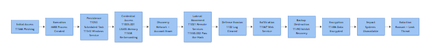
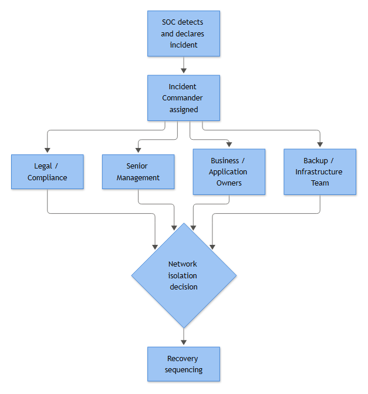

# Playbook: Ransomware Master Playbook

## Playbook ID & Name

**RAN-001 — Ransomware: Full Attack Lifecycle & Incident Command Field Guide**

Category: Master Playbook (cross-cutting — spans Identity, Endpoint, Network, and Email categories)
Owner: SOC Detection Engineering & Incident Response (joint ownership)
Executive Sponsor: CISO
Approver: Priya Anand, SOC Manager
Related Playbooks: 20 — Data Exfiltration Master, 22 — Malware Master, Identity & AD Account playbooks (10), Endpoint Execution/Persistence playbooks (12–13)
Version: 1.0
Status: Active – Production
Last Updated: 2026-09-15
Next Review Date: 2026-12-15 (quarterly, or immediately after any live activation or tabletop — see §Governance)

### How to use this document

This is not a single-alert playbook — it's the field guide an Incident Commander (IC) and the on-shift SOC reach for when a ransomware case is declared or suspected. Mid-incident, go straight to **Decision Points** or **Containment**. Pre-incident — onboarding, a tabletop, a detection-engineering sprint — the lifecycle sections are where the work lives. A missing log source below is a finding to fix now, not a gap to discover live.

One running example threads throughout: **Meridian Manufacturing** (fictional), incident **RAN-2026-0914-MERIDIAN**, domain `corp.meridianmfg.example.com`. Patient zero is a laptop, `MER-WKS-0447`, belonging to an accounts-payable clerk. It gets worse from there, the way it always does.

## Business Risk

**[STAKEHOLDER]** - Ransomware reliably converts a SOC alert into a board-level event within hours. The risk isn't just "files are encrypted" — it's simultaneous loss of availability (can't ship, invoice, or run payroll), a live extortion negotiation most executives have never rehearsed, a legal clock that starts the moment data theft is confirmed regardless of whether encryption ever happens, and a recovery timeline that depends on backup integrity nobody tested under pressure until now. Every hour spent preparing this in advance is an hour you don't have to invent mid-incident.

## Severity/Priority Default

| Confirmed indicator | Default severity | Notes |
|---|---|---|
| Single suspicious LOLBin/PowerShell execution, no other stage confirmed | Medium | Investigate as potential precursor; don't close on "one host, one alert" alone |
| Credential-dumping indicator or lateral-movement pattern confirmed | High | Assume domain-wide until scoped; begin precautionary account review |
| Defense-evasion indicators — 4719, 1102, EDR/AV tamper | **Critical / Sev-1**, immediate page | Near-zero false-positive rate; treat as active pre-detonation |
| Shadow-copy/backup sabotage (T1490), mass FileCreate/FileDelete fan-out, ransom note, confirmed encryption | **Critical / Sev-1**, bridge opens immediately | IC declared, notification chain begins within minutes |
| Confirmed large-volume outbound transfer to non-corporate destination | **Critical / Sev-1** | Triggers legal/regulatory track even if encryption never occurs |

Ransomware defaults to Sev-1 the moment recovery-sabotage or encryption is confirmed. Everything upstream can be triaged at lower severity individually — but in an environment already flagged for a live investigation, every lifecycle indicator below should auto-escalate rather than sit in a standard triage queue.

## MITRE ATT&CK Kill Chain Map

All technique IDs below are drawn from MITRE ATT&CK (MITRE, "MITRE ATT&CK," MITRE Corporation, accessed 2026: https://attack.mitre.org/ — see appendices/38b-references.md for the full source list). These stages rarely run in a strict straight line — Defense Evasion can recur at multiple points, and Discovery often continues after Lateral Movement from each new vantage point. The order below reflects what the SOC is most likely to see first, and what tends to follow.

| Stage | Primary ATT&CK Technique(s) | Primary Telemetry |
|---|---|---|
| Initial Access | T1566.001/.002, T1204, T1133, T1110, T1190, T1078/.004 | Mail gateway logs, Sysmon 1/3/22, 4104, 4625/4624 Type 10, Sysmon 11 |
| Execution | T1204, T1105, T1218.005/.010/.011, T1059.001/.003, T1027 | Sysmon 1, 4104/4103, 4688 |
| Persistence | T1543.003, T1053.005, T1547.001 | 7045, 4697, 4698, Sysmon 12/13/14 |
| Discovery | T1087, T1069, T1482, T1046, T1018, T1201 | Sysmon 1/3, 4798/4799 |
| Credential Access | T1003.001/.006, T1558.001/.002/.003, T1552.001 | Sysmon 10/1/11, 4769/4768/4771 |
| Lateral Movement | T1021.001/.002, T1550.002/.003, T1078.002 | 4624 Type 3/10, 4648, 4672, 4776, Sysmon 3/17/18, 7045/4697 |
| Defense Evasion | T1562.001, T1027 | Sysmon 1/6/12/13, 4719, 1102 |
| Exfiltration | T1567, T1048, T1071.004, T1572, T1090, T1530, T1538, T1580, T1098.001, T1119 | Sysmon 1/3/11/22, proxy/NetFlow |
| Encryption | T1486, T1490 | Sysmon 11/23/1, EDR fan-out alerts |
| Impact | T1486, T1490 (organizational consequence) | Cross-system correlation, CMDB, helpdesk volume |



*Figure F039 - the complete initial-access-to-extortion chain.*

## Detection Logic Summary & Investigation — By Attack Stage

### Stage 1 — Initial Access

At `MER-WKS-0447`, the entry path turned out to be phishing — but every case starts with one of four doors, and the earliest signature of each sits in a different log, often triaged as low-severity noise weeks before anyone connects it to an encryption event.

| Vector | ATT&CK | Earliest signature | Primary log source |
|---|---|---|---|
| Phishing | T1566.001/.002, T1204 | Office app spawns shell/LOLBin, obfuscated script block | Mail gateway, Sysmon 1/3/22, 4104 |
| Exposed RDP | T1133, T1110 | 4625 failure storm → 4624 Type 10 success from unbaselined source | 4625/4624/4740/4776 |
| Exploited public-facing app | T1190 | Webshell drop (Sysmon 11) → web process spawns shell (Sysmon 1) | Sysmon 1/11, app access logs |
| Valid account reuse | T1078/.004 | Anomalous geo/ASN logon, no MFA challenge | IdP sign-in log, 4624/4768/4769 |

**[ANALYST]** - For phishing, pull Sysmon 1 filtered on parent image `WINWORD.EXE`/`EXCEL.EXE`/`OUTLOOK.EXE` with a child of `powershell.exe`, `cmd.exe`, `wscript.exe`, or `mshta.exe` — that lineage should essentially never exist. Cross-reference 4104 for obfuscated blocks and Sysmon 15 for a Mark-of-the-Web identifier confirming internet origin. For RDP, baseline normal Logon Type 10 sources first; a 4624 Type 10 success immediately after a 4625 failure burst (Sub Status `0xC000006A`) from an unbaselined source is textbook, and 4740's Caller Computer Name often unmasks the real attacking host behind a jump box. For public-facing app exploitation, look for Sysmon 11 dropping a `.aspx`/`.jsp`/`.php` file into a web root outside a deployment window, immediately followed by the web server process spawning a shell. For valid-account reuse, the giveaway is context: a 4624 from an ASN/geolocation the account has never used, with no matching MFA challenge.

**[ENGINEERING]** - Build now: `Sysmon EID1 WHERE ParentImage IN (office_binaries) AND Image IN (LOLBins) AND CommandLine CONTAINS ('-enc','-nop','-w hidden','IEX')`, joined within 60s to Sysmon 3/22 outbound activity from that child process. For RDP: `count(4625, SubStatus IN (0xC000006A, 0xC0000064)) by source IP, account > threshold in 5 min → followed by 4624 Type 10 same source within 30 min`.

**[STAKEHOLDER]** - Every awareness campaign and mail-filtering investment gets justified right here — phishing is still the cheapest way in, and missing the first fifteen minutes is the difference between an isolated laptop and a domain-wide event two weeks later.

### Stage 2 — Execution

Once the loader lands, expect volume and speed rather than stealth — ransomware operators aren't optimizing for quiet the way a long-dwell APT does. `MER-WKS-0447` showed the textbook chain: `explorer.exe → mshta.exe → powershell.exe → rundll32.exe`, each hop individually suspicious (unsigned binary, unusual working directory, a UNC-path image name).

| LOLBin | ATT&CK | Typical use | Tell |
|---|---|---|---|
| mshta.exe | T1218.005 | Executes HTA that stages the loader | Spawns cmd.exe/powershell.exe as child |
| regsvr32.exe | T1218.010 | "Squiblydoo"-style scriptlet execution, sometimes over WebDAV | `/s /n /u /i:<url> scrobj.dll` pattern |
| rundll32.exe | T1218.011 | Loads the actual encryptor DLL export directly | Unusual export name, loads from %TEMP%/%APPDATA%/UNC path |

**[ANALYST]** - Don't stop at the first LOLBin hit — loaders frequently daisy-chain two or three before the real payload touches disk. Pull the full process tree, not just the alerting node, and check Sysmon 11 in the surrounding minutes for dropped executables/DLLs. Event ID 4104 consistently defeats PowerShell obfuscation, since it records the de-obfuscated block — `IEX (New-Object Net.WebClient).DownloadString(...)`, `-EncodedCommand`, string concatenation built to dodge static signatures. If 4104 isn't enabled, that's a gap to close before the next incident. T1059.003 shows up too, usually for simpler jobs — shadow-copy deletion, `net`/`wmic` from a batch script dropped alongside the loader.

Execution rarely runs alone. Expect T1543.003/T1053.005 persistence (§Stage 3) and T1562.001 defense impairment (§Stage 7) — often the loudest EDR alert of the stage — plus occasional T1055 Process Injection, where Sysmon 8/10 show a legitimate process (`explorer.exe`, `svchost.exe`) suddenly getting a handle opened into it with unusual access rights.

**[ENGINEERING]** - Build correlation around the chain, not single events: LOLBin child-of-Office/browser process → 4104 block containing `DownloadString`/`EncodedCommand` → new service or scheduled task within N minutes on the same host → shadow-copy deletion command. Any three of these firing on one host in a short window should page, not queue.

**[STAKEHOLDER]** - This is where "we got an EDR alert" turns into "we might have an active encryption event." Isolation authority needs to already be settled (§Containment) — waiting on a call-out approval while this chain fires is how a contained incident becomes a domain-wide one.

### Stage 3 — Persistence

Analysts from an APT background expect a rich persistence footprint. In ransomware cases you usually find almost nothing — one service, maybe a Run key, sometimes zero persistence outside the encryptor binary itself. That's not a detection gap; it's the business model — an affiliate optimizes for speed to detonation, not surviving a reboot. **Treat light persistence as consistent with ransomware, not as evidence the intrusion is minor.**

| Mechanism | Event IDs | ATT&CK |
|---|---|---|
| Service creation | 7045 (System, no audit policy required), 4697 (Security, requires audit policy) | T1543.003 |
| Scheduled task | 4698 (full Task Content XML) | T1053.005 |
| Registry Run key | Sysmon 12/13/14 | T1547.001 |

**[ANALYST]** - Service creation on servers isn't zero-baseline noise — patch management and backup agents install services constantly — so 7045/4697 alone is noisy. What separates a ransomware-relevant hit: Image Path in `C:\Windows\Temp`, `C:\ProgramData`, a UNC share, or a randomly-named binary in `AppData`; a service name mimicking a legitimate product without matching the real vendor path; or a manual Start Type paired with immediate invocation. Cross-reference the Service File Name against Sysmon 1 for the same host/timestamp — hash and command line tell you far more than the SCM event alone. For scheduled tasks, pull the Task Content XML directly rather than trusting Task Name — crews reuse legitimate-sounding names that don't match the actual `<Command>` inside. For Run keys, Sysmon 13 is what you'll see most; filter `TargetObject` on `\Run\`, `\RunOnce\`, `\Winlogon\Shell`/`Userinit`, excluding your known-good allowlist.

**[ENGINEERING]** - Correlate on host + narrow time window rather than treating 7045/4697 as standalone high-fidelity:

```text
event.code in (7045, 4697)
| where ImagePath matches (".*\\Temp\\.*", ".*\\ProgramData\\.*", "\\\\\\\\.*\\\\.*\\.exe")
   or ImagePath !contains VendorPathAllowlist
| join kind=inner (Sysmon | where EventID == 1) on Host, ImagePath ~= NewProcessName, timestamp within 2m
| project Host, ServiceName, ImagePath, ParentProcess, Hashes, Subject
```

**[MANAGEMENT]** - None of these three justifies a P1 alone, but any hit during an already-open engagement should auto-escalate — by the time persistence lands, detonation is often hours away, not days. Pre-authorize analysts to isolate on high-confidence hits tied to an open case without a second approval loop.

### Stage 4 — Discovery

Between first foothold and the encryptor hitting file servers, there's usually a window of hours to days where the operator quietly maps the environment — who are the domain admins, which host is the backup server, what talks over SMB and RDP. Miss this stage and you're triaging the encryption event instead of stopping it. The friction: almost everything here has a legitimate twin — help desk runs `net user` all day, scanners hit every port on schedule. Discovery detection is about context, not a single command line.

**[ANALYST]** - AdFind (and lookalikes — SharpHound, custom LDAP wrappers) remains the most common bulk-AD-recon tool, because it's fast, static, and doesn't need reflection tricks some EDR products flag:

```text
adfind.exe -f "(objectcategory=person)" -csv > users.csv
adfind.exe -sc trustdmp
adfind.exe -f "(objectClass=group)" -csv > groups.csv
```

`-sc trustdmp` (Domain Trust Discovery, T1482) is a strong tell — legitimate admins almost never run it interactively. Watch for the tool copied to `C:\Users\Public\` or `C:\Windows\Temp\` rather than run from an admin's normal toolset; placement plus a parent process of `cmd.exe`/`powershell.exe` spawned from a beacon or PsExec session is far more telling than the binary name, which is trivially renamed. `net.exe`/`net1.exe` covers cheap discovery with no tooling at all: `net group "Domain Admins" /domain` (T1069), `net view` (T1018 Remote System Discovery), `net accounts /domain` (T1201 Password Policy Discovery). The tell isn't the command, it's the chaining — the same sequence against a dozen hostnames from one workstation's Logon ID in seconds is a script, not a human typing.

**[ENGINEERING]** - Sysmon 1 always captures the full command line regardless of 4688 audit policy — hunt substrings (`objectcategory=`, `trustdmp`) combined with hash allowlisting of known builds. Cross-reference 4798/4799 — a single source workstation generating dozens of local-group-membership enumerations across multiple targets in a short window is a strong signal independent of tool attribution, since it also catches PowerShell-native variants that never touch disk. For port/service discovery, Sysmon 3 is the workhorse:

```text
Sysmon EventID=3 | where DestinationPort in (445, 3389, 5985, 5986)
| summarize DistinctDest=dcount(DestinationIp) by SourceIp, Image, bin(TimeGenerated, 5m)
| where DistinctDest > 15
```

**[MANAGEMENT]** - This logic generates false positives against legitimate vulnerability scanners and backup agents; maintain an exception list owned by IT operations, reviewed quarterly, with SOC owning the alert logic and IT confirming scanner ranges — not the reverse.

### Stage 5 — Credential Access

This is the hinge point of the incident. Initial access gets an attacker onto one host; credential access lets them stop being a guest and start being an administrator everywhere else. Catch it before this stage and you're doing forensics on a workstation; catch it after and you're doing forensics on the entire forest, with the clock on domain-wide lateral movement already running. At Meridian, this is exactly where the case turned — a dumped LSASS on `MER-WKS-0447` produced a cached helpdesk admin credential valid across the file server fleet.

**[ANALYST]** - The core signal is Sysmon 10 (ProcessAccess) where the target image is `lsass.exe`. Legitimate LSASS touches are a short, boring list; hunt for an unusual source process — `taskmgr.exe` requesting GrantedAccess `0x1410`/`0x1010`, `procdump.exe`, `rundll32.exe`, or an unsigned binary. Pair with Sysmon 1 for command line/parent chain and Sysmon 11 for any `.dmp` file dropped afterward — attackers frequently dump LSASS to disk and exfiltrate it for offline parsing rather than running credential tools live and tripping AV.

Don't anchor detection purely on the LSASS handle — plenty of intrusions go straight for **T1558.003 Kerberoasting** (mass 4769 requests with RC4 ticket encryption `0x17` against multiple SPNs from one source, short window), **T1558.001 Golden Ticket**, or **T1003.006 DCSync** (replication requests from a non-DC account, nothing near LSASS at all) — LSASS-centric detection alone lets DCSync walk right past you. **T1552.001 Credentials In Files** covers the quieter half — saved browser passwords, cached `.rdp` files, `unattend.xml`, KeePass exports — doesn't touch LSASS or trip Mimikatz-tuned heuristics, and is routinely the actual source of the credential that ends the single-host phase.

**[ENGINEERING]** -

```text
EventID=10
TargetImage="*\\lsass.exe"
GrantedAccess IN ("0x1410","0x1010","0x1438","0x143a","0x1fffff")
SourceImage NOT IN (known_good_signed_paths)
```

Correlate against Sysmon 1 for the same ProcessGuid to pull CommandLine/ParentCommandLine, and alert independently on command lines matching known dumping syntax (`sekurlsa::`, `procdump.*lsass`, `comsvcs.dll.*MiniDump`) regardless of whether ProcessAccess fires cleanly, since some tooling injects rather than opening a handle the naive way.

**[STAKEHOLDER]** - Up to this point the business risk is bounded — one machine, one user's blast radius. Once a credential with domain-wide reach is harvested, this is the point where "monitor and contain" needs to become "assume compromise across the estate."

**[MANAGEMENT]** - Escalate to full incident status if not already there: mandate a credential-reset scope decision (which accounts, what order, krbtgt reset where DCSync/Golden Ticket is suspected), and set the expectation that "contained" and "eradicated" are different milestones — an unrotated privileged credential means the attacker can walk back in through a different door after the original host is wiped.

### Stage 6 — Lateral Movement

Ransomware crews win in the hours or days before encryption, quietly moving from patient-zero to domain controllers, backup servers, and file shares. Catch lateral movement and you're doing incident response; miss it and you're doing disaster recovery. Four telemetry clusters matter most.

| Cluster | Key events | Signal |
|---|---|---|
| RDP (Logon Type 10) | 4624/4625 Type 10, 4648, 4672, Sysmon 3 | Workstation account RDP'ing to a server it's never touched, off-hours |
| SMB/admin shares (Logon Type 3) | 4624/4625 Type 3, Sysmon 3/17/18 | User account (never a service account before) authenticating to `ADMIN$`/`C$` on a DC or backup host |
| Pass the Hash / Pass the Ticket | 4776 (Error 0x0 but NTLM where Kerberos expected), 4769 without matching 4768 | Ticket/hash reused, not legitimately requested |
| PsExec-style execution | 4697/7045 (`PSEXESVC`-pattern names), Sysmon 17/18 (`\PIPE\psexecsvc`), 4689 | Short-lived service, install-execute-exit within seconds |

**[ANALYST]** - Baseline RDP first: which hosts are legitimate jump boxes, which accounts RDP daily, what hours. Suspicious: a workstation account Type-10 logon to a server it's never touched, followed by `net.exe`/`whoami.exe`/`nltest.exe`. For SMB, normal is service accounts hitting shares on a predictable schedule; suspicious is a *user* account on `ADMIN$` with no business reason — especially near an RDP hop from a different box. For PsExec, IT ops legitimately uses it for patching — check for a change ticket before calling it malicious; absent that, a PsExec-pattern install fanning out across a dozen hosts in minutes is a strong staging indicator.

**[ENGINEERING]** - Pass the Hash (**T1550.002**) shows as an NTLM-authenticated Type 3 logon between two domain-joined hosts where Kerberos should be the default path. Pass the Ticket (**T1550.003**): a 4769 with no corresponding 4768 from the same client address means the ticket was imported, not requested. A Golden Ticket (**T1558.001**) shows as a 4768 with an abnormal lifetime, sometimes for a principal that no longer resolves cleanly. A Silver Ticket (**T1558.002**) never touches the DC — a 4624 lands on the target host with zero matching upstream 4769; that absence is the evidence. Treat **Logon ID** as a join key across the chain:

```text
Host A: 4624 (Type 10, RDP) -> Logon ID 0x3A9F1C
Host A: 4688 under 0x3A9F1C -> net.exe / mstsc.exe to Host B
Host B: 4624 (Type 3, SMB/NTLM) from Host A -> new Logon ID 0x4B2E07
Host B: 4697/7045 service install under 0x4B2E07 -> payload execution
```

**[MANAGEMENT]** - Lateral-movement alerts carry a tighter SLA than routine alerts — 15 minutes to eyes-on once ransomware is suspected anywhere, since dwell time here is measured in minutes. Track mean-time-to-contain from first indicator and review closure codes monthly; a healthy mix includes Benign Positive and Insufficient Evidence, not just True Positive.

### Stage 7 — Defense Evasion

By the time an operator tampers with logging and security tooling, they usually already have a foothold and domain-level access. Not the flashy part of the intrusion, but it decides whether you catch this at 2 a.m. on day one or find out from the ransom note on day twelve. If you only have budget to tune one stage, tune this one — low false-positive rate, high true-positive severity, a rare combination in this kill chain.

Operators go after security tooling through repeatable mechanisms: **service-level kill** (`sc.exe stop`, `net stop`, or registry edits to a security service's Start value); **BYOVD** (a signed-but-vulnerable driver loaded to strip EDR hooks from kernel space — Sysmon 6 exists to catch this: flag unsigned drivers outright, and separately check signed drivers' hash/publisher against a known-vulnerable-driver list, since BYOVD abuses a legitimate signature, not the absence of one); **uninstall via installer/service abuse** (7045/4697 where the Service File Name references an uninstaller or renamed removal tool); and **PowerShell-driven tampering** (`Set-MpPreference -DisableRealtimeMonitoring $true`, tamper-protection toggles — 4104 catches this even base64-encoded).

4719 fires when a subcategory — most tellingly Process Creation auditing or Security State Change — gets flipped off. A blinding move, not cleanup. 1102 is the cleanup move, about as close to a smoking gun as Security auditing produces — the Subject field tells you who cleared it, and if that account isn't your logging/SIEM service account or a documented maintenance window, this is an incident, full stop.

**[ANALYST]** - Baseline what "normal" looks like for your EDR/AV vendor's service and driver footprint on gold-image hosts. A 7045/4697 pair for a security-relevant service where the Service File Name doesn't match your known-good path or hash is a tampering candidate until proven otherwise — don't wait for encryption to start to escalate.

**[ENGINEERING]** -

```text
alert when:
  EventID == 1102
  AND Subject.AccountName NOT IN (approved_log_admin_accounts)
  WITHIN 15m OF (EventID IN (4719, 7045, 4697) ON SAME Host)
```

The pairing matters more than either event alone. 4719 followed by 1102 on the same host, close together, outside change windows, is a near-certain precursor to encryption — get eyes on that host and its lateral-movement neighbors immediately.

**[MANAGEMENT]** - 1102 and 4719 should page someone, always, with no dedupe/suppression window longer than a few minutes and no auto-close. Track mean time from first 4719/1102 to containment action as a core ransomware-readiness metric; require CISO sign-off to add any suppression rule touching these two IDs.

### Stage 8 — Exfiltration: the Double-Extortion Staging Window

By 2026, most professional affiliates run double extortion by default: backups can defeat encryption, but they can't un-leak stolen data. Encryption is the secondary lever now for a lot of crews; data theft is the primary one — also why exfiltration usually precedes detonation, since once encryption starts, the quiet window over file shares closes fast. At Meridian, six hours of Sysmon 3/22 telemetry between lateral movement and the ransom-note drop showed sustained outbound sessions from `MER-FS02` to a non-corporate ASN — the exfiltration case there had to be built after the fact, from network telemetry alone.

**Staging.** Operators typically pull files from shares (**T1119 Automated Collection**) into password-protected archives dropped somewhere convenient, often the file server itself. **[ANALYST]** - Watch Sysmon 11 for large archive-extension file creates (random-named or split-volume `.7z`/`.zip`/`.rar`) in paths with no business hosting archives, correlated to Sysmon 1 for the archive utility's invocation.

**Cloud egress.** The dominant pattern (**T1567**) is direct upload via `rclone` (frequently renamed), MEGAsync, or WinSCP/FileZilla to an attacker-controlled endpoint. Pivoting into the victim's own cloud tenant instead shows as **T1530 Data from Cloud Storage**, **T1538 Cloud Service Dashboard**, **T1580 Cloud Infrastructure Discovery** (enumerating buckets before pulling data), and **T1098.001 Additional Cloud Credentials** where the operator adds their own access key to preserve access after eradication. **[ENGINEERING]** - Hunt Sysmon 1 for `rclone` syntax, Sysmon 22 DNS queries resolving to cloud-storage domains from a host with no reason to (a file server resolving `mega.nz`), and Sysmon 3 connections on 443/22/990 to non-corporate ASNs sustained over minutes-to-hours rather than normal browsing's shape.

**Volume indicators.** Where full process attribution isn't available, proxy/NetFlow still shows sustained high-volume outbound transfer from a host with no reason to be a top talker (a file server, off-hours, under a service account):

```text
netflow | where direction == "outbound"
| summarize bytes_out = sum(bytes) by src_host, bin(time, 15m)
| where bytes_out > baseline_p99 and dest_asn !in (corporate_cloud_allowlist)
```

Also watch **T1048 Exfiltration Over Alternative Protocol** (non-standard port/protocol dodging DLP tuned for web/email only), **T1572 Protocol Tunneling**/**T1090 Proxy** (exfil riding inside an allowed protocol or relayed through a multi-hop proxy), and, less common, **T1071.004 DNS** for slow low-volume exfil where other egress is blocked.

**[ANALYST]** - DLP is frequently tuned for email/web-form uploads and blind to `rclone` or raw SFTP; legitimate sync agents look similar at the flow level, so process attribution (Sysmon 3/22), not volume alone, separates a real finding from an argument with backup ops. Treat "no exfiltration found" as **Insufficient Evidence** until retention lets you look further back, not a clean bill.

**[STAKEHOLDER]** - Confirmed exfiltration changes the legal and regulatory picture immediately, regardless of whether the encryptor ever runs. "No ransom note yet" does not mean "no notification duty yet" — this needs to reach Legal the moment it's confirmed.

### Stage 9 — Encryption: Detonation Signals and Recovery Sabotage

By the time file content is actually changing on disk, the incident has moved past containment-is-easy territory — everything upstream was positioning. Four detection surfaces matter most here.

**Mass rename/extension-change.** Most encryptors read the original file, write encrypted content to a temp file, delete the original, then rename to a new extension — a paired **FileCreate → FileDelete** fingerprint at high volume from one process across many directories in a short window. **[ANALYST]** - Normal is a handful of creates/deletes per minute in one or two directories; suspicious is hundreds to thousands per minute across multiple drives and shares, including files the user has no reason to touch. **[ENGINEERING]** -

```text
Sysmon | where EventID in (11, 23) and TimeGenerated > ago(5m)
| extend Directory = substring(TargetFilename, 0, lastindexof(TargetFilename, '\\'))
| summarize FileCreateCount = countif(EventID == 11),
            FileDeleteCount = countif(EventID == 23),
            DistinctDirs = dcount(Directory)
          by Image, Computer, bin(TimeGenerated, 1m)
| where FileCreateCount > 200 and DistinctDirs > 20
```

Don't hard-code a fixed extension list as the trigger — affiliates rotate extensions; volume and fan-out are the durable signal.

**Entropy-spike indicators.** Windows doesn't natively log file-content entropy — EDR/UEBA/FIM territory. Legitimate writes have predictable, lower-entropy distributions; encrypted output is close to statistically random. **[ENGINEERING]** - Tune against known-good compression/backup jobs first (zip, 7z, SQL backups are also high-entropy). Canary/honeyfiles watched for entropy change plus rapid modify-time churn are a cheap tripwire independent of vendor scoring. **[ANALYST]** - Entropy alone isn't proof; correlate with the FileCreate/FileDelete fan-out before calling it **T1486** (MITRE, "T1486: Data Encrypted for Impact," MITRE ATT&CK, 2025: https://attack.mitre.org/techniques/T1486/ — see appendices/38b-references.md).

**Shadow copy/recovery sabotage (T1490).** Close to universal — deleting shadow copies and disabling recovery removes the cheap restore path and forces the negotiation (MITRE, "T1490: Inhibit System Recovery," MITRE ATT&CK, 2025: https://attack.mitre.org/techniques/T1490/):

| Command pattern | Intent |
|---|---|
| `vssadmin.exe delete shadows /all /quiet` | Delete all shadow copies silently |
| `wmic.exe shadowcopy delete` | Same, via WMI |
| `bcdedit.exe /set {default} recoveryenabled No` | Disable boot-time recovery |
| `wbadmin.exe delete catalog -quiet` | Destroy Windows Server Backup catalog |

**[ENGINEERING]** - Sysmon 1 (full command line always populated) is the reliable source; 4688 works only if command-line auditing is enabled. Allowlist by known-good parent process and signed publisher rather than suppressing the pattern outright, since backup/imaging software (Veeam, Macrium) runs similar commands. **[ANALYST]** - Timing matters: sabotage in the same 1-2 minute window as the FileCreate/FileDelete storm is corroborating; sabotage hours earlier means the actor pre-positioned deliberately.

**Ransom note drop detection.** Note drop is almost always mass, uniform, and fast — identical name and content into every directory touched, hundreds to thousands of times in minutes. **[ENGINEERING]** -

```text
Sysmon | where EventID == 11
| where TargetFilename matches regex @"(?i)(readme|decrypt|recover.?files|how.?to.?decrypt)"
| summarize NoteCount = count(), DistinctDirs = dcount(TargetFilename) by Image, Computer, bin(TimeGenerated, 5m)
| where NoteCount > 10
```

**[ANALYST]** - A single note in a single folder could be a stale artifact or an awareness-test file — validate hash and directory breadth first. Dozens of identical notes across a file-server tree in five minutes is not ambiguous.

The high-confidence detection isn't any single signal — it's the sequence: unusual process creation, VSS/backup sabotage, mass FileCreate/FileDelete fan-out, then uniform ransom notes, chained in a bounded window from one host or a small cluster. That chained artifact is what you hand the IC as proof encryption is live, not suspected.

**[MANAGEMENT]** - This chain should carry an SLA of minutes and an auto-isolation trigger — every minute between first FileCreate spike and containment is more encrypted estate. Track mean-time-to-isolation from first VSS-deletion or note-drop alert as a hard KPI.

### Stage 10 — Impact: Scope Assessment in the First Hour

By the time you're formally in the Impact stage, containment has usually already started — this isn't a phase you enter deliberately, it's the one you realize you're already in, usually because the helpdesk queue just went from four tickets to four hundred. Impact rarely announces itself as a single event; it's a pattern of unrelated-seeming complaints that converge.

| Symptom reported | Likely cause | Who notices first |
|---|---|---|
| Files with a weird extension, ransom note in every directory | Active T1486 | End users, helpdesk |
| File server/share unreachable, SMB timeouts | Encryptor consuming disk I/O, or host crashed mid-encryption | IT ops, monitoring |
| Backup jobs failing, backup console unreachable | Backup infrastructure targeted directly, or credentials burned earlier | Backup admin, not SOC |
| Domain controllers unresponsive, GPO not applying | DCs encrypted or deliberately targeted last for maximum blast radius | Domain admins |
| Production line/OT system down | IT/OT segmentation failure, or ransomware crossing into historian/SCADA-adjacent Windows hosts | Plant ops — reaches SOC last, hurts most |

The pattern that separates ransomware impact from a garden-variety outage is **simultaneity across unrelated systems**. One dead file server is a hardware problem. A file server, three backup targets, and the DC all going sideways inside twenty minutes is impact stage.

**[STAKEHOLDER]** - The business doesn't care about encryption algorithms in hour one — they care whether they can take orders, ship, and pay people. "Domain controllers in Site B are encrypted" means nothing to a CFO; "Site B cannot process invoices and payroll runs are at risk Friday" does. Translate every finding into those terms in the first briefing. Where the technical recovery timeline runs to days, activating manual fallback — paper-based order entry, manual invoicing, phone-based updates to customers and suppliers waiting on shipments — is a decision Business Continuity/Operations owns, not the SOC; say so explicitly in the first briefing so the business isn't sitting idle waiting on IT for a call IT was never going to make.

**[ANALYST]** - The IC's job isn't root-cause analysis — that's parallel investigation work. It's a **blast-radius map**, built fast and revised often, from sources worked in parallel: Sysmon 11 ransom-note bursts (fastest indicator of confirmed vs. suspected); Sysmon 23 mass-deletion patterns (deletes with no note yet may just be mid-encryption, not safe); Sysmon 1/4688 T1490 commands, which often fire minutes before the encryptor; and EDR alert volume **by host**, not by alert type. Expect gaps: DCs may be encrypted before logs forward to the SIEM, and EPS spikes can overwhelm ingestion. Treat "only 12 hosts alerting" as a floor, not ground truth, this early.

**[MANAGEMENT]** - The first-hour deliverable is a living scope document — host/system, business function, confirmed/suspected/clean, backup status (untested — "backups exist" is not "backups are restorable"). Update it every 15 minutes, timestamped. This document becomes the spine of the exec briefing, the legal/insurance notification, and the after-action review. Backup verification and the pay/not-pay decision are downstream of it, not part of it — the SOC's job in hour one is scope, not remediation strategy.

## Known Limitations

Every detection cited above assumes cleaner telemetry than a live incident usually delivers. Name the gaps up front so nobody mistakes silence for a clean host.

- **VPN/NAT collapses source attribution.** A remote workforce egressing through a handful of corporate VPN concentrators makes "anomalous geo/ASN logon" (§Stage 1) and "a workstation account that's never touched this host before" (§Stage 6) noisier than they look on paper — pull the VPN/NAT session log for the real client address before calling a shared exit IP either clearly malicious or clearly clean.
- **Shared and service accounts blur single-actor attribution.** Helpdesk, backup, and break-glass accounts are routinely used by more than one human or process. A Logon ID chain (§Stage 6) proves an authenticated session moved between hosts — it doesn't by itself prove which person or process drove it without a second corroborating source (endpoint-side process ownership, a ticket, a badge log).
- **Clock drift and mixed time zones distort tight-window correlation.** Several of the detections above depend on events landing within a one-to-five-minute window across two or more hosts (§Stage 6 Logon ID chaining, §Stage 9 sabotage-to-encryption timing). Confirm NTP sync and normalize everything to UTC before trusting an apparent gap or overlap — a host running five minutes fast can make simultaneous events look sequential, or the reverse.
- **Log delay and partial telemetry are the default mid-incident, not the exception.** A domain controller can be encrypted before its own logs finish forwarding to the SIEM, and EPS spikes during mass encryption routinely overwhelm ingestion (§Stage 10). Treat any host count or timeline built in the first hour as a floor, not ground truth, and revise it as delayed logs land.
- **Retention limits cause gaps that look like clean results.** Exfiltration especially (§Stage 8) is often reconstructed after the fact from whatever network telemetry retention still covers. "No exfiltration found" inside a short retention window is **Insufficient Evidence**, not a finding of "didn't happen."

## Decision Points

The calls an IC has to make live, under pressure, with incomplete information. None have a clean textbook answer — only a documented, defensible tradeoff.

### Isolate now vs. preserve evidence

There's no clean answer here, only discipline about the order of operations. **[ANALYST]** - Before pulling network access, if there's even 60-90 seconds, grab volatile evidence: a memory-resident process list, active connections (Sysmon 3), and the encrypting process's PID/command line (Sysmon 1 or 4688). Note the exact timestamp of the isolation action and by whom — part of the root-cause timeline and, if litigation follows, the evidentiary record.

**[ENGINEERING]** - Isolation order, fastest and least evidence-destructive first: (1) EDR network containment/quarantine — near-instant, reversible, logging continues locally; (2) switch port shutdown/802.1X quarantine VLAN — fast, kills SMB/RDP lateral movement immediately; (3) firewall/ACL block at segment boundary — slower at scale, keeps internal forensics collectible; (4) physical unplug/power-off — last resort only, since it destroys memory-resident evidence and can trigger shutdown-triggered cleanup in some families.

Never default to (4) for a live encrypting host unless it's about to hit something irreplaceable. **[MANAGEMENT]** - Default: contain at the network layer, don't power off, unless the IC states a specific reason — regulators and insurers will ask why a host was or wasn't powered down.

### Scope of precautionary account disabling

**[ANALYST]** - Build the disable list from evidence, not guesswork: accounts in 4624/4672 privileged logons on affected hosts, accounts tied to 4720/4728/4732 activity beforehand, and service accounts tied to 4697/7045 installs matching the ransomware binary. **[ENGINEERING]** - Priority order: domain/enterprise admin accounts with recent activity; accounts that authenticated to the encryption-source host; service accounts with logon rights on more than one server unless confirmed clean; break-glass accounts — reset, don't disable. Do **not** blanket-disable every domain account; that's a self-inflicted denial of service. **[MANAGEMENT]** - Track disabled accounts on one running list with owner and re-enable criteria — "who approved re-enabling the CFO's account" needs an answer at the after-action review, not a guess.

### Rebuild vs. restore

Not a technical coin-flip — a risk/cost trade decided per asset class, and the IC should push for a written decision matrix rather than relitigating it host by host at 2 a.m.

| Factor | Favors restore | Favors rebuild |
|---|---|---|
| Domain Controllers, PKI, identity infra | Rarely, if ever, if attacker had domain admin | Almost always — rebuild from clean media, restore data only |
| Backup image age vs. dwell time | Image predates the first confirmed Indicator of Compromise (IOC) by a comfortable margin | Image falls inside or near the compromise window |
| Golden image/IaC availability | N/A | Rebuild is fast and cheap — prefer it |
| Custom, undocumented legacy app | Restore, with compensating monitoring | Rebuild not realistic short-term |

**[MANAGEMENT]** - Domain Controllers, CA servers, and anything that validated authentication during the incident default to rebuild-from-clean, not restore, unless forensics can affirmatively clear them. Restoring a DC in scope for credential theft without a full krbtgt reset reintroduces the exact persistence mechanism you're trying to remove.

### Backup trust — do we actually have backups

Restoring from a compromised or sabotaged backup set is a documented failure mode, not a hypothetical — T1490 routinely precedes T1486 precisely because backups stand between the victim and a payment decision. **[ANALYST]** - Confirm three things independently, never from the backup console's own status page: the backup's timestamp relative to the confirmed compromise window (discard anything after first IOC minus a safety margin — dwell time is usually longer than it looks); that backup infrastructure itself wasn't touched (anomalous 4624 Type 10/3, 4648, 7045/4697 on the backup agent — if it appears in the lateral-movement graph, treat every image as suspect); and a sample-restore of one non-critical host to an isolated VLAN before trusting the image for anything business-facing. **[ENGINEERING]** - Immutable/air-gapped backups get restore priority; anything reachable from a domain-joined credential during the incident window gets the sample-restore treatment regardless of vendor assurances.

### Pay or not pay — why this is not a SOC decision

This is the one decision point where the SOC's job is to supply facts, not make the call. Whether to pay a ransom is a business-and-legal decision, owned by executive leadership and Legal jointly, informed by insurance coverage (the carrier should already be engaged per §Communication Requirements, not consulted for the first time here), sanctions/OFAC-type exposure, regulatory posture, and the confirmed (not assumed) state of backup recoverability. **[STAKEHOLDER]** - The SOC's deliverable is narrow: confirmed scope, confirmed exfiltration status (§Stage 8 — paying doesn't un-leak data already staged out), and confirmed backup viability (§Backup trust). **[MANAGEMENT]** - Do not let the payment conversation happen without that evidence in hand, and do not let the SOC frame the recommendation — that's Legal and the executive sponsor's role. Document who made the call and on what evidence; it matters for insurance and regulators regardless of the outcome.

## Containment Options & Approval Authority

**[MANAGEMENT]** - Isolation authority has to be pre-agreed before the incident, not negotiated during it. If the IR plan says "the SOC will isolate as needed," that's not an authority model, that's a hope. The SOC Manager (or on-call incident lead outside business hours) is who formally declares Sev-1 and designates the IC — until that call is made, the on-shift analyst defaults to single-host containment authority only and escalates up, not sideways.

| Scope | Who can authorize | Escalation trigger |
|---|---|---|
| Single host/endpoint | On-shift analyst/handler, no approval needed | Immediate, log in IR ticket |
| VLAN/subnet segment | Incident Commander | Notify IT infra lead + site owner within 15 min |
| Site/building network | IC + IT Director or designated deputy | CISO notified immediately, BCP activated |
| Core/WAN, DC isolation, internet egress cut | IC + CISO (or delegate) jointly | CEO/board bridge, legal and comms engaged same call |

The key failure mode: the analyst who spots the ransom note has the technical ability to isolate a switch port but no delegated authority to do it, and burns twenty minutes hunting for a human who can say yes while encryption continues. Pre-authorize host-level and single-segment isolation to on-shift staff, in writing, with post-hoc notification rather than a pre-approval gate. **[STAKEHOLDER]** - The risk of hesitating is almost always worse than the risk of an unnecessary cut. A severed VLAN is an outage you can explain to a customer. A second building encrypted because nobody had authority to act is not.

Account disabling scope and isolate-fast-vs-preserve-evidence are covered under Decision Points — authority and method are separate questions, both settled in advance.

## Communication Requirements — Notification Chain & Bridge Discipline

Ransomware incidents die or survive on communication discipline as much as on tooling. The moment encryption is confirmed, technical response and notification run in parallel, and the IC owns both. Get the chain wrong — too slow, too loud, wrong sequence — and a second incident gets created: a legal or reputational one that outlives the malware.

| Order | Stakeholder | Why now | What they own |
|---|---|---|---|
| 1 | Incident Commander | Declares the incident, opens the bridge | Overall response authority, single source of truth |
| 2 | Legal Counsel (internal + outside breach counsel if retained) | Privilege needs to attach before anyone writes anything down | Attorney-client privilege, regulatory clock, law enforcement contact |
| 3 | Cyber Insurance Carrier (via Legal or the named policy contact) | Policy notification windows are frequently measured in hours to a few days and often name the only forensics/legal/negotiation vendors the policy will reimburse | Approved-vendor panel, coverage scope and sub-limits, reimbursement process, negotiation-firm engagement if extortion is confirmed |
| 4 | Senior Management/Executive Sponsor (CISO, CIO, sometimes CEO) | Needs situational awareness before hearing it from a business unit or the press | Resourcing, external comms approval, ultimately the pay/not-pay call |
| 5 | Business/Application Owners for affected systems | They know the real business impact of downtime | Impact statements, RTO/RPO tolerance, prioritization input |
| 6 | Backup/Infrastructure Teams | Restore feasibility has to be assessed before anyone promises a recovery time | Backup integrity verification, restore sequencing, isolation of backup infra |



*Figure F040 - who gets notified and in what order during an active ransomware incident.*

**[MANAGEMENT]** - Notification timing should be pre-defined, not improvised live. Working threshold: Legal and the executive sponsor are notified the moment ransomware is *suspected* if it affects more than one endpoint, or immediately regardless of scope once encryption or backup sabotage is evident. Loop in the cyber insurance carrier on the same call as Legal, not after — most policies start their own notification clock independent of the SOC's timeline, and a late call can put coverage itself at risk.

**Running the bridge.** It needs a rhythm or it becomes a shouting match. The IC opens every call the same way: confirmed facts, unknowns, decisions needed — facts before speculation. A dedicated scribe (not the IC, not an analyst mid-investigation) keeps a timestamped decision log, one line per decision, who made it, what authority they had; Legal will ask for it later. Cadence: 30-minute standups early, stretching to hourly or twice-daily once containment holds. Speaking order: technical findings, then legal risk, then business impact, then decisions. One person authorizes external statements, and that sits with Legal and the executive sponsor jointly, never IT or SOC.

**[ANALYST]** - What you hand up the chain is evidence and confidence level, not conclusions. "Encryption confirmed on 40 hosts in the Finance VLAN, ransom note present, no evidence of exfiltration yet" is usable. "It's a ransomware attack and they definitely stole data" from an analyst two hours into triage is not — and it will get quoted back to you if it's wrong.

A working notification log:

```text
Incident: RAN-2026-0914-MERIDIAN
Time (UTC) | Party Notified            | Method    | Notified By  | Ack'd By
14:02      | Legal Counsel (J. Rai)    | Phone     | IC (M. Osei) | Y
14:11      | CISO (D. Ferro)           | Bridge    | IC           | Y
14:35      | App Owner - ERP (S.Klein) | Bridge    | IC           | Y
15:10      | Backup Lead (T.Nakamura)  | Voicemail | IC           | N — pending, redialed 15:25
```

Every row needs an ack, not just a send — "notified" and "confirmed aware" are legally different states once discovery or regulatory timelines get scrutinized. The Backup Lead row above is the realistic case, not the exception: a voicemail is a send, not an ack, and it's exactly the kind of gap a scribe needs to chase down rather than let sit as a checkbox.

## Recovery

Recovery is where Incident Commanders get hurt politically. The encryption event is over, the room wants "back to normal," and every hour of downtime has a dollar figure Finance is calculating in real time. The job is to slow that instinct down just enough to avoid a second detonation.

**Order of restoration.** Sequence by business-criticality tier agreed with the business continuity owner *before* the incident — build it now as a gap finding if it doesn't exist. Typical tiering: Tier 0 (identity, DNS, backup infrastructure) → Tier 1 (revenue-generating/safety systems) → Tier 2 (internal productivity) → Tier 3 (everything else). Never restore a downstream tier onto a Tier 0 system that hasn't been independently validated clean. Backup validation and the rebuild-vs-restore matrix (§Decision Points) gate every restoration, no exceptions, regardless of the pressure to go faster.

**Reinfection risk — the gate before go-live.** **[ANALYST]** - Before any restored or rebuilt host reconnects, confirm eradication of every persistence mechanism found: scheduled tasks (4698), services (4697/7045), Run-key entries (Sysmon 12/13), rogue accounts (4720/4722/4728), and audit-tampering (1102, 4719) that may have blinded logging mid-incident. A single missed task, or an unrotated service-account credential, turns a clean restore into a same-day repeat encryption event. Cross-check the disabled-account list against re-enablement — nothing goes back on without a documented, business-need reason.

**[MANAGEMENT]** - Recovery has its own approval gate, separate from containment: no production reconnection without sign-off from both the IC and whoever owns the eradication checklist for that asset class. Track time-to-restore against the tier sequence, and flag any case where business pressure moved a Tier 2/3 system ahead of a Tier 0 dependency — a governance finding for the after-action review, not just an operational note.

## True Positive / Benign Positive / Insufficient Evidence — Closure Criteria

Not every ransomware-adjacent alert ends in a confirmed encryption event, and the closure taxonomy matters for trend data as much as for any single case.

- **True Positive** - one or more stages independently corroborated (e.g., LSASS access via Sysmon 10 *and* a subsequent lateral-movement logon under the harvested credential), scope documented, containment applied and logged.
- **Benign Positive** - traces to a known, named source: a PsExec deployment tied to an open change ticket, a scanner's port sweep, a backup agent's service reinstall. Document the owning team/tool by name — "probably fine" is not a closure code.
- **Expected Activity** - recurring, pre-approved administrative behavior (scheduled AD audits, documented DR test restores) that would otherwise match this playbook's logic. Maintain an allowlist, reviewed quarterly, rather than re-litigating the same finding.
- **Insufficient Evidence** - source can't be attributed, or a stage's evidence (most often exfiltration, §Stage 8) can't be confirmed or ruled out due to telemetry gaps or retention limits. Flag for a watchlist and revisit as more logs land — don't silently close, and don't round up to a worse verdict than the evidence supports.

## Escalation Criteria

Escalate to full Sev-1, bridge opened, immediately when any of the following is confirmed: mass rename fan-out or ransom note drop on any host; shadow-copy/backup-catalog deletion (T1490) anywhere; an audit-policy change (4719) or log-clearing event (1102) outside a maintenance window; lateral movement using a domain admin or service account with reach into backup infrastructure; or large-volume outbound transfer to a non-corporate destination. Any one alone is sufficient — don't wait for a second signal.

## Response SLA

**[STAKEHOLDER]** - Each threshold below is argued for in context in the stage or decision point that names it; this table exists so a CISO or business owner doesn't have to hunt through ten stages to find the number that matters to them. These are floors — a healthy program beats them, not just meets them.

| Trigger | Eyes-on / Acknowledge | Decision required by | Owner |
|---|---|---|---|
| Single lifecycle indicator, no other stage confirmed (§Severity/Priority Default) | 15 min | Escalate or stand down within 30 min | On-shift analyst |
| Lateral movement suspected anywhere in the environment (§Stage 6) | 15 min | Contain or clear within 1 hour | On-shift analyst / IC |
| Defense-evasion pairing — 4719 + 1102 on the same host (§Stage 7) | Immediate page, no dedupe window longer than a few minutes | Escalate to Sev-1 and isolate within 15 min | On-shift analyst, no approval gate |
| VSS/backup sabotage or ransom-note fan-out confirmed (§Stage 9) | Immediate page | Isolation decision within minutes | On-shift analyst + IC |
| Confirmed encryption or large-volume non-corporate outbound transfer (§Severity/Priority Default) | Immediate, Sev-1 bridge | IC declares within minutes | IC |

## Governance, Metrics & Review Cadence

**[MANAGEMENT]** - Review this playbook quarterly and after every live activation or tabletop, with revisions tracked in version history. Core metrics: mean-time-to-detect per stage (especially first-4719/1102-to-containment and first-VSS-deletion-to-isolation); mean-time-to-contain from first lateral-movement indicator; the True Positive / Benign Positive / Insufficient Evidence split (a healthy program shows a mix, not a monoculture); and, per event, whether isolation and notification happened within pre-agreed authority windows — a harder bar than whether detections merely fired. Any suppression rule touching 1102, 4719, or the encryption correlation chain requires CISO sign-off. The after-action review owns the question this playbook can't answer live: which decisions got made on time, by the right person, with the right evidence.

## Appendix A — Event ID Quick Reference

| Event ID | Log | What it tells you |
|---|---|---|
| 4624 / 4625 | Security | Logon success/failure; Logon Type (3=SMB, 10=RDP) is the key discriminator |
| 4648 | Security | Explicit-credential logon — RunAs, alternate creds |
| 4672 | Security | Privileged logon, fires alongside 4624 when the token is admin-equivalent |
| 4688 | Security | Process creation (command line only if audit policy enables it) |
| 4697 / 7045 | Security / System | Service installed — 7045 needs no audit policy, 4697 does |
| 4698 | Security | Scheduled task created — pull Task Content XML, not just Task Name |
| 4719 | Security | Audit policy changed — blinding move |
| 1102 | Security | Audit log cleared — cleanup move, near-zero benign rate |
| 4740 / 4767 | Security | Lockout/unlock — Caller Computer Name often reveals the true source |
| 4768 / 4769 / 4771 | Security | Kerberos TGT/ticket/pre-auth failure — RC4 (0x17) and lifetime anomalies matter |
| 4776 | Security | NTLM validation at the DC |
| 4798 / 4799 | Security | Local group membership enumeration — recon-flavored |
| Sysmon 1 | Sysmon | Process creation, full command line always, parent chain, hashes |
| Sysmon 3 | Sysmon | Network connection, process-attributed |
| Sysmon 6 | Sysmon | Driver loaded — BYOVD/rootkit relevant |
| Sysmon 8 / 10 | Sysmon | CreateRemoteThread / ProcessAccess — injection and LSASS evidence |
| Sysmon 11 / 23 | Sysmon | FileCreate / FileDelete — encryption fan-out, payloads, ransom notes |
| Sysmon 12/13/14 | Sysmon | Registry create/set/rename — Run key persistence |
| Sysmon 15 | Sysmon | FileCreateStreamHash — Mark-of-the-Web on downloads |
| Sysmon 17/18 | Sysmon | Named pipe created/connected — PsExec-family and some C2 |
| Sysmon 22 | Sysmon | DNS query with process attribution |
| 4103 / 4104 | PowerShell/Operational | Module/script block logging — defeats obfuscation |

## Appendix B — Related Playbooks

Cross-reference during investigation: Identity & AD Account playbooks for Stages 1, 5, 6; Endpoint Execution/Persistence for Stages 2, 3; Data Exfiltration Master for Stage 8 detail beyond what's summarized here; Malware Master for encryptor-family-specific IOCs feeding Stage 9.
