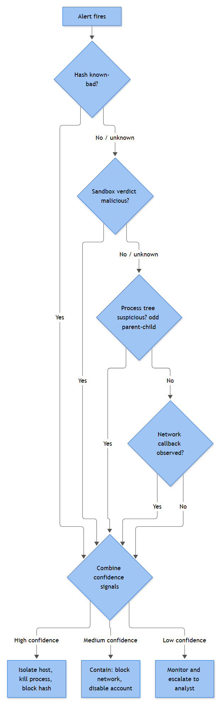

# Malware Master Playbook — Generic Malware Triage, End to End

This is the playbook the rest of the malware-adjacent material in this book assumes you already know. Parts 12 and 13 each cover one slice — a LOLBin pattern, a registry Run key, a scheduled task — in isolation, because that's how alerts arrive: one rule fires, one host lights up. This is what you run once you've decided "this is probably malware" and need a repeatable path from that first flagged file to a documented, defensible closure, at whatever confidence level the evidence supports.

It is deliberately generic — it does not assume ransomware (see the companion Ransomware Master Playbook) and does not assume a specific delivery vector, since email, drive-by, USB, and supply-chain drops all funnel into the same triage logic once a suspicious binary or script is running. It assumes some combination of EDR/Sysmon telemetry and Windows Security logging, and that a hash match alone is a hypothesis, not a verdict.

Four evidence domains feed the confidence model here: **identity** (what is this file, really), **process behavior** (what did it do, and to what), **network and persistence** (does it talk home, and how does it survive reboot), and **sandbox/task/service corroboration** (what does dynamic analysis add). No single domain decides the verdict — it's a function of how many agree.

---

## Header Fields

| Field | Value |
|---|---|
| **Playbook ID** | MAL-001 |
| **Playbook Name** | Malware Master Playbook — Generic Malware Triage & Confidence-Tiered Containment |
| **Version** | 1.3 |
| **Status** | Active – Production |
| **Owner** | SOC Detection & Response, Endpoint Track |
| **Technical Owner** | Idris Chukwu, Lead Detection Engineer (EDR/Sysmon) |
| **Business Owner** | Renata Solis, Director of IT Operations |
| **Approver** | Dana Ferris, SOC Manager |
| **Last Updated** | 2026-08-30 |
| **Next Review Date** | 2027-02-28 (semi-annual, or immediately after any P1 malware incident) |

## Detection Source

Any AV/EDR console generating a malware verdict (Defender for Endpoint, CrowdStrike, SentinelOne, Carbon Black, etc.), a SIEM correlation rule built on Sysmon/4688 telemetry, or an analyst escalation from a related playbook. This master playbook is the landing point for all of them — the "now prove it end to end" layer above the single-signal alert playbooks.

## Alert Name

**EP-MAL-MASTER: Suspected Malware — Full Triage Required (Any Source)**. Open this case-type whenever a single-signal alert needs the fuller identity/behavior/network/persistence workflow to reach a defensible verdict.

## Description

End-to-end triage of a suspected malicious file or script: confirming what the artifact is (hash, path, signer), what it did (process tree, command line, injection), how it communicates and persists (C2/DNS, registry, tasks, services), and what containment is proportionate to the confidence reached.

## Objective

Reach a documented, evidence-backed verdict — Confirmed, Likely Malicious, Suspicious, Benign Positive, or Insufficient Evidence — within SLA, and apply containment proportionate to that confidence level rather than defaulting to full isolation or to inaction while evidence accumulates.

## Business Risk

**[STAKEHOLDER]** - A single infected endpoint is rarely the actual cost. The cost is what it becomes a foothold for: credential theft that walks into other systems, a second-stage payload turning a loader into ransomware, or a beaconing implant sitting quiet for weeks collecting data. This playbook uses a graduated confidence model instead of "isolate everything" because a finance workstation isolated on a false positive during month-end close is its own incident — but it also insists on not under-reacting, since commodity loaders exist to prove they can run undetected before fetching something worse.

## Severity / Priority

Medium/P2 by default. Escalates to High/P1 if a persistence mechanism is confirmed, beaconing is corroborated by two-plus telemetry sources, the host is a server/DC/privileged workstation, or the confidence model reaches Likely Malicious in the first pass. Escalates to Critical if injection into a security-relevant process (lsass.exe) is observed, or the same hash/C2 indicator appears on three or more hosts.

## MITRE ATT&CK

All technique IDs below are drawn from MITRE ATT&CK (MITRE, "MITRE ATT&CK," MITRE Corporation, accessed 2026: https://attack.mitre.org/ — see appendices/38b-references.md).

T1204 User Execution; T1059.001/.003 PowerShell/Windows Command Shell; T1218.005/.010/.011 System Binary Proxy Execution (Mshta/Regsvr32/Rundll32); T1027 Obfuscated Files or Information; T1105 Ingress Tool Transfer; T1055 Process Injection; T1003.001 OS Credential Dumping: LSASS Memory; T1547.001 Registry Run Keys; T1053.005 Scheduled Task; T1543.003 Windows Service; T1547.004 Winlogon Helper DLL; T1546.012 Image File Execution Options Injection; T1071.004 Application Layer Protocol: DNS; T1090 Proxy; T1572 Protocol Tunneling; T1567 Exfiltration Over Web Service; T1562.001 Impair Defenses: Disable or Modify Tools.

## Applicable Systems

Windows domain-joined endpoints and servers with EDR and/or Sysmon deployed. Security-log-only environments can still use this playbook but should expect materially reduced fidelity in Investigation — flagged explicitly below, not glossed over.

## Data Sources / Log Sources / Required Fields

**[ENGINEERING]**

| Source | Fields / Notes |
|---|---|
| EDR/AV console | Detection ID, verdict, hash, path, remediation action |
| Sysmon 1 / 8 / 10 | Image, Hashes, CommandLine, ParentImage/ParentCommandLine, IntegrityLevel; CreateRemoteThread; ProcessAccess+GrantedAccess |
| Sysmon 3 / 22 | Source/DestinationIp/Port, QueryName — keyed on ProcessGuid |
| Sysmon 6 / 7 | ImageLoaded, Hashes, Signed/Signature (7 is high-volume, query targeted) |
| Sysmon 11/12/13/14/23 | TargetFilename/TargetObject, Details, Image |
| 4688 / 4697 / 7045 | Process Name/PID/Command Line (if auditing enabled); Service Name/Image Path/Account |
| 4698–4702 / 4103 / 4104 | Task Name, Task Content (XML); PowerShell pipeline details, script block text |

Retention: EDR/Sysmon/PowerShell 30/90 days; Security/System 90/365 days; sandbox reports kept indefinitely.

## Prerequisites

Sysmon capturing at minimum Event IDs 1, 3, 6, 7, 8, 10, 11, 12/13/14, 22, 23. If relying on native logging only, confirm command-line process auditing is enabled — 4688 without it gives process names with no command line, which silently defeats most of Investigation. PowerShell module/script-block logging enabled. Access to at least one reputation source and, ideally, a sandbox.

## Dependencies

Threat intel feed integration; sandbox platform; EDR isolation capability; IAM for credential resets; the narrower Part 12/13 playbooks this hands off to and receives escalations from; the Ransomware Master Playbook, to which this escalates immediately on any encryption/impact behavior.

## Trigger Condition

Any AV/EDR malware verdict of Medium severity or above; OR a SIEM correlation rule matching a suspicious process tree, injection indicator, or persistence artifact from Parts 12/13 that an analyst elevates; OR direct escalation from another playbook confirming a dropped or executed artifact.

## Detection Logic Summary

**[ENGINEERING]** - Not one detection query — the workflow triggered once a qualifying alert lands. The confidence model is additive: each of the four evidence domains below contributes independently, and the verdict reflects how many corroborate each other, not any single strong signal alone. A high-confidence hash match with zero behavioral corroboration is treated more cautiously than a moderate hash signal backed by confirmed persistence and beaconing.

## Known Limitations

Command-line auditing gaps erase most process-tree fidelity — treat an empty command line as a probable config gap, not a finding. Sandbox detonation is time-boxed and evadable; a clean result is evidence toward benign, not proof of it. VPN/NAT egress can mask true source addresses. Sysmon 7 (Image Loaded) is high-volume and typically filtered at ingestion, so sideloading/injection corroboration via that event usually needs a targeted manual query.

## Known False Positives

Internal/vendor tooling flagged by heuristic engines with no established baseline (especially after a definitions update); RMM/backup/patch tooling spawning `powershell.exe` from a service parent on schedule; installers briefly triggering Temp/AppData path heuristics; SDKs and SaaS clients beaconing on fixed intervals; approved pentest activity not yet suppressed.

## Initial Triage

**[ANALYST]**

1. Confirm hostname, user, timestamp, and artifact against the raw event — entity mapping errors happen.
2. Check the EDR remediation action first: quarantined/killed with no further activity leans toward a fast close; "allowed"/"action failed" means treat as live immediately.
3. Pull SHA256, check two-plus reputation sources — don't treat "0 detections" on a low-prevalence hash as clean.
4. Evaluate the file path before the filename — `svhost.exe` (missing "c") is not `svchost.exe`.
5. Check for an existing open case on this host, user, or hash.

## Enrichment

Threat intel on hash, observed IP/domain, cert serial. Asset criticality tag; server/DC/privileged status changes urgency. User role, VIP flag, HR events. Fleet-wide hash search. Sandbox submission if warranted and data-handling rules permit.

## Investigation

The core of the playbook, drawing together the four evidence domains. Work through them in order — each stage raises or lowers confidence, and later stages are easier to read correctly once earlier ones are done.

### 1. Identity & Reputation — what is this artifact, really

**[ANALYST]** - A hash tells you what's been *seen*, not what's happening on *this* host. Pull SHA256 from Sysmon 1's Hashes field (Sysmon 6 for driver loads) and check at least two independent sources: a multi-AV aggregator, a known-good baseline (NSRL-style sets, golden-image DB), internal threat intel, and sandbox re-detonation when static reputation is inconclusive. Prevalence matters as much as detection count — a freshly packed binary (T1027) will legitimately show low detections simply because no one has scanned it yet. Treat "unknown, low prevalence, first seen today" as its own tier, distinct from both known-bad and known-good.

**File path** matters as much as the hash. Pull the New Process Name (4688) or Image field (Sysmon 1): `System32\*` should be a signed OS binary — any hash mismatch is severe; `%TEMP%`/`AppData\Local\Temp` is a classic drop location when an executable persists or spawns children there; `ProgramData\*` and `Windows\Tasks\*` are occasionally legitimate but frequently abused for T1547.001/T1053.005. Cross-reference the parent process against the path — `winword.exe` spawning `powershell.exe` from `AppData\Roaming` reads very differently from an admin launching the same call from a scripts share.

**Signer validation**, in order of trust: Microsoft-signed (highest trust, but LOLBin abuse via T1218.005/.010/.011 uses exactly these binaries); valid third-party signer (name matches vendor); expired/chain-untrusted (score as unsigned); revoked (high-signal); unsigned (not automatically malicious, but with a Temp/AppData path and low prevalence it moves confidence up sharply). Signed does not mean trusted — stolen certificates exist to defeat exactly this check.

**[ENGINEERING]** - Pair static reputation with network corroboration by joining on ProcessGuid rather than checking connections in isolation — pull Sysmon 3/22 events filtered to the suspicious ProcessGuid, then run the destination IP and query name through the same reputation feeds used for the hash.

### 2. Process Tree, Command Line, and Injection — what did it do

**[ANALYST]** - 4688 gives New Process Name, PID, Creator Process Name/ID, and Subject — but Command Line only populates if command-line auditing is explicitly enabled. Sysmon 1 always captures the full command line plus ParentCommandLine (the grandparent's intent, not just its name), CurrentDirectory, IntegrityLevel, and hashes if configured — if fighting for budget on one telemetry source, this is it. **[ENGINEERING]** - Correlate 4688 and Sysmon 1 by PID *and* CreationTime, not name alone — PIDs recycle fast, and a naive PID-only join hands you the wrong process's children.

Reconstruct command lines fully before judging intent: caret/quote insertion in cmd.exe (`p^ow^ershell`) dodges string-match detections while executing identically; Base64 with `-EncodedCommand` isn't proof of malice alone, but combined with `-w hidden -nop -ep bypass` it's a strong indicator; SIEM-side field truncation means a command line ending mid-token needs the raw Sysmon EventData, not the parsed summary.

| Parent | Child | Read |
|---|---|---|
| `winword.exe`/`excel.exe`/`outlook.exe` | `cmd.exe`, `powershell.exe`, `wscript.exe` | Office/email spawning a shell is almost never legitimate (T1204, T1059.001/.003) |
| `explorer.exe` | `rundll32.exe`, `mshta.exe`, `regsvr32.exe` | Double-click can be normal; check args for URLs/remote paths (T1218.005/.010/.011) |
| `svchost.exe` | unsigned/user-profile-path binaries | Normal children are other services; a child from `%APPDATA%`/`%TEMP%` is a strong anomaly |
| `lsass.exe` | anything | Effectively no legitimate children — treat any as an incident |
| `cmd.exe` | `certutil.exe -urlcache`, `bitsadmin`, `curl` | Ingress Tool Transfer (T1105) staging pattern |

Baseline your own estate first — RMM tools, backup agents, and patch suites spawning `powershell.exe` from a service parent on schedule are normal in most fleets. A "confirmed anomalous tree" finding requires checking path, signature, and fleet-wide prevalence, not just the parent-child pair.

**Process injection** (T1055 — MITRE, "T1055: Process Injection," MITRE ATT&CK, 2025: https://attack.mitre.org/techniques/T1055/) rarely shows up as a single log line. Sysmon 10 (ProcessAccess) is the leading indicator: a process opening a handle to another with GrantedAccess rights consistent with read/write/thread-creation (not just query) — access to `lsass.exe` maps to T1003.001 and is high-confidence on sight from an unexpected source. Sysmon 8 (CreateRemoteThread) is close to a smoking gun for classic DLL/remote-thread injection, though security tooling and debuggers use it too — confirm source identity first. Process hollowing looks different and won't reliably show up on Sysmon 8: the malicious thread already exists (created suspended), so there's no remote-thread call to catch — look instead for a freshly-spawned suspended child immediately followed by write-capable ProcessAccess into it (Sysmon 10), or Sysmon 25/ProcessTampering where that Sysmon version is deployed. Sysmon 7 (Image Loaded) is high-volume and usually filtered, but worth a targeted query once injection is suspected.

```text
SysmonEvent | where EventID==10 and TargetImage endswith "lsass.exe"
| where SourceImage !in ("wininit.exe","svchost.exe","lsass.exe")
| project TimeGenerated, SourceImage, TargetImage, GrantedAccess
```

**[ENGINEERING]** - GrantedAccess values are hex bitmasks — build detections against dangerous combinations (`PROCESS_VM_WRITE`/`PROCESS_CREATE_THREAD`) rather than "any access to lsass.exe," or AV/EDR self-access noise drowns the signal.

### 3. Network, DNS, Persistence, and Registry — does it phone home, and how does it survive reboot

**[ANALYST]** - Pull Sysmon 3 for the host and pivot on process, not IP alone — a `svchost.exe` making repeated outbound TLS connections to an IP with no reverse DNS, on a port outside its normal profile, is worth more than a strange IP by itself. Cross-reference Sysmon 22 for the resolving domain and issuing process.

Beaconing has a signature even with jitter: near-constant time-delta between connections, small consistent payload sizes, TLS to a self-signed or freshly-issued cert. DNS-based C2 (T1071.004) shows up as unusually long subdomains or high query volume to one apex domain — think `a8f3c1.updates.example-cdn.net` repeated every 45–90 seconds. Protocol tunneling (T1572) and proxying through legitimate infrastructure (T1090) both aim to blend into normal traffic, so don't wave off "it's just a CDN" as automatically benign.

**[ENGINEERING]** - A workable beacon query groups the equivalent of Sysmon 3 by `(DeviceName, InitiatingProcessFileName, RemoteIP)` — shown below against Defender for Endpoint's `DeviceNetworkEvents` schema, since raw Sysmon-only environments will need to substitute `Computer`/`Image`/`DestinationIp` from their own ingestion pipeline — and flags low standard deviation in inter-connection interval:

```kql
DeviceNetworkEvents
| where Timestamp > ago(24h)
| extend EpochSeconds = (Timestamp - datetime(1970-01-01)) / 1s
| summarize Connections=count(), Times=make_list(EpochSeconds) by DeviceName, InitiatingProcessFileName, RemoteIP
| where Connections > 20
| extend SortedTimes = array_sort_asc(Times)
| extend Deltas = series_subtract(array_slice(SortedTimes, 1, -1), array_slice(SortedTimes, 0, -2))
| extend DeltaStats = series_stats_dynamic(Deltas)
| where DeltaStats.stdev < 15
```

Pair this with a DNS-length/entropy check against Sysmon 22 to catch tunneling that never touches Sysmon 3 directly. Not every anomalous beacon is malicious — enterprise EDR agents and SaaS clients beacon on fixed intervals too; Benign Positive is a real closure here.

The next question is how the process survives a reboot:

| Mechanism | MITRE ID | Primary artifact | Event source |
|---|---|---|---|
| Registry Run/RunOnce key | T1547.001 | `HKLM/HKCU\...\Run` value pointing to payload | Sysmon 12/13, 4688 for execution |
| Scheduled Task | T1053.005 | Task Scheduler XML action node | 4698 created, 4702 updated, Sysmon 1 for `schtasks.exe` |
| Windows Service | T1543.003 | Service ImagePath, Start Type = Auto | 7045 (System log), 4697 (Security log) |

Check, via Sysmon 12/13/14 (`TargetObject`, `Details`, writing `Image`): `...\CurrentVersion\Run`/`RunOnce` (T1547.001); `...\Winlogon\Shell`/`Userinit` (T1547.004, Winlogon Helper DLL — any value other than `explorer.exe`/`userinit.exe` or the stock path is a hard flag); and `Image File Execution Options\<binary>\Debugger` (T1546.012 — debugger-hijack persistence/privilege-escalation; if the targeted binary is a security tool being silently prevented from launching, treat it as Impair Defenses (T1562.001) too). **[ENGINEERING]** - `EventID:13 AND TargetObject:"*\Run\*" AND Image !endswith ("\explorer.exe","\msiexec.exe") AND Details:"*\AppData\Local\Temp\*"` catches most Temp-staged Run-key persistence without drowning in installer noise.

**[STAKEHOLDER]** - A beacon alone might just be noisy software; a beacon plus a persistence mechanism plus a phishing origin (see the worked example below) is a fully reproducible attack chain — that's what justifies isolating the host and resetting the account rather than a lighter-touch response.

### 4. Sandbox, Scheduled Task, and Service Corroboration

**[ANALYST]** - A detonation sandbox (EDR sandbox, cloud multi-scanner, or internal VM farm) answers one question fast: does this file *do* anything. Treat the report as one input, not the conclusion. A "malicious: 8/10" verdict with zero network activity and one dropped `.tmp` file is weaker evidence than a "suspicious: 4/10" verdict showing a `Run` write and a connection to a domain registered four days ago — score inflation and deflation both happen.

Known limits to build into process: evasion checks (VM artifacts, sleep timers) let a sample detonate clean while running fine on the real endpoint; sandbox-aware C2 means "no further activity" even though a second stage never got the chance to fire; time-boxed windows miss delayed-execution triggers; public cloud sandboxes are a data-handling risk — never upload documents with customer PII or credentials to one. A clean result is evidence toward Benign Positive, not proof of it. **[ENGINEERING]** - Correlate sandbox IOCs back into the SIEM as a retro-hunt, not just a forward rule — a sandbox run shows what happened in isolation five minutes ago, not whether the sample already ran elsewhere last week.

Persistence is usually where confidence shifts from "suspicious" to "confirmed" — a dropped file that never re-executes is weaker than one wired into a task or service. 4697 (Security) and 7045 (System) both cover service installation — check Image Path for anything running from `%TEMP%`, `%APPDATA%`, or `C:\Users\Public`; a `LocalSystem` account on a suspicious path is a strong signal. For tasks, 4698's Task Content is XML with the actual `<Command>`/`<Arguments>` — attackers name tasks to mimic Microsoft, and the giveaway is in the action, not the name. Events 4699–4702 clustered together often indicate toggling a task to dodge detection windows. Baseline legitimate scheduled tasks and service-install patterns before hunting, or every SCCM-pushed task looks anomalous.

**Worked example:** Host `FIN-WK-0417` (`n.abara`) — a phishing attachment (T1566.001 → T1204) drops a binary. This one did not read as clean-cut in real time. The EDR console's remediation action showed "quarantined" for the original attachment, which is the fast-close signal Initial Triage step 2 tells you to trust — except the dropped binary had already run once before quarantine caught up, so the case stayed open on that alone. The SHA256 came back "0/71, first seen today" on the multi-AV aggregator — not a clean verdict, just an unscored one, and it was logged as unknown/low-prevalence rather than benign. Command-line auditing was disabled on this host — one of the gaps Known Limitations warns about — so the 4688 for the PowerShell launch showed only the process name; the full `-nop -w hidden -enc <base64>` command line came from Sysmon 1, which was thankfully in scope. The host also writes a `HKCU\...\Run` key and a 4698 for task `MicrosoftEdgeUpdateTaskUser` — a name chosen to blend into legitimate Edge update noise, and it briefly did: the first analyst on shift almost triaged the task as benign until pulling the actual Task Content XML, which invoked `rundll32.exe` rather than anything resembling an updater. That `rundll32.exe` beacons to `cdn-update-check.example.net:443` every ~70 seconds via a two-day-old self-signed cert — a domain name built to read as a CDN health-check, which is exactly why the beaconing-interval query (not the domain name) is what flagged it. The sandbox run, submitted late because of a data-handling review on the attachment, came back "suspicious: 3/10" with no network activity reproduced — evasion or a sandboxed environment the second stage didn't trust, not evidence of benign behavior. Two persistence mechanisms, an encoded LOLBin chain, and a corroborated beacon — three independent domains agreed, which is what actually drove the verdict, not the sandbox score or the initial hash check. Closed as **True Positive — Confirmed, Contained**, after isolation, Run-key and task removal verified via a fresh log pull, `n.abara`'s credentials reset, and a fleet-wide sweep on the hash and C2 domain turned up no other hosts.

## Validation

Cross-check every domain that raised confidence against at least one other before committing to a verdict — a strong hash hit with no behavioral corroboration, or a strong beacon with no persistence artifact, is weaker alone than it looks. Re-run the correlating query rather than trusting a single pass, and where feasible confirm with the user/asset owner whether the behavior matches anything they knowingly ran.

## Decision Points

- Hash known-bad, known-good, or unknown/low-prevalence? Unknown-low-prevalence needs behavioral corroboration before any verdict.
- Process tree explainable by a baselined legitimate tool, or a genuine anomaly once path/signature/prevalence are checked?
- Confirmed injection (Sysmon 8/10) into a security-relevant target? Any yes is automatic high-confidence escalation.
- Corroborated network beacon or confirmed persistence artifact tied to the same process/PID chain?
- How many domains agree? Two or more moves the case toward Likely Malicious or fully Confirmed; one strong signal alone stays Suspicious pending more evidence.

## True Positive Indicators

Unknown/known-bad hash with no legitimate explanation; office app/browser spawning a script interpreter with obfuscated arguments; confirmed ProcessAccess/CreateRemoteThread into lsass.exe or another security-relevant process from an unsigned/unexpected source; new persistence artifact pointing at a Temp/AppData binary; network beacon with fixed interval and a young/self-signed cert, or DNS tunneling pattern; sandbox corroborating any of the above even at a moderate score.

## False Positive Indicators

Hash matches a known-good baseline or internal tool with an established signer; process tree matches a baselined RMM/backup/patch pattern; no injection activity into any security-relevant process; no new persistence artifact; network activity matches a known SDK/SaaS cadence; sandbox shows no drops, registry writes, or network activity.

## Benign Positive Conditions

Approved, pre-registered pentest activity (verify against the engagement calendar); internal tooling flagged by a heuristic engine with no prior baseline, confirmed against the software allowlist; known PUP/adware installer quarantined on write with zero children/network follow-up; detection inside a security tool's own scan cache or an intentional analysis VM.

## Escalation Criteria

Escalate to Tier 3/IR immediately if: injection into lsass.exe or another security-relevant process is confirmed; persistence is confirmed and corroborated by beaconing; the host is a DC, server, or privileged workstation; the same hash/C2 indicator appears on three-plus hosts; any Impair Defenses (T1562.001) behavior against the EDR agent is observed; or encryption/mass file modification appears — hand off to the Ransomware Master Playbook.

## Containment Options

Containment should scale with confidence, not jump straight to "isolate and rebuild" on every ticket — that burns trust for what may turn out to be a Benign Positive.



*Figure F041 - scaling containment to confidence level.*

| Confidence | Basis | Containment action | Reversible? | Approver |
|---|---|---|---|---|
| Insufficient / Low | Inconclusive sandbox, no persistence, one weak indicator | Monitor 24–48h, snapshot if feasible, no user disruption | N/A | Analyst |
| Suspicious | One strong indicator, no confirmed C2/persistence | Network-restrict host, disable (not delete) task/service, hold session | Yes | Analyst + Tier 2 |
| Likely Malicious | Persistence + corroborated behavior | Full isolation, kill process tree (after memory capture), block hash/C2 | Mostly | Incident lead |
| Confirmed | Multiple domains agree | Isolate, remove persistence, reset credentials, reimage, hunt lateral spread | No (rebuild) | Incident commander |

**[MANAGEMENT]** - Tie disposition to what the evidence shows, not just whether a hash matched. Document which tier drove which action — this is what gets audited when a host sat un-isolated too long, or was isolated on weak evidence.

**[STAKEHOLDER]** - Isolating a host is disruptive but recoverable; rebuilding is not. The jump to Confirmed-tier containment is where the named asset/business owner gets looped in — not to approve the technical action itself (the incident lead or commander already has standing authority to isolate or reimage once the evidence supports it, per Containment Approval below), but to flag anything the SOC can't see from the telemetry alone: a payroll run that can't tolerate this workstation going offline today, a shift-critical process the host feeds, a customer-facing dependency. SOC's SLA commitment is a containment decision within 45 minutes for a P1 case and 2 hours for standard P2 (see SLA below) — that clock runs regardless of whether the business owner has responded. The owner's actual sign-off gate is return-to-production after a rebuild, not the decision to pull the host offline; if that timing creates a genuine conflict (see Recovery Steps below), that's the conversation to have, not a reason to leave a Confirmed host live.

## Containment Approval

Monitor-only: analyst discretion. Network restriction/evidence-preserving disable: Tier 2 sign-off, logged within 15 minutes. Full isolation/hash-C2 blocking: incident lead approval, except where waiting would let confirmed exfiltration continue — act first, justify after. Reimage/rebuild: incident commander approval plus asset-owner notification.

## Recovery Steps

Confirm persistence artifacts are fully removed (deleted, not disabled) and re-verify via a fresh log pull. Reset credentials used during the session through the secure IAM channel; confirm MFA hasn't been silently re-registered. Reimage rather than clean in place for any verdict involving injection or confirmed C2 — cleaning a live implant off a running system is a losing bet against basic anti-forensics. Re-enable network access only after containment is confirmed complete, and monitor for 72 hours.

For a business-critical host (a finance workstation mid-month-end-close, a shift lead's machine, anything the Business Risk section above had in mind), coordinate the reimage window with the asset owner rather than starting the moment isolation lifts — a rebuild that lands in the middle of the exact process the user needed the machine for just relocates the disruption instead of ending it. Where the user needs to keep working sooner than a full reimage cycle allows, issue a loaner or a pre-built spare rather than leaving them offline for the duration, and note the swap in Case Documentation so the eventual asset-owner sign-off (Post Incident Tasks) covers the physical asset that actually returns to production.

## Evidence Collection

Hash/reputation results with timestamps; full process tree around the execution window; ProcessAccess/CreateRemoteThread events with GrantedAccess values; network/DNS records tied to the ProcessGuid; registry and task/service artifacts; sandbox report if submitted; memory capture if taken before termination; ticket and analyst identity per containment action.

## Case Documentation

Full timeline from first artifact through recovery; which evidence domains corroborated the verdict; MITRE techniques observed, not just the triggering one; containment/recovery actions with timestamps and approvers; closure classification; root cause category; fleet-wide sweep results.

## Communication Requirements

Notify the asset owner's manager if containment disrupts production outside the user's own request; IT Ops (the Business Owner role on this playbook) for any reimage; Legal/Privacy only where evidence shows actual access to client PII or financial records. For a Confirmed verdict with C2 or lateral-spread indicators, notify the SOC Manager and open the incident bridge. Escalate notification to the CISO for any Critical-severity case — confirmed injection into lsass.exe or another security-relevant process, or the same hash/C2 indicator on multiple hosts — since that's the threshold where this stops being a single-endpoint cleanup and starts looking like an active, spreading intrusion. Hand off to the Ransomware Master Playbook's requirements if encryption behavior appears. No blanket notification for routine Benign Positive closures.

## SLA

**[MANAGEMENT]**

| Severity/Priority | Acknowledge | Initial Triage | Containment Decision | Full Resolution |
|---|---|---|---|---|
| P1 (DC/privileged host, or injection/C2 confirmed) | 10 min | 30 min | 45 min | 4 hours |
| P2 (standard default) | 15 min | 1 hour | 2 hours | 8 business hours |

## Closure Criteria

Close **True Positive — Contained** (logged with the confidence tier reached, e.g. "True Positive — Confirmed, Contained") only after isolation, persistence removal, credential reset, and fleet-wide sweep are complete — a True Positive closed before those four are done is not actually closed, just quiet. Close **Benign Positive** or **Expected Activity** only after confirming no security-relevant process access, no new persistence artifact, no corroborated beacon, and clean/known-good hash reputation. Close **Insufficient Evidence** where genuine telemetry gaps (missing command-line auditing, filtered Sysmon 7, evaded sandbox) prevent a determination — document which domain was unavailable; this is a tuning input, not an analyst shortfall.

## Post Incident Tasks

For any True Positive: lessons-learned review within 5 business days if containment failed or SLA was breached; tuning ticket per Detection Feedback; awareness follow-up for the delivery vector; fleet-wide sweep if not already done; asset-owner sign-off on reimage before return to production.

## Detection Feedback

Loop findings back to Detection Engineering: did the confidence model correctly weight the evidence domains, or was a weak signal over-escalated relative to how the case resolved? Was a telemetry gap a material factor in reaching Insufficient Evidence? Log every Benign Positive root cause even when no rule change is made immediately.

## Tuning Opportunities

Baseline and allowlist known RMM/backup/patch-tooling process trees per fleet segment. Add sandbox-evasion-aware secondary checks where budget allows. Pre-register pentest IP ranges and hashes from the engagement calendar. Review GrantedAccess bitmask thresholds on the lsass.exe detection quarterly against EDR self-access noise.

## Metrics

**[MANAGEMENT]**

| Metric | Target | Last Quarter Actual |
|---|---|---|
| Mean Time to Triage | < 45 min | 52 min |
| Mean Time to Containment Decision (P1) | < 45 min | 41 min |
| False Positive Rate | < 40% | 46% |
| Benign Positive Rate | tracked, no target | 28% |
| True Positive Rate | tracked, no target | 19% |
| Insufficient Evidence Rate | < 15% | 12% |
| Escalation-to-Tier-3 Rate | tracked, no target | 9% |

## Automation Potential

High for enrichment (hash reputation, fleet-wide hash search, IP/domain intel, sandbox submission) — pre-populated automatically. Medium for correlation: beaconing-interval and persistence-artifact queries run as standing detections rather than manual pulls. Low for the verdict itself and containment beyond network restriction — a false auto-isolation or auto-reimage on a Benign Positive creates its own incident, so those stay analyst-confirmed-execute.

## Related Rules

EP-001 (Malware Detection: Generic AV/EDR Alert); LOLBin execution-chain rules (Part 12); Run-key and scheduled-task rules (Part 13); credential-dumping/LSASS-access rules (Part 13); beaconing and suspicious-TLS rules (Part 14).

## Related Playbooks

Malware Detection: Generic AV/EDR Alert (the front door this deepens); Encoded/Obfuscated PowerShell; Suspicious Rundll32/Regsvr32/Mshta Usage; Credential Dumping — LSASS Access; Registry Run Key Persistence; Scheduled Task Persistence; New Service Creation; C2 Communication; DNS Tunnelling; Ransomware Master Playbook; Data Exfiltration Master Playbook.

## References

Microsoft Learn — Windows Security Event Reference, Sysmon documentation, Advanced Audit Policy Configuration; MITRE ATT&CK; NIST SP 800-61; SANS Institute malware analysis references; CISA guidance on malware triage.

## Revision History

| Version | Date | Author | Summary of Changes |
|---|---|---|---|
| 1.0 | 2026-02-14 | Idris Chukwu | Initial version — identity/reputation and process-tree only |
| 1.1 | 2026-05-19 | Idris Chukwu | Added network/DNS/persistence/registry section |
| 1.2 | 2026-07-22 | Chukwu, Ferris | Added sandbox limitations and containment table |
| 1.3 | 2026-08-30 | Idris Chukwu | Merged all four drafts into single master template |
